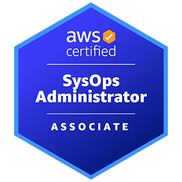
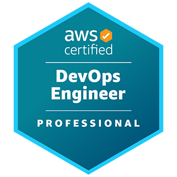
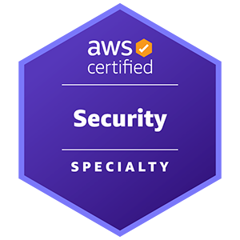
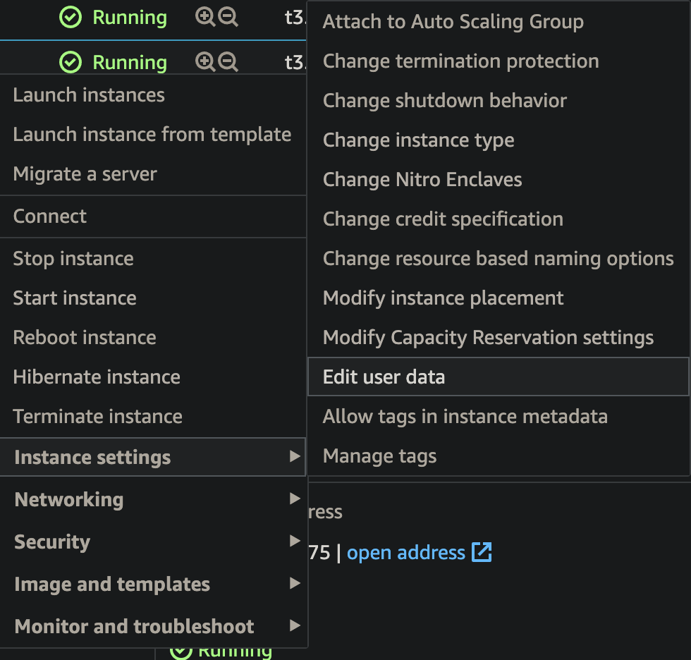

# AWS

## Certification

### AWS Certified Cloud Practitioner


CLF-C01

<https://aws.amazon.com/certification/certified-cloud-practitioner/>

<https://courses.datacumulus.com/downloads/certified-cloud-practitioner-zb2/>

[Download Slides](https://raw.githubusercontent.com/CalebSargeant/docs/master/docs/computing/cloud/_docs/AWS%20Certified%20Cloud%20Practitioner%20Slides%20v2.11.0.pdf)

### AWS Certified SysOps Administrator



SOA-C02

<https://aws.amazon.com/certification/certified-sysops-admin-associate/>

<https://courses.datacumulus.com/downloads/certified-sysops-administrator-dw1/>

[Download Slides](https://raw.githubusercontent.com/CalebSargeant/docs/master/docs/computing/cloud/_docs/AWS%20Certified%20SysOps%20Slides%20v3.8.0.pdf)

### AWS Certified DevOps Engineer - Professional



DOP-C01

<https://aws.amazon.com/certification/certified-devops-engineer-professional/>

### AWS Certified Security - Specialty



SCS-C01

<https://aws.amazon.com/certification/certified-security-specialty/>

## General

### Recover Lost SSH Key

<https://github.com/miztiik/AWS-Demos/tree/master/How-To/setup-ssh-key-recovery-using-userdata>

1.  Create a new instance with an SSH key
2.  SSH into the instance and copy the authorized_keys entry
3.  Stop the instance that you lost the key for
4.  Edit the user data of the instance:



5.  Paste the below in the user data of the instance and start it:

``` bash
Content-Type: multipart/mixed; boundary="//"
MIME-Version: 1.0

--//
Content-Type: text/cloud-config; charset="us-ascii"
MIME-Version: 1.0
Content-Transfer-Encoding: 7bit
Content-Disposition: attachment; filename="cloud-config.txt"

#cloud-config
cloud_final_modules:
- [scripts-user, always]

--//
Content-Type: text/x-shellscript; charset="us-ascii"
MIME-Version: 1.0
Content-Transfer-Encoding: 7bit
Content-Disposition: attachment; filename="userdata.txt"
#!/bin/bash
/bin/echo -e "ssh-rsa AAUvoqDuvCKFrVzeq/O68JgAo0zSSD3KMYwO1RSZ8/2FwMEYZP7jAh3GOYJhIS
AzFsDcN/jgtluZIwEn7MXym21EDLk1aFdI20WtbQJH79as9+nV9jtzf9BiQnM/fe18Frb94A1DUALcEyPesl
oYvcOxyCCaqAKS6v1g1me4Up+IbHNfVgE+GtLdh+oohR8SRc3xL9tvQu0kzFSRVsfymhu5l2WBpf9STvm3rt
MbNKzjmKAqPlMSuShn72pTwqScGoPG+3ofZ36nLdh+oo" >> /home/ec2-user/.ssh/authorized_keys
--//
```

6.  Login to the server with the new key
7.  Remember to stop the recovery instance you created if not using it
