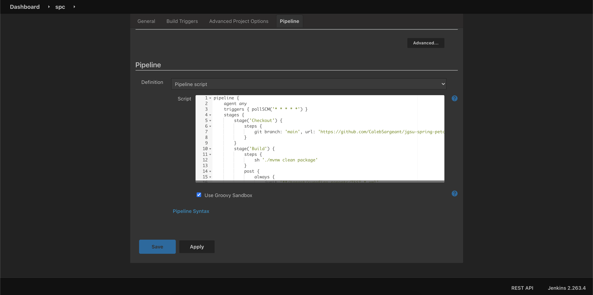
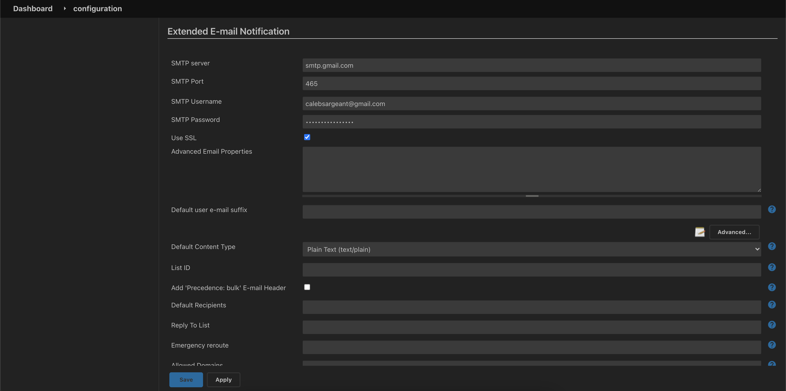
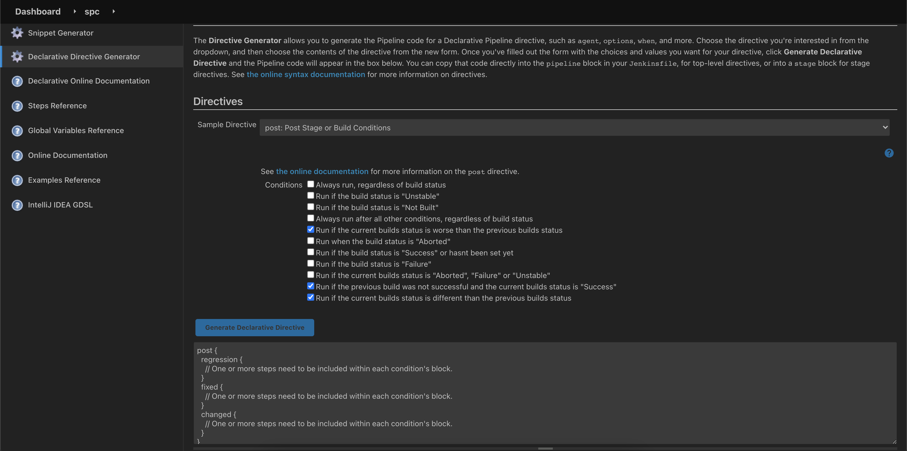
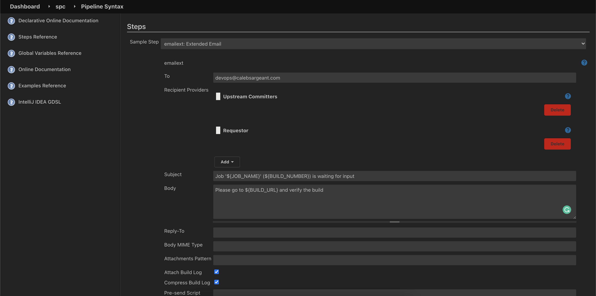
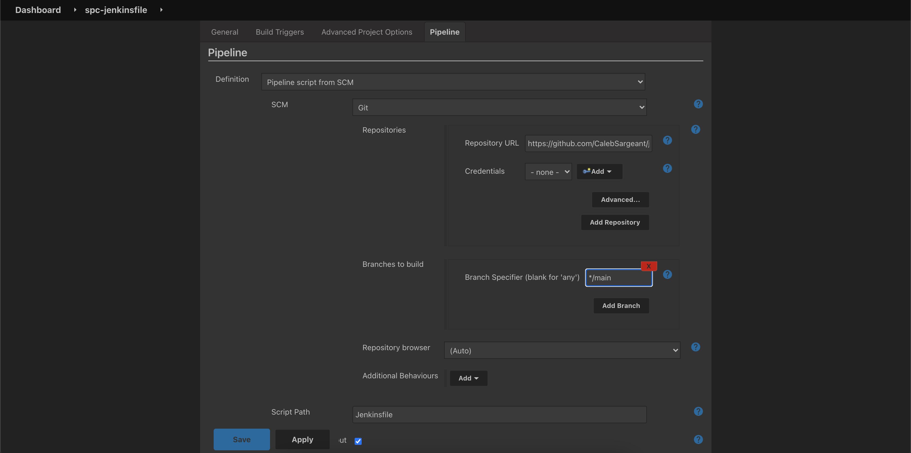

# Colocating Jobs and Source Code with Jenkinsfile

View the [Pipeline Syntax documentation online:](https://www.jenkins.io/doc/book/pipeline/syntax/#agent)

Download example pipeline: [pipeline.groovy](https://raw.githubusercontent.com/CalebSargeant/docs/master/docs/computing/jenkins/getting-started/_docs/pipeline.groovy)

<figure>

<figcaption>Adding a trigger to the pipeline</figcaption>
</figure>

<figure>

<figcaption>Configuring Email server for Jenkins</figcaption>
</figure>

<figure>

<figcaption>Post Declarative Directive generator for regression, fixed, and changed</figcaption>
</figure>

View the [Global Variable Reference](https://www.jenkins.io/doc/book/pipeline/getting-started/#global-variable-reference)

<figure>

<figcaption>Generating email pipeline syntax</figcaption>
</figure>

<figure>

<figcaption>pipeline from single repo - scm</figcaption>
</figure>

!!! note

    You can create a new item and have Jenkins scan all repos in a GitHub org for Jenkinsfiles and create build processes for each
