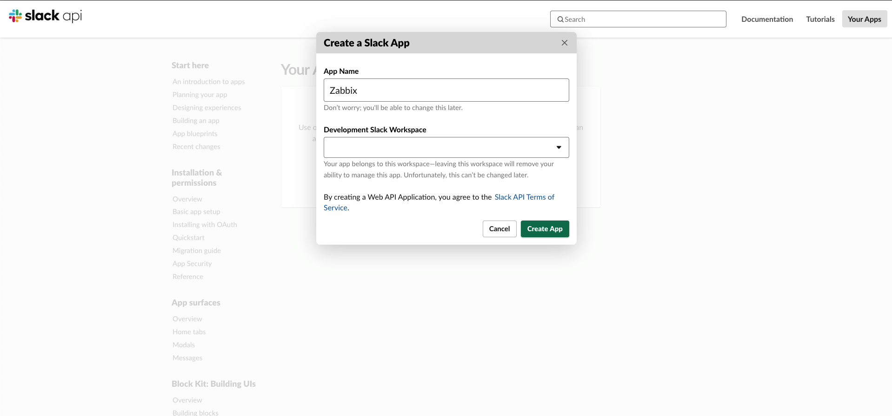
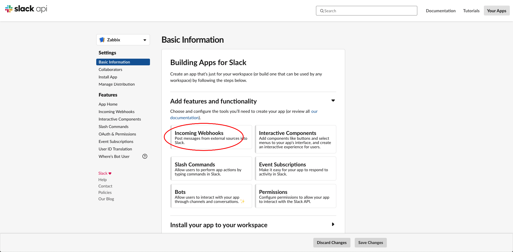
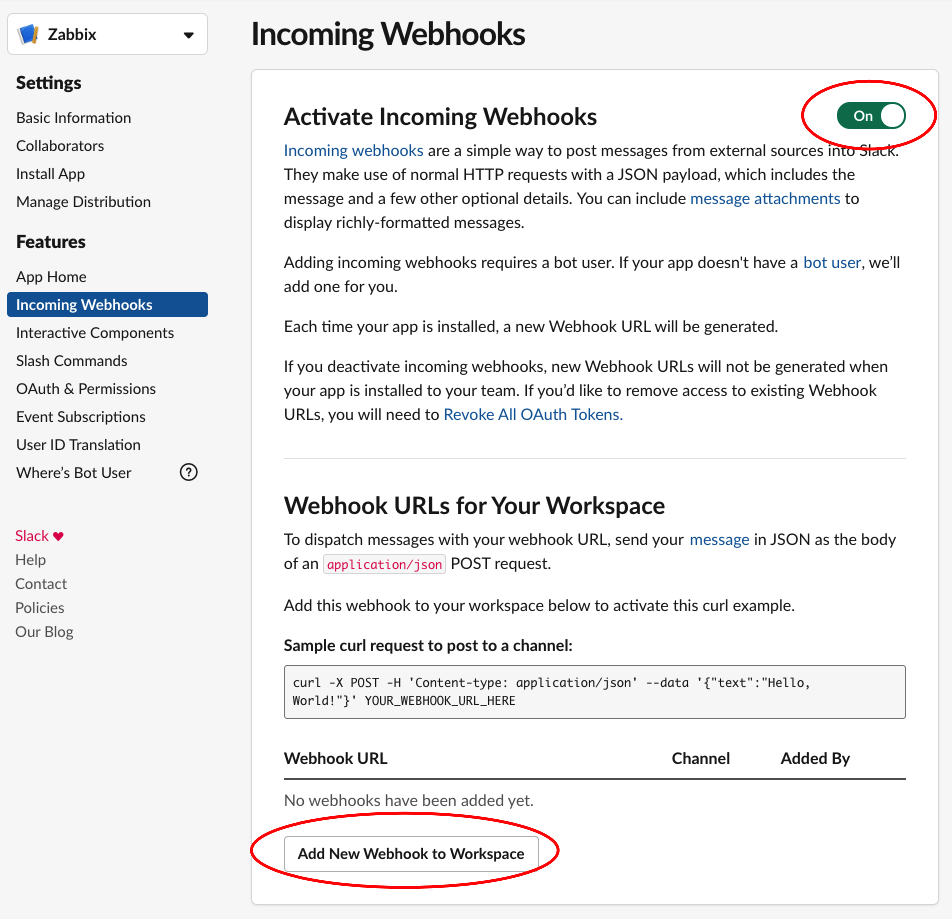
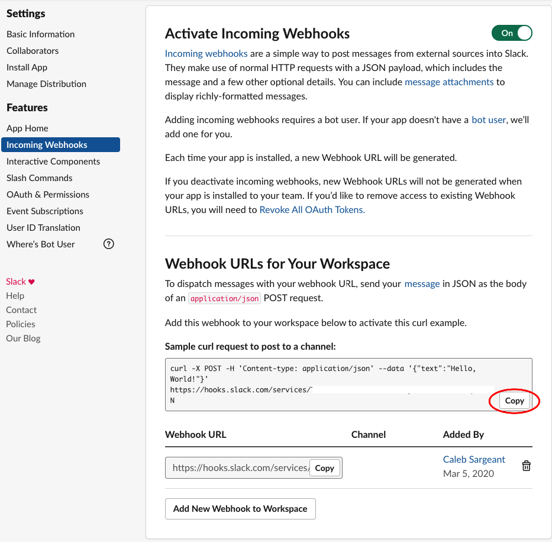
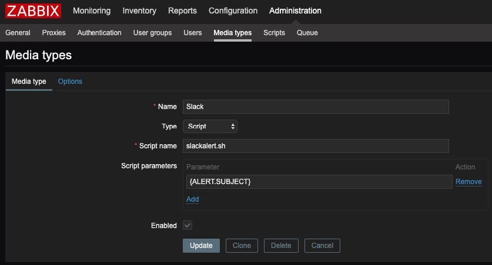
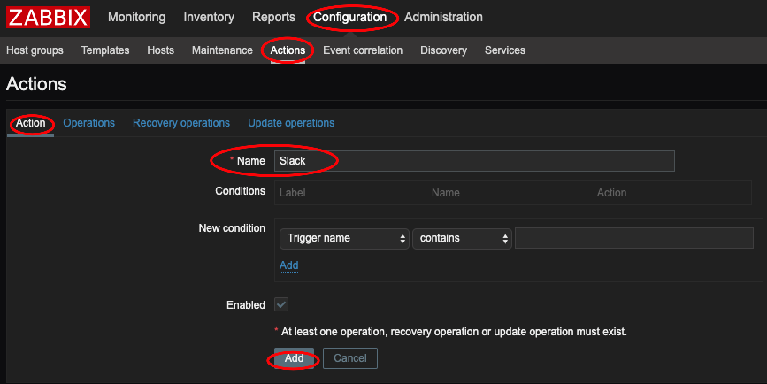
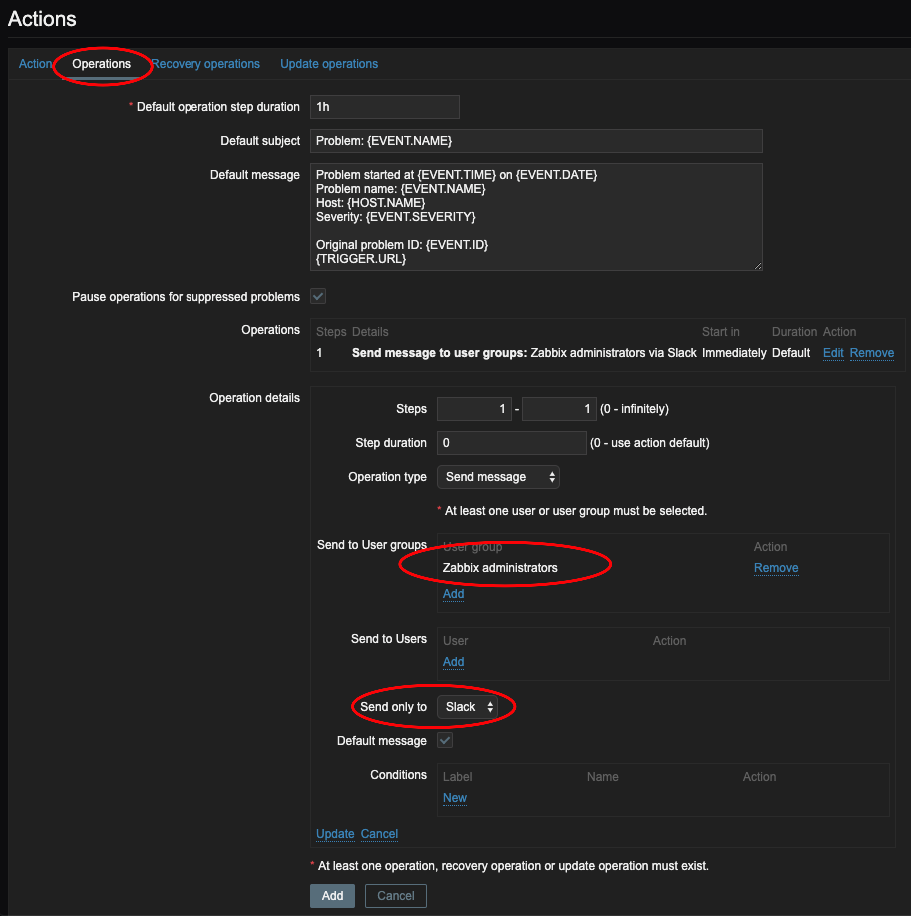
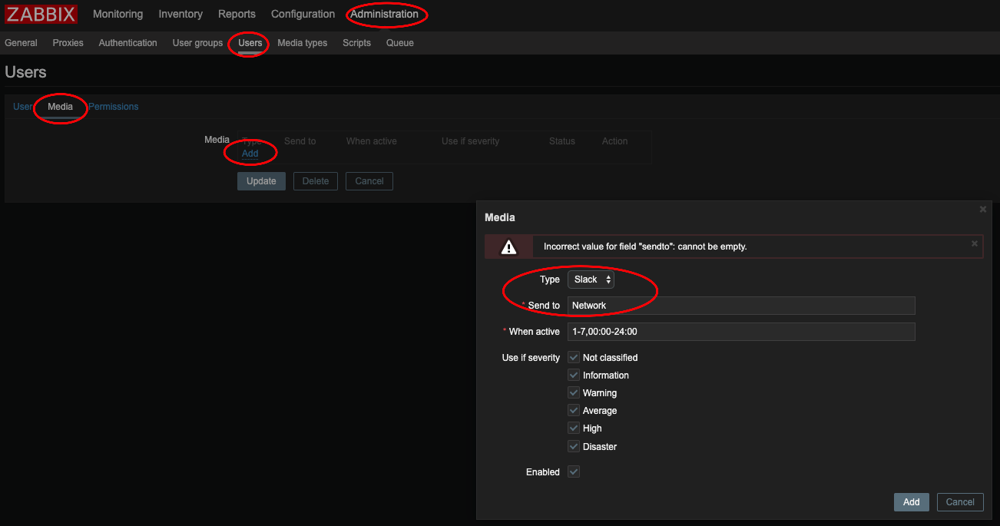

# Monitoring

## Zabbix

### Slack Alerting

**Configuring Slack**

Go to <https://api.slack.com/apps>. Create a new app called "Zabbix".



Create an *Incoming Webhook*.





Copy the curl request to `/usr/lib/zabbix/alertscripts/slackalerts.sh`.



Change `'{"text":"Hello, World!"}'` to `'{"text":"'"$1"'"}'`.

Test your configuration on Zabbix with `/usr/lib/zabbix/alertscripts/slackalerts.sh test`.

**Configuring Zabbix**

Create the *Media Type* in Zabbix.



Create an *Action* and an *Operation* in *Operations*, *Recovery operations*, and *Update operations*.

Nice *Default subjects* to use: Create `{ZABBIX.SERVER}` in **Administration** \> **General** \> **Macros**

- `[{ZABBIX.SERVER}] - [{HOST.HOST}] Problem: {EVENT.NAME}`
- `[{ZABBIX.SERVER}] - [{HOST.HOST}] Resolved: {EVENT.NAME}`
- `[{ZABBIX.SERVER}] - [{HOST.HOST}] Updated problem: {EVENT.NAME} - {USER.FULLNAME}`





Add the *Media* to the Administrator.



## Nagios

### Install Nagios Client on Ubuntu

<https://tecadmin.net/how-to-install-nrpe-on-ubuntu-20-04/>

``` bash
apt update
apt install nagios-nrpe-server nagios-plugins
nano /etc/nagios/nrpe.cfg
  allowed_hosts=127.0.0.1, 192.168.1.100
systemctl restart nagios-nrpe-server 
```
