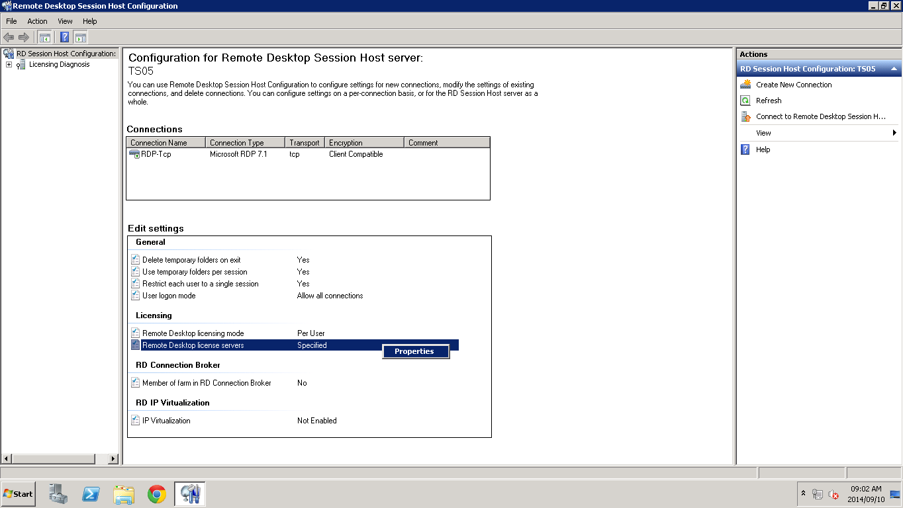
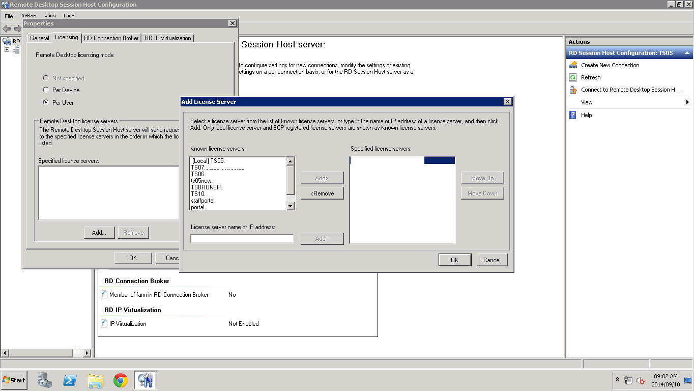
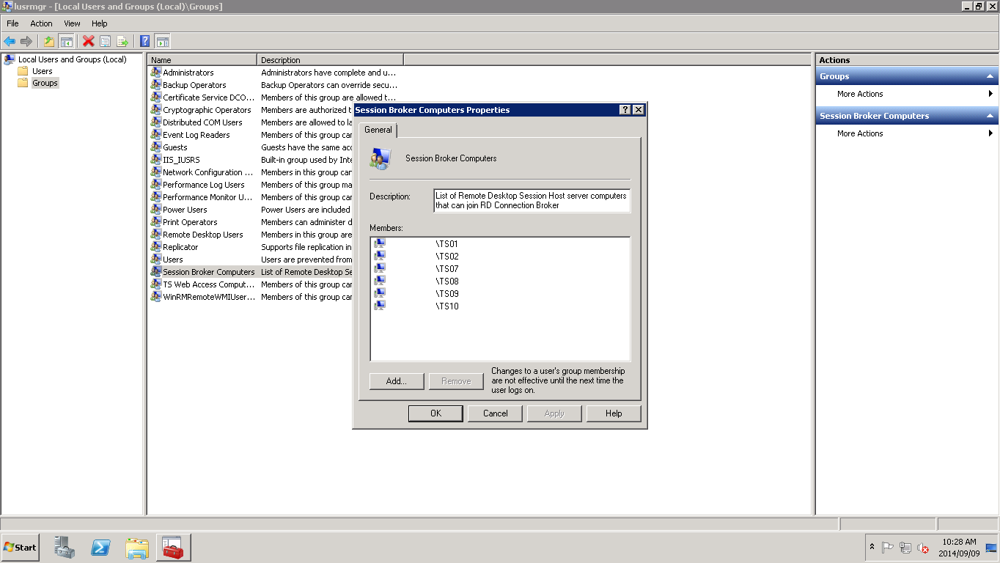
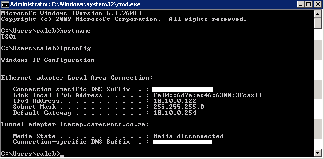
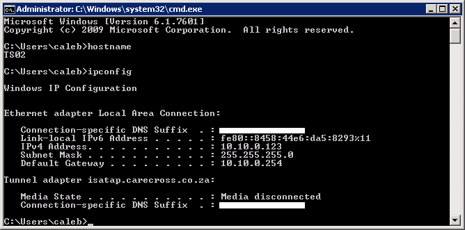
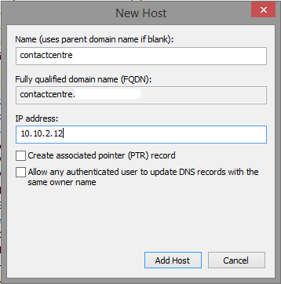
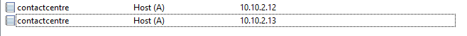
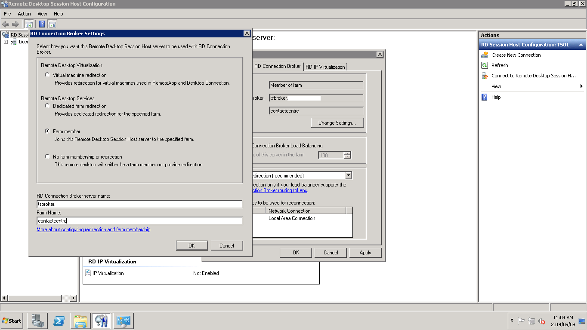

# Terminal Services

<https://docs.microsoft.com/en-us/previous-versions/windows/it-pro/windows-server-2008-R2-and-2008/cc770412(v=ws.10>)

## Add a TS to TS License Server

## Add TS to TSBroker Farm

