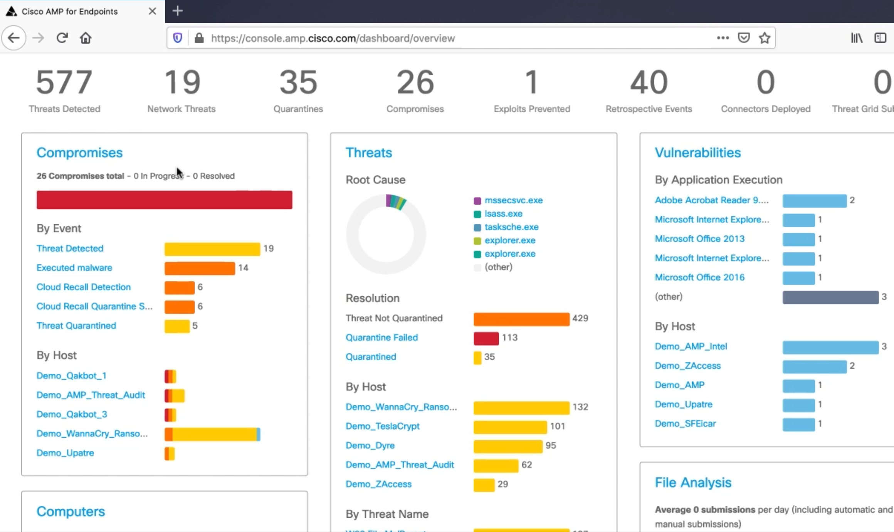
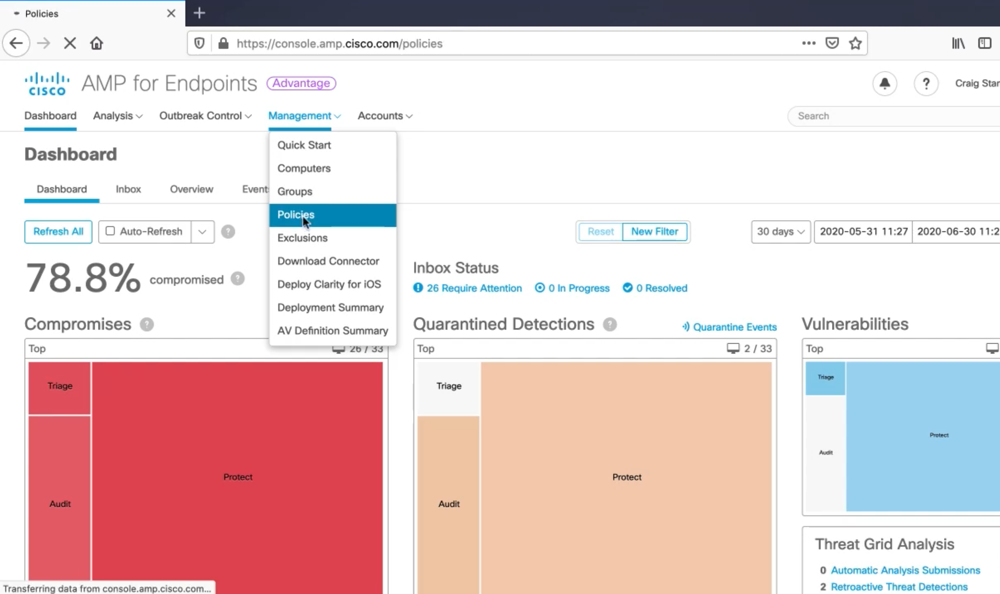
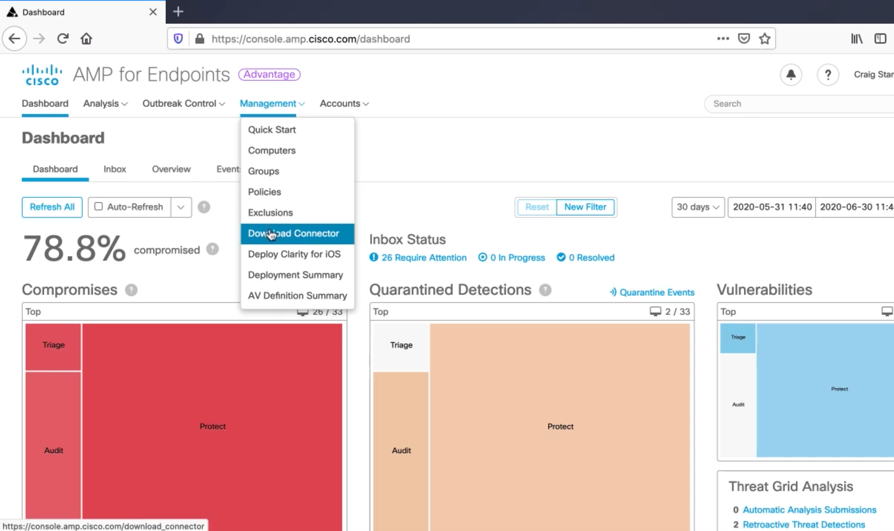

# Configuring Malware Protection and Outbreak Controls

## Cisco AMP Console Overview and Outbreak Controls

## Creating Policies in Cisco AMP

## Installing Cisco AMP Connectors on Endpoints and Verifying

