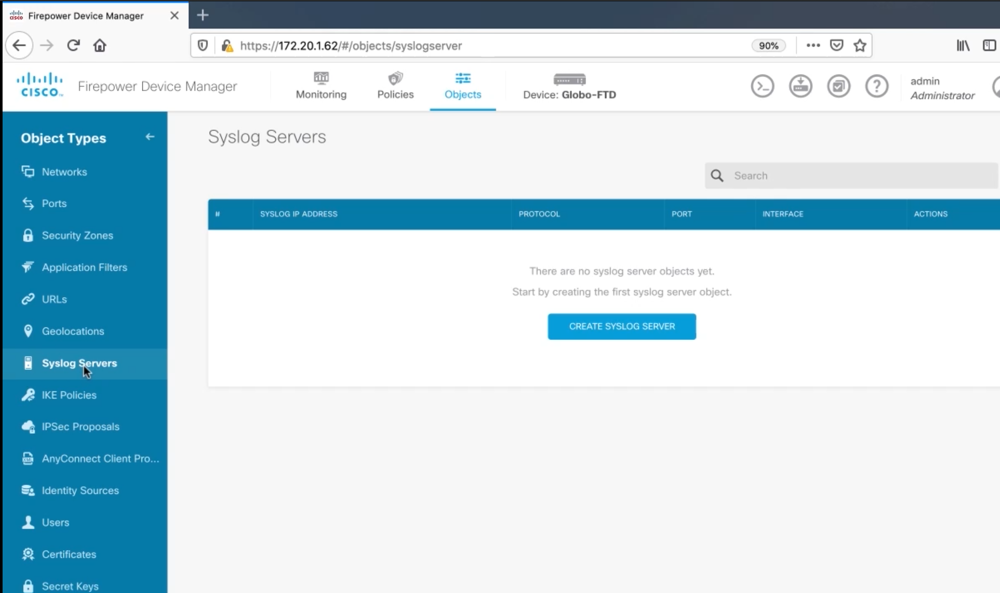
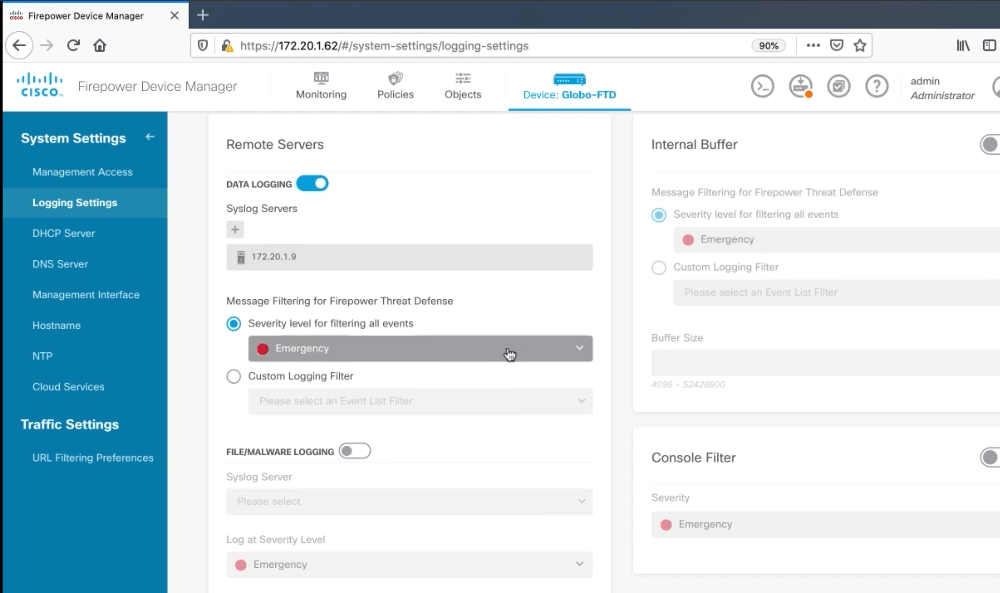
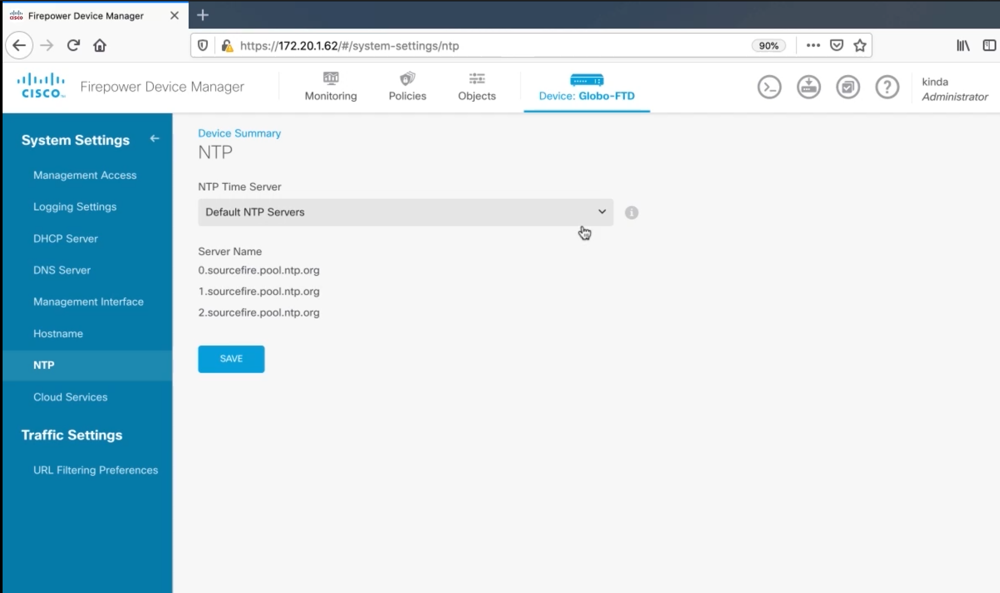
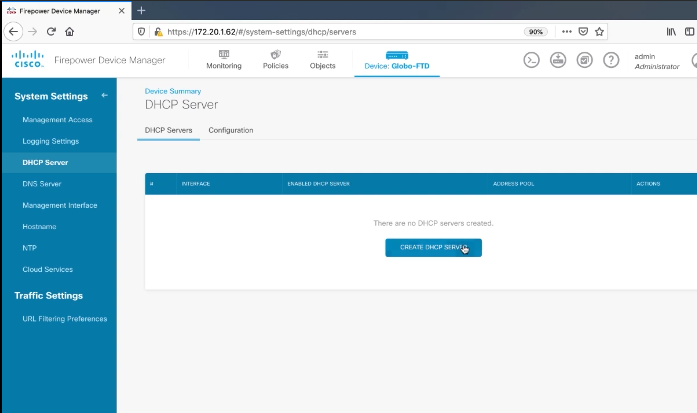

# Configuring Management Protocols on a Cisco Firepower

## Configuring Syslog on a Cisco FTD Appliance

<figure>

<figcaption>Add a Syslog Server</figcaption>
</figure>

<figure>

<figcaption>Logging Settings</figcaption>
</figure>

## Configuring NTP on a Cisco FTD Appliance

<figure>

<figcaption>NTP Settings</figcaption>
</figure>

## Configuring DHCP on a FTD Appliance

<figure>

<figcaption>DHCP Settings</figcaption>
</figure>
