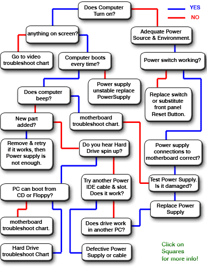
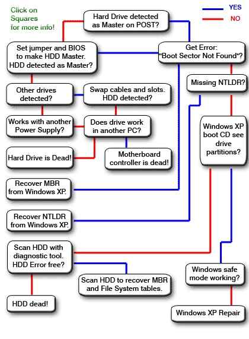
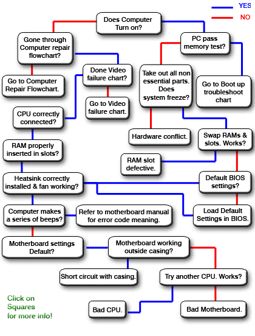
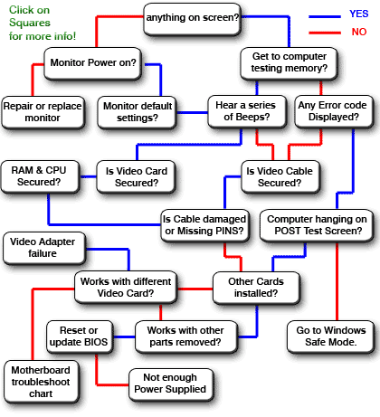

# Hardware Troubleshooting

This is all sourced from <http://www.fixingmycomputer.com> and placed in this documentation, as *fixingmycomputer* may not be online forever, being mostly Windows XP orientated...

## Boot

## Hard Drive

## Motherboard

## Graphics Card

