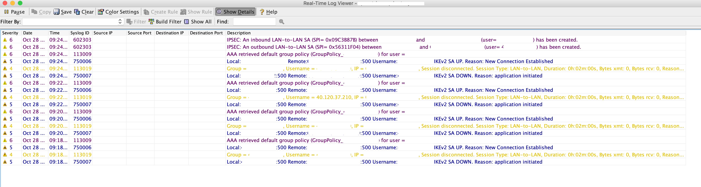

###
ASA
###

Adaptive Security Appliance

Failover
--------

.. code-block:: none

  ### ASA1
  # Setup failover interface
  en
  conf t
  hostname ASA1
  failover lan unit pri
  int g0/6
  no shut

  # Assign failover IP Address
  failover lan int FAILOVER g0/6
  failover int ip FAILOVER 10.255.255.1 255.255.255.252 standby 10.255.255.2
  failover key MySecretKey
  failover link FAILOVER

  # Configure Outside IP Address on ASA1
  int g0/4
  ip add 100.100.100.1 255.255.255.248 standby 100.100.100.2
  nameif outside1
  no shut

  # Configure Inside IP Address on ASA1
  int g0/0
  ip add 10.0.0.1 255.255.255.0 standby 10.0.0.2
  nameif inside1
  security-level 100
  no shut

  # Enable failover
  failover

  ### ASA2
  # Setup failover interface
  en
  conf t
  hostname ASA2
  failover lan unit secondary
  int g0/6
  no shut
  failover lan int FAILOVER g0/6

  # Assign failover IP Address
  failover int ip FAILOVER 10.255.255.1 255.255.255.252 standby 10.255.255.2
  failover key MySecretKey
  failover link FAILOVER

  # Enable failover
  failover

Site to Site VPN
----------------

Tunnel Establishing in ASDM
^^^^^^^^^^^^^^^^^^^^^^^^^^^

