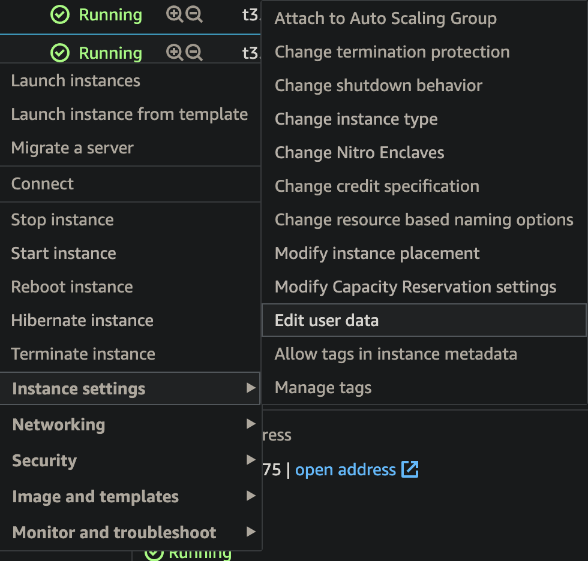

AWS
===

Recover Lost SSH Key
--------------------

https://github.com/miztiik/AWS-Demos/tree/master/How-To/setup-ssh-key-recovery-using-userdata

1. Create a new instance with an SSH key
2. SSH into the instance and copy the authorized_keys entry
3. Stop the instance that you lost the key for
4. Edit the user data of the instance:

5. Paste the below in the user data of the instance and start it:

.. code-block:: bash

    Content-Type: multipart/mixed; boundary="//"
    MIME-Version: 1.0

    --//
    Content-Type: text/cloud-config; charset="us-ascii"
    MIME-Version: 1.0
    Content-Transfer-Encoding: 7bit
    Content-Disposition: attachment; filename="cloud-config.txt"

    #cloud-config
    cloud_final_modules:
    - [scripts-user, always]

    --//
    Content-Type: text/x-shellscript; charset="us-ascii"
    MIME-Version: 1.0
    Content-Transfer-Encoding: 7bit
    Content-Disposition: attachment; filename="userdata.txt"
    #!/bin/bash
    /bin/echo -e "ssh-rsa AAUvoqDuvCKFrVzeq/O68JgAo0zSSD3KMYwO1RSZ8/2FwMEYZP7jAh3GOYJhIS
    AzFsDcN/jgtluZIwEn7MXym21EDLk1aFdI20WtbQJH79as9+nV9jtzf9BiQnM/fe18Frb94A1DUALcEyPesl
    oYvcOxyCCaqAKS6v1g1me4Up+IbHNfVgE+GtLdh+oohR8SRc3xL9tvQu0kzFSRVsfymhu5l2WBpf9STvm3rt
    MbNKzjmKAqPlMSuShn72pTwqScGoPG+3ofZ36nLdh+oo" >> /home/ec2-user/.ssh/authorized_keys
    --//

6. Login to the server with the new key
7. Remember to stop the recovery instance you created if not using it