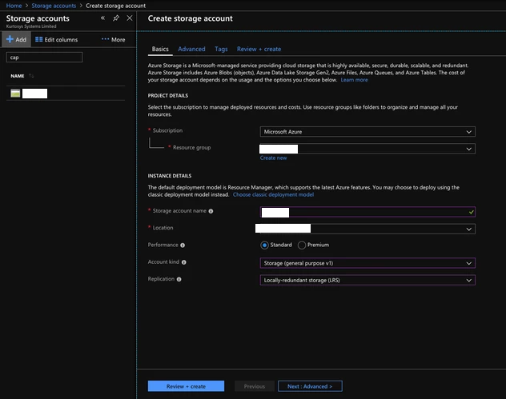

Azure
=====

SFTP Server using Storage Account
---------------------------------

- Create Storage Account
- Deploy template https://docs.microsoft.com/en-us/samples/azure-samples/sftp-creation-template/sftp-on-azure/

Sentinal
--------

- https://docs.microsoft.com/en-us/azure/sentinel/connect-syslog
- https://docs.microsoft.com/en-us/azure/sentinel/connect-common-event-format

    - https://docs.microsoft.com/en-us/azure/sentinel/connect-syslog
    - https://docs.microsoft.com/en-us/azure/sentinel/connect-cef-solution-config
    - https://docs.microsoft.com/en-us/azure/sentinel/connect-cef-verify

Az-CLI
------

Creating Tunnels
^^^^^^^^^^^^^^^^

.. code-block:: bash

  ## Create a Gatway Subnet for VNET
  az network vnet subnet create -g "$RSG" --vnet-name "$VNET" -n "GatewaySubnet" --address-prefix "10.$SUBNUM.207.224/27"

  ## Create a Public IP Address for VGW (https://docs.microsoft.com/en-us/azure/vpn-gateway/vpn-gateway-vpn-faq#can-i-request-a-static-public-ip-address-for-my-vpn-gateway)
  az network public-ip create -g "$RSG" -n "$VGW_PIP" --allocation-method "dynamic"

  ## Create a VNET Gateway
  az network vnet-gateway create -g "$RSG" -n "$VGW_NAME" --vnet "$VNET" --public-ip-addresses "$VGW_PIP" --sku "Standard"

  ## Create a local-gateway (VPN Peer) to connect to
  az network local-gateway create -g "$RSG" -n "$LGW1" --gateway-ip-address "$PIP1" --local-address-prefixes "$SUBNET"

  ## Create the tunnel on Azure's side
  az network vpn-connection create -g "$RSG" -n "$CON1" --vnet-gateway1 "$VGW_NAME" --local-gateway2 "$LGW1" --shared-key "$PSK"

  ## VNET to VNET Tunnels
  for XX in $OTHER_REGIONS; do
    VGW_ID=$(az network vnet-gateway show -g "$XX-RSG" -n "$XX-VPN-GW" | grep id | head -n1 | awk -F '"' '{print $4}')
    az network vpn-connection create -g "$RSG" -n "$VNET-$XX-VNET" --vnet-gateway1 "$VGW_NAME" --vnet-gateway2 "$VGW_ID" --shared-key "$VNET_PSK"
  done

Tunnel Config on ASA
^^^^^^^^^^^^^^^^^^^^

.. code-block:: bash

  ASA_PEER=$(az network public-ip show -g "$RSG" -n "$VGW_PIP" --query ipAddress -o tsv)
  ASA_PEER_NAME="CORP-AZURE-$REGION_PREFIX-$SUBNUM"
  ASA_REMOTE_SUBNET=$(echo "$VNET_PREFIX" | grep -o '[0-9]\{1,3\}\.[0-9]\{1,3\}\.[0-9]\{1,3\}\.[0-9]\{1,3\}')

  # Generate Azure tunnel configuration
  FILENAME="$REGION_PREFIX.ps1"

  echo "# This file is generated by scriptPX"  >> "$FILENAME"
  echo "\$POLICY = New-AzIpsecPolicy -IkeEncryption AES$P1_AES -IkeIntegrity SHA$P1_SHA -DhGroup DHGroup$DH_GROUP -IpsecEncryption GCMAES$P2_GCM_AES -IpsecIntegrity GCMAES$P2_GCM_AES -PfsGroup PFS$DH_GROUP -SALifeTimeSeconds 14400 -SADataSizeKilobytes 102400000" > "$FILENAME"
  echo "\$RSG = \"$RSG\"" >> "$FILENAME"
  echo "\$Connections = @(\"$CON1\", \"$CON2\")" >> "$FILENAME"
  echo "foreach (\$Connection in \$Connections) {" >> "$FILENAME"
  echo " \$CON = Get-AzVirtualNetworkGatewayConnection -name \$Connection -ResourceGroupName \$RSG" >> "$FILENAME"
  echo "  Set-AzVirtualNetworkGatewayConnection -VirtualNetworkGatewayConnection \$CON -IpsecPolicies \$POLICY -UsePolicyBasedTrafficSelectors \$True -Force" >> "$FILENAME"
  echo "}" >> "$FILENAME"

  # Generate ASA tunnel configuration
  for i in "${OFFICES[@]}"; do
    OFFICE=$i
    if [[ "$OFFICE" == "CPT" ]] ; then
      FILENAME="03-4-tunnels-cpt-az$REGION_PREFIX"
      PSK="$CPT_PSK"
      ASA_LOCAL_SUBNET=$(echo "$CPT_SUBNET" | grep -o '[0-9]\{1,3\}\.[0-9]\{1,3\}\.[0-9]\{1,3\}\.[0-9]\{1,3\}')
      NEXT_HOP_INT="$CPT_NEXT_HOP_INT"
      NEXT_HOP_IP="$CPT_NEXT_HOP_IP"
    elif [[ "$OFFICE" == "JHB" ]]; then
      FILENAME="03-5-tunnels-jhb$REGION_PREFIX"
      PSK="$JHB_PSK"
      ASA_LOCAL_SUBNET=$(echo "$JHB_SUBNET" | grep -o '[0-9]\{1,3\}\.[0-9]\{1,3\}\.[0-9]\{1,3\}\.[0-9]\{1,3\}')
      NEXT_HOP_INT="$JHB_NEXT_HOP_INT"
      NEXT_HOP_IP="$JHB_NEXT_HOP_IP"
    elif [[ "$OFFICE" == "DBN" ]]; then
      FILENAME="03-6-tunnels-dbn$REGION_PREFIX"
      PSK="$DBN_PSK"
      ASA_LOCAL_SUBNET=$(echo "$DBN_SUBNET" | grep -o '[0-9]\{1,3\}\.[0-9]\{1,3\}\.[0-9]\{1,3\}\.[0-9]\{1,3\}')
      NEXT_HOP_INT="$DBN_NEXT_HOP_INT"
      NEXT_HOP_IP="$DBN_NEXT_HOP_IP"
    fi
    echo "# This file is generated by scriptPX" >> "$FILENAME"
    echo "wr mem" >> "$FILENAME"
    echo "copy /noconfirm startup startup$rdate" > "$FILENAME"
    echo "name $ASA_PEER $ASA_PEER_NAME" > "$FILENAME"
    echo "" >> "$FILENAME"
    echo "group-policy GroupPolicy_$ASA_PEER internal" >> "$FILENAME"
    echo "group-policy GroupPolicy_$ASA_PEER attributes" >> "$FILENAME"
    echo " vpn-tunnel-protocol ikev2" >> "$FILENAME"
    echo "" >> "$FILENAME"
    echo "tunnel-group $ASA_PEER type ipsec-l2l" >> "$FILENAME"
    echo "tunnel-group $ASA_PEER general-attributes" >> "$FILENAME"
    echo " default-group-policy GroupPolicy_$ASA_PEER" >> "$FILENAME"
    echo "tunnel-group $ASA_PEER ipsec-attributes" >> "$FILENAME"
    echo " ikev2 local-authentication pre-shared-key $PSK" >> "$FILENAME"
    echo " ikev2 remote-authentication pre-shared-key $PSK" >> "$FILENAME"
    echo "" >> "$FILENAME"
    echo "object-group network VPN-LOCAL-$SUBNUM" >> "$FILENAME"
    echo " description OnPrem Network" >> "$FILENAME"
    echo " network-object $ASA_LOCAL_SUBNET 255.255.0.0" >> "$FILENAME"
    echo "" >> "$FILENAME"
    echo "object-group network VPN-REMOTE-$SUBNUM" >> "$FILENAME"
    echo " description Azure Virtual Network" >> "$FILENAME"
    echo " network-object $ASA_REMOTE_SUBNET 255.255.0.0" >> "$FILENAME"
    echo "" >> "$FILENAME"
    echo "access-list $SUBNUM extended permit ip object-group VPN-LOCAL-$SUBNUM object-group VPN-REMOTE-$SUBNUM" >> "$FILENAME"
    echo "" >> "$FILENAME"
    echo "crypto ikev2 policy $SUBNUM" >> "$FILENAME"
    echo " encryption aes-$P1_AES" >> "$FILENAME"
    echo " integrity sha$P1_SHA" >> "$FILENAME"
    echo " group $DH_GROUP" >> "$FILENAME"
    echo " prf $PRF" >> "$FILENAME"
    echo " lifetime seconds $P1_LIFETIME" >> "$FILENAME"
    echo "" >> "$FILENAME"
    echo "crypto ipsec ikev2 ipsec-proposal AES-GCM-$P2_GCM_AES" >> "$FILENAME"
    echo " protocol esp encryption aes-gcm-$P2_GCM_AES" >> "$FILENAME"
    echo " protocol esp integrity aes-gcm-$P2_GCM_AES" >> "$FILENAME"
    echo "" >> "$FILENAME"
    echo "crypto map outside_map $SUBNUM match address $SUBNUM" >> "$FILENAME"
    echo "crypto map outside_map $SUBNUM set pfs group$DH_GROUP" >> "$FILENAME"
    echo "crypto map outside_map $SUBNUM set peer $ASA_PEER_NAME" >> "$FILENAME"
    echo "crypto map outside_map $SUBNUM set ikev2 ipsec-proposal AES-GCM-$P2_GCM_AES" >> "$FILENAME"
    echo "crypto map outside2_map $SUBNUM match address $SUBNUM" >> "$FILENAME"
    echo "crypto map outside2_map $SUBNUM set pfs group$DH_GROUP" >> "$FILENAME"
    echo "crypto map outside2_map $SUBNUM set peer $ASA_PEER_NAME" >> "$FILENAME"
    echo "crypto map outside2_map $SUBNUM set ikev2 ipsec-proposal AES-GCM-$P2_GCM_AES" >> "$FILENAME"
    echo "" >> "$FILENAME"
    echo "nat (any,outside) source static VPN-LOCAL-$SUBNUM VPN-LOCAL-$SUBNUM destination static VPN-REMOTE-$SUBNUM VPN-REMOTE-$SUBNUM no-proxy-arp route-lookup" >> "$FILENAME"
    echo "nat (any,outside2) source static VPN-LOCAL-$SUBNUM VPN-LOCAL-$SUBNUM destination static VPN-REMOTE-$SUBNUM VPN-REMOTE-$SUBNUM no-proxy-arp route-lookup" >> "$FILENAME"
    echo "" >> "$FILENAME"
    echo "access-list Outside-Split-ACL standard permit $ASA_REMOTE_SUBNET 255.255.0.0" >> "$FILENAME"
    echo "" >> "$FILENAME"
    if [[ "$NEXT_HOP_INT" == "outside" ]]; then
      echo "# using default route" >> "$FILENAME"
    else
      echo "route $NEXT_HOP_INT $ASA_PEER_NAME 255.255.255.255 $NEXT_HOP_IP 1" >> "$FILENAME"
    fi
    echo "wr mem" >> "$FILENAME"
  done

Public IP
^^^^^^^^^

.. code-block:: bash

  <code>AZ_PEER_PIP1=$(az network public-ip show -g "$RSG" -n "$VGW_PIP" --query ipAddress -o tsv)

Functions
^^^^^^^^^

.. code-block:: bash

  # Nothing needs to be defined to use function (no, you don't have to define Nothing= :))
  network-lb-create() {
    az network lb create --resource-group "$RSG" --name "$LB_NAME" --frontend-ip-name "$LB_FE_POOL_NAME" \
      --private-ip-address "$LB_IP" --backend-pool-name "$LB_BE_POOL_NAME" --vnet-name "$VNET" --subnet "$SUBNET"
  }

  # LB_PROBE_PROTO and LB_PROBE_PORT need to be defined to use function
  network-lb-probe-create() {
    az network lb probe create --resource-group "$RSG" --lb-name "$LB_NAME" \
      --name "$LB_PROBE_NAME" --protocol "$LB_PROBE_PROTO" --port "$LB_PROBE_PORT"
  }

  # LB_RULE_NAME, LB_RULE_PORT, and LB_RULE_PROTO need to be defined to use function
  lb-rule-create() {
    az network lb rule create --resource-group "$RSG" --lb-name "$LB_NAME" \
    --name "$LB_NAME-$LB_RULE_NAME" --protocol "$LB_RULE_PROTO" --frontend-port "$LB_RULE_PORT" \
    --backend-port "$LB_RULE_PORT" --frontend-ip-name "$LB_FE_POOL_NAME" \
    --backend-pool-name "$LB_BE_POOL_NAME" --probe-name "$LB_PROBE_NAME"
  }

  # NSGR_NAME, NSGR_SRC, NSGR_DST, NSGR_PORTS, NSGR_PROTO, and NSGR_PRIORITY need to be defined to use function
  nsg-rule-create() {
    az network nsg rule create -g "$RSG" --nsg-name "$NSG" -n $NSGR_NAME \
      --source-address-prefixes ""$NSGR_SRC"" \
      --destination-address-prefixes "$NSGR_DST"  \
      --destination-port-ranges "$NSGR_PORTS" --priority "$NSGR_PRIORITY" \
      --access Allow --protocol "$NSGR_PROTO" --direction Inbound
  }

  # VM_NIC_NAME needs to be defined to use function
  network-nic-create() {
    az network nic create \
      -g "$RSG" -n "$VM_NIC_NAME" \
      --vnet-name "$VNET" \
      --subnet "$SUBNET" "$@"
  }

  network-nic-list() {
    az network nic list \
      -g "$RSG" \
      --vnet-name "$VNET"
  }

  # AS_NAME needs to be defined to use function
  vm-availability-set-create() {
    az vm availability-set create -g "$RSG" -n "$AS_NAME"
  }

  # VM_NIC_NAME needs to be defined to use function
  network-nic-pool-add() {
    az network nic ip-config address-pool add -g "$RSG" --nic-name "$VM_NIC_NAME" \
      --ip-config-name "ipconfig1" --address-pool "$LB_BE_POOL_NAME" --lb-name "$LB_NAME"
  }

  # VM_NAME and VM_NIC_NAME need to be defined to use function
  vm-create() {
    az vm create \
      -g "$RSG" -n "$VM_NAME" \
      --image "$VM_IMAGE" \
      --admin-username "$VM_USER" \
      --admin-password "$VM_PASS" \
      --size "$VM_FLAVOUR" \
      --storage-sku "$VM_DISK_TYPE" \
      --nics "$VM_NIC_NAME" \
      --generate-ssh-keys "$@"
  }

  # VM_NAME needs to be defined to use function
  vm-ip-private() {
    az vm show -d -g "$RSG" -n "$VM_NAME" --query privateIps -o tsv
  }

  # VM_NAME needs to be defined to use function
  vm-ip-public() {
    az vm show -d -g "$RSG" -n "$VM_NAME" --query publicIps -o tsv
  }

  # VM_IP needs to be defined to use function
  vm-copy-ssh-key() {
    .ssh/login.expect "$VM_PASS" "$VM_USER" "$VM_IP"
  }

Resize Disk
^^^^^^^^^^^

https://docs.microsoft.com/en-us/azure/virtual-machines/linux/expand-disks

.. code-block:: bash

  # Get a list of disks in RSG
  az disk list -g RSG --query '[*].{Name:name,Gb:diskSizeGb,Tier:accountType}' --output table

  # Output the name of the disk
  az disk list -g RSG --query '[*].{Name:name,Gb:diskSizeGb,Tier:accountType}' --output table | grep SERVERNAME | awk '{print $1}'

  # Stop the VM
  az vm stop -g RSG -n SERVERNAME

  # Deallocate the VM
  az vm deallocate -g RSG -n SERVERNAME

  # Resize the disk
  az disk update -g UK-RSG -n SERVERNAME_OsDisk_1_xxxxxxxxxx --size-gb 100

  # Start the VM
  az vm start -g RSG -n SERVERNAME

Azure Powershell
----------------

Modifying IPSec Policies
^^^^^^^^^^^^^^^^^^^^^^^^

.. code-block:: powershell

  # Maximum strength:

  $POLICY = New-AzIpsecPolicy -IkeEncryption AES256 -IkeIntegrity SHA384 -DhGroup DHGroup24 -IpsecEncryption GCMAES256 -IpsecIntegrity GCMAES256 -PfsGroup PFS24 -SALifeTimeSeconds 14400 -SADataSizeKilobytes 102400000
  $RSG = "RSG"
  $Connections = @("CON1", "CON2")
  foreach ($Connection in $Connections) {
   $CON = Get-AzVirtualNetworkGatewayConnection -name $Connection -ResourceGroupName $RSG
    Set-AzVirtualNetworkGatewayConnection -VirtualNetworkGatewayConnection $CON -IpsecPolicies $POLICY -UsePolicyBasedTrafficSelectors $True -Force
  }

Deploy AADDS
^^^^^^^^^^^^

.. code-block:: powershell

  # Change the following values to match your deployment.
  $AaddsAdminUserUpn = "admin@contoso.onmicrosoft.com"
  $ResourceGroupName = "myResourceGroup"
  $VnetName = "myVnet"
  $AzureLocation = "westus"
  $AzureSubscriptionId = "xxxxxx-xxxxx-xxxx-xxxx-xxxxxxx"
  $ManagedDomainName = "mydomain.com"

  # Connect to your Azure AD directory.
  Connect-AzureAD

  # Login to your Azure subscription.
  Connect-AzAccount

  # Create the service principal for Azure AD Domain Services.
  New-AzureADServicePrincipal -AppId "2565bd9d-da50-47d4-8b85-4c97f669dc36"

  # Create the delegated administration group for AAD Domain Services.
  New-AzureADGroup -DisplayName "AAD DC Administrators" `
    -Description "Delegated group to administer Azure AD Domain Services" `
    -SecurityEnabled $true -MailEnabled $false `
    -MailNickName "AADDCAdministrators"

  # First, retrieve the object ID of the newly created 'AAD DC Administrators' group.
  $GroupObjectId = Get-AzureADGroup `
    -Filter "DisplayName eq 'AAD DC Administrators'" | `
    Select-Object ObjectId

  # Now, retrieve the object ID of the user you'd like to add to the group.
  $UserObjectId = Get-AzureADUser `
    -Filter "UserPrincipalName eq '$AaddsAdminUserUpn'" | `
    Select-Object ObjectId

  # Add the user to the 'AAD DC Administrators' group.
  Add-AzureADGroupMember -ObjectId $GroupObjectId.ObjectId -RefObjectId $UserObjectId.ObjectId

  # Register the resource provider for Azure AD Domain Services with Resource Manager.
  Register-AzResourceProvider -ProviderNamespace Microsoft.AAD

  # Create the resource group.
  New-AzResourceGroup `
    -Name $ResourceGroupName `
    -Location $AzureLocation

  # Create the dedicated subnet for AAD Domain Services.
  $AaddsSubnet = New-AzVirtualNetworkSubnetConfig `
    -Name DomainServices `
    -AddressPrefix 10.0.0.0/24

  $WorkloadSubnet = New-AzVirtualNetworkSubnetConfig `
    -Name Workloads `
    -AddressPrefix 10.0.1.0/24

  # Create the virtual network in which you will enable Azure AD Domain Services.
  $Vnet=New-AzVirtualNetwork `
    -ResourceGroupName $ResourceGroupName `
    -Location $AzureLocation `
    -Name $VnetName `
    -AddressPrefix 10.0.0.0/16 `
    -Subnet $AaddsSubnet,$WorkloadSubnet

  # Enable Azure AD Domain Services for the directory.
  New-AzResource -ResourceId "/subscriptions/$AzureSubscriptionId/resourceGroups/$ResourceGroupName/providers/Microsoft.AAD/DomainServices/$ManagedDomainName" `
    -Location $AzureLocation `
    -Properties @{"DomainName"=$ManagedDomainName; `
      "SubnetId"="/subscriptions/$AzureSubscriptionId/resourceGroups/$ResourceGroupName/providers/Microsoft.Network/virtualNetworks/$VnetName/subnets/DomainServices"} `
    -Force -Verbose

Connection Troubleshooting
--------------------------

GUI
^^^

https://docs.microsoft.com/en-us/azure/network-watcher/network-watcher-packet-capture-manage-portal

**Create a Storage Account**

Go to Home > `Network Watcher - Packet capture <https://portal.azure.com/#blade/Microsoft_Azure_Network/NetworkWatcherMenuBlade/packetCapture>`_ > Add

Select the following from the dropdowns:

- Resource group: (your RSG)
- Target Virtual Machine: (the VM that you want to run the capture on)
- Packet capture name: (give it something unique)
- Storage account: (your storage account )
- Maximum bytes per session: 10485760 (10MB, instead of the default 1GB)

CLI
^^^

https://docs.microsoft.com/en-us/azure/network-watcher/network-watcher-packet-capture-manage-powershell

https://docs.microsoft.com/en-us/cli/azure/network/watcher/packet-capture?view=azure-cli-latest

.. code-block:: bash

  az network watcher packet-capture create -g MyResourceGroup -n MyPacketCaptureName --vm MyVm \
                            --storage-account MyStorageAccount --filters '[ \
                                { \
                                    "protocol":"TCP", \
                                    "remoteIPAddress":"1.1.1.1-255.255.255", \
                                    "localIPAddress":"10.0.0.3", \
                                    "remotePort":"20" \
                                }, \
                                { \
                                    "protocol":"TCP", \
                                    "remoteIPAddress":"1.1.1.1-255.255.255", \
                                    "localIPAddress":"10.0.0.3", \
                                    "remotePort":"80" \
                                }, \
                                { \
                                    "protocol":"TCP", \
                                    "remoteIPAddress":"1.1.1.1-255.255.255", \
                                    "localIPAddress":"10.0.0.3", \
                                    "remotePort":"443" \
                                }, \
                                { \
                                    "protocol":"UDP" \
                                }]'
