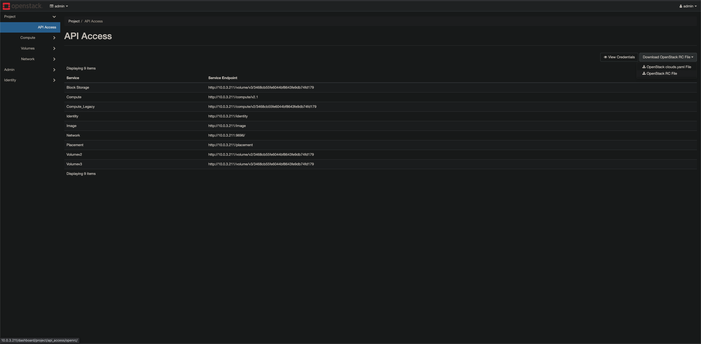

Openstack
=========

Installing Openstack on Ubuntu
------------------------------

https://computingforgeeks.com/openstack-deployment-on-ubuntu-with-devstack/

.. code-block:: bash

  # Update && Upgrade
  sudo apt update -y && sudo apt upgrade -y

  # Add default non-root user to Sudoers
  nano /etc/sudoers
    # Allow members of group sudo to execute any command
    %sudo	ALL=(ALL:ALL) NOPASSWD:ALL

  # Download DevStack
  sudo apt install git -y
  cd ~ && git clone https://git.openstack.org/openstack-dev/devstack

  # Create local.conf
  cd devstack && nano local.conf
    [[local|localrc]]

    # Password for KeyStone, Database, RabbitMQ and Service
    ADMIN_PASSWORD=supersecurepassword
    DATABASE_PASSWORD=$ADMIN_PASSWORD
    RABBIT_PASSWORD=$ADMIN_PASSWORD
    SERVICE_PASSWORD=$ADMIN_PASSWORD

    # Host IP - get your Server/VM IP address from ip addr command
    HOST_IP=192.168.10.100

  # Deploy Openstack
  cd devstack
  ./stack.sh

Openstack CLI
-------------

Download the OpenStack RC File from the GUI:

Example OpenRC File downloaded:

.. code-block:: bash

  #!/usr/bin/env bash
  # To use an OpenStack cloud you need to authenticate against the Identity
  # service named keystone, which returns a **Token** and **Service Catalog**.
  # The catalog contains the endpoints for all services the user/tenant has
  # access to - such as Compute, Image Service, Identity, Object Storage, Block
  # Storage, and Networking (code-named nova, glance, keystone, swift,
  # cinder, and neutron).
  #
  # *NOTE*: Using the 3 *Identity API* does not necessarily mean any other
  # OpenStack API is version 3. For example, your cloud provider may implement
  # Image API v1.1, Block Storage API v2, and Compute API v2.0. OS_AUTH_URL is
  # only for the Identity API served through keystone.
  export OS_AUTH_URL=http://10.0.3.211/identity
  # With the addition of Keystone we have standardized on the term **project**
  # as the entity that owns the resources.
  export OS_PROJECT_ID=3468cb55fe6044bf8643fe9db74fd179
  export OS_PROJECT_NAME="admin"
  export OS_USER_DOMAIN_NAME="Default"
  if [ -z "$OS_USER_DOMAIN_NAME" ]; then unset OS_USER_DOMAIN_NAME; fi
  export OS_PROJECT_DOMAIN_ID="default"
  if [ -z "$OS_PROJECT_DOMAIN_ID" ]; then unset OS_PROJECT_DOMAIN_ID; fi
  # unset v2.0 items in case set
  unset OS_TENANT_ID
  unset OS_TENANT_NAME
  # In addition to the owning entity (tenant), OpenStack stores the entity
  # performing the action as the **user**.
  export OS_USERNAME="admin"
  # With Keystone you pass the keystone password.
  #echo "Please enter your OpenStack Password for project $OS_PROJECT_NAME as user $OS_USERNAME: "
  #read -sr OS_PASSWORD_INPUT
  #export OS_PASSWORD=$OS_PASSWORD_INPUT
  export OS_PASSWORD=password
  # If your configuration has multiple regions, we set that information here.
  # OS_REGION_NAME is optional and only valid in certain environments.
  export OS_REGION_NAME="RegionOne"
  # Don't leave a blank variable, unset it if it was empty
  if [ -z "$OS_REGION_NAME" ]; then unset OS_REGION_NAME; fi
  export OS_INTERFACE=public
  export OS_IDENTITY_API_VERSION=3

`Install openstack CLI here <https://docs.openstack.org/newton/user-guide/common/cli-install-openstack-command-line-clients.html>`_.

`See openstack cli docs here <https://docs.openstack.org/python-openstackclient/pike/cli/command-list.html>`_.

Image
^^^^^

https://docs.openstack.org/python-openstackclient/pike/cli/command-objects/image.html

.. code-block:: bash

  # Image Create
  openstack image create --container-format ova --disk-format vdi --min-disk 8 --min-ram 1024 --file ~/Downloads/VirtualCanary_334d99a4.ova VirtualCanary

Flavor
^^^^^^

https://docs.openstack.org/python-openstackclient/pike/cli/command-objects/flavor.html

.. code-block:: bash

  openstack flavor create --id canary --ram 1024 --disk 8 --vcpus 1 canary

Server
^^^^^^

https://docs.openstack.org/python-openstackclient/pike/cli/command-objects/server.html

.. code-block:: bash

  # Server Create
  openstack server create --image VirtualCanary --flavor ds1G --network private canary

Random Scriptjies
-----------------

List all SG rules of grepped SG names:

.. code-block:: bash

  read -p 'Enter substring of SG: ' PX
  for SG in $(openstack security group list | grep $PX | awk '{print $4}')
    do
      echo $SG
      openstack security group rule list $SG | grep -w "10."* | awk '{print $4,$6,$8}' > $PX.log
    done

Text manipulation of SG list:

.. code-block:: bash

  # Remove the |
  openstack security group list | grep PX | sed 's/|//g'

  # Extract the 2nd column
  openstack security group list | grep PX | awk '{print $2}'

  # Extract the 1st row of the 2nd column
  openstack security group list | grep PX | awk 'NR==1{print $2}'

  # Extract the 1st row
  openstack security group list | grep PX | awk 'NR==1'

  # Extract the 1st row
  openstack security group list | grep PX | head -1

  # Count the number of rows
  openstack security group list | grep PX | wc -l

  ### SG Rule List
  openstack security group rule list xxxxxxxx-xxxx-xxxx-xxxx-xxxxxxxxxxxx

  # Add test to result
  openstack security group rule list xxxxxxxx-xxxx-xxxx-xxxx-xxxxxxxxxxxx | grep -o '[0-9]\{1,3\}\.[0-9]\{1,3\}\.[0-9]\{1,3\}\.[0-9]\{1,3\}' | perl -ne 'print "test $_"'

Lookup the machine(s) from IP Address:

.. code-block:: bash

  # List all VMs
  nova list --all-tenants | grep 10.249.0

  # IP Address Extractor
  grep -o '[0-9]\{1,3\}\.[0-9]\{1,3\}\.[0-9]\{1,3\}\.[0-9]\{1,3\}'

  openstack security group rule list PX | grep -w "10."*

Remove all text before characters:

.. code-block:: bash

  sed 's/^.*10./10./'

Get ICMP rules:

.. code-block:: bash

  openstack security group rule list PX | grep -w "10."* | grep -v "icmp" | awk '{print $6,"_",$4,"_",$8}' | sed 's/ //g' | sed 's/:/-/g'

Inbound rule list extract:

.. code-block:: bash

  openstack security group rule list PX | grep -w "10."* | awk '{print $4,$6,$8}'
