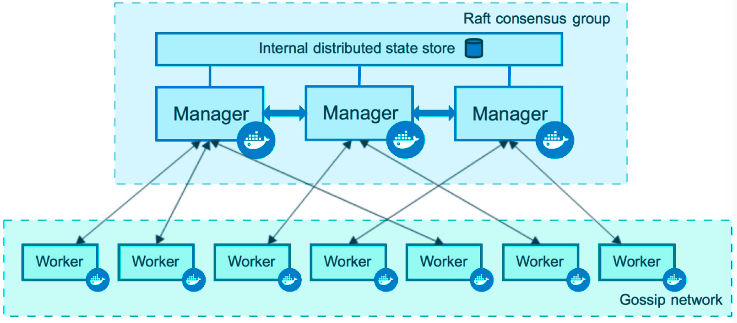
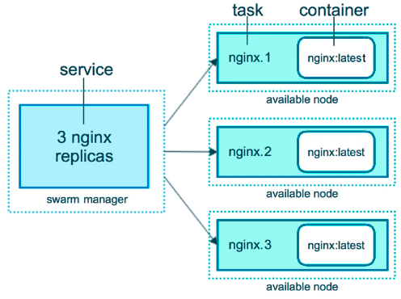
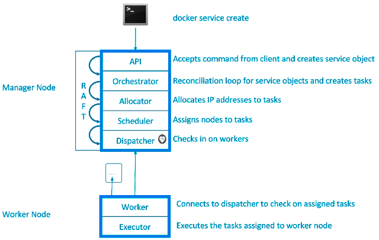
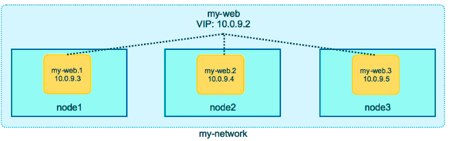
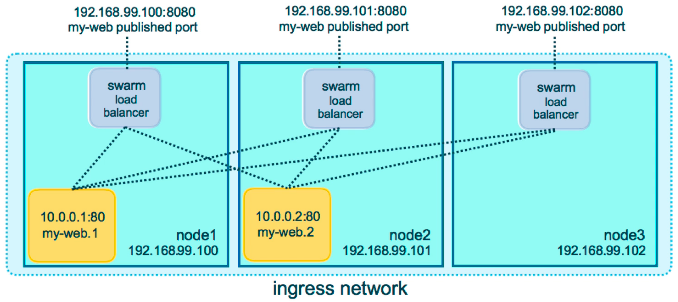
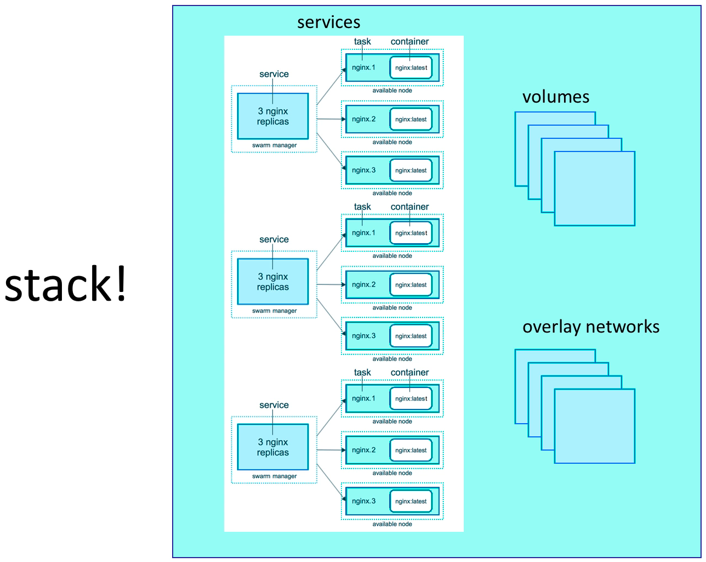

Swarm
=====

Containers Everywhere = New Problems
------------------------------------

* How do we automate container lifecycle?
* How can we easily scale out/in/up/down?
* How can we ensure our containers are recreated if they fail?
* How can we replace containers without downtime (blue/green deploy)?
* How can we control/track where containers get started?
* How can we create cross-node virtual networks?
* How can we ensure only trusted servers run our containers?
* How can we store secrets, keys, passwords and get them to the right container (and only that container)?

Swarm Mode: Built-In Orchestration
----------------------------------

* Swarm Mode is a clustering solution built inside Docker
* Not related to Swarm "classic" for pre-1.12 versions
* Added in 1.12 (Summer 2016) via SwarmKit toolkit
* Enhanced in 1.13 (Jan 2017) via Stacks and Secrets
* Not enabled by default, new commands once enabled

    * docker swarm
    * docker node
    * docker service
    * docker stack
    * docker secret

Swarm Services
--------------

* `docker swarm init`
* Lots of PKI and security automation

    * Root Signing Certificate create for our Swarm
    * Certificate is issued for first Manager node
    * Join tokens are created

* Raft database created to store root CA, configs and secrets

    * Encrypted by default on disk (1.13+)
    * No need for another key/value system to hold orchestration/secrets
    * Replicates logs amongst Managers via mutual TLS in "contrl plane"

Overlay Multi-Host Networking
-----------------------------

* Just choose `--driver overlay` when creating network
* FOr container-to-container traffic inside a single Swarm
* Optional IPSec (AES) encryption on netowrk creation
* Each service can be connected to multiple networks

    * (e.g. fornt-end, back-end)

* `docker network create --driver overlay mydrupal`
* `docker service create --name psql --network mydrupal -e POSTGRES_PASSWORD=mypass postgres`
* `docker service create --name dripal --network mydrupal -p 80:80 drupal`

Routing Mesh
------------

* Routes ingress (incoming) packets for a Service to proper Task
* Spans all nodes in Swarm
* Uses IPVS from Linux Kernal
* Load balances Swarm Services accross their Tasks
* Two ways this works
* COntainer-to-container in a Overlay netrwokr (uses VIP)
* External traffic incoming to published ports (all nodes listen)

* `docker service create --name elasticsearch --replicas 3 -p 9200:9200 elasticsearch:2`

* This is a stateless load balancer
* This LB is at OSI layer 3 (TCP) not layer 4 (DNS)
* Both limitations can be overcome with:
* Nginx or HAProxy LB proxy or:
* Docker enterprise Edition which comes with built-in L4 web proxy

Swarm Stacks
------------

* In 1.13 Docker adds a new layer of abstraction to Swarm called Stacks
* Stacks accept Compose files as their declarative definition for services, networks, and volumes
* We use `docker stack deploy` rather than docker service create
* Stack manages all those objects for us, including overlay network per stack. Adds stack name to start of their name
* New `deploy:` key in Compose file. Cant do `build:`
* Compose now ignores `deploy:`, Swarm ignores `build:`
* `docker-compose` cli not needed on Swarm server

* `docker stack deploy -c example-voting-app-stack.yml voteapp`
* `docker stack serices voteapp`
* `docker stack ps voteapp`

Swarm Secrets
-------------

Secrets Storage
^^^^^^^^^^^^^^^

* Easiest "Secure" solution for storing secrets in Swarm
* What is a Secret?

    * Usernames and passwords
    * TLS certificates and keys
    * SSH keys
    * Any data you would prefer not being on front page of news

* Supports generic strings or binary content up to 500Kb in size
* Doesnt require apps to be rewritten
* As of Docker 1.13.0 Swarm Raft DB is encrypted on disk
* Only stored on disk on Manager nodes
* Default is Managers and Workers "control plan" is TLS + Mutual Auth
* Secrets are firt stored in Swarm, then assigned to a Service(s)
* Only containers in assigned Service(s) can see them
* They look like files in container but are actuallin in-memory fs
* `/run/secrets/secret_name` or `/run/secrets/secret_alias`
* Local docker-compose can use file-based secrets, but not secure

Secrets with Services
^^^^^^^^^^^^^^^^^^^^^

* `docker secret create psql_user psql_user.txt`
* `echo "myDBPassword" | docker secret create psql_pass -`
* `docker secret ls`
* `docker secret inspect psql_user`
* `docker service create --name psql --secret psql_user --secret psql_pass -e POSTGRES_PASSWORD_FILE=/run/secrets/psql_pass -e POSTGRES_USER_FILE=/run/secrets/psql_user postgres`
* `docker service update --secret-rm`

Secrets with Stacks
^^^^^^^^^^^^^^^^^^^

* `docker service create --name search --replicas 3 -p 9200:9200 elasticsearch:2`
* `docker stack deploy -c docker-compoes.yml mydb`

Swarm Lifecycle
---------------

* `docker-compose exec psql cat /run/secrets/psql_user`

Full App Lifecycle with Compose
^^^^^^^^^^^^^^^^^^^^^^^^^^^^^^^

* Single set of Compose files for:
* Local `docker-compose up` development environemnt
* Remote `docker-compose up` CI environment
* Remote `docker stack deploy` production environment
* Note: `docker-compose -f a.yml -f b.yml config` mostly works
* Note: Compose `extends:` doesnt work yet in Stacks

Service Updates
---------------

* Provides rolling replacement of tasks/containers in a service
* Limits downtime (be careful with "prevents" downtime)
* Will replace containers for most changes
* Has many, many cli options to control the update
* Create options will usally change, adding -add or -rm to them
* Also has scale & rollback subcommand for quicker access

    * `docker service scale web=4` and `docker service rollback web`

* A stack deploy, when pre-existing, will issue service updates

Swarm Update Examples
^^^^^^^^^^^^^^^^^^^^^

* Just update the image used to a newer version

    * `docker service update --image myapp:1.2.1 <servicename>`

* Adding an environment variable and remove a port

    * `docker service update --env-add NODE_ENV=production --publish-rm 8080`

 * Change number of replicas of two services

    * `docker service scale web=8 api=6`

Swarm Updates in Stack FIles
^^^^^^^^^^^^^^^^^^^^^^^^^^^^

Same command, just edit the YAML file, then

`docker stack deploy -c file.yml <stackname>`

Healthchecks
------------

* `HEALTHCHECK` was added in 1.12
* Supported in Dckerfile, Compose YAML, docker run, and Swarm Services
* Docker engine will `exec`'s the command in the container

    * e.g curl localhost

* it expects `exit 0` (OK) or `exit 1` (Error)
* Three container states: starting, healthy, unhealthy
* Much better than "is binary still running?"
* Not an external monitoring replacement
* Healthcheck status shows up in `docker container ls`
* Check last 5 healthchecks with `docker container inspect`
* Docker run does nothing with healthchecks
* Services will replace takss if they fail healthcheck
* Service updates wait for them before continuing

Healthcheck DOcker Run Example
^^^^^^^^^^^^^^^^^^^^^^^^^^^^^^

.. code-block:: bash

    docker run \
    --health-cmd="curl -f localhost:9200/_cluster/health || False" \
    --health-interval=5s \
    --health-retries=3 \
    --health-timeout=2s \
    --health-start-period=15s \
    elasticsearch:2

Healthcheck Dockerfile Examples
^^^^^^^^^^^^^^^^^^^^^^^^^^^^^^^

* Options for healthcheck command

    * `--interval=DURATION (default: 30s)`
    * `--timeout=DURATION (default: 30s)`
    * `--start-period=DURATION (default: 0s) (17.09+)`
    * `--retries=N (default:3)`

* Basic command using default options

    * `HEALTHCHECK curl -f http://localhost/ || false`

* Custom options with the command

    * `HEALTHCHECK --timeout=2s --interval=3s --retries=3 CMD curl -f http://localhost/ || exit 1`

Healthcheck in Nginx Dockerfile
^^^^^^^^^^^^^^^^^^^^^^^^^^^^^^^

* Static website running in Nginx, just test default URL

.. code-block:: bash

    FROM nginx:1.13
    HEALTHCHECK --interval=30s --timeout=3s \
    CMD curl -f http://localhost/ || exit 1

Healthcheck in PHP Nginx Dockerfile
^^^^^^^^^^^^^^^^^^^^^^^^^^^^^^^^^^^

PHP-FPM running behind Nginx, test the Nginx and FPM status URLs

.. code-block:: bash

    FROM your-nginx-php-fpm-combo-image

    # dont do this if php-fpm is another container
    # must enable php-fpm ping/status in pool.ini
    # must forward /ping and /status urls from ngix to php-fpom

    HEALTHCHECK --interval=5s --timeout=3s \
    CMD curl -f http://localhost/ping || exit 1

Healthcheck in postgres Dockerfile
^^^^^^^^^^^^^^^^^^^^^^^^^^^^^^^^^^

Use a PostgtreSQL utility to test for ready state

.. code-block:: bash

    FROM postgres

    # Specify real user with -U to prevent errors in log

    HEALTHCHECK --interval=5s --timeout=3s \
    CMD pg_isready -U postgres || exit 1

    