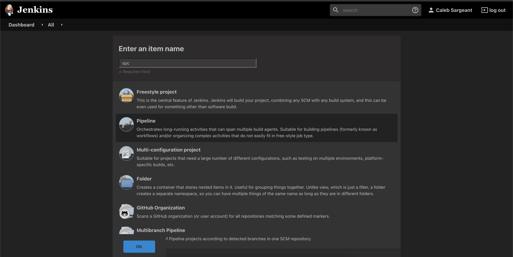
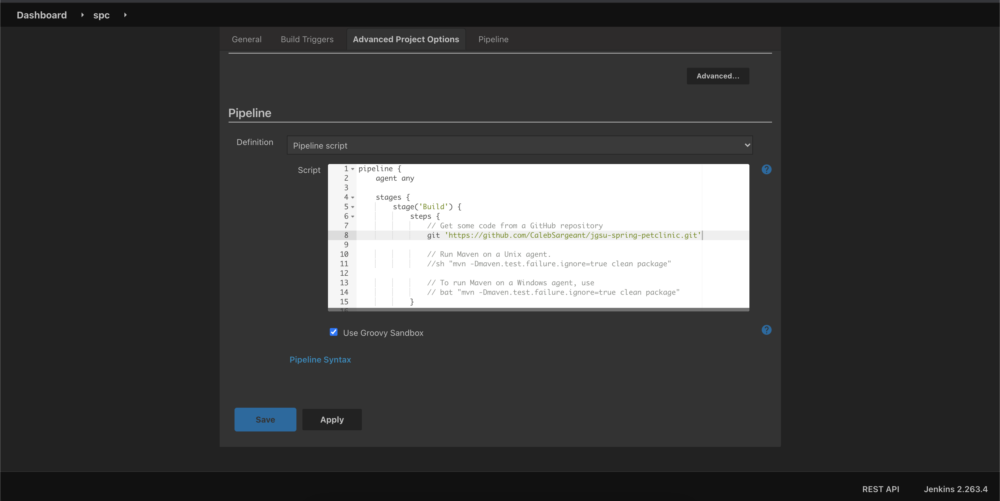
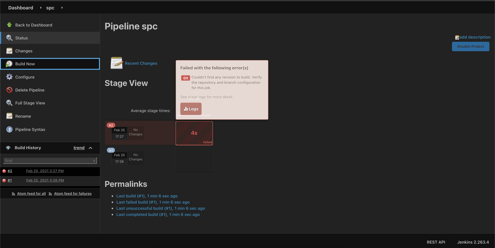
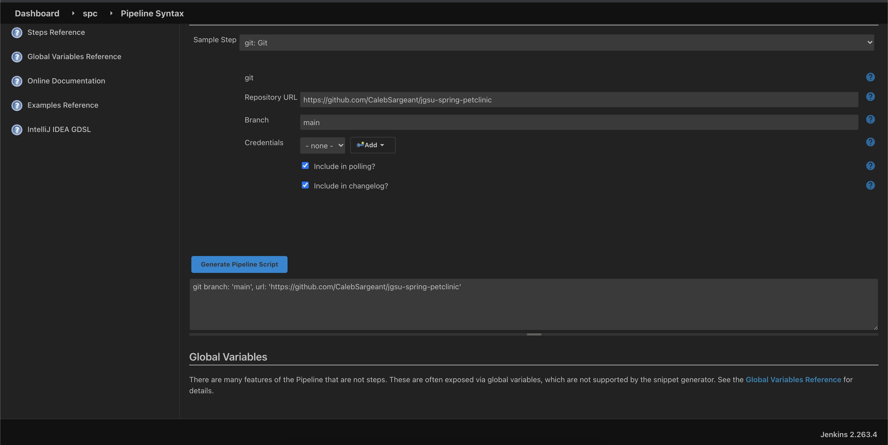
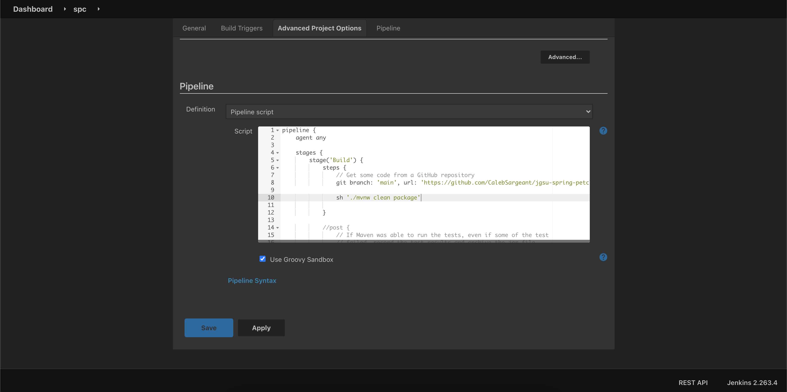
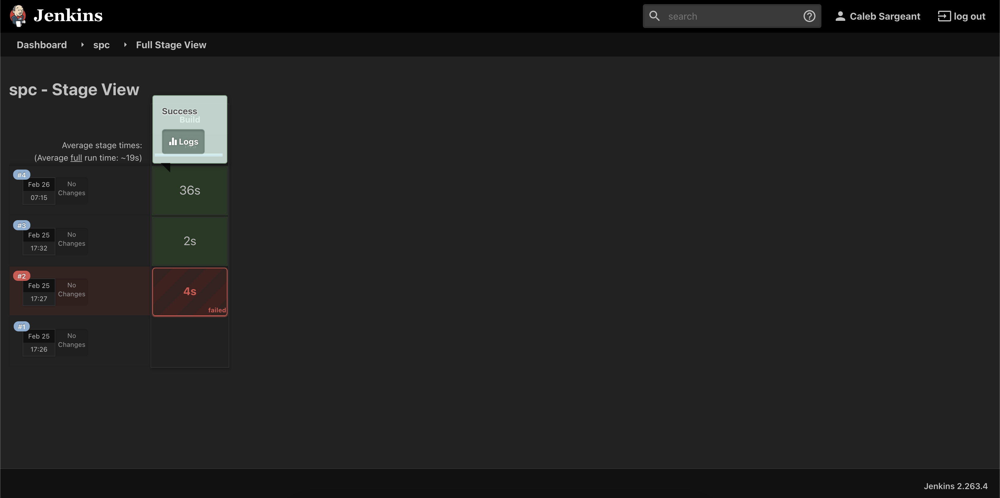
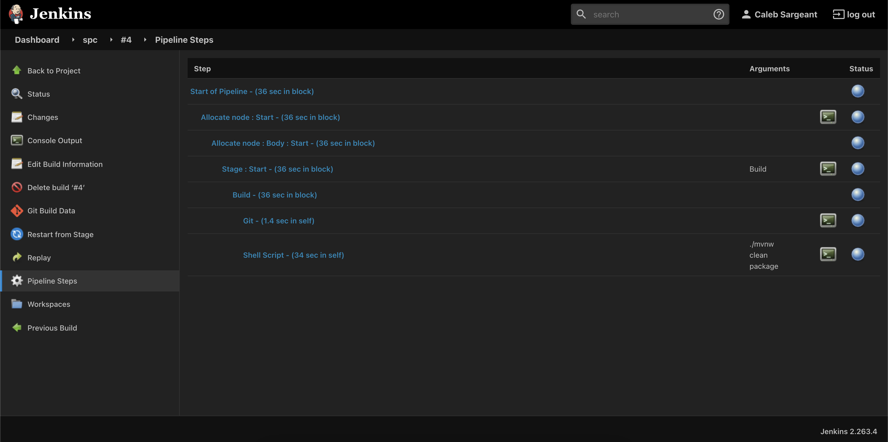
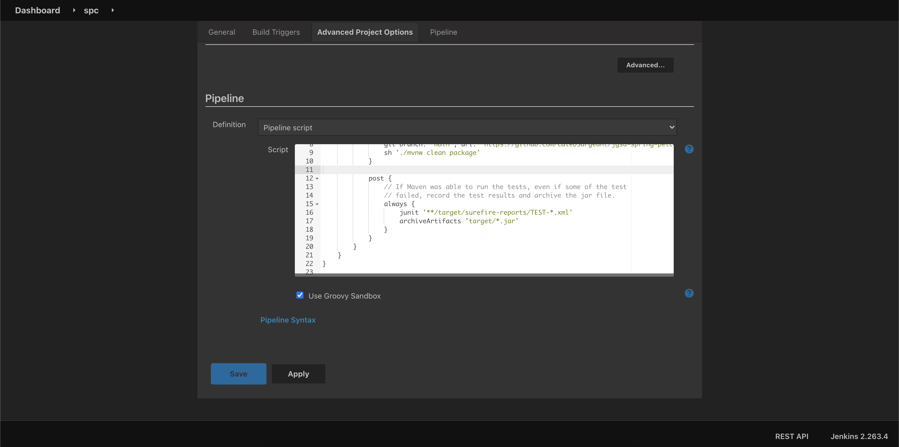
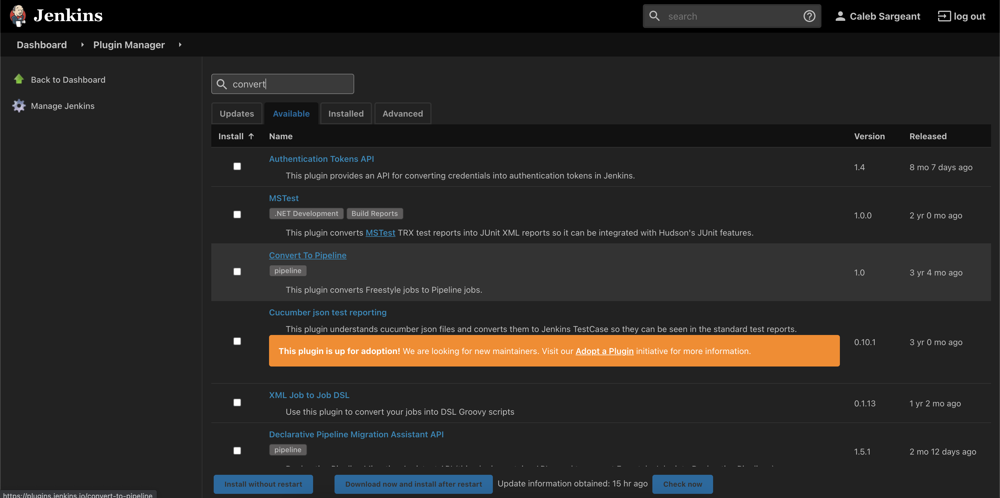

# Automating Jobs Configured with Code

<figure>

<figcaption>Pipeline config to clone repo</figcaption>
</figure>

<figure>

<figcaption>A failed pipeline building</figcaption>
</figure>

<figure>

<figcaption>It's helpful to generate using Pipeline Syntax</figcaption>
</figure>

<figure>

<figcaption>Viewing the pipeline syntax</figcaption>
</figure>

<figure>

<figcaption>Build our package via pipeline</figcaption>
</figure>

<figure>

<figcaption>Viewing results in Stage View</figcaption>
</figure>

<figure>

<figcaption>Viewing the Pipeline Steps of a Build</figcaption>
</figure>

<figure>

<figcaption>Adding post to pipeline for archiving jar file &amp; test
results</figcaption>
</figure>

<figure>

<figcaption>Adding a Stage to the pipeline</figcaption>
</figure>

<figure>

<figcaption>The convert to pipeline plugin</figcaption>
</figure>
