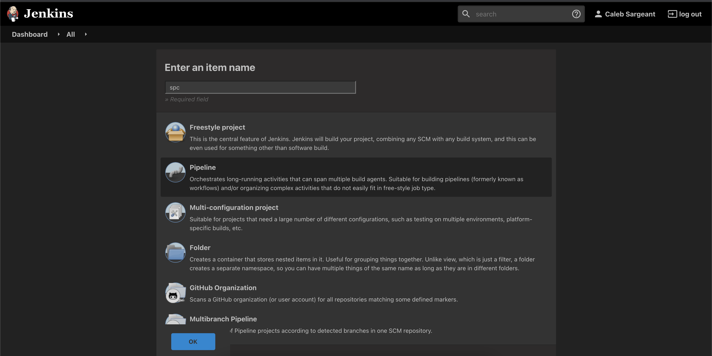
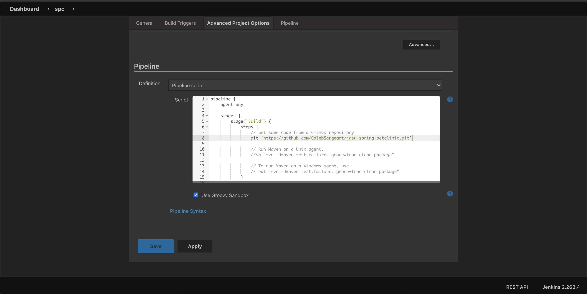
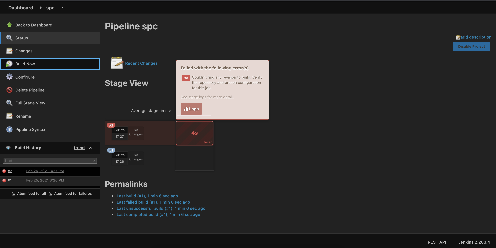
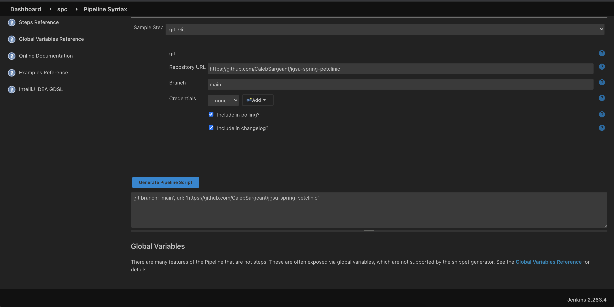
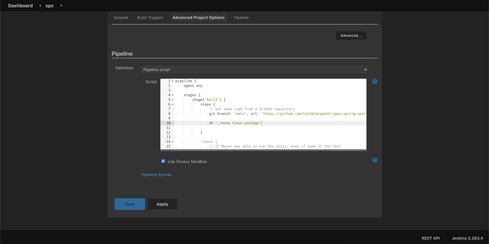
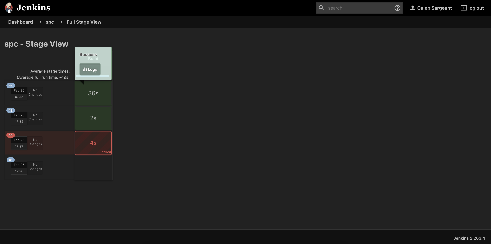
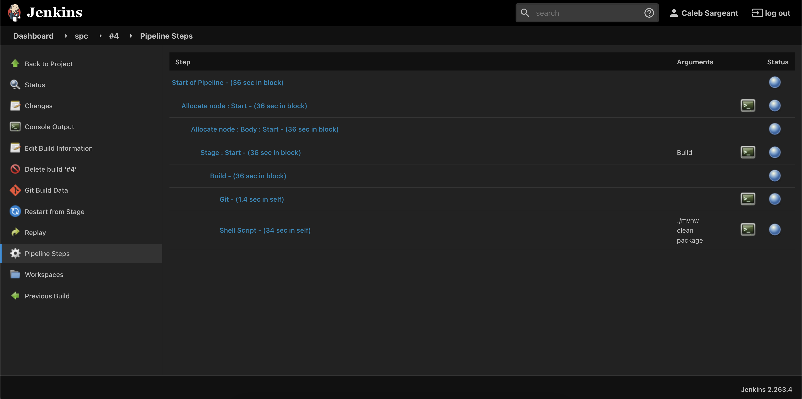
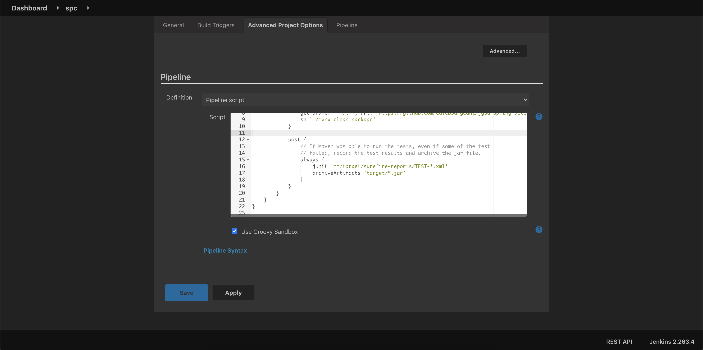
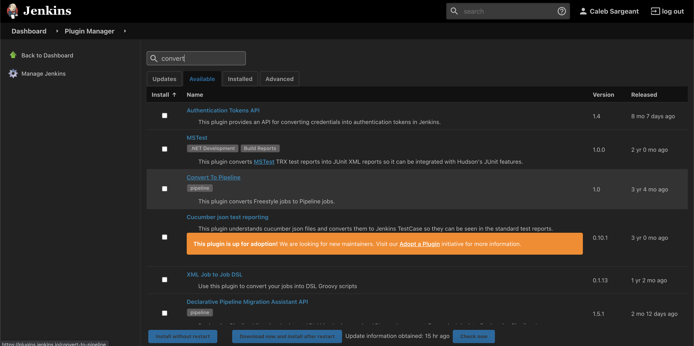

Automating Jobs Configured with Code
====================================

  Pipeline config to clone repo

  A failed pipeline building

  It's helpful to generate using Pipeline Syntax

  Viewing the pipeline syntax

  Build our package via pipeline

  Viewing results in Stage View

  Viewing the Pipeline Steps of a Build

  Adding post to pipeline for archiving jar file & test results

  Adding a Stage to the pipeline

  The convert to pipeline plugin
