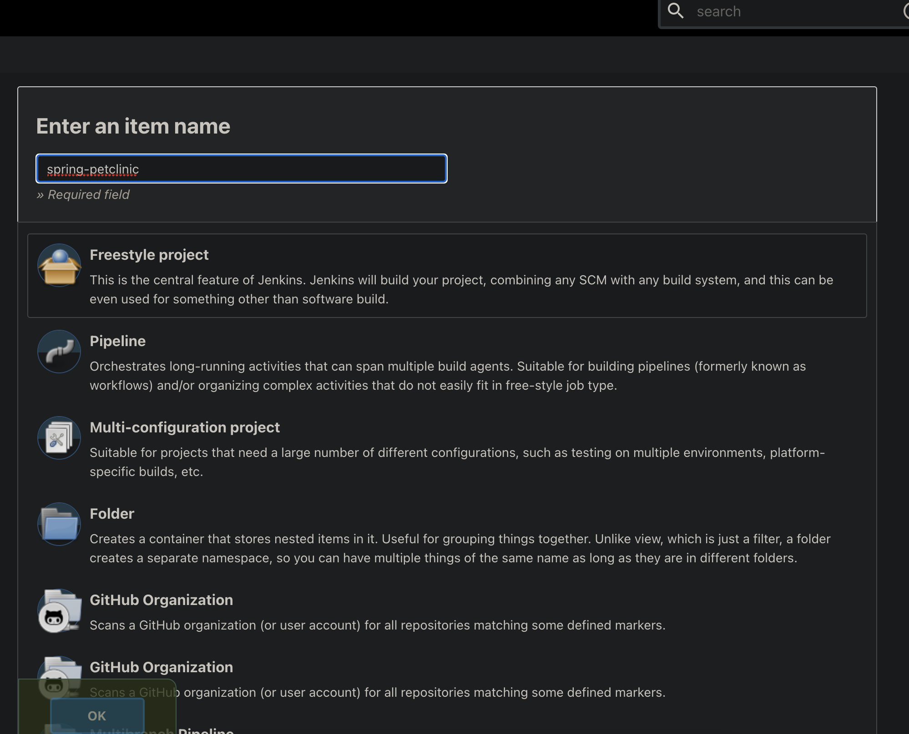
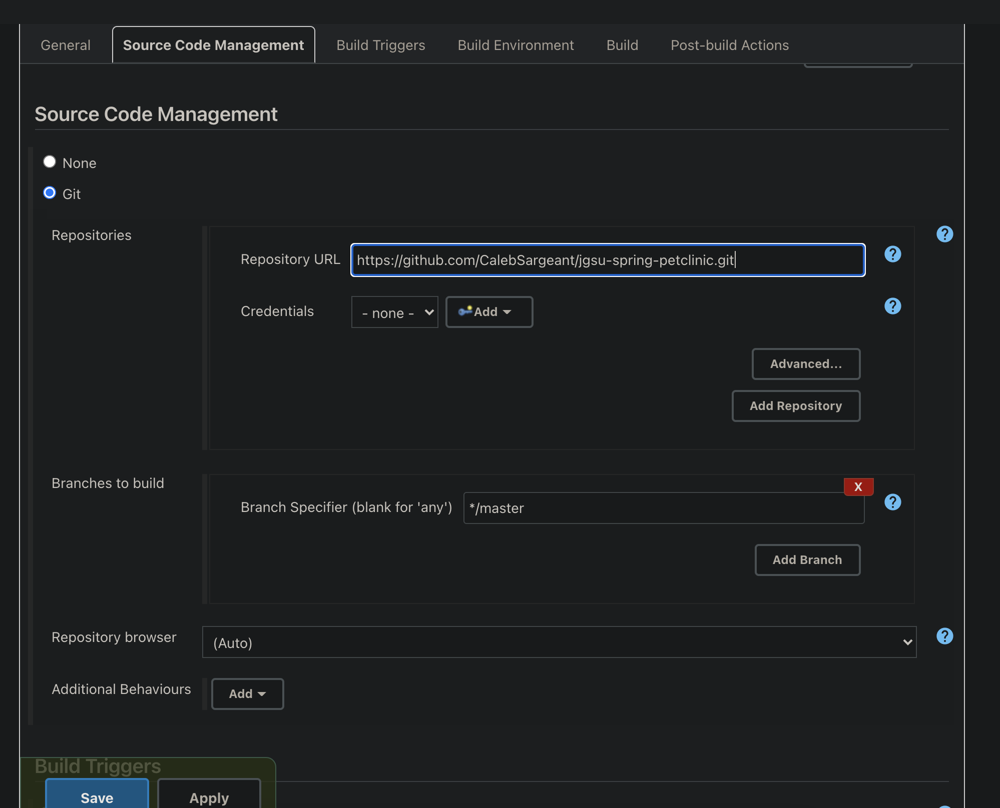
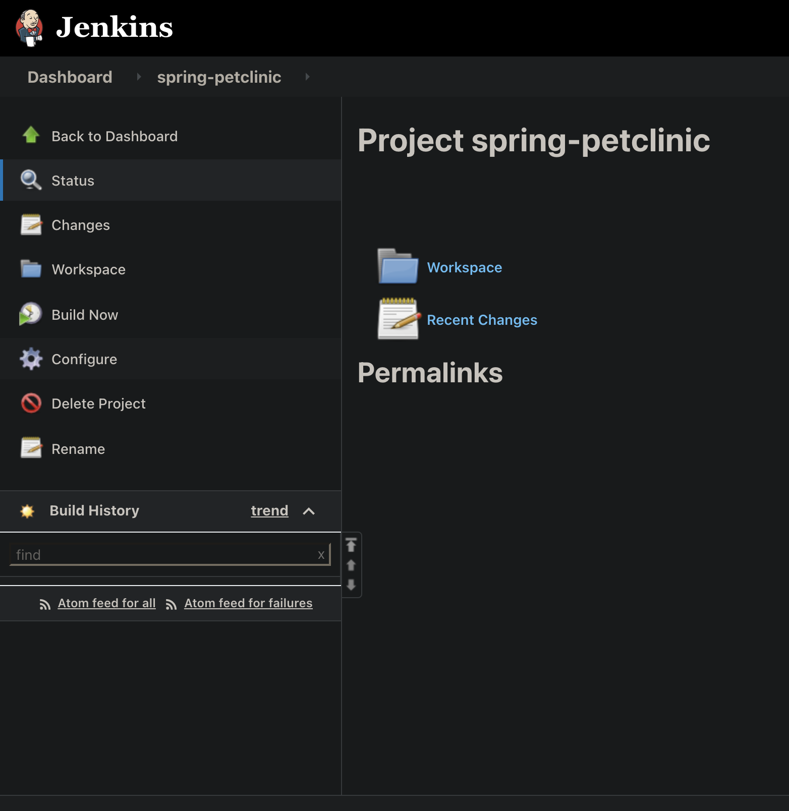
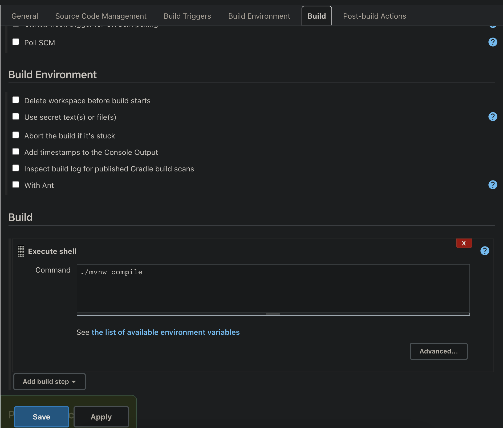
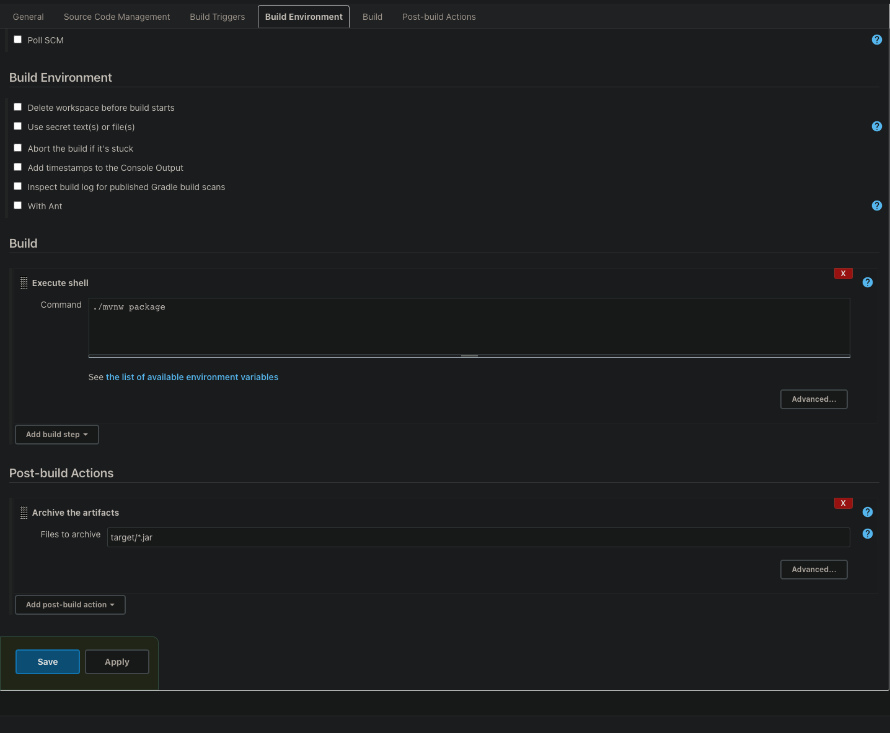
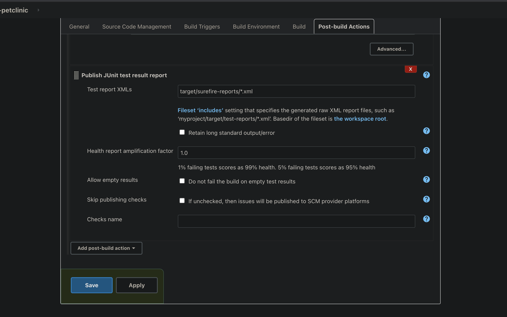
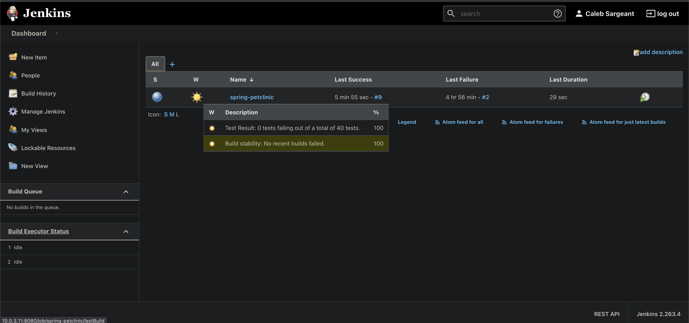
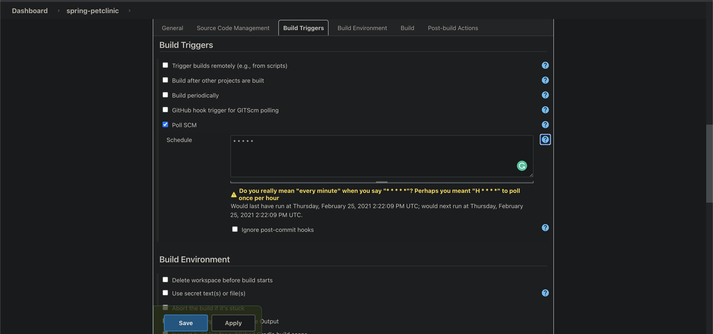
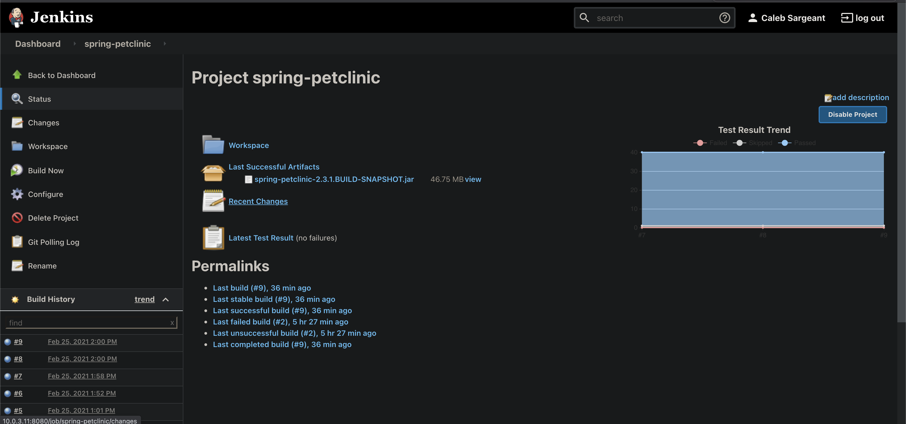

# Building Applications with Freestyle Jobs

## Anatomy of the Build

-   Git repo
    -   Compile
    -   Test
    -   Package
    -   Clean
    -   rinse & repeat

## Manually Building with Maven and Running App

``` bash
git clone git@github.com:CalebSargeant/jgsu-spring-petclinic.git --config core.sshCommand="ssh -i ~/.ssh/github"
cd jgsu-spring-petclinic
./mvnw compile
./mvnw test
./mvnw package
java -jar target/spring-petclinic-2.3.1.BUILD-SNAPSHOT.jar
```

## Packaging an App in Jenkins

::: note
::: title
Note
:::

Workspaces are temporary!
:::

<figure>

<figcaption>Give your item a name</figcaption>
</figure>

<figure>

<figcaption>Input the repo url, ensure branch is correct (main vs
master)</figcaption>
</figure>

<figure>

<figcaption>To build a project, click Build now</figcaption>
</figure>

<figure>

<figcaption>You can use <code>mvnw</code> commands for
building</figcaption>
</figure>

<figure>

<figcaption>We'll want to package our app, also exclude
<code>*.jar</code> from being deleted</figcaption>
</figure>

<figure>

<figcaption>You can configure test reports from the xml
files</figcaption>
</figure>

<figure>

<figcaption>Checking the health status of a build</figcaption>
</figure>

<figure>

<figcaption>Configuring polling git for changes to code to build
automatically</figcaption>
</figure>

<figure>

<figcaption>You can check the recent changes of a build and drill down
into git diffs</figcaption>
</figure>
