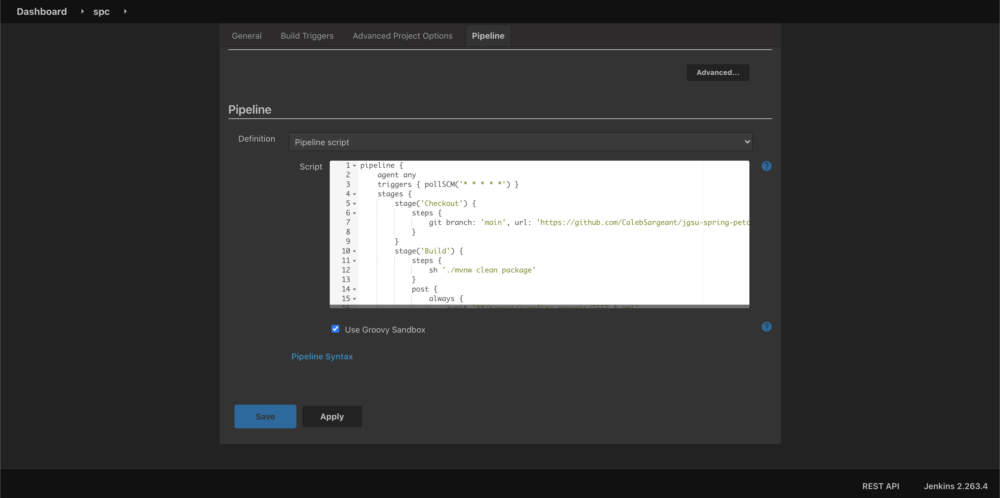
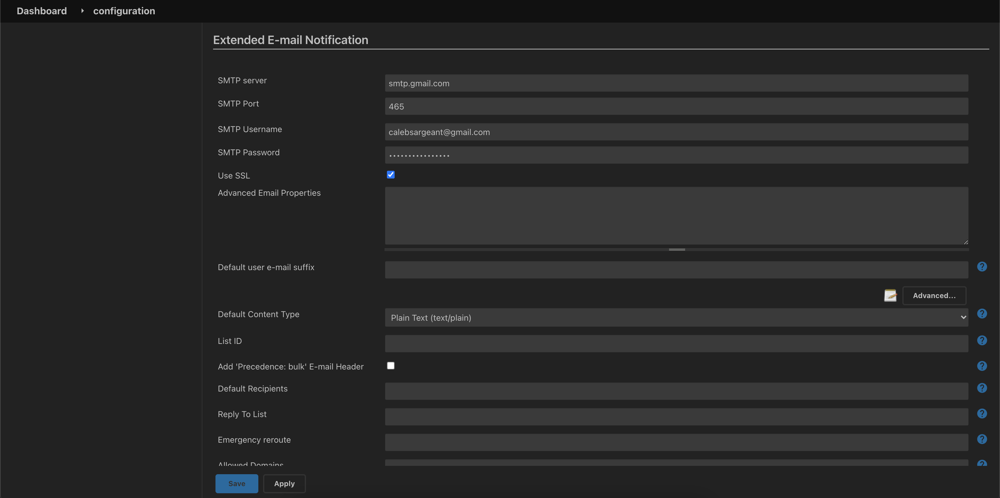
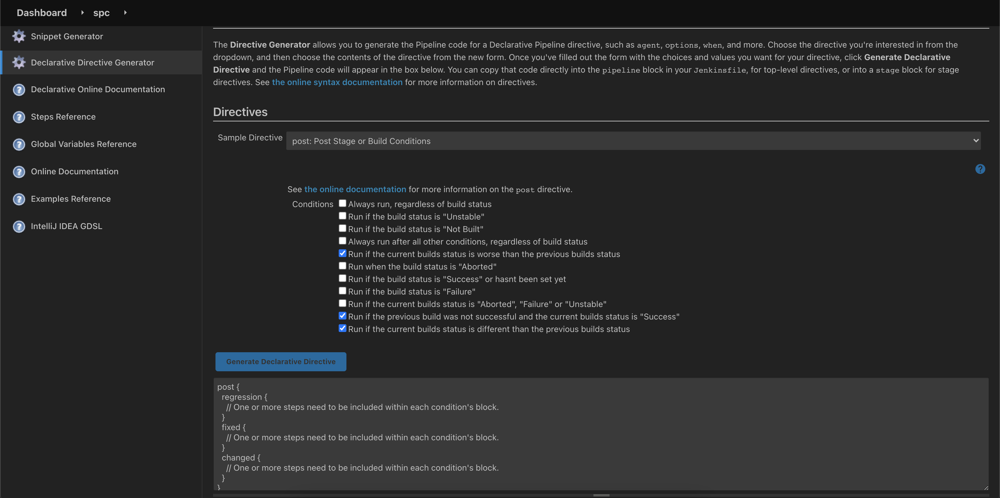
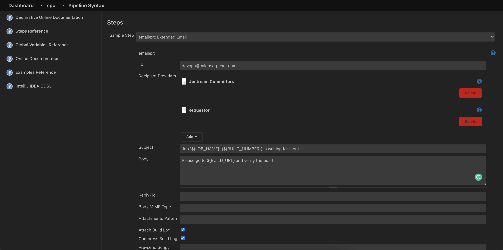
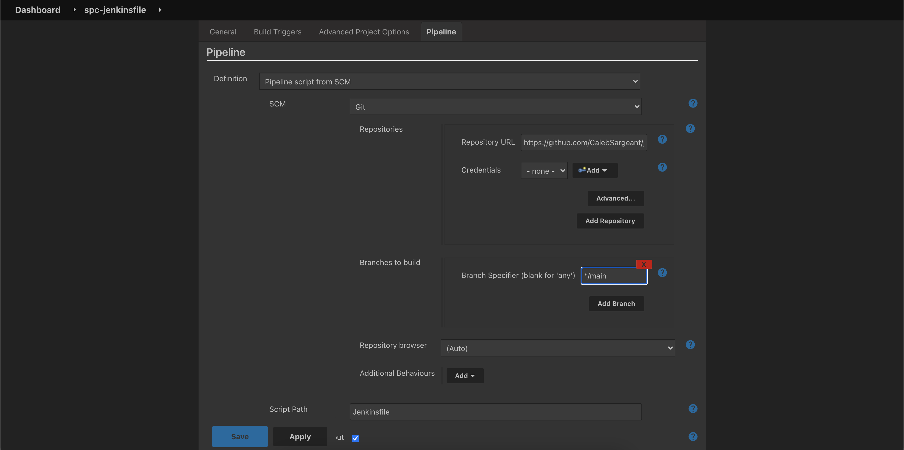

Colocating Jobs and Source Code with Jenkinsfile
================================================

View the `Pipeline Syntax documentation online: <https://www.jenkins.io/doc/book/pipeline/syntax/#agent>`_

Download example pipeline: :download:`_docs/pipeline.groovy`

  Adding a trigger to the pipeline

  Configuring Email server for Jenkins

  Post Declarative Directive generator for regression, fixed, and changed

View the `Global Variable Reference <https://www.jenkins.io/doc/book/pipeline/getting-started/#global-variable-reference>`_

  Generating email pipeline syntax

  pipeline from single repo - scm

.. note::

	You can create a new item and have Jenkins scan all repos in a GitHub org for Jenkinsfiles and create build processes for each
