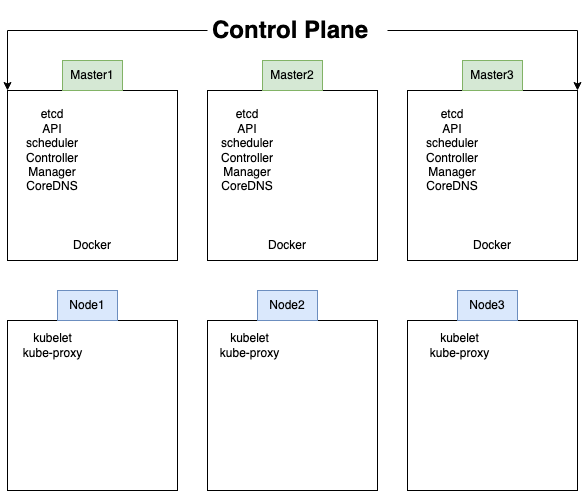
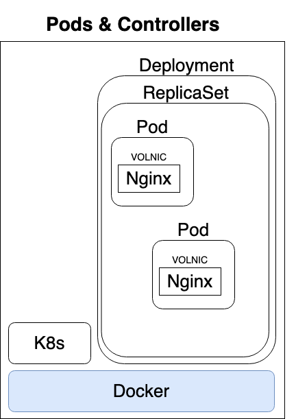

Kubernetes Install
==================

Architecture Terminology
------------------------

* Kubernetes: the whole orchestration system

    * K8s "k-eights" or Kube for short

* Kubectl: CLI to configure Kubernetes and manage apps

    * Using "cube control" official pronunciation

* Node: Single server in the Kubernetes cluster
* Kubelet: Kubernetes agent running on nodes
* Control Plane: Set of containers that manage the cluster

    * Includes API server, scheduler, controller manager, etcd, and more
    * Sometimes called the master

Installing Kubernetes
---------------------

* Kubernetes is a series of containers, CLIs and configurations
* Many ways to install
* Docker Desktop: Enable in settings

    * Sets up everything inside Docker's existing Linux VM

* Docker Toolbox on Windows: MiniKube

    * Uses VirtualBox to make Linux VM

* Your Own Linux Host or VM: MicroK8s

    * Installs Kubernetes right on the OS

* Kubernetes in a browser

    * Try http://play-with-k8s.com or katacoda.com in a browser

Container Abstractions
----------------------

* **Pod:** one or more containers running together on one Node

    * Basic unit of deployment. Containers are always in pods

* **Controller:** For creating/updating pods and other objects

    * Many types of Controllers inc. Deployment, ReplicaSet, StatefulSet, DaemonSet, Job, CronJob, etc.

* **Service:** network endpoint to connect to a pod
* **Namespace:** Filtered group of objects in cluster
* Secrets, ConfigMaps, and more

Kubectl Command Styles
----------------------

* Kubernets is evolving, and so is the CLI
* We get three ways to create pods from the kubectl CLI

    * `kubectl run` (changing to be only for pod creation)
    * `kubectl create` (create some resources via CLI or YAML)
    * `kubectl apply` (create/update anything via YAML)

Our First Pod
-------------

Creating Pods with kubectl
^^^^^^^^^^^^^^^^^^^^^^^^^^

* Are we working?

    * `kubectl version`

* Two ways to deploy Pods (containers): via commands, or via YAML
* Lets run a pod of the nginx web server!

    * `kubectl run my-nginx --image nginx`

* Lets list the pod

    * `kubectl get pods`

* Lets see all objects

    * `kubectl get all`

Pods -> ReplicaSet -> Deployment
^^^^^^^^^^^^^^^^^^^^^^^^^^^^^^^^

Cleanup
^^^^^^^

* Delete deployment

    * `kubectl delete deployment my-nginx`

Scaling ReplicaSets
-------------------

* Start a new deployment for one replica/pod

    * `kubectl run my-apache --image httpd`

* Lets scale it up with another pod

    * `kubectl scale deploy/my-apache --replicas 2`
    * `kubectl scale deployment my-apace --replicas 2`
    * Same command
    * deploy = deployment = deployments

Inspecting Deployments
----------------------

* `kubectl get pods`
* Get container logs

    * `kubectl logs deploy my-apache --follow --tail 1`

* Get a bunch of details about an object including events!

    * `kubectl logs -l run=my-apache`
    * `kubectl describe pod/my-apache-xxxxxx-yyyyy`

* Watch a command (without needing `watch`)

    * `kubectl get pods -w`

* In a seperate window

    * `kubectl delete pod/my-apache-xxx-yyy`

* Watch the pod get re-created

