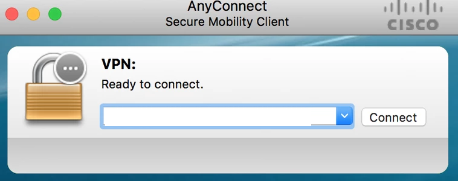
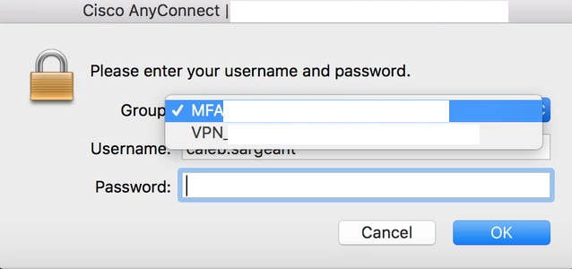
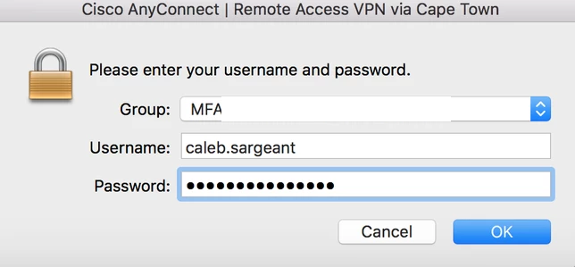
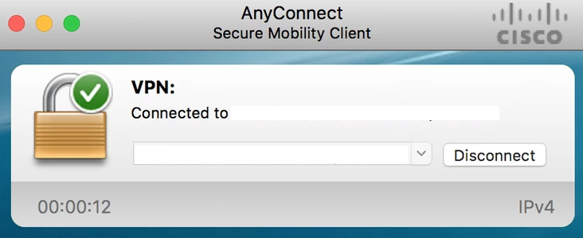

General
=======

General, random and useful Linux-related config and things.

A good site to browse random commands and things: https://www.commandlinefu.com/

Apt & Yum Cheat Sheets
----------------------

https://blog.packagecloud.io:

:download:`Apt Cheat Sheet <_docs/APT Cheat Sheet - Packagecloud Blog.pdf>`

:download:`Yum Cheat Sheet <_docs/Yum Cheat Sheet - Packagecloud Blog.pdf>`

Yum
---

Clear Yum Cache
^^^^^^^^^^^^^^^

https://unix.stackexchange.com/questions/481993/tar-directory-and-exclude-multiple-subdirectories/481994

.. code-block:: bash

  yum clean all

Nmap
----

https://phoenixnap.com/kb/nmap-scan-open-ports

.. code-block:: bash

  # Scan a host
  nmap www.hostname.com

  # Scan a range
  nmap 192.168.0.1-10

  # Scan a subnet
  nmap 192.168.0.1/24

  # Scan a list of hosts
  nmap -iL textlist.txt

  # Scan a port
  nmap -p 80 192.168.0.1

  # Scan a range of ports
  nmap -p 1-200 192.168.0.1

  # Fast scan most common ports
  nmap -F 192.168.0.1

  # Scan all ports
  nmap -p- 192.168.0.1

  # Scan using TCP connect (takes longer but more likely to connect)
  nmap -sT 192.168.0.1

  # Scan default SYN scan (tests by performing only half the TCP handshake)
  nmap -sS 192.168.0.1

  # Scan UDP ports
  nmap -sU -p 80,130,255 192.168.0.1

  # Bypass host discovery (host discovery uses ping, but many firewalls don't respond to ping. This runs the test without waiting for ping response)
  nmap -Pn -F 192.168.0.1

  # Detect OS
  nmap -A 192.168.0.1

  # Scan for services that might be using different ports
  nmap -sV 192.168.0.1

Rsync
-----

https://ss64.com/bash/rsync.html

https://www.computerhope.com/unix/rsync.htm

.. code-block:: bash

  # rsync without owner and group attributes
  rsync -avP --no-o --no-g /mnt/data/share/ /mnt/server3/Backups/

  # cronning rsync (https://unix.stackexchange.com/questions/392780/how-to-schedule-an-rsync-command)
  crontab -e
    0 19 * * * root rsync -a src dest

  # rsync showing progress (https://www.cyberciti.biz/faq/show-progress-during-file-transfer/)
  rsync -P src dest

  # rsync exclude stuff
  rsync -avP --exclude 'file_or_dir' src/ dst/

  # rsync exclude from source file list
  cat excl-list.txt
    thisdir
    thatdir
    myfile.txt
  rsync -av --exclude-from={excl-list.txt}

  # stop rsync from bandwidth vreet (https://www.cyberciti.biz/faq/how-to-set-keep-rsync-from-using-all-your-bandwidth-on-linux-unix/)
  rsync -avP --bwlimit=KBps
  rsync -avP --bwlimit=1024 src/ dst/

  # rsync specify multiple source dirs (https://unix.stackexchange.com/questions/368210/how-to-rsync-multiple-source-folders)
  rsync -avP /src/one /src/two /src/etcetra /dst

Rsync Compare Directories
^^^^^^^^^^^^^^^^^^^^^^^^^

https://unix.stackexchange.com/questions/57305/rsync-compare-directories

.. code-block:: bash

  rsync -nai --delete source destination | grep "^deleting "

Smartcl
-------

https://unix.stackexchange.com/questions/39064/smartctl-on-external-hdd-inside-ide-to-usb-enclosure

.. code-block:: bash

  smartctl -H -d sat /dev/sda

While Loop
----------

https://stackoverflow.com/questions/1289026/syntax-for-a-single-line-while-loop-in-bash

.. code-block:: bash

  while true; do foo; sleep 2; done

For Loop
--------

https://unix.stackexchange.com/questions/103920/parallelize-a-bash-for-loop/103922

.. code-block:: bash

  # Parellelize a for loop
  for thing in a b c d e f g; do 
    task "$thing" &
  done

Moving Files with Spaces
------------------------

https://unix.stackexchange.com/questions/392393/bash-moving-files-with-spaces

.. code-block:: bash

  while IFS= read -r file; do echo "$file"; done < files 

IPv6
----

Disabling IPv6
^^^^^^^^^^^^^^

https://itsfoss.com/disable-ipv6-ubuntu-linux/

.. code-block:: bash

  nano /etc/sysctl.conf
    net.ipv6.conf.all.disable_ipv6=1
    net.ipv6.conf.default.disable_ipv6=1
    net.ipv6.conf.lo.disable_ipv6=1
  sudo sysctl -p

Fstab
-----

Automounting
^^^^^^^^^^^^

.. code-block:: bash

  # List all UUIDs of drives
  blkid

  # List all disks
  fdisk -l

  nano /etc/fstab
    UUID=05cdfcb3-90fc-40ec-8ff1-3324e3767b1d	/media/data	ext4	defaults,nofail 0 0

Emergency Mode Bad Fstab
^^^^^^^^^^^^^^^^^^^^^^^^

.. code-block:: bash

  # Put SD card / HDD into another PC
  nano /boot/cmdline.txt
    init=/bin/sh

  # Put SD card / HDD back into original machine

  # Mount FS (but not fstab)
  mount -o remount,rw / –target /

  # Modify fstab
  nano /etc/fstab
    # modify what must be

  # Put SD card / HDD into another PC
  nano /boot/cmdline.txt
    # delete init=/bin/sh

  # Put SD card / HDD back into original machine

Swap
----

https://www.digitalocean.com/community/tutorials/how-to-add-swap-space-on-ubuntu-20-04

.. code-block:: bash

  sudo swapon --show
  free -h
  df -h
  sudo fallocate -l 1G /swapfile
  sudo chmod 600 /swapfile
  sudo mkswap /swapfile
  sudo swapon /swapfile
  echo '/swapfile none swap sw 0 0' | sudo tee -a /etc/fstab

SSH Config
----------

https://www.ssh.com/ssh/config/

https://www.openssh.com/legacy.html

Example:

.. code-block:: bash

  cat ~/.ssh/config
    Host server
     LocalForward 2222 192.168.99.99:22
     User ubuntu
     Hostname 192.168.100.1
     IdentityFile ~/.ssh/server
    Host router
     User cisco
     Hostname 192.168.1.1
     IdentityFile ~/.ssh/router
     Ciphers aes256-cbc
    Host switch
     User cisco
     Hostname 192.168.33.2
     Ciphers aes256-cbc
     KexAlgorithms +diffie-hellman-group1-sha1

OpenSSL
-------

.. code-block:: bash
  
  # https://stackoverflow.com/questions/5244129/use-rsa-private-key-to-generate-public-key
  # Generate public key from private
  openssl rsa -in mykey.pem -pubout > mykey.pub

Disk Usage
----------

.. code-block:: bash

  # Human readable output
  du -h mydir/

  # Kilobytes
  du -k mydir/

  # Megabytes
  du -m mydir/

  # Which sub-dirs consume how much disk space:
  du -h --max-depth=1 mydir/ | sort -hr

  # List all items including files and dirs
  du -ah mydir/

  # Multiple dirs
  du -h dir1/ dir2/

  # Summary
  du -sh

  # Grand total of dirs
  du -sch dir/

  # Exclude:
  du -sh --exclude='*.docx'

Order by Size
^^^^^^^^^^^^^

https://www.studytonight.com/forum/how-can-i-sort-du-h-output-by-size

.. code-block:: bash

  du | sort -nr | cut -f2- | xargs du -hs

Formatting Disk
---------------

.. code-block:: bash

  # List disks
  df -h
  fdisk -l

  # Unmount disk to format
  sudo umount /dev/sdc1

  # vFAT, NTFS, EXT4, etc.:
  sudo mkfs.vfat /dev/sdc1
  sudo mkfs.ntfs /dev/sdc1
  sudo mkfs.ext4 /dev/sdc1

ISO to Disk
-----------

.. code-block:: bash

  sudo dd if=~/Downloads/ubuntu_something.iso of=/dev/diskN

Check SSL Certificate Expiry Date
---------------------------------

https://www.cyberciti.biz/faq/find-check-tls-ssl-certificate-expiry-date-from-linux-unix/

.. code-block:: bash

  echo | openssl s_client -servername www.calebsargeant.com -connect www.calebsargeant.com:443 | openssl x509 -noout -dates

Inodes
------

https://stackoverflow.com/questions/24671621/no-space-left-on-device

.. code-block:: bash

  df -i

https://unix.stackexchange.com/questions/117093/find-where-inodes-are-being-used

.. code-block:: bash
  
  { find / -xdev -printf '%h\n' | sort | uniq -c | sort -k 1 -n; } 2>/dev/null


Mail
----

https://askubuntu.com/questions/12917/how-to-send-mail-from-the-command-line

Grep
----

.. code-block:: bash
  
  # exclude nologin
  grep -wv nologin /etc/passwd

  # recursive lookups - https://stackoverflow.com/questions/1987926/how-do-i-grep-recursively
  grep -r "texthere" .

Tail
----

.. code-block:: bash

  ## https://stackoverflow.com/questions/39615142/bash-get-last-line-from-a-variable
  # Get last line
  tail -n1

SFTP
----

Pass Variable into SFTP
^^^^^^^^^^^^^^^^^^^^^^^

https://unix.stackexchange.com/questions/228859/how-do-i-pass-a-variable-into-sftp

.. code-block:: bash

  sftp -i key.pem -b - un@server <<< "get /some/path/with/$yr"

Curl
----

Uploading Files
^^^^^^^^^^^^^^^

https://ec.haxx.se/usingcurl/usingcurl-uploads

.. code-block:: bash

  curl https://EXAMPLE \
    -F 'one=sometext' \
    -F 'two=someothertext' \
    -F 'three=somemoretext' \
    -F 'doc=@/Users/caleb/Documents/Test.docx; type=application/vnd.openxmlformats-officedocument.wordprocessingml.document'

Curl to SFTP
^^^^^^^^^^^^

https://stackoverflow.com/questions/31730476/curl-fails-on-sftp-password-authentication

.. code-block:: bash

  curl -v --insecure --user username:urlencodedPassword sftp://somedomain.com

TCPDump
-------

https://danielmiessler.com/study/tcpdump/

https://serverfault.com/questions/1025292/how-to-specify-both-ip-address-and-port-in-tcpdump

Get all https traffic:

.. code-block:: bash

  tcpdump -nnSX port 443

Get just port 443

.. code-block:: bash

  tcpdump port 443

Get from specific source:

.. code-block:: bash

  tcpdump src 10.3.0.4

Dump from an interface:

.. code-block:: bash

  tcpdump -i eth0

Putting it all together:

.. code-block:: bash

  tcpdump -i enp1s9 dst 192.168.6.1 and src 192.168.6.2 and src port 80

Find
----

https://askubuntu.com/questions/123305/how-to-find-a-folder-on-my-server-with-a-certain-name

.. code-block:: bash

  find ~ -name foldername -type d

https://stackoverflow.com/questions/5905054/how-can-i-recursively-find-all-files-in-current-and-subfolders-based-on-wildcard

.. code-block:: bash

  find . -name "foo*"

https://www.howtogeek.com/howto/ubuntu/delete-files-older-than-x-days-on-linux/

.. code-block:: bash

  find /path/to/files* -mtime +5 -exec rm {} \;

Screen
------

Using Screen
^^^^^^^^^^^^

https://linuxize.com/post/how-to-use-linux-screen/

.. code-block:: bash

  # Create screen called caleb
  screen -S caleb

  # Go into screen called caleb
  screen -r -d caleb

List Running Sessions
^^^^^^^^^^^^^^^^^^^^^

https://stackoverflow.com/questions/537942/how-to-list-running-screen-sessions

.. code-block:: bash

  screen -ls
  ls -laR /var/run/screen

Kill a Detached Session
^^^^^^^^^^^^^^^^^^^^^^^

https://stackoverflow.com/questions/1509677/kill-detached-screen-session

.. code-block:: bash

  screen -X -S [session # you want to kill] quit

Detatch Session
^^^^^^^^^^^^^^^

https://www.tecmint.com/screen-command-examples-to-manage-linux-terminals/#:~:text=Leaving%20Screen%20Terminal%20Session,K%E2%80%9D%20to%20kill%20the%20screen.

Ctrl-A d

Generating SSH Keys
-------------------

https://askubuntu.com/questions/311558/ssh-permission-denied-publickey

.. code-block:: bash

  ### ON THE CLIENT

  # Generate a public key on the client
  ssh-keygen -t rsa -b 4096

  ### Output
  #Generating public/private rsa key pair.
  #Enter file in which to save the key (/home/ubuntu/.ssh/id_rsa):
  #Enter passphrase (empty for no passphrase):
  #Enter same passphrase again:
  #Your identification has been saved in /home/ubuntu/.ssh/id_rsa.
  #Your public key has been saved in /home/ubuntu/.ssh/id_rsa.pub.
  #The key fingerprint is:
  #SHA256:random

  # Copy public key to server (you will be required to authenticate)
  ssh-copy-id ubuntu@10.0.2.12

  ### Output
  # /usr/bin/ssh-copy-id: INFO: Source of key(s) to be installed: "/home/ubuntu/.ssh/id_rsa.pub"
  # /usr/bin/ssh-copy-id: INFO: attempting to log in with the new key(s), to filter out any that are already installed
  # /usr/bin/ssh-copy-id: INFO: 1 key(s) remain to be installed if you are prompted now it is to install the new keys
  # ubuntu@10.0.2.12's password:

  # Number of key(s) added: 1

  # Now try logging into the machine, with:   "ssh 'ubuntu@10.0.2.12'"
  # and check to make sure that only the key(s) you wanted were added.

  # You can add IdentitiesOnly yes to ensure ssh uses the IdentityFile and no other keyfiles during authentication, which can cause issues and is not a good practice.
  vim ~/.ssh/config
    Host SERVERNAME
    Hostname ip-or-domain-of-server
    User USERNAME
    PubKeyAuthentication yes
    IdentityFile ./path/to/key

Sudo without Password
---------------------

.. code-block:: bash

  # DO NOT MAKE A MISTAKE
  visudo
      %sudo   ALL=(ALL:ALL) NOPASSWD:ALL

Compression
-----------

Gzip
^^^^

https://linuxize.com/post/how-to-unzip-gz-file/

.. code-block:: bash

  gzip -d file.gz

Zip
^^^

.. code-block:: bash

  yum -y install zip unzip
  zip -9 -r <zip file> <folder name>
  unzip file.zip

Bunzip
^^^^^^

.. code-block:: bash

  bunzip2 myfile.bz2
  tar xjvf myfile.tar.bz2

Tar
^^^

A good source for ``tar`` commands https://www.freecodecamp.org/news/tar-in-linux-example-tar-gz-tar-file-and-tar-directory-and-tar-compress-commands/.

**.tar**

.. code-block:: bash

  tar -cvf myarchive.tar mydirectory/
  tar -xvf mystuff.tar

**.tar.gz**

.. code-block:: bash

  tar -czvf myarchive.tgz mydirectory/
  tar -xzvf mystuff.tgz

**Tar to CIFS:**

.. code-block:: bash

  # Backup the MySQL database
  mysqldump zabbix > backup.sql

  # Install cifs-utils
  apt-get install cifs-utils

  # Create mountpoint dir
  mkdir /mnt/data

  # Mount the share
  mount -t cifs //10.10.10.10/share /mnt/data -o user=administrator

  # Archive Zabbix config & DB
  tar cfzv backup.tar.gz /etc/zabbix/ backup.sql

  # Copy to share
  cp backup.tar.gz /mnt/data/

**Tar exclude:**

https://unix.stackexchange.com/questions/32845/tar-exclude-doesnt-exclude-why

https://unix.stackexchange.com/questions/481993/tar-directory-and-exclude-multiple-subdirectories/481994

.. code-block:: bash

  tar --exclude='./folder' --exclude='./upload/folder2' \
    -zcvf /backup/filename.tgz .

https://unix.stackexchange.com/questions/481993/tar-directory-and-exclude-multiple-subdirectories

.. code-block:: bash

  tar -czvf /location/my.tar.gz --exclude='/dir1' --exclude='/dir2' /dir/to/tar

PDF to CSV
----------

https://github.com/tabulapdf/tabula-java/releases

.. code-block:: bash

  TABULARNAME=tabula-1.0.3-jar-with-dependencies.jar
  YEAR=2019
  MONTH=08
  java -jar ./$TABULARNAME -b ./$YEAR/$MONTH -t -p all

Installing GUI on CentOS
------------------------

``yum groupinstall "Desktop" "Desktop Platform" "X Window System" "Fonts"``

List Samba Users
----------------

pbdedit -L

Open Webpage on Mac
-------------------

``open -a "Google Chrome" index.html``

Running FSCK Manually
---------------------

You get a message: (or something similar)
/dev/mapper/vg_fedora1530-lv-home: UNEXPECTED INCONSISTENCY: RUN fsck MANUALLY (i.e., without -a or -p options)
Try the following:
1. Type the following commands:
umount /dev/sda*
fsck /dev/sda1 -f -y -a
(see http://www.computerhope.com/unix/fsck.htm for syntax of fsck)

Nginx
-----

https://stackoverflow.com/questions/18587638/how-do-i-restart-nginx-only-after-the-configuration-test-was-successful-on-ubunt

.. code-block:: bash

  sudo nginx -t && sudo nginx -s reload

Xen
---

Manually Starting
^^^^^^^^^^^^^^^^^

.. code-block:: bash

  xm list
  cd /etc/xen/
  ls
  xm create <vm-name>
  ping <vm-name>
  xm list

Install Xen
^^^^^^^^^^^

.. code-block:: bash

  yum install xen virt-manager kernel-xen
  chkconfig xend on
  reboot

Mount CD for Image of OS
^^^^^^^^^^^^^^^^^^^^^^^^

.. code-block:: bash

  mkdir /media/cdrom
  mount -t <name_of_iso> -o ro /dev/cdrom /media/cdrom

Install VM
^^^^^^^^^^

``virt-install --prompt (yes centos 512 /home/vm/centos /media/cdrom)``

Launch VM to Create Virtual OS
^^^^^^^^^^^^^^^^^^^^^^^^^^^^^^

.. code-block:: bash

  # NOTE to exit startx press ctrl,alt,bkspce
  startx
  virt-manager

Skel Terminal Colours
---------------------

.. code-block:: bash

  mv .bashrc .bashrc.bak
  cp /etc/skel/.bashrc .bashrc
  nano .bashrc
  # uncomment this:
  force_color_prompt=yes
  # add this to the bottom of the file
  [[ -s "$HOME/.rvm/scripts/rvm" ]] && source "$HOME/.rvm/scripts/rvm"
  . .bashrc

Move a File Starting with Dash
------------------------------

.. code-block:: bash

  # https://www.cyberciti.biz/faq/linuxunix-move-file-starting-with-a-dash/
  mv -- '--bar.txt' /path/to/dest

LFTP
----

https://linuxconfig.org/lftp-tutorial-on-linux-with-examples

Rename a File to a Filename with Date
-------------------------------------

``cp <name_of_file> <new_name_of_file>.`date -I```

Checking CPU Architecture
-------------------------

``uname -i``

Checking Uptime
---------------

``uptime``

Crontab different editor
------------------------

https://www.linux.org/threads/set-your-default-editor-for-things-like-crontab-visudo-etc.5046/

.. code-block:: bash

  export EDITOR="nano"
  export VISUAL="nano"

TigerVNC
--------

.. code-block:: bash

  yum install vnc vnc-server tigervnc-server xterm
  yum groupinstall Desktop

  useradd <UserNameHere>
  passwd <UserNameHere>

  vi /etc/sysconfig/vncservers
    VNCSERVERS="1:<user1> 2:<user2> 3:<user3>"
    VNCSERVERARGS[1]="-geometry 640x480"
    VNCSERVERARGS[2]="-geometry 640x480"
    VNCSERVERARGS[3]="-geometry 800x600"

  # Remember to delete the nonsense after: <resolution>"

  su - <username>
  vncpasswd
  service vncserver start

  # To connect to a Windows machine, install tiger-vnc on the Windows machine and enable Remote Desktop. Allow RDP 3389 through firewall.

Old School LAMP
---------------

Features
^^^^^^^^

* Apache (hosts the website)
* MySQL (Database server)
* PHP (hypertext processor)
* Joomla (creates the website. Dependant on PHP and MYSQL)

Installation
^^^^^^^^^^^^

**My SQL Server 5.0 (server & client)**

.. code-block:: bash

  yum install mysql mysql-server
  chkconfig --levels 235 mysqld on
  /etc/init.d/mysqld start
  mysql_secure_installation

**Apache 2**

(http://xxx.xxx.xxx)
(Apache's default document root is /var/www/html on CentOS, and the configuration file is /etc/httpd/conf/httpd.conf.
Additional configurations are stored in the /etc/httpd/conf.d/ directory)

.. code-block:: bash

  yum install httpd
  chkconfig --levels 235 httpd on
  /etc/init.d/httpd start

**PHP5**

.. code-block:: bash

  yum install php
  /etc/init.d/httpd restart
  vi /var/www/html/info.php

**MySQL Support for PHP5**

(http://xxx.xxx.xxx.xxx/info.php)

.. code-block:: bash

  yum search php
  yum install php-mysql php-gd php-imap php-ldap php-mbstring php-odbc php-pear php-xml phpxmlrpc
  yum install php-pecl-apc
  /etc/init.d/httpd restart

**phpMyAdmin**

(http://xxx.xxx.xxx.xxx/phpmyadmin/)

.. code-block:: bash

  rpm --import http://dag.wieers.com/rpm/packages/RPM-GPG-KEY.dag.txt

  # 64-bit:
  yum install http://pkgs.repoforge.org/rpmforge-release/rpmforge-release-0.5.2-2.el6.rf.x86_64.rpm

  # 32-bit
  yum install http://pkgs.repoforge.org/rpmforge-release/rpmforge-release-0.5.2-2.el6.rf.i686.rpm

  yum install phpmyadmin
  vi /etc/httpd/conf.d/phpmyadmin.conf
    #
    # Web application to manage MySQL
    #
    #<Directory "/usr/share/phpmyadmin">
    # Order Deny,Allow
    # Deny from all
    # Allow from 127.0.0.1
    #</Directory>
    Alias /phpmyadmin /usr/share/phpmyadmin
    Alias /phpMyAdmin /usr/share/phpmyadmin

  vi /usr/share/phpmyadmin/config.inc.php
    [...]
    /* Authentication type */
    $cfg['Servers'][$i]['auth_type'] = 'http';
    [...]

  /etc/init.d/httpd restart

**Joomla!**

If you are installing LAMP without Joomla then skip all the commands that have anything to do with
Joomla.

.. code-block:: bash

  cd /tmp
  yum install wget
  wget joomlacode.org/gf/download/frsrelease/17715/77262/Joomla_2.5.8-Stable-Full_Package.zip
  mkdir /tmp/joomla
  unzip Joomla_2.5.8-Stable-Full_Package.zip /tmp/joomla/
  mv /tmp/joomla/* /var/www/html/
  service mysqld start; chkconfig mysqld on
  /usr/bin/mysql_secure_installation
  yum --enablerepo=epel install phpmyadmin

  vi /etc/httpd/conf.d/phpMyAdmin.conf
    Allow from 127.0.0.1 xxx.xxx.xxx.xxx/24

  iptables -I INPUT -p tcp --dport http -j ACCEPT ; service iptables save ; service iptables restart

  vi /etc/php.ini
    output_buffering=Off

  touch /var/www/html/configuration.php
  chmod 666 /var/www/html/configuration.php
  service httpd start; chkconfig httpd on

  mysql -u root -p
    create database <db_name_here>
    create user 'root'@'localhost' identified by '<password_here>';
    grant all privileges on <db_name_here>.* to root@localhost;
    show grants for 'root'@'localhost';

Open up a web browser and type in http://xxx.xxx.xxx. Follow the wizard. REMEMBER TO COPY
CONFIGURATION TEXT TO /var/www/html/configuration.php.
``rm -rf /var/www/html/installation/``
You can access the server by going to a browser and typing http://xxx.xxx.xxx/administrator.

Git Server
----------

On the Server
^^^^^^^^^^^^^

**Installing Git**

.. code-block:: bash

  yum install git-core

**Configuring the git group**

.. code-block:: bash

  groupadd git

For a new user:

.. code-block:: bash

  useradd -G git <username>
  passwd <username>
  id <username>

For an existing user:

.. code-block:: bash

  usermod -a -G git <username>
  id <username>

**Configuring the Git Server Repository**

.. code-block:: bash

  mkdir /path/to/gits
  cd /path/to/gits
  mkdir project.git
  cd project.git
  git init --bare --shared=group
  sudo chmod -R g+ws *
  sudo chgrp -R git *

**Configuring the Git Hook for Web code**

.. code-block:: bash

  mkdir /var/www/html/project
  cd /path/to/gits/project.git
  vi /hooks/post-recieve
  #!/bin/sh
  GIT_WORK_TREEE=/var/www/html/project git checkout -f
  chmod +x hooks/post-receive
  chown -R git:git *

On the Client's Machine
^^^^^^^^^^^^^^^^^^^^^^^

Download and install: https://git-scm.com/download/win

.. code-block:: bash

  mkdir /path/to/gits
  cd /path/to/gits
  mkdir project.git
  cd project.git
  git init
  git remote add web ssh://<HostnameOrIP>/full/path/to/project.git
  git add README
  git commit -m "Initial Import"
  git push web +master:refs/heads/master

Then open Firefox, go to <HostnameOrIP>/project
Then in future: git push web

Please note that you wont see any files on the server, because it is a bare repository and therefore the files are
protected. You can create a Git Hook to expose the bare repository's files in a different directory (useful for
web code).
Use git clone ssh://<hostname>/path/to/gits to clone an existing server repository.

Age of System
-------------

https://serverfault.com/questions/221377/how-to-determine-the-age-of-a-linux-system-since-installation

.. code-block:: bash

  ubuntu@server:~$ sudo tune2fs -l /dev/sda2 | grep created
  Filesystem created:       Mon Sep  7 06:49:22 2020

List all Services
-----------------

https://www.tecmint.com/list-all-running-services-under-systemd-in-linux/

.. code-block:: bash

  systemctl list-units --type=service
  systemctl --type=service


Temporary Failure in Name Resolution
------------------------------------

https://stackoverflow.com/questions/53687051/ping-google-com-temporary-failure-in-name-resolution

.. code-block:: bash

  sudo systemctl disable systemd-resolved.service
  sudo systemctl stop systemd-resolved.service
  sudo rm /etc/resolv.conf
  echo "nameserver 1.1.1.1" > /etc/resolv.conf
  echo "nameserver 1.0.0.3" >> /etc/resolv.conf

Change Hosname
--------------

https://www.cyberciti.biz/faq/ubuntu-20-04-lts-change-hostname-permanently/

.. code-block:: bash

  sudo hostnamectl set-hostname SERVERNAME
  nano /etc/hosts

Google Authenticator
--------------------

CentOS 7
^^^^^^^^

.. code-block:: bash

  # Update and Upgrade
  yum -y update && yum -y upgrade

  # Install FreeRADIUS
  yum install freeradius freeradius-utils

  # Install nano
  yum install nano

  # Make root the user
  nano /etc/raddb/radiusd.conf

  user = root
  group = root

  # Enable PAM
  nano /etc/raddb/sites-enabled/default

  # Pluggable Authentication Modules.
  pam

  ln -s /etc/raddb/mods-available/pam /etc/raddb/mods-enabled/pam

  # Add the RADIUS clients
  nano /etc/raddb/clients.conf

  client asa {
  ipaddr = 10.145.16.3
  secret = supersecuresecret
  nas_type = cisco
  }

  # Change auth type
  nano /etc/raddb/users

  DEFAULT Group == "disabled", Auth-Type := Reject

  Reply-Message = "Your account has been disabled."

  DEFAULT Auth-Type := PAM

  # Reload radiusd
  service radiusd restart

  # Test RADIUS, look for any errors
  radiusd -X

  # Test RADIUS without LDAP or Google Auth
  useradd raduser
  passwd raduser

  radtest raduser Password1 localhost 0 testing123

  # Installing tools to add box to domain
  yum install sssd realmd adcli oddjob oddjob-mkhomedir sssd samba-common-tools

  # Make computer join the domain
  realm join corp.domain.com -U caleb.sargeant

  # Configure SSSD
  nano /etc/sssd/sssd.conf

  ad_domain = corp.domain.com
  krb5_realm = CORP.DOMAIN.COM
  realmd_tags = manages-system joined-with-samba
  cache_credentials = True
  id_provider = ad
  krb5_store_password_if_offline = True
  default_shell = /bin/bash
  ldap_id_mapping = True
  use_fully_qualified_names = False
  fallback_homedir = /home/%u
  access_provider = simple
  simple_allow_groups = test-group

  # Allow only users part of test-group to auth with radius server
  realm permit -g test-group

  ### SSH into the box with caleb.sargeant@ct-googleauth - not needed anymore, become the user via su only

  # Reload radiusd & SSSD
  service radiusd restart
  service sssd restart

  # Test RADIUS with LDAP, without Google Auth
  radiusd -X

  radtest caleb.sargeant <Password> localhost 0 testing123

  # Install stuff for Google Authenticator
  yum install pam-devel make gcc-c++ git wget

  # Installing Google Authenticator
  cd /tmp
  wget https://dl.fedoraproject.org/pub/epel/7/x86_64/Packages/g/google-authenticator-1.04-1.el7.x86_64.rpm
  rpm -i google-authenticator-1.04-1.el7.x86_64.rpm

  # Configuring Google Authenticator for a user
  su - caleb.sargeant
  google-authenticator
  ### say y for everything, backup the numbers!

  # Add Google Authenticator to PAM
  nano /etc/pam.d/radiusd
  #%PAM-1.0
  auth requisite pam_google_authenticator.so forward_pass
  auth required pam_sss.so use_first_pass
  account required pam_nologin.so
  account include password-auth
  session include password-auth

  # Test RADIUS with LDAP and Google Auth
  radtest caleb.sargeant <Password><GoogleAuthCode> localhost 0 testing123

  # Disable SELinux
  nano /etc/selinux/config
  SELINUX=disabled

  # Configuring firewall
  firewall-cmd --get-default-zone
  firewall-cmd --zone=public --list-all
  firewall-cmd --get-services | grep rad
  firewall-cmd --permanent --zone=public --add-service=radius
  firewall-cmd --reload


Cisco AnyConnect Connection
^^^^^^^^^^^^^^^^^^^^^^^^^^^

The below guide shows one how to connect to the VPN using one's OTP. The connection is exactly the same as the previous VPN connection.

* To connect to the VPN using MFA, first connect to your region.



* Select the MFA Group.



* Enter your credentials. Once you have finished typing in your password, enter your TOTP. In this example, I will be using *Google Authenticator* on Android. The format is YOURPASSWORD-OTP (without the "-").




* You will be connected to the VPN as per normal.



LDAP Authentication
-------------------

Public Key Authentication
^^^^^^^^^^^^^^^^^^^^^^^^^

First, on the host, reset the password of ubuntu & root

.. code-block:: bash

  ubuntu@hostname:~$ sudo su -
  root@hostname:~# passwd ubuntu
  root@hostname:~# passwd root

Modify the sudoers file, so that we don't have type in the password to become root. DO NOT make a mistake here.

.. code-block:: bash

  visudo
    %sudo   ALL=(ALL:ALL) NOPASSWD:ALL

On your laptop, copy the sshkey to the host

.. code-block:: bash

  name.surname@MacBookPro:~$ sudo ssh-copy-id -i key.pub ubuntu@hostname

You can now log into the host using ubuntu & the key.

SSSD
^^^^

Modify the sudoers

.. code-block:: bash

  # Add Infrasturcture Team to Sudoers
  nano /etc/sudoers.d/ad-ldap
    %Infrastructure\ Team ALL=(ALL:ALL) NOPASSWD:ALL

  # Change permissions on sudoers file to Owner & Group readable only
  chmod 440 /etc/sudoers.d/ad-ldap

Install SSSD & Related Tools

.. code-block:: bash

  apt-get install samba-common sssd sssd-tools realmd adcli oddjob oddjob-mkhomedir libnss-sss libpam-sss adcli -y

Join the domain

.. code-block:: bash

  sudo realm join corp.example.com -U caleb.sargeant --install=/

SSSD Configuration

.. code-block:: bash

  # Add or modify the below
  nano /etc/sssd/sssd.conf
    use_fully_qualified_names = False
    fallback_homedir = /home/%u
    skel_dir = /etc/skel
    homedir_umask = 000
    override_homedir = /home/%u
    simple_allow_groups = Infrastructure\ Team

Restart SSSD

.. code-block:: bash

  service sssd restart

You can now log in to the host using your domain credentials

To add Duo Authentication push notifications, see `here <https://docs.calebsargeant.com/en/latest/computing/cloud/duo.html#unix-ssh>`_.

Gcloud
------

Installation
^^^^^^^^^^^^

https://stackoverflow.com/questions/31037279/gcloud-command-not-found-while-installing-google-cloud-sdk

.. code-block:: bash
  
  curl https://sdk.cloud.google.com | bash
  # The next line updates PATH for the Google Cloud SDK.
  source '[path-to-my-home]/google-cloud-sdk/path.bash.inc'
  # The next line enables bash completion for gcloud.
  source '[path-to-my-home]/google-cloud-sdk/completion.bash.inc'

Find the PID Using Port
-----------------------

https://unix.stackexchange.com/questions/106561/finding-the-pid-of-the-process-using-a-specific-port

.. code-block:: bash

  sudo ss -lptn 'sport = :80'
  sudo netstat -nlp | grep :80
  sudo lsof -n -i :80 | grep LISTEN

Unmounting a Busy Device
------------------------

https://stackoverflow.com/questions/7878707/how-to-unmount-a-busy-device

.. code-block:: bash

  umount -l /PATH/OF/BUSY-DEVICE
  umount -f /PATH/OF/BUSY-NFS (NETWORK-FILE-SYSTEM)


Ubuntu Resize Logical Volume
----------------------------

https://askubuntu.com/questions/1269493/ubuntu-server-20-04-1-lts-not-all-disk-space-was-allocated-during-installation

.. code-block:: bash

  vgdisplay
  lvextend -l +100%FREE /dev/mapper/ubuntu--vg-ubuntu--lv
  resize2fs /dev/mapper/ubuntu--vg-ubuntu--lv

Wget
----

Download a list of files
^^^^^^^^^^^^^^^^^^^^^^^^

https://stackoverflow.com/questions/40986340/how-to-wget-a-list-of-urls-in-a-text-file

.. code-block:: bash

  wget -i text_file.txt

Cat & Tac
---------

https://stackoverflow.com/questions/742466/how-can-i-reverse-the-order-of-lines-in-a-file

.. code-block:: bash

  # Flip a file into another
  tac a.txt > b.txt

WC
---

https://www.baeldung.com/linux/bash-count-lines-in-file#:~:text=3.-,wc,the%20name%20of%20the%20file.

.. code-block:: bash

  # Get the number of lines in a file
  wc -l file.txt

Decrypt GPG
-----------

https://www.cyberciti.biz/tips/linux-how-to-encrypt-and-decrypt-files-with-a-password.html

.. code-block:: bash

  gpg -d myfinancial.info.txt.gpg

Forget GPG Invalid Password
---------------------------

https://emacs.stackexchange.com/questions/52837/how-to-force-emacs-or-pinentry-to-forget-wrong-gpg-password

.. code-block:: bash

  gpgconf --kill gpg-agent

List DNS Servers Ubuntu
-----------------------

https://askubuntu.com/questions/152593/command-line-to-list-dns-servers-used-by-my-system

.. code-block:: bash

  nmcli device show <interfacename> | grep IP4.DNS
  systemd-resolve --status

Install WireGuard VPN Client
----------------------------

https://serverspace.io/support/help/how-to-install-wireguard-vpn-client-on-ubuntu-linux/

.. code-block:: bash

  sudo apt-get install wireguard
  cd /etc/wireguard
  wg genkey | tee private.key | wg pubkey > public.key
  sudo nano /etc/wireguard/wg0.conf
    [Interface]
    PrivateKey = <contents-of-client-privatekey>
    Address = 10.0.0.1/24
    PostUp = iptables -A FORWARD -i wg0 -j ACCEPT; iptables -t nat -A POSTROUTING -o eth0 -j MASQUERADE
    PostDown = iptables -D FORWARD -i wg0 -j ACCEPT; iptables -t nat -D POSTROUTING -o eth0 -j MASQUERADE
    ListenPort = 51820

    [Peer]
    PublicKey = <contents-of-server-publickey>
    AllowedIPs = 10.0.0.2/32

  sudo wg-quick up wg0
  sudo wg show

Install Docker on Amazon Linux 2
--------------------------------

https://www.cyberciti.biz/faq/how-to-install-docker-on-amazon-linux-2/

.. code-block:: bash

  yum install docker
  usermod -a -G docker ec2-user
  newgrp docker
  yum install python3-pip
  pip3 install docker-compose
  systemctl enable docker.service