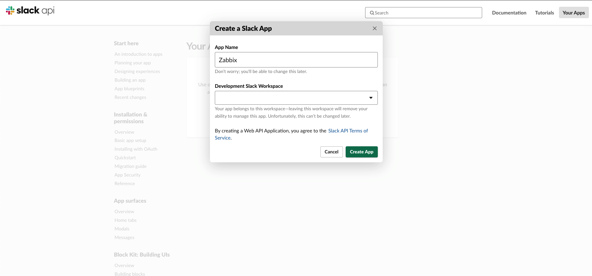
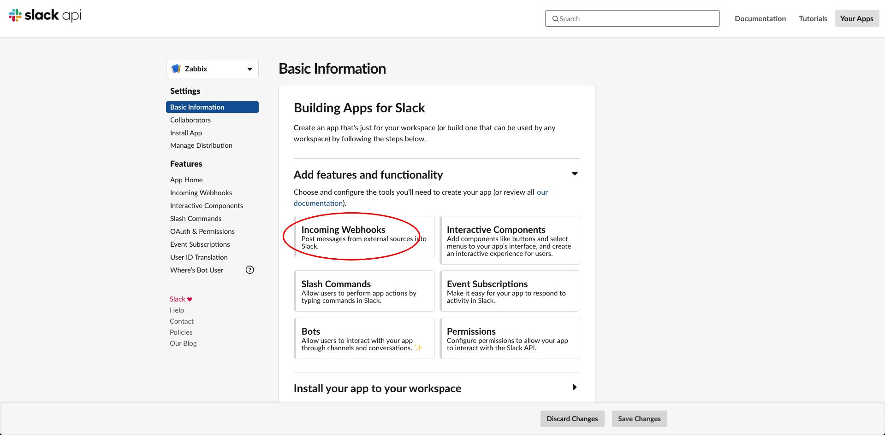
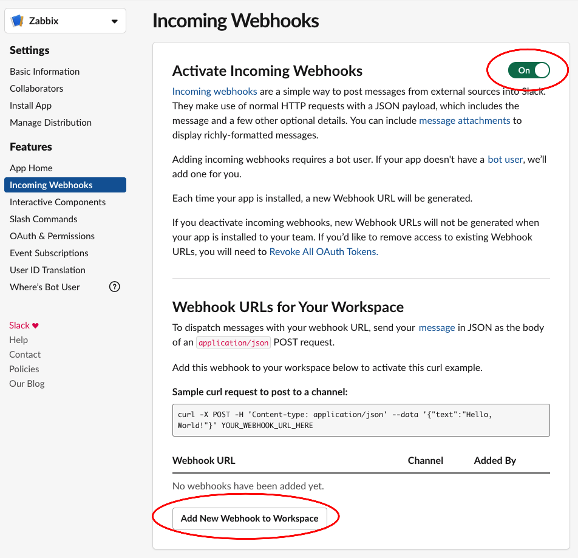
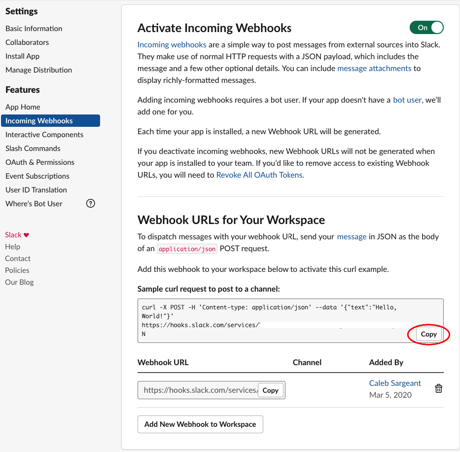
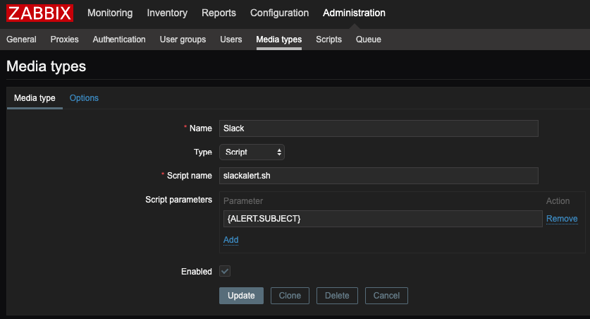
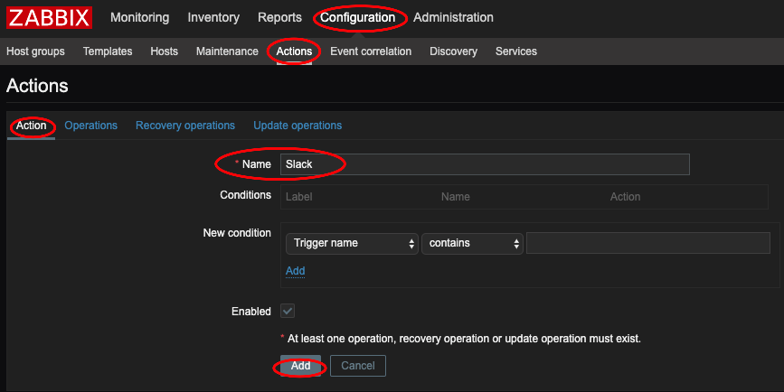
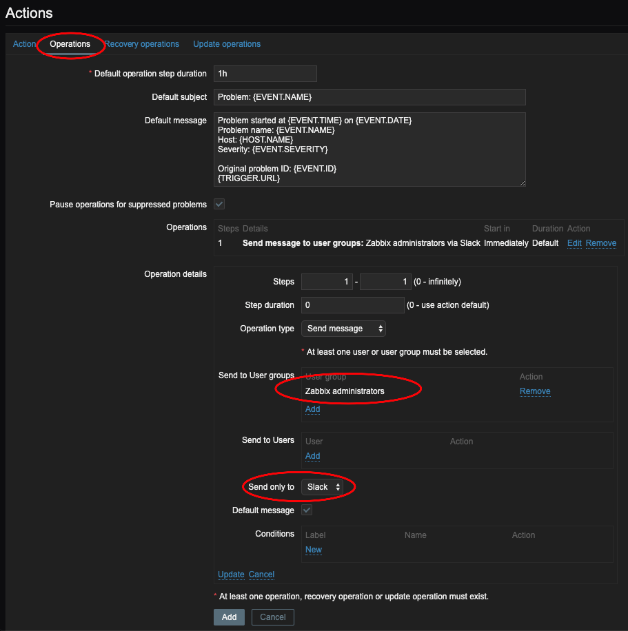
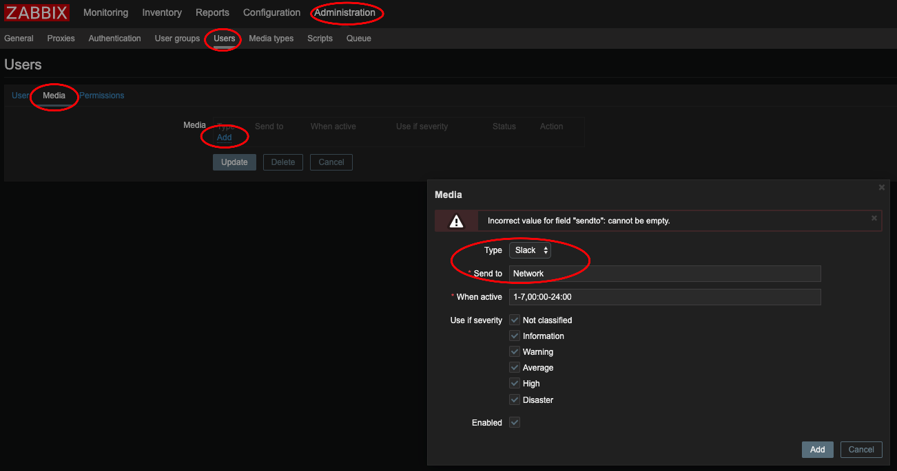

Monitoring
==========

Zabbix
------

Slack Alerting
^^^^^^^^^^^^^^

**Configuring Slack**

Go to https://api.slack.com/apps. Create a new app called "Zabbix".

Create an *Incoming Webhook*.

Copy the curl request to ``/usr/lib/zabbix/alertscripts/slackalerts.sh``.

Change ``'{"text":"Hello, World!"}'`` to ``'{"text":"'"$1"'"}'``.

Test your configuration on Zabbix with ``/usr/lib/zabbix/alertscripts/slackalerts.sh test``.

**Configuring Zabbix**

Create the *Media Type* in Zabbix.

Create an *Action* and an *Operation* in *Operations*, *Recovery operations*, and *Update operations*.

Nice *Default subjects* to use:
Create ``{ZABBIX.SERVER}`` in **Administration** > **General** > **Macros**

* ``[{ZABBIX.SERVER}] - [{HOST.HOST}] Problem: {EVENT.NAME}``
* ``[{ZABBIX.SERVER}] - [{HOST.HOST}] Resolved: {EVENT.NAME}``
* ``[{ZABBIX.SERVER}] - [{HOST.HOST}] Updated problem: {EVENT.NAME} - {USER.FULLNAME}``

Add the *Media* to the Administrator.

