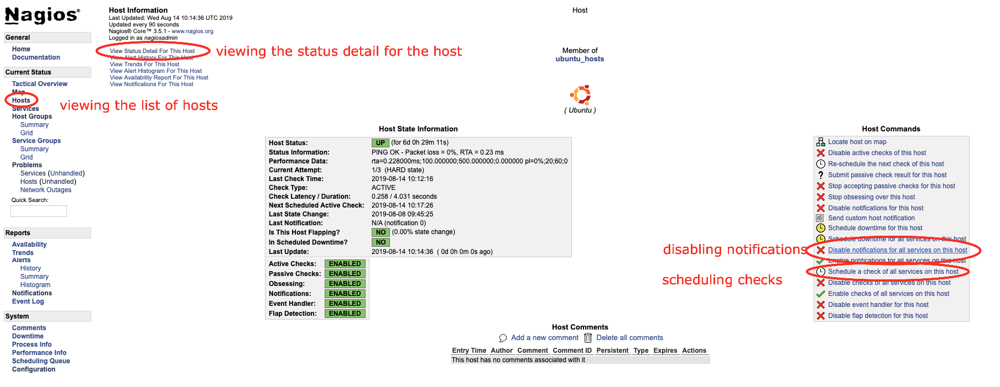

Nagios
------

Adding Linux Hosts
------------------

On the Nagios Box
^^^^^^^^^^^^^^^^^

.. code-block:: bash

  # Create the host in config (see below example config file)
  nano /etc/nagios3/conf.d/server.fqdn.com.cfg

  # ALWAYS verify Nagios config before reloading service, ensure that there are no errors (warnings are okay)
  cd /etc/nagios3/
  nagios3 -v nagios.cfg

  # If no errors, you should be safe to reload nagios service (DO NOT restart service)
  /etc/init.d/nagios3 reload

**Example config file** (the last service is a custom service check example):

.. code-block:: bash

  define host {
      address                        server.example.com
      alias                          server.example.com
      check_command                  check_ping!100.0,20%!500.0,60%
      host_name                      server.example.com
      hostgroups                     ubuntu_hosts
      max_check_attempts             3
      notification_period            24x7
      use                            generic-host
  }
  define hostextinfo {
      host_name                      server.example.com
      icon_image                     base/ubuntu.png
      icon_image_alt                 Ubuntu
      statusmap_image                base/ubuntu.gd2
  }
  define service {
      check_command                  check_nrpe!check_load
      display_name                   CPU Load
      host_name                      server.example.com
      max_check_attempts             3
      notification_period            24x7
      service_description            CPU Load
      use                            generic-service
  }
  define service {
      check_command                  check_nrpe!check_mem
      display_name                   Memory
      host_name                      server.example.com
      max_check_attempts             3
      notification_period            24x7
      service_description            Memory
      use                            generic-service
  }
  define service {
      check_command                  check_nrpe!check_vda1
      display_name                   Disk Status
      host_name                      server.example.com
      max_check_attempts             3
      notification_period            24x7
      service_description            Disk vda1 Status
      use                            generic-service
  }
  define service {
      check_command                  check_tcp!22
      display_name                   SSH/sftp Port 22
      host_name                      server.example.com
      max_check_attempts             3
      notification_period            24x7
      service_description            SSH/sftp Port 22
      use                            generic-service
  }
  define service {
      check_command                  check_nrpe!check_total_procs
      display_name                   Total Procs
      host_name                      server.example.com
      max_check_attempts             3
      notification_period            24x7
      service_description            Total Procs
      use                            generic-service
  }
  define service {
      check_command                  check_nrpe!check_users
      display_name                   User Check
      host_name                      server.example.com
      max_check_attempts             3
      notification_period            24x7
      service_description            Users Check
      use                            generic-service
  }
  define service {
      check_command                  check_nrpe!check_zombie_procs
      display_name                   Zombie Procs
      host_name                      server.example.com
      max_check_attempts             3
      notification_period            24x7
      service_description            Zombie Procs
      use                            generic-service
  }
  define service {
      check_command                  check_nrpe!check_OpManager
      display_name                   Netflow Service
      host_name                      server.example.com
      max_check_attempts             3
      notification_period            24x7
      service_description            Netflow Service Status
      use                            generic-service
  }
  define service {
      check_command                  check_nrpe!check_mysql
      display_name                   MySQL Status
      host_name                      nagiosserver.example.com
      max_check_attempts             3
      notification_period            24x7
      service_description            MySQL Status
      use                            generic-service
  }

**In the GUI:**

After adding the host and reloading the Nagios service, quickly go to the Nagios GUI and mute the notifications. You can also schedule a check to re-check the host's service statuses (almost) immediately, view the status detail for the host (list of items Nagios is monitoring), etc.

On the host to monitor
^^^^^^^^^^^^^^^^^^^^^^

.. code-block:: bash

  # See if Nagios is already installed
  dpkg -l | grep nagios

  # Install Nagios
  apt-get install nagios-nrpe-server nagios-plugins-basic

  # Add your custom checks (see below custom_nrpe.cfg file)
  nano /etc/nagios/nrpe.d/custom_nrpe.cfg

  # Create the check_mem plugin, as it's a custom, standard check (see below check_mem file)
  nano /usr/lib/nagios/plugins/check_mem

  # Make the file executable
  chmod +x /usr/lib/nagios/plugins/check_mem

  # Add x.x.x.x (servername) to the allowed hosts (you will get "CHECK_NRPE: Error - Could not complete SSL handshake." in Nagios GUI if you don't add this line)
  nano /etc/nagios/nrpe.cfg
      allowed_hosts=127.0.0.1,x.x.x.x

  # Restart the nagios-nrpe-server for it to recognise the change
  /etc/init.d/nagios-nrpe-server restart

**File custom_nrpe.cfg**

.. code-block:: bash

  ##########################################################
  #                                                        #
  #   you can place all you custom-config snipplets here   #
  #   only snipplets ending in .cfg will get included      #
  #                                                        #
  ##########################################################
  #
  # Generic Checks - For all nodes
  command[check_zombie_procs]=/usr/lib/nagios/plugins/check_procs -w 5 -c 10 -s Z
  command[check_total_procs]=/usr/lib/nagios/plugins/check_procs -w 600 -c 800
  command[check_vda1]=/usr/lib/nagios/plugins/check_disk -w 10% -c 5% -x tmpfs -x udev -x /snap/*
  command[check_disk_inode]=/usr/lib/nagios/plugins/check_disk_inodes -w 80 -c 90 -p /
  command[check_running_proc]=/usr/lib/nagios/plugins/check_procs $ARG1$
  command[check_puppet_agent]=sudo /usr/lib/nagios/plugins/check_puppet_agent
  command[check_open_deleted_files]=sudo /usr/lib/nagios/plugins/check_open_deleted_files -w 15000000000 -c 20000000000
  command[check_kernel]=sudo /usr/lib/nagios/plugins/check_kernel
  command[check_users]=/usr/lib/nagios/plugins/check_users -w 10 -c 20
  command[check_sssd_status]=/usr/lib/nagios/plugins/check_sssd_status
  command[check_java_version]=/usr/lib/nagios/plugins/check_java_version

  # Check Load - Defined per node type
  ##command[check_load]=/usr/lib/nagios/plugins/check_load -w 15.0,10,5 -c 30,25,20
  #
  command[check_load]=/usr/lib/nagios/plugins/check_load -r -w 2.5,2,1.5 -c 4,3.5,3

  # Check Load - Defined per node type
  command[check_mem]=/usr/lib/nagios/plugins/check_mem -w 85 -c 95

  # KONG Checks
  command[check_kong]=/usr/lib/nagios/plugins/check_kong

  # ntpd Checks
  command[check_ntpd]=/usr/lib/nagios/plugins/check_ntpd --peer_warning 1 --peer_critical 0

  # TOMCAT Checks
  #command[check_tomcat]=/usr/lib/nagios/plugins/check_tomcat -H localhost -p 8080 -w 10%,50 -c 5%,10 -l nagios -a i1I605LzIG7V
  command[check_tomcat]=/usr/lib/nagios/plugins/check_tomcat 10 80 10 admin Masehare

  # Percona/MySQL Checks
  command[check_percona_cluster_size]=sudo /usr/lib64/nagios/plugins/pmp-check-mysql-status -x wsrep_cluster_size -C '<=' -w 2 -c 1
  command[check_percona_primary_cluster]=sudo /usr/lib64/nagios/plugins/pmp-check-mysql-status -x wsrep_cluster_status -C == -T str -c non-Primary
  command[check_percona_local_node_sync]=sudo /usr/lib64/nagios/plugins/pmp-check-mysql-status -x wsrep_local_state_comment -C '!=' -T str -w Synced
  command[check_percona_flow_control]=sudo /usr/lib64/nagios/plugins/pmp-check-mysql-status -x wsrep_flow_control_paused -w 0.1 -c 0.9
  command[check_mysql_status]=/usr/lib64/nagios/plugins/pmp-check-mysql-status $ARG1$
  command[check_mysql_processlist]=/usr/lib64/nagios/plugins/pmp-check-mysql-processlist
  command[check_mysql_innodb]=/usr/lib64/nagios/plugins/pmp-check-mysql-innodb -C $ARG1$
  command[check_mysql_status_uptime]=/usr/lib64/nagios/plugins/pmp-check-mysql-status x Uptime -C '<' -w $ARG1$ -c $ARG2$
  command[check_mysql_status_connx]=/usr/lib64/nagios/plugins/pmp-check-mysql-status -x Threads_connected -o / -y max_connections -T pct -w $ARG1$ -c $ARG2$
  command[check_mysql_status_threadrun]=/usr/lib64/nagios/plugins/pmp-check-mysql-status -x Threads_running -w $ARG1$ -c $ARG2$
  command[check_mysql_slave_running]=/usr/lib64/nagios/plugins/pmp-check-mysql-replication-running
  command[check_mysql_slave_delay]=/usr/lib64/nagios/plugins/pmp-check-mysql-replication-delay

  # MemSQL Checks - ALL
  command[check_memsql_orphans]=/usr/lib/nagios/plugins/check_memsql_orphans
  command[check_memsql_stat_only]=/usr/lib/nagios/plugins/check_memsql_dbs_only
  command[check_memsql_memory]=/usr/lib/nagios/plugins/check_memsql_mem
  command[check_port_3306_on_all_memsql_nodes]=/usr/lib/nagios/plugins/check_memsql_connections

  # MemSQL Checks - mem_master

  # NGINX Checks
  command[check_nginx_status]=/usr/lib/nagios/plugins/check_nginx_status -H localhost -P 9396 -w 10000 -c 20000
  command[check_nginx_procs]=/usr/lib/nagios/plugins/check_procs --argument-array="/usr/sbin/nginx -g daemon on; master_process on" -w 1:1 -c 1:1

  # Rabbit MQ Checks
  command[check_rabbit_status]=/usr/lib/nagios/plugins/check_rabbit_stat -n aliveness-test -q status
  command[check_rabbit_msg_ready]=/usr/lib/nagios/plugins/check_rabbit_stat -n overview -q messages_ready -c 2000 -w 10000
  command[check_rabbit_msg_unack]=/usr/lib/nagios/plugins/check_rabbit_stat -n overview -q messages_unacknowledged -w 0 -c 10
  command[check_rabbit_publish]=/usr/lib/nagios/plugins/check_rabbit_stat -n overview -q publish_details
  command[check_rabbit_msg_ack]=/usr/lib/nagios/plugins/check_rabbit_stat -n overview -q ack_details
  command[check_rabbit_deliver_get]=/usr/lib/nagios/plugins/check_rabbit_stat -n overview -q deliver_get_details
  command[check_rabbit_msg_redeliver]=/usr/lib/nagios/plugins/check_rabbit_stat -n overview -q redeliver_details -w 40 -c 80
  command[check_rabbit_msg_deliver]=/usr/lib/nagios/plugins/check_rabbit_stat -n overview -q deliver_details
  command[check_rabbit_deliver_no_ack]=/usr/lib/nagios/plugins/check_rabbit_stat -n overview -q deliver_no_ack_details
  command[check_rabbit_get_no_ack]=/usr/lib/nagios/plugins/check_rabbit_stat -n overview -q get_no_ack_details
  command[check_rabbit_memory]=/usr/lib/nagios/plugins/check_rabbit_stat -n nodes -q memory

  # NODEJS Checks
  command[check_node_pm2_status]=/usr/bin/sudo -i -u serviceuser check_node_pm2 -A -S -R --rwarn 5 --rcrit 10

  # Dockerswarm checks
  command[check_docker_procs]=/usr/lib/nagios/plugins/check_procs --argument-array=/var/run/docker/containerd/containerd.toml -w 1:1 -c 1:1

  #
  # Wordpress
  command[check_glusterfs]=/usr/lib/nagios/plugins/check_glusterfs -v wordpress_files -n 2
  command[check_php5fpm_status]=/usr/lib/nagios/plugins/check_phpfpm_status -o linux -s php5-fpm
  command[check_php71fpm_status]=/usr/lib/nagios/plugins/check_phpfpm_status -o linux -s php7.1-fpm
  command[check_wpress_version]=/usr/lib/nagios/plugins/check_wp_version

  # Glusterfs Checks
  command[check_gluster_procs]=/usr/lib/nagios/plugins/check_procs --argument-array="/usr/sbin/glusterd -p /var/run/glusterd.pid" -w 1:1 -c 1:1
  command[check_glusterfs_health]=/usr/lib/nagios/plugins/check_glusterfs_health

  # Gitlab Checks
  command[check_gitlab_procs]=/usr/lib/nagios/plugins/check_procs --argument-array=/etc/gitlab-runner/config.toml -c 1:1

  # ClusterControl Checks
  command[check_cluster_control]=/usr/lib/nagios/plugins/check_cluster_control

  # MongoDB
  command[check_mongo_connections]=/usr/lib64/nagios/plugins/pmp-check-mongo.py -A check_connections
  command[check_mongo_election]=/usr/lib64/nagios/plugins/pmp-check-mongo.py -A check_election
  command[check_mongo_repl_lag]=/usr/lib64/nagios/plugins/pmp-check-mongo.py -A check_repl_lag
  command[check_mongo_flushing]=/usr/lib64/nagios/plugins/pmp-check-mongo.py -A check_flushing
  command[check_mongo_total_indexes]=/usr/lib64/nagios/plugins/pmp-check-mongo.py -A check_total_indexes
  command[check_mongo_balance]=/usr/lib64/nagios/plugins/pmp-check-mongo.py -A check_balance
  command[check_mongo_queues]=/usr/lib64/nagios/plugins/pmp-check-mongo.py -A check_queues
  command[check_mongo_cannary_test]=/usr/lib64/nagios/plugins/pmp-check-mongo.py -A check_cannary_test
  command[check_mongo_have_primary]=/usr/lib64/nagios/plugins/pmp-check-mongo.py -A check_have_primary
  command[check_mongo_connect]=/usr/lib64/nagios/plugins/pmp-check-mongo.py -A check_connect
  command[check_mongo_oplog]=/usr/lib64/nagios/plugins/pmp-check-mongo.py -A check_oplog

  ## Elasticsearch
  command[check_elasticsearch]=/usr/lib/nagios/plugins/check_elasticsearch.sh -H localhost -u elastic -p tusfDtzYSEtb

  ## ZFS
  command[check_zfs_pool_health]=/usr/lib/nagios/plugins/check_zfs_pool_health

  ## Netflow
  command[check_OpManager]=/usr/lib/nagios/plugins/check_procs -a OpManager

  ## Zabbix
  command[check_zabbix_server]=/usr/lib/nagios/plugins/check_procs -c 1: -w 3: -C zabbix_server
  command[check_zabbix_agent]=/usr/lib/nagios/plugins/check_procs -c 1: -w 3: -C zabbix_agentd
  command[check_mysql]=/usr/lib/nagios/plugins/check_procs -a mysql

**File check_mem**

.. code-block:: bash

  #!/bin/bash

  if [ "$1" = "-w" ] && [ "$2" -gt "0" ] && [ "$3" = "-c" ] && [ "$4" -gt "0" ]; then
              FreeM=`free -m`
          memTotal_m=`echo "$FreeM" |grep Mem |awk '{print $2}'`
          memUsed_m=`echo "$FreeM" |grep Mem |awk '{print $3}'`
          memFree_m=`echo "$FreeM" |grep Mem |awk '{print $4}'`
          memBuffer_m=`echo "$FreeM" |grep Mem |awk '{print $6}'`
          memCache_m=`echo "$FreeM" |grep Mem |awk '{print $7}'`
          memUsed_m=$(($memUsed_m - $memCache_m))
          memUsedPrc=`echo $((($memUsed_m*100)/$memTotal_m))||cut -d. -f1`
          if [ "$memUsedPrc" -ge "$4" ]; then
                  echo "Memory: CRITICAL Total: $memTotal_m MB - Used: $memUsed_m MB - $memUsedPrc% used!|TOTAL=$memTotal_m;;;; USED=$memUsed_m;;;; CACHE=$memCache_m;;;; BUFFER=$memBuffer_m;;;;"
                  exit 2
          elif [ "$memUsedPrc" -ge "$2" ]; then
                  echo "Memory: WARNING Total: $memTotal_m MB - Used: $memUsed_m MB - $memUsedPrc% used!|TOTAL=$memTotal_m;;;; USED=$memUsed_m;;;; CACHE=$memCache_m;;;; BUFFER=$memBuffer_m;;;;"
                  exit 1
          else
                  echo "Memory: OK Total: $memTotal_m MB - Used: $memUsed_m MB - $memUsedPrc% used|TOTAL=$memTotal_m;;;; USED=$memUsed_m;;;; CACHE=$memCache_m;;;; BUFFER=$memBuffer_m;;;;"
                  exit 0
          fi
  else    # If inputs are not as expected, print help.
          sName="`echo $0|awk -F '/' '{print $NF}'`"
          echo -e "\n\n\t\t### $sName Version 2.0###\n"
          echo -e "# Usage:\t$sName -w <warnlevel> -c <critlevel>"
          echo -e "\t\t= warnlevel and critlevel is percentage value without %\n"
          echo "# EXAMPLE:\t/usr/lib64/nagios/plugins/$sName -w 80 -c 90"
          echo -e "\nCopyright (C) 2012 Lukasz Gogolin (lukasz.gogolin@gmail.com), improved by Nestor 2015\n\n"
          exit
  fi

Troubleshooting
^^^^^^^^^^^^^^^

.. code-block:: bash

  ### On the Nagios Box
  # Check the log, grepping a part of the server name you what to see a log for
  tail -f /var/log/nagios3/nagios.log | grep netflow

  ### On the Host to Monitor
  ## Test to see if you can run the checks (these are found in /etc/nagios/nrpe.d/custom_nrpe.cfg)
  # CPU Load
  /usr/lib/nagios/plugins/check_load -r -w 2.5,2,1.5 -c 4,3.5,3

  # Disk vda1 Status
  /usr/lib/nagios/plugins/check_disk -w 10% -c 5% -x tmpfs -x udev -x /snap/*

  # Memory
  /usr/lib/nagios/plugins/check_mem -w 85 -c 95

  # Total Procs
  /usr/lib/nagios/plugins/check_procs -w 600 -c 800

  # Users Check
  /usr/lib/nagios/plugins/check_users -w 10 -c 20

  # Zombie Procs
  /usr/lib/nagios/plugins/check_procs -w 5 -c 10 -s Z
