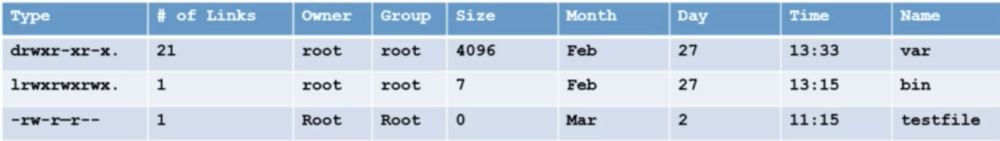

Training
========

:download:`Syllabus <_docs/training/Complete+Linux+Training+Syllabus.pdf>`

:download:`Commands Recap <_docs/training/Commands-Recap.pdf>`

Module 1 - Concepts
-------------------

:download:`Hard Disk and Disk Cache <_docs/training/module1/Hard+Disk+and+Disk+Cache.pdf>`

:download:`History of Unix <_docs/training/module1/History+of+Unix.pdf>`

:download:`Inside Linux <_docs/training/module1/Inside+Linux.pdf>`

:download:`Operating System <_docs/training/module1/Operating+system.pdf>`

:download:`Parts of an OS <_docs/training/module1/Parts+of+OS.pdf>`

:download:`Virtual Memory <_docs/training/module1/Virtual+memory.pdf>`

What is Linux?
^^^^^^^^^^^^^^

- Operating System which sites in the middle of your hardware and users

Unix vs Linux
^^^^^^^^^^^^^

- Unix was first developed for multi-user and multi-tasking in mid 1970 in Bell Labs by ATT. GE and MIT
- Then linux was born in 1991 by Linus Torvalds
- Linux is mostly free
- Linux is open source
- Unix is mostly used by Sun as Solaris, HP-UX, AIX etc.
- Linux is used by developer communuty or companies (Redhat, CentOs, Debian) etc.
- Unix comparitively supports very few File systems
- Linux can be installed on a wide variety of computer hardware, ranging from mobile phones, tablets, video game consoles, to mainframes and supercomputers

Module 2 - Download, Install and Configure
------------------------------------------

:download:`Oracle VirtualBox User Manual <_docs/training/module2/Oracle+Virtual+Box+User+Manual.pdf>`

:download:`Changing from 32 to 64bit <_docs/training/module2/Changing-from-32-to-64bit.pdf>`

:download:`CentOS Installation Guide <_docs/training/module2/CentOS+Installation+Guide.pdf>`

:download:`RedHat 7 Install Guide <_docs/training/module2/Red_Hat_Enterprise_Linux-7-Installation_Guide-en-US.pdf>`

Linux Distributions
^^^^^^^^^^^^^^^^^^^

- Redhat
- CentOS
- Fedora
- Suse
- Debian
- Ubuntu

CentOS vs CentOS Stream
^^^^^^^^^^^^^^^^^^^^^^^

- Brief history of CentOS
- 2004 - Greg Kurtzer forked RHEL to CentOS
- 2014 - RH took over CentOS
- Community Enterprise Operating System
- Before Feb 2021:

    - Fedora > RHEL > CentOS

- After Feb 2021:

    - Fedora > CentOS Stream > RHEL

Linux vs Windows
^^^^^^^^^^^^^^^^

+--------------+------------------------------------------------+-----------------------------------------------------------------------+
|              | Linux                                          | Windows                                                               |
+==============+================================================+=======================================================================+
| Price        | Free                                           | $$$                                                                   |
| Ease         | Not user-friendly                              | User friendly                                                         |
| Reliability  | Very reliable, often runs for months or years  | Often requires reboot                                                 |
| Software     | Mostly enterprise level softwares              | Much larger selection of softwares eg office, games, utilities, etc.  |
| Multitasking | Best for multi-tasking                         | Multi-tasking is available but with very high cpu or memory resources |
| Security     | Very secure                                    | Somewhat secure                                                       |
| Opensource   | Open to public                                 | Not an open source OS                                                 |
+--------------+------------------------------------------------+-----------------------------------------------------------------------+

Linux Users
^^^^^^^^^^^

- US Government Agencies (National, State, Federal, and International)
- NASA
- Health Care
- Bullet trains in Japan runs at the soeed of 150-215m/h
- Traffic Control
- Financial Institutes eg NYSE
- Entertainment industries (cinemas, production houses, etc.)
- World e-commerce leaders, including Amazon, eBay, PayPal, and Walmart
- Other fortune 500 companies eg Google, IBM, McDonalds, Facebook etc.

Module 3 - System Access and File System
----------------------------------------

:download:`Logging onto System <_docs/training/module3/4-Logging+On+To+System.pdf>`

:download:`File Names <_docs/training/module3/7-File+Names.pdf>`

:download:`Password Standards <_docs/training/module3/8-Passwords+Standards.pdf>`

Network Commands
^^^^^^^^^^^^^^^^

- Centos/RHEL 5 or 6 was `ifconfig`
- Centos/RHEL 7 is `ip`
- Centos/RHEL 7.5 and up `ifconfig` has been deprecated
- To use ifconfig in 7.5 use `yum install net-tools`

Important Things
^^^^^^^^^^^^^^^^

- Linux has super user account called root

    - root is the most powerful account that can create, modify, delete accounts and make changes to system configuration files

- Linux is case-sensitive

    - ABC is not the same as abc

- Avoid using spaces when creating files and directories
- Linux kernal is not an OS. It's a small software within linux OS that takes commands from users and pass them to system hardware or peripherals
- Linux is mostly CLI not GUI
- Linux is very flexible as compared to other OSs

:download:`notes <_docs/training/module3/3-Linux+vs+Windows.pdf>`

Linux File System
^^^^^^^^^^^^^^^^^

- OS store data on disk drives using a structure called filesystem, consisting of files, directories, and the information needed to access and locate them
- There are many different types of filesystems. In general improvements have been made to filesystems with new releases of OS and each new FS has been given a different name. Eg. ext3, ext4, XFS, NTFS, FAT etc.
- Linux filesystems store info in a hierarchy of dirs and fiels.

:download:`notes <_docs/training/module3/1-Linux+Structure.pdf>`

:download:`more notes <_docs/training/module3/5-Linux+File+System.pdf>`

File System Structure
^^^^^^^^^^^^^^^^^^^^^

.. image:: _images/linux-file-system-structure.png

:download:`notes <_docs/training/module3/6-File+System+Detail.pdf>`

File System Structure and its Description
^^^^^^^^^^^^^^^^^^^^^^^^^^^^^^^^^^^^^^^^^

- /boot - contains file that is used by the boot loader (grub.cfg)
- /root - root user home directory. It is not the same as /
- /dev - system devices (eg. disk cdrom speakers flash drive keyboard)
- /etc - configuration files
- /bin > / usr/bin - everyday user commands
- /sbin > /usr/sbin - system/filesystem commands
- /opt - optional addon applications (not part of OS apps)
- /proc - running processes (only exist in memory)
- /lib > usr/lib - C programming library needed by commands and apps (`strace -e open pwd`)
- /tmp - dir for temp files
- /home - dir for users
- /var - system logs
- /run - system daemons that start very early (eg. systemd and udev) to store runtime files like PID files
- /mnt - to mount external filesystem (eg. NFS)
- /media - for cdrom mounts

File System Navigation
^^^^^^^^^^^^^^^^^^^^^^

- When navigating a UNIX filesystem, there are a few important commands

    - `cd` - stands for change directory. It is the primary command for moving you arount the filesystem
    - `pwd` - stands for print working directory. It tells you where you current location is.
    - `ls` - stands for list. It lists all the directories/files within a current working dir

What is Root?
^^^^^^^^^^^^^

- There are 3 types of root on a Linux system

    - Root account: root is an account or username on Linux machine and is the most powerful account which has access to all commands and files
    - Root as /: the very first dir of Linux also referred as root directory
    - Root home directory: the root user account also has a dir located in /root which is called root home dir

File System Paths
^^^^^^^^^^^^^^^^^

- There are two paths to navigate to a filesystem

    - Absolute path
    - Relative path

- An absolute path always begins with a `/`. This indicates that the path starts at the root directory. An example of an absolute path is `cd /var/log/samba`
- A relative path does not begin with a `/`. It identifies a location relative to your current position. An example of a relative path is `cd /var` and `cd log` `cd samba`

Directory Listing Attributes
^^^^^^^^^^^^^^^^^^^^^^^^^^^^

:download:`notes <_docs/training/module3/13-List+files+and+directories.pdf>`

Creating Files and Directories
^^^^^^^^^^^^^^^^^^^^^^^^^^^^^^

- Creating files

    - touch
    - cp
    - vi

- Creating directories

    - mkdir

Copying Directories
^^^^^^^^^^^^^^^^^^^

- Command to copy a directory

    - `cp`

- To copy a directory on Linux, you have to execute the `cp` command with the `-R` option for recursive and specify the source and destination directories to be copied

    - `cp -R <source_folder> <destination_folder>`

Linux File Types
^^^^^^^^^^^^^^^^

+--------------+------------------------------+
| File Symbol  | Meaning                      |
+==============+==============================+
| dash         | Regular file                 |
| d            | Directory                    |
| l            | link                         |
| c            | Special file or device file  |
| s            | socket                       |
| p            | Named pipe                   |
| b            | Block device                 |
+--------------+------------------------------+

Finding Files and Directories
^^^^^^^^^^^^^^^^^^^^^^^^^^^^^

- Two main commands are useful to find files/directories

    - `find` (`find . -name "test"`)
    - `locate` (`locate test`)

- If `locate` command doesnt output any result, then as rute run `updatedb`
- Also make sure you have `mlocate` package installed
- To check run `rpm -qa | grep mlocate`
- To install run `yum install mlocate`

Difference Between find and locate
^^^^^^^^^^^^^^^^^^^^^^^^^^^^^^^^^^

- `locate` uses a prebuilt database, which should be regularly updated, while `find` iterates over a filesystem to locate files. Thus, locate is much faster than find, but can be inaccurate if the database (can be seen as a cache) is not updated
- To update the locate database run `updatedb`

:download:`notes <_docs/training/module3/10-Difference-between-locate-and-find-command-in-Linux.pdf>`

Changing Password
^^^^^^^^^^^^^^^^^

- You should change your initial password as soon as you login
- Command = `passwd userid`

:download:`notes <_docs/training/module3/9-Change+Password+in+Linux.pdf>`

Wildcards
^^^^^^^^^

A wildcard is a character that can be used as a substitute for any of a class of characters in a search

- `*` represents zero or more characters
- `?` represents a single character
- `[]` represents a range of characters (`ls -ltr *[cd]*`)
- `{}` range of fiels to create
- backslash as an escape character
- `^` the beginning of a line
- `$` the end of a line

:download:`notes <_docs/training/module3/11-Wildcards.pdf>`

Soft and Hard Links
^^^^^^^^^^^^^^^^^^^

- inode = Pointer or number of a file on the hard disk
- Soft Link = Link will be removed if file is removed or renamed
- Hard Link = Deleting renaming or moving the original file will not affect the hard link

    - `ln` (hard link)
    - `ln -s` (soft link)

.. image:: _images/linux-soft-and-hard-links.png

- Note: you cannot create a soft or hard link within the same directory with the smae name.
- Hard links only work within the same partition

:download:`notes <_docs/training/module3/12-Soft+Link+and+Hard+Links.pdf>`

Module 4 - Fundamentals
-----------------------

Commands Syntax
^^^^^^^^^^^^^^^

- Command options and arguments

    - Commands typically have the syntax:
    
        - command options arguments

- Options

    - Modify the way that a command works
    - Usually oly consist of a hyphen or dash followed by a single letter
    - Some commands accept multiple options which can usually be grouoped together after a single hypghen

- Arguments:

    - Most commands are used together with one or more arguments
    - Some commands assume a default argument if none is supplied
    - Arguments are optional for some commands and required by others

:download:`notes <_docs/training/module4/1-Command+Syntax.pdf>`

File Permissions
^^^^^^^^^^^^^^^^

- UNIX is a multi-user system. Every file and directory in your account can be protected from or made accessible to other users by changing its access permissions. Every user has responsibility for controlling access to their files.
- Permissions for a file or directory may be restricted to by types
- There are 3 types of permissions

    - r - read
    - w - write
    - x - execute (running a program)

- Each permission (rwx) can be controlled at three levels

    - u - user (yourself)
    - g - group (can be people in the same project)
    - o - other (everyone in the system)

- File or Directory permission can be displayed by running `ls -l` command

    - -rwxrwxrwx

- Command to change permission

    - `chmod`

- Remove read rights from group: `chmod g-r file`
- Remove read rights from all (other): `chmod a-r file`
- Remove write rights from user: `chmod u-w file`
- Add read and write rights to user on file: `chmod u+rw file`

:download:`notes <_docs/training/module4/2-File+Permissions+and+Ownership.pdf>`

File Permissions using Numeric Mode
^^^^^^^^^^^^^^^^^^^^^^^^^^^^^^^^^^^

- Permission to a file and directory can be assigned numerically

    - `chmod ugo+r file`
    - or `chmod 444 file`

.. image:: _images/linux-file-system-permissions.png

- The table below assigns numbers to permissions types

+---------+------------------------+---------+
| Number  | Permission Type        | Symbol  |
+=========+========================+=========+
| 0       | No Permission          | ---     |
| 1       | Execute                | --x     |
| 2       | Write                  | -w-     |
| 3       | Execute + Write        | -wx     |
| 4       | Read                   | r--     |
| 5       | Read + Execute         | r-x     |
| 6       | Read + Write           | rw-     |
| 7       | Read +Write + Execute  | rwx     |
+---------+------------------------+---------+

- `chmod 764 file`:

:download:`notes <_docs/training/module4/11-File+Permissions+Cheat+Sheet.pdf>`

File Ownership
^^^^^^^^^^^^^^

- There are 2 owners of a file or directory

    - User and group

- Command to change file ownership

    - chown and chgrp
    
        - chown changes the ownership of a file
        - chgrp changes the group ownership of a file

- Recursive ownership change option (cascade)

    - -R

Access Control List
^^^^^^^^^^^^^^^^^^^

- What is ACL?

    - Access control list (ACL) provides an additional, more flexible permission mechanism for file systems. It is designed to assist with UNIX file permissions. ACL allows you to give permissions for any user or group to any disc resource.

- Use of ACL:

    - Think of a scenario in which a particular user is not a member of a group created by you but you still want to give some read or write access, how can you do it without making user a member of a group, here comes in picture ACL, CAL helps us to do this trick.
    - Basically, ACLs are used to make a flexible permission mechanism in Linux.
    - From Linux man pages, ACLs are used to define more fine-granied discretionary access rights for files and directories
    - Commands to assign and remove ACL permissions are:

        - `setfacl` and `getfacl`

- List of commands for setting up ACL:

    - to add permission for a user (`setfacl -m u:user:rwx /path/to/file`)
    - to add permissions for a group (`setfacl -m g:group:rw /path/to/file`)
    - to allow all files or directories to inherit ACL entries from the directory it is within (`setfacl -Rm "entry" /'path/to/dir'`)
    - To remove a specific entry (`setfacl -x u:user /path/to/file` (for a specific user))
    - To remove all entries (`setfacl -b path/to/file` (for all users))
    - Note:

        - As you assign the ACL permission to a file/directory it adds + sign at the end of the permission
        - Setting w permission with ACL does not allow to remove a file

:download:`notes <_docs/training/module4/12-Access+Control+Lists.pdf>`

Help Commands
^^^^^^^^^^^^^

- There are 3 types of help commands

    - `whatis` command
    - command `--help`
    - `man` command

:download:`notes <_docs/training/module4/3-Getting+Help.pdf>`

Tab Completion and Up Arrow
^^^^^^^^^^^^^^^^^^^^^^^^^^^

- Hitting TAB key completes the available commands, files, or directories

    - `chm TAB`
    - `ls j<TAB>`
    - `cd Des<TAB>`

- Hitting up arrow key on the keyboard returns the last command run

:download:`notes <_docs/training/module4/4-TAB+Completion.pdf>`

Adding Text to Files (Redirects)
^^^^^^^^^^^^^^^^^^^^^^^^^^^^^^^^

- 3 Simple ways to add text to a file

    - vi
    - Redirect command output > or >>
    - echo > or >>

:download:`notes <_docs/training/module4/5-Adding+Text+to+Files.pdf>`

Input and Output Redirects
^^^^^^^^^^^^^^^^^^^^^^^^^^

- There are 3 redirects in Linux

    - Standard input (stdin) and it has file descriptor number as 0
    - Standard output (stdout) and it has file descriptor number 1
    - Standard error (stderr) and it has file descriptor number as 2

- Output (stdout) -1

    - By default when running a command its output goes to the terminal
    - The output of a command can be routed to a file using > symbol

        - eg. `ls -l > listings`
        - `pwd > findpath`
    
    - If using the same file for additional output or to append to the same file then use >>

        - eg. `ls -la >> listings`
        - `echo "Hello World" >> findpath`

- Input (stdin) -0

    - Input is used when feeding file contents to a file

        - eg. `cat < listings` 
        - `mail -s "office memo" contact@calebsargeant.com < momoletter`

- Error (stderr) - 2

    - When a command is executed we use a keyboard and that is also considered (stdin -0)
    - That command output goes on the monitor that outpit is (stdout -1)
    - If the command produced any error on the screen then it is considered (stderr -2)

        - We cna use redirects to route errors from the screen

            - eg. `ls -l /root 2> errorfile`
            - `telnet localhost 2> errorfile`

Standard Output to a File (tee)
^^^^^^^^^^^^^^^^^^^^^^^^^^^^^^^

- `tee` command is used to store and view (both at the same time) the output of any command
- The command is named after the T-splitter used in plumbing. It basically breaks the output of a program so that it can be both displated and saved in a file. It does both the tasks simultaneously, copies the result into the specified file or variables and also displays the result.
- Remember `-a` appends

Pipes
^^^^^

- A pipe is used by the shell to connec the output of one command directly to the inout of another file
- The symbol for a pipe is the vertical bar (`|`). The command syntax is:

    - command 1 [arguments] | command2 [arguments]

:download:`notes <_docs/training/module4/6-Pipes.pdf>`

File Maintenance Commands
^^^^^^^^^^^^^^^^^^^^^^^^^

- `cp`
- `rm`
- `mv`
- `mkdir`
- `rmdir` or `rm -r`
- `chgrp`
- `chown`

:download:`notes <_docs/training/module4/7-File+Maintenance+Commands.pdf>`

File Display Commands
^^^^^^^^^^^^^^^^^^^^^

- `cat`
- `more`
- `less`
- `head`
- `tail`

:download:`notes <_docs/training/module4/8-File+Display+Commands.pdf>`

Filters / Text Processors Commands
^^^^^^^^^^^^^^^^^^^^^^^^^^^^^^^^^^

- `cut`
- `awk`
- `grep` and `egrep`
- `sort`
- `uniq`
- `wc`

:download:`notes <_docs/training/module4/9-Filters-Text+Processing+Commands.pdf>`

Cut
^^^

- Cut is a comman d line utility that allows you to cut parts of lines from specified files or piped data and print the result to standard output. It can be used to cut parts of a line by delimiter, byte position, and character
- `cut filename` does not work
- `cut --version`
- `cut -c1 file` - gets the first character from each line
- `cut -c1,2,4 file` - pick and choose character
- `cut -c1-3 file` - list range of characters
- `cut -c1-3,6-8 file` - list specific range of characters
- `cut -b1-3 file` - list byte size
- `cut -d: -f 6 /etc/passwd` - list first 6th column seperated by :
- `cut -d: -f 6-7 /etc/passwd` - list first 6th and 7th column sperated by :
- `ls -l | cut -c-4` - only print user permissions of files/dir

Awk
^^^

- awk is a utility/language designed for data extraction. Most of the time it is used to extract fields from a file or from an output.
- `awk --version` - check version
- `awk '{print $1}' file` - list 1st field from a file
- `ls -l | awk '{print $1,$3}'` - list 1st and 3rd field of ls -l output
- `ls -l | awk '{print $NF}'` - last filed of the output
- `awk '/Jerry/ {print}' file` - search for a specific word
- `awk -F: '{print $1}' /etc/passwd` - output only 1st field of /etc/passwd
- `echo "Hello Tom" | awk '{$2="Adam"; print $0}'` - replace words field words
- `cat file | awk '{$2="Caleb"; print $0}'` - replace words field words
- `awk 'length($0) > 15' file` - get lines that more that 15 byte size
- `ls -l | awk '{if($9 == "caleb") print $0;}'` - get the field matching caleb in /home/caleb
- `ls -l | awk '{print NF}'`

Grep/Egrep
^^^^^^^^^^

- What is grep?

    - the grep command which stands for "global regular expression print", processes text line by line and prints any lines which match a specified pattern

- `grep --version` or `grep --help`
- `grep keyword file` - search for a keyword from a file
- `grep -c keyword file` - search for a keyword and count
- `grep -i keyword file` - search for a keyword ignore case-sensitive
- `grep -n keyword file` - display the matched lines and their line numbers
- `grep -v keyword file` - display everything but keyword
- `grep keyword file | awk '{print $1}'` - search for a keyword and then only give 1st field
- `ls -l | grep Desktop` - search for a keyword and then only give 1st field
- `egrep -i "keyword|keyword2" file` - search for 2 keywords

:download:`notes <_docs/training/module4/10-Finding+System+Information.pdf>`

Sort/Uniq
^^^^^^^^^

- What are sort and uniq commands?

    - Sort command sorts in alphabetical order
    - Uniq command filters out the repeated or duplicate lines

- `sort --version` or `sort --help` - check version or help
- `sort file` - sorts in alphabetical order
- `sort -r file` - sorts in reverse alphabetical order
- `sort -k2 file` - sort by field number
- `uniq file` - removes duplicates
- `sort file | uniq` - always sort first before using uniq their line numbers
- `sort file | uniq -c` - sort first then uniq and list count
- `sort file | uniq -d` - only show repeated lines

Wc
^^^

- What is wc command?

    - The command reads either standard input or a list of files and generates: newline count, word count, and byte count

- `wc --version` or `wc --help` - check version or help
- `wc file` - check file line count, word count and byte count
- `wc -l file` - get the number of lines in a file
- `wc -w file` - get the number of words in a file
- `wc -b file` - get the number of bytes in a file
- `wc DIRECTORY` - not allowed
- `ls -l | wc -l` - number of files
- `grep keyword | wc -l` - number of keyword lines

Compare Files
^^^^^^^^^^^^^

- `diff` (line by line)
- `cmp` (byte by byte)

Compress and un-Compress Files
^^^^^^^^^^^^^^^^^^^^^^^^^^^^^^

- `tar`
- `gzip`
- `gzip -d` or `gunzip`

Truncate File Size
^^^^^^^^^^^^^^^^^^

- The linux `truncate` command is often used to shrink or extend the size of a file to the specified size
- Command

    - `truncate -s 10 filename`

Combining and Splitting Files
^^^^^^^^^^^^^^^^^^^^^^^^^^^^^

- Multiple files can be combined into one and
- One file can be split into multiple files

    - `cat file1 file2 file3 > file4`
    - `split file4`
    - e.g. `split -l 300 file.txt childfile` - split file.txt into 300 lines per file and output to childfileaa, childfileab, and childfileac

Linux vs Windows Commands
^^^^^^^^^^^^^^^^^^^^^^^^^

+--------------------------------------------+-------------+--------------+
| Command Description                        | Windows     | Linux        |
+============================================+=============+==============+
| Listing of a directory                     | dir         | ls -l        |
| Rename a file                              | ren         | mv           |
| Copy a file                                | copy        | cp           |
| Move a file                                | move        | mv           |
| Clear screen                               | cls         | clear        |
| Delete file                                | del         | rm           |
| Compare contents of files                  | fc          | diff         |
| Search for a word/string in a file         | find        | grep         |
| Display command help                       | command /?  | man command  |
| Displays your location in the file system  | chdir       | pwd          |
| Displays the time                          | time        | date         |
+--------------------------------------------+-------------+--------------+

Module 5 - System Administration
--------------------------------

Linux File Editor (vi)
^^^^^^^^^^^^^^^^^^^^^^

- A text editor is a program which enables you to create and manipulate data (text) in a Linux file
- There are several standard text editors available on most Linux systems

    - `vi` - Visual editor
    - `ed` - Standard line editor
    - `ex` - Extended line editor
    - `emacs` - A full screen editor
    - `pico` - Begginers editor
    - `vim` - Advanced version of vi

- Our editor = vi (available in almost every Linux distribution)
- vi supplies commands for:

    - inserting and deleting text
    - replacing text
    - moving around the file
    - finding and substituting strings
    - cutting and pasting text

- Most common keys:

    - i - insert
    - Esc - escape out of any mode
    - r - replace
    - d - delete
    - :q! - quit without savinbg
    - :wq! - quit and save

:download:`notes <_docs/training/module5/1-vi+Commands.pdf>`

:download:`more notes <_docs/training/module5/5-Unix+Editors.pdf>`

Difference Between vi and vim Editor
^^^^^^^^^^^^^^^^^^^^^^^^^^^^^^^^^^^^

- As far as functionality is concerned, both editors work in the same manner. Which editor you choose is a matter of personal choice. Some people recommend learningh the vim editor instead of the vi editor. Due to added features, learning and using vim editor is much easier than the vi editor.
- Since vim is based on the vi, when you will learn how to use the vim editor, you will automaticall learn how to use the vi editor
- vim has all the features as vi with some excellent addition
- There's also a comprehensive help system and lots of customization options available.

.. image:: _images/linux-vi-vs-vim.png

- There are many websites taht offer free vim interactive training

    - https://www.openvim.com
    - http://www.vimgenius.com
    - https://vim-adventures.com (games)

Sed Command
^^^^^^^^^^^

- Replace a string in a file with a newstring

    - `sed 's/Kenny/Lenny/g' file` - output to console
    - `sed -i "s/Kenny/Lenny/g" file` - make changes to file
    - `sed 's/Costanza//g'` - remove the word Costanza

- Find and delete a line

    - `sed '/Caleb/d' file`

- Remove empty lines

    - `sed '/^$/d'` 

- Remove the first or n lines in a file

    - `sed '1d' file` - delete first line
    - `sed '1,2d' file` - delete first 2 lines

- To replace tabs with spaces

    - `sed 's/\t/ /g'`

- Show defined lines from a file

    - `sed -n 12,18p file` - show only lines 12 to 18
    - `sed 12,18d file` - show all but lines 12 to 18
    - `sed G file` - add a linebreak to every line
    - `sed '8!s/Caleb/C/g' file` - change all lines except line 8

- Substitute wining vi editor

    - `:%s/Caleb/Peter/`

User Account Management
^^^^^^^^^^^^^^^^^^^^^^^

Commands:

* useradd
* groupadd
* userdel
* groupdel
* usermod

Files:

* /etc/passwd
* /etc/group
* /etc/shadow

Example:

.. code-block:: bash

    useradd -g superheros -s /bin/bash -c "user description" -m -d /home/spiderman spiderman

:download:`notes <_docs/training/module5/2-User+Account+Management.pdf>`

:download:`more notes <_docs/training/module5/3-User+Accounts+in+Linux.pdf>`

Enable Password Aging
^^^^^^^^^^^^^^^^^^^^^

* chage [-m mindags] [-M maxdays] [-d lastday] [-I inactive] [-E expiredate] [-W warndays] user
* File = /etc/login.def

    * PASS_MAX_DAYS 99999
    * PASS_MIN_DAYS 0
    * PASS_MIN_LEN 5
    * PASS_WARN_AGE 7

Check /etc/shadow for the position:

* -d = 3. Last password change (lastchanged): Days since Jan 1, 1970 that password was last changed
* -m = 4. Minimum: the minimum number of days requred between password changes i.e. the number of days left before the user is allowed to change his/her password
* -M = 5. Maximum: the maximum number of days the password is valid (after that the user is forced to change the password)
* -W = 6. Warn: The number of days before password is set to expire that the user is warned that the password must be changed
* -I = 7. Inactive: The number of days after password expires that the account is disabled
* -E = 8. Expire: days since Jan 1, 1970 that account is disabled i.e. an absolute date specifying when the login may no longer be used

Switch Users and Sudo Access
^^^^^^^^^^^^^^^^^^^^^^^^^^^^

Commands: 

* su - username
* sudo command
* visudo

File

* /etc/sudoers

:download:`notes <_docs/training/module5/4-Switch+users+and+Sudo+Access.pdf>`

Monitor Users
^^^^^^^^^^^^^

* who
* last
* w
* finger
* id.

:download:`notes <_docs/training/module5/6-Monitor+User+Commands.pdf>`

Talking to Users
^^^^^^^^^^^^^^^^

* users
* wall
* write

Linux Account Authentication
^^^^^^^^^^^^^^^^^^^^^^^^^^^^

* Type of Accounts

    * Local accounts
    * Domain/Directory accounts

* Windows = active directory

Difference between AD, LDAP, IDM, WinBIND, OpenLDAP, etc.
^^^^^^^^^^^^^^^^^^^^^^^^^^^^^^^^^^^^^^^^^^^^^^^^^^^^^^^^^

* Active Directory = Microsoft
* IDM = Identity Manager (Redhat)
* WinBIND = Used in Linux to communicate with Windows (samba)
* OpenLDAP (open source)
* IBM Directory Server
* JumpCloud
* LDAP = Lightweight Directory Access Protocol (not a package, but a protocol)

System Utility Commands
^^^^^^^^^^^^^^^^^^^^^^^

* date
* uptime
* hostname
* uname
* which
* cal
* bc

.. image:: _docs/training/module5/15-uptime.jpg

:download:`notes <_docs/training/module5/7-System+Utility+Commands.pdf>`

Processes and Jobs
^^^^^^^^^^^^^^^^^^

* Application = Service
* Script
* Process
* Daemon
* Threads
* Job

* systemctl or service
* ps
* top
* kill
* crontab
* at

:download:`notes <_docs/training/module5/8-Processes.pdf>`

:download:`more notes <_docs/training/module5/9-Unix+Programs.pdf>`

Systemctl Command
^^^^^^^^^^^^^^^^^

* systemctl command is a new tool to control system services
* It's available in version 7 and later it replaces the service command
* Usage example:

    * `systemctl start|stop|status servicename.service`
    * `systemctl enable servicename.service`
    * `systemctl restart|reload servicename.service`
    * `systemctl list-units --all`

        * The output has the following columns:

            * **UNIT**: the systemd unit name
            * **LOAD**: Whether the unit's configuration has been parsed by systemd. The configuration of loaded units is kept in memory
            * **ACTIVE**: A summary state about whether the unit is active. This usually a fairly basic way to tell if the unit has started successfully or not.
            * **SUB**: this is a lower-level state that indicates more detailed information about the unit. THis often varies by unit type, state, and the actual method in which the unit runs.
            * **DESCRIPTION**: A short textual description of what the unit is/does.

* To add a service under systemctl management:

    * Create a unit file in /etc/systemd/system/servicename.service

* To control system with systemctl

    * `systemctl poweroff`
    * `systemctl halt`
    * `systemctl reboot`

ps Command
^^^^^^^^^^

* ps command stands for process status and it displays all the currently running processes in the Linux system
* Usage examples:

    * ps = shows the processes of the current shell

        * **PID** = the unique process ID
        * **TTY** = terminal type that the user logged in to
        * **TIME** = amount of CPU in mins and secs that the prcess has been running
        * **CMD** = name of the command

* `ps -e` = shows all running processes
* `ps aux` = shows all running processes in BSD format
* `ps -ef` = shows all running processes in full format listing (most commonly used)

top Command
^^^^^^^^^^^

* top command is used to show the Linux process and it provides a real-time view of the running system
* This command shows the summary information of the system and the list of process or threads that are currently managed by the Linux Kernal
* When the top command is executed then it goes into interactive mode and you can exit using q
* Usage: top

    * **PID**: shows task's unique process ID
    * **USER**: usertname of owner of task
    * **PR**: The PR field shows the scheduling priority of the process from the perspective of the kernel
    * **NI**: Represents a Nice Value of task. A negative nice value implies higher priority, and positive Nice value means lower priority.
    * **VIRT**: Total virtual memory used by the task
    * **RES**: Memory consumed by the process in RAM
    * **SHR**: Represents the amount of shared memory used by a task
    * **S**: This field shows the process state in the single-letter form
    * **%CPU**: represents the CPU usage
    * **%Mem**: shows the memory usage of task
    * **TIME+**: CPU Time, the smae as TIME, but reflecting more granualarity through hundredths of a second

* top -u caleb = shows tasks/processes by user owned
* top then press c = shows commands absolute path
* top then press k = kill a process by PID within top session
* top the M and P = to sort all linux running processes by Memory usage

:download:`notes <_docs/training/module5/13-top+command.pdf>`

kill Command
^^^^^^^^^^^^

* kill command is used to terminate process manually
* It sends a signal which ultimately terminates or kills a particular process or group of processes
* Usage: `kill [OPTION] [PID]`
* kill -l = to get a list of all signal names or signal numbers
* Most used signals are:

    * kill PID = kill a process with default signal
    * kill -1 = restart
    * kill -2 = interupt from the keyboard just like ctrl C
    * kill -9  = forcefully kill the process
    * kill -15 = kill a process gracefully

* Other similar kill commands are:

    * killall
    * pkill

crontab Command
^^^^^^^^^^^^^^^

* Crontab command is used to schedule tasks
* Usage:

    * crontab -e = edit the crontab
    * crontab -l = list the crontab entries
    * crontab -r = remove the crontab
    * crond = crontab daemon/service that manages scheduling
    * systemctl status crond = manage the crond service

.. image:: _images/linux-crontab-1.png

:download:`notes <_docs/training/module5/10-crontab.pdf>`

at Command
^^^^^^^^^^

* at command is like crontab which allows you to schedule jobs only once
* When the command command is run it will enter interactive mode and you can get out by pressing ctrl d
* Usage:

    * `at HH:MM PM` = schedule a job
    * `atq` = list the at entries
    * `atrm #` = remove at entry
    * `atd` = at daemon/service that manages scheduling
    * `systemctl` status atd = to manage the atd service

* Other future scheduling format:

    * at 2:45 am 101621
    * at 4pm + 4 days
    * at now + 5 hours
    * at 80:00 am sun
    * at 10:00 am next month

Additional Cron Jobs
^^^^^^^^^^^^^^^^^^^^

* By default there are 4 different types of cronjobs

    * Hourly
    * Daily
    * Weekly
    * Monthly

* All the above crons are setup in

    * /etc/cron._ (directory)

* The timing for each are set in

    * /etc/anacrontab -- except hourly

* For hourly

    * /etc/cron.d/0hourly

Process Management
^^^^^^^^^^^^^^^^^^

* Background = `ctrl-z, jobs and bg`
* Foreground = `fg`
* Run process even after exit = `nohup process &`

    * OR = `nohub process > /dev/null 2>&1 &`

* Kill a process by name = `pkill`
* Process priority = nice (e.g. `nice -n 5 process`)

    * the niceness scale goes from -20 to 19. The lower the number more priority that task gets

* Process monitoring = `top`
* List process = `ps`

System Monitoring
^^^^^^^^^^^^^^^^^

* top
* df
* dmesg
* iostat 1
* netstat (netstat -rnv)
* free
* cat /proc/cpuinfo
* cat /proc/meminfo

:download:`notes <_docs/training/module5/11-System+Resource+Commands.pdf>`

Log Monitoring
^^^^^^^^^^^^^^

* Another and most important way of system administration is log monitor
* Log Directory = /var/log

    * boot
    * chronyd = NTP
    * cron
    * maillog
    * secure
    * messages
    * httpd

System Maintenance Commands
^^^^^^^^^^^^^^^^^^^^^^^^^^^

* shutdown
* init
* reboot
* halt

Changing System Hostname
^^^^^^^^^^^^^^^^^^^^^^^^

* hostnamectl - set-hostname newhostname
* Version 7 = edit /etc/hostname
* version 6 = edit /etc/sysconfig/network

Finding System Information
^^^^^^^^^^^^^^^^^^^^^^^^^^

* cat /etc/redhat-release
* uname -a
* dmidecode

System Architecture
^^^^^^^^^^^^^^^^^^^

* Differences between a 32-bit and 64-bit CPU

A big difference between 32-bit processors and 64-bit processors is the number of calculations per second they can perform, which affects the speed at which they can complete tasks. 64-bit processors can come in dual core, quad core, six core, and eight core versions for home computing. Multiple cores allow for an increased number of calculations per second that can be performed, which can increase the processing power and help make a computer run faster. Software programs that require many calculations to function smoothly can operate faster and more efficiently on the multi-core 64-bit processors.

* Linux = arch
* Windows = My Computer -> Properties

Terminal Control Keys
^^^^^^^^^^^^^^^^^^^^^

* Several key combinations on your keyboard usually have a special effect on the terminal
* These "control" (CTRL) keys are accomplished by holding the CTRL key while typing the second key
* For example, CTRL-c means to hold the CTRL key while typing the letter "c"
* The most common control keys are listed below:

    * CTRL-u = erase everything you've typed on the command line
    * CTRL-c = stop/kill a command
    * CTRL-z = suspend a command
    * CTRL-d = exit from an interactive program (signals end of data)

:download:`notes <_docs/training/module5/12-Terminal+Control+Keys.pdf>`

Terminal Commands
^^^^^^^^^^^^^^^^^

* clear (clears your screen)
* exit (exit out of the shell, terminal or user session)
* script (the script command stores terminal activites in a log file that can be named by a user, when a name is not provided by a user, the default file name, typescript is used)

Recover Root Password
^^^^^^^^^^^^^^^^^^^^^

* restart your computer
* edit grub
* change password
* reboot

* look for "ro" at the bottom and replace with:
* rw init=/systoot/bin/sh
* ctrl x
* chroot /sysroot
* passwd root
* exit
* reboot

:download:`notes <_docs/training/module5/14-Recover+Root+Password.pdf>`

SOS Report
^^^^^^^^^^

* What is SOS Report?

    * Collect and package diagnostic and support data

* Package name

    * sos-version

* Command

    * `sosreport`

Environment Variables
^^^^^^^^^^^^^^^^^^^^^

* What are environment variables?

    * AN environment variable is a dynamic-named value that can affect the way running processes will behave on a computer. THey are part of the environment in which a process runs
    * In simple words, a set of defined rules and values to build an environment

* To view all environment variables

    * `printenv` or `env`

* To view all environment variables

    * `echo $SHELL`

* To set the environment variables

    * `export TEST=1`
    * `echo $TEST`

* To set environment variable permanently

    * `vi .bashrc`
    * `TEST=123`
    * `export TEST`

* To set global environment variable permanently

    * `vi /etc/profile`` or `/etc/bashrc`
    * `Test=123`
    * `export TEST`

Special Permissions
^^^^^^^^^^^^^^^^^^^

* All permissions on a file or directory are referred as bits

.. image:: _images/linux-special-permissions.png

* There are additional permissions in Linux:

    * **setuid**: bit tells Linux to run a program with the effective user id of the owner instead of the executor (eg `passwd` command) -> /etc/shadow
    * **setgid**: bit tells LInux to run a program with the effective group id of the owner instead of the executor (eg `locate` or `wall` command). Please note that this bit is present for only files which have executable permissions
    * **sticky bit**: a bit set on files/directories that allows only the owner or root to delete those files

* To assign special permissions at the user level:

    * `chmod u+s xyz.sh`

* To assign special permissions at the group level

    * `chmod g+s xyz.sh`

* To remove special permissions at the user or group level

    * `chmod u-s xyz.sh`
    * `chmod g-s xyz.sh`

* To find all executables in Linux with setuid and setgid permissions

    * `find / -perm /6000 -type f`

* Sticky Bit - it is assigned to the last bit of permissions

    * -rwx rwx rwt

* Please note that these bits work on c programming executables not on bash shell scripts

Module 6 - Shell Scripting
--------------------------

Linux Kernal
^^^^^^^^^^^^

* What is a Kernel?

    * interface between hardware and software

.. image:: _images/linux-kernel.png

:download:`notes <_docs/training/module6/1-Linux+Kernel.pdf>`

Introduction to Shell
^^^^^^^^^^^^^^^^^^^^^

* What is a Shell?

    * it's like a container
    * Interface between users and Kernel/OS
    * CLI is a Shell

* FInd your Shell

    * echo $0
    * Available Shells "cat /etc/shells"
    * Your Shell? /etc/passwd

* Windows GUI is a shell
* Linux KDE GUI is a shell
* Linux sh, bash etc. is a shell

:download:`notes <_docs/training/module6/2-What+is+a+Shell.pdf>`

Types of Shells
^^^^^^^^^^^^^^^

* Gnome
* KDE
* sh
* bash
* csh and tcsh
* ksh

Shell Scripting
^^^^^^^^^^^^^^^

* What is a Shell Script?

    * A shell script is an executable file containing multiple shell commands that are executed sequentially. THe file can contain:

        * Shell (#!/bin/bash)
        * Comments (# comments)
        * Commands (echo, cp, grep, etc.)
        * Statements (if, while, for, etc.)

* Shell script should have executable permissions (eg. -rwx r-x r-x)
* Shell script has to be called from absolute path (eg. /home/userdir/script.bash)
* If called from current location then ./script.bash

:download:`notes <_docs/training/module6/3-Unix+Shell+Scripting.pdf>`

Basic Shell Scripts
^^^^^^^^^^^^^^^^^^^

* Output to screen using "echo"
* Creating tasks

    * Telling your id, current location, your files/directories, system info
    * Creating directories and files
    * Output to a file ">"

* FIlters/Text processors through scripts (cut, awk, grep, sort, uniq, wc)

:download:`notes <_docs/training/module6/4-Basic+Shell+Scripts.pdf>`

Input/Output
^^^^^^^^^^^^

* Create script to take input from the user

    * read
    * echo

if-then Scripts
^^^^^^^^^^^^^^^

* If then statement

    * If this happens = do this
    * Otherwise = do that

:download:`notes <_docs/training/module6/7-if-then+Scripts.pdf>`

For Loop Scripts
^^^^^^^^^^^^^^^^

* For loops

    * Keep running until specified number variable
    * Variable = blue, red, green (then run the script 3 times for each color)

:download:`notes <_docs/training/module6/5-for+loop+Scripts.pdf>`

do-while Scripts
^^^^^^^^^^^^^^^^

* do while

    * the while statement continually executes a block of statements while a particular condition is true or met
    * eg. run a script untl 2pm

:download:`notes <_docs/training/module6/6-do-while+Scripts.pdf>`

Case Statement Scripts
^^^^^^^^^^^^^^^^^^^^^^

* case

    * If option a is selected = do this
    * If option b is selected = do this
    * etc.

:download:`notes <_docs/training/module6/8-case+Scripts.pdf>`

Check Remote Servers Connectivity
^^^^^^^^^^^^^^^^^^^^^^^^^^^^^^^^^

.. code-block:: bash

    #!/bin/bash

    ping -c1 192.168.1.1
            if [ $? -eq 0 ]
            then
            echo OK
            else
            echo NOT OK
            fi

    ###Change the IP to 192.168.1.235

    ###Don't show the output
    ping -c1 192.168.1.1 &> /dev/null
            if [ $? -eq 0 ]
            then
            echo OK
            else
            echo NOT OK
            fi

    ###Define variable
    #!/bin/bash

    hosts="192.168.1.1"
    ping -c1 $hosts &> /dev/null
            if [ $? -eq 0 ]
            then
            echo $hosts OK
            else
            echo $hosts NOT OK
            fi

    ###Change the IP to 192.168.1.235

    ###Multiple IPs
    #!/bin/bash

    IPLIST="path_to_the_Ip_list_file"

    for ip in $(cat $IPLIST)

    do
    ping -c1 $ip &> /dev/null
    if [ $? -eq 0 ]
    then
    echo $ip ping passed
    else
    echo $ip ping failed
    fi
    done

Aliases
^^^^^^^

* Aliases is a very popular command that is used to cut down on lengthy and repetitive commands

    * `alias ls="ls -al"`
    * `alias pl="pwd; ls"`
    * `alias tell="whoami; hostname; pwd"`
    * `alias dir="ls -l | grep ^d"`
    * `alias lmar="ls -l | grep Mar"`
    * `alias wpa="chmod a+w"`
    * `alias d="df -h | awk '{print \$6}' | cut -c1-4"`

:download:`notes <_docs/training/module6/9-Aliases.pdf>`

Creating User or Global Aliases
^^^^^^^^^^^^^^^^^^^^^^^^^^^^^^^

* User = Applies only to a specific user profile
* Global = Applies to everyone who has account on the system
* User = /home/user/.bashrc
* Global = /etc/bashrc

Shell History
^^^^^^^^^^^^^

* command `history`
* The file where history of your shell commands saved = /home/yourname/.bash_history

Module 7 - Networking, Services and System Updates
--------------------------------------------------

:download:`Storage Administration Guide <_docs/training/module7/15-Red-Hat-Enterprise-Linux-7-Storage-Administration-Guide-en-US.pdf>`

:download:`Yum Cheat Sheet <_docs/training/module7/yum+command+cheatsheet.pdf>`

Internet Access to VM
^^^^^^^^^^^^^^^^^^^^^

* Open Virtualbox Manager
* Select the machine you cannot get internet on in the left pane
* Click the Settings button in the top menu
* Click Network in the left pane in the settings window
* Switched to Bridged Adaptor in the Attached to drop-down menu * Hit OK to save your changes
* Start your VM

Network Components
^^^^^^^^^^^^^^^^^^

* IP
* Subnet mask
* Gateway
* Static vs. DHCP
* Interface
* Interface MAC.

Network Files and Commands
^^^^^^^^^^^^^^^^^^^^^^^^^^

* Interface Detection
* Assigning an IP address
* Interface configuration files

    * /etc/nsswitch.conf
    * /etc/hostname
    * /etc/sysconfig/network
    * /etc/sysconfig/network-scripts/ifcfg-nic 
    * /etc/resolv.conf

* Network Commands

    * `ping`
    * `ifconfig`
    * `ifup` or `ifdown` 
    * `netstat`
    * `tcpdump`

:download:`notes <_docs/training/module7/1-Networking.pdf>`

:download:`notes <_docs/training/module7/2-Network+Related+Utilities.pdf>`

NIC Information
^^^^^^^^^^^^^^^

NIC = Network Interface Card

Example: `ethtool enp0s3`

Other NICs

* lo = The loopback device is a special interface that your computer uses to communicate with itself. It is used mainly for diagnostics and troubleshooting, and to connect to servers running on the local machine
* virb0 = The virbr0, or "Virtual Bridge 0" interface is used for NAT (Network Address Translation). Virtual environments sometimes use it to connect to the outside network

NIC Bonding
^^^^^^^^^^^

* NIC(Network Interface Card) bonding is also known as Network bonding. It can be defined as the aggregation or combination of multiple NIC into a single bond interface.
* Its main purpose is to provide high availability and redundancy

:download:`notes <_docs/training/module7/6-Creating+NIC+Bonding.pdf>`

NIC Bonding Procedure
^^^^^^^^^^^^^^^^^^^^^

* modprobe bonding
* modinfo bonding
* Create /etc/sysconfig/network-scripts/ifcfg-bond0 
* Edit /etc/sysconfig/network-scripts/ethernet1
* Edit /etc/sysconfig/network-scripts/ethernet2
* Restart network = systemctl restart network

Net Network Utilities
^^^^^^^^^^^^^^^^^^^^^

* Getting started with NetworkManager
* Network configuration methods 

    * nmtui
    * nmcli
    * nm-connection-editor
    * GNOME Settings.

* Getting started with NetworkManager

    * NetworkManager is a service that provides set of tools designed specifically to make it easier to manage the networking configuration on Linux systems and is the default network management service on RHEL 8
    * It makes network management easier
    * It provides easy setup of connection to the user
    * NetworkManager offers management through different tools such as GUI, nmtui, and nmcli.

* Network configuration methods

    * nmcli - Short for network manager command line interface. This tool is useful when access to a graphical environment is not available and can also be used within scripts to make network configuration changes
    * nmtui - Short for network manager text user interface. This tool can be run within any terminal window and allows changes to be made by making menu selections and entering data
    * nm-connection-editor - A full graphical management tool providing access to most of the NetworkManager configuration options. It can only be accessed through the desktop or console
    * GNOME Settings - The network screen of the GNOME desktop settings application allows basic network management tasks to be performed

System Updates and Repos
^^^^^^^^^^^^^^^^^^^^^^^^

* yum (CentOS), apt-get (other Linux) 
* rpm (Redhat Package Manager)

:download:`notes <_docs/training/module7/7-Linux_yum_command_cheatsheet.pdf>`

Advanced Package Management
^^^^^^^^^^^^^^^^^^^^^^^^^^^

* Installing packages
* Upgrading
* Deleting
* View package details information
* Identify source or location information
* Packages configuration files

Download Files or Apps
^^^^^^^^^^^^^^^^^^^^^^

* Linux = wget
* Example in Linux:

    * wget http://website.com/filename

* Why??? Most of the servers in corporate environment do NOT have internet access

curl and ping Commands
^^^^^^^^^^^^^^^^^^^^^^

* Linux = curl
* Linux = ping
* Example in Linux:

    * curl http://website.com/filename
    * curl -O http://website.com/filename
    * ping www.google.com

FTP - File Transfer Protocol
^^^^^^^^^^^^^^^^^^^^^^^^^^^^

* The File Transfer Protocol is a standard network protocol used for the transfer of computer files between a client and server on a computer network. FTP is built on a client-server model architecture using separate control and data connections between the client and the server. (Wikipedia)
* Protocol = Set of rules used by computers to communicate
* Default FTP Port = 21

* Install and Configure FTP on the remote server

.. code-block:: bash

    # Become root
    #rpmqa|grepftp
    # ping www.google.com
    # yum install vsftpd
    # vi /etc/vsftpd/vsftpd.conf (make a copy first)

    ## Find the following lines and make the changes as shown below:
    ## Disable anonymous login ##
    anonymous_enable=NO

    ## Uncomment ##
    ascii_upload_enable=YES
    ascii_download_enable=YES

    ## Uncomment - Enter your Welcome message - This is optional ## 
    ftpd_banner=Welcome to UNIXMEN FTP service.

    ##Addattheendofthis file##
    use_localtime=YES

    # systemctl start vsftpd
    # systemctl enable vsftpd
    # systemctl stop firewalld
    # systemctl disable firewalld
    # useradd caleb (if the user does not exist).

* Install FTP client on the client server

.. code-block:: bash

    # Become root
    # yum install ftp 
    # su  caleb
    touch caleb
    
* Commands to transfer file to the FTP server:

.. code-block:: bash

    ftp 192.168.1.x
    Enter username and password
    bi
    hash
    put caleb 
    bye.

SCP - Secure Copy Protocol
^^^^^^^^^^^^^^^^^^^^^^^^^^

* The Secure Copy Protocol or SCP helps to transfer computer files securely from a local to a remote host. It is somewhat similar to the File Transfer Protocol FTP, but it adds security and authentication
* Protocol = Set of rules used by computers to communicate
* Default SCP Port = 22 (same as SSH)

* SCP commands to transfer file to the remote server:

  * Login as yourself (caleb)
  * touch jack
  * scp jack caleb@192.168.1.x:/home/caleb * Enter username and password

:download:`notes <_docs/training/module7/16-SCP+examples.pdf>`

rsync - Remote Synchronization
^^^^^^^^^^^^^^^^^^^^^^^^^^^^^^

* rsync is a utility for efficiently transferring and synchronizing files within the same computer or to a remote computer by comparing the modification times and sizes of files
* rsync is a lot faster than ftp or scp
* This utility is mostly used to backup the files and directories from one server to another
* Default rsync Port = 22 (same as SSH)

* Basic syntax of rsync command

    * # rsync options source destination

* Install rsync in your Linux machine (check if it already exists)

    * # yum install rsync (On CentOS/Redhat based systems)
    * # apt-get install rsync (On Ubuntu/Debian based systems)

* rsync a file on a local machine

    * $ tar cvf backup.tar . (tar the entire home directory (/home/caleb)
    * $ mkdir /tmp/backups
    * $ rsync -zvh backup.tar /tmp/backups/

* rsync a directory on a local machine

    * $ rsync -azvh /home/caleb /tmp/backups/

* rsync a file to a remote machine

    * $ mkdir /tmp/backups (create /tmp/backups dir on remote server)
    * $ rsync -avz backup.tar caleb@192.168.1.x:/tmp/backups

* rsync a file from a remote machine

    * $ touch serverfile
    * $ rsync -avzh caleb@192.168.1.x:/home/caleb/serverfile /tmp/backups

System Upgrade/Patch Management
^^^^^^^^^^^^^^^^^^^^^^^^^^^^^^^

* Two type of upgrades

    * Major version = 5,6,7
    * Minor version = 7.3, 7.4

* example: `yum update -y`

Create Local Repository
^^^^^^^^^^^^^^^^^^^^^^^

* Command: `createrepo`

:download:`notes <_docs/training/module7/12-Create+local+repository-old.pdf>`

:download:`more notes <_docs/training/module7/13-Creating+Local+Yum+Repo.pdf>`

SSH and Telnet
^^^^^^^^^^^^^^

* Telnet = Un-secured connection between computers
* SSH = Secured

* Two type of packages for most of the services 

    * Client package
    * Server package

SSH Without a Password
^^^^^^^^^^^^^^^^^^^^^^

* SSH is a secure way to login from host A to host B 
* Repetitive tasks require login without a password

:download:`notes <_docs/training/module7/14-SSH+without+a+Password.pdf>`

DNS - Domain Name System
^^^^^^^^^^^^^^^^^^^^^^^^

* Purpose?

    * Hostname to IP (A Record)
    * IP to Hostname (PTR Record)
    * Hostname to Hostname (CNAME Record)

* Files

    * /etc/named.conf
    * /var/named

* Service

    * systemctl restart named

:download:`notes <_docs/training/module7/3-DNS.pdf>`

Download, Install and Configure DNS
^^^^^^^^^^^^^^^^^^^^^^^^^^^^^^^^^^^

* Create a snapshot of your virtual machine
* Setup:

    * Master DNS
    * Secondary or Slave DNS
    * Client

* Domain Name = lab.local
* IP address = My local IP address on enp0s3

* Install DNS package

    * yum install bind bind-utils y

* ConfigureDNS(Summary)

    * Modify /etc/named.conf
    * Create two zone files (forward.lab and reverse.lab) 
    * Modify DNS file permissions and start the service

* Revert back to snapshot

Hostname/IP Lookup
^^^^^^^^^^^^^^^^^^

* Commands used for DNS lookup

    * `nslookup`
    * `dig`

NTP
^^^

* Purpose? Time synchronization
* File = /etc/ntp.conf
* Service = systemctl restart ntpd
* Command = `ntpq`

:download:`notes <_docs/training/module7/4-NTP.pdf>`

chronyd
^^^^^^^

* Purpose? = Time synchronization
* Package name = chronyd
* Configuration file = /etc/chronyd.conf
* Log file = /var/log/chrony
* Service = systemctl start/restart chronyd 
* Program command = chronyd.

New System Utility Command (timedatectl)
^^^^^^^^^^^^^^^^^^^^^^^^^^^^^^^^^^^^^^^^

* The timedatectl command is a new utility for RHEL/CentOS 7/8 based distributions, which comes as a part of the systemd system and service manager
* It is a replacement for old traditional date command
* Thetimedatectl command shows/change date, time, and timezone
* It synchronizes the time with NTP server as well

    * You can either use chronyd or ntpd and make the ntp setting in timedatectl as yes
    * Or you can use systemd-timesyncd daemon to synchronize time which is a replacement for ntpd and chronyd

* Please note:

    * Redhat/CentOS does not provide this daemon in its standard repo. You will have to download it separately.

* To check time status 

    * timedatectl
    
* To view all available time zones

    * timedatectl list-timezones

* To set the time zone

    * timedatectl set-timezone America/New_York

* To set date

    * timedatectl set-time YYYY-MM-DD

* To set date and time

    * timedatectl set-time '2015-11-20 16:14:50'

* To start automatic time synchronization with a remote NTP server 

    * timedatectl set-ntp true.

Sendmail
^^^^^^^^

* Purpose? Send and receive emails
* Files

    * /etc/mail/sendmail.mc
    * /etc/mail/sendmail.cf
    * /etc/mail

* Service

    * systemctl restart sendmail

* Command

    * mail s subject line email@mydomain.com

* Sendmail is a program in Linux operating systems that allows systems administrator to send email from the Linux system
* It uses SMTP (Simple Mail Transfer Protocol) 
* SMTP port = 25
* It attempts to deliver the mail to the intended recipient immediately and, if the recipient is not present, it queues messages for later delivery.

* Sendmail installation and configuration

    * # su  (Login as root)
    * # rpm qa | grep sendmail (verify if it is already installed) * # yum install sendmail sendmail-cf
    * # vi /etc/mail/sendmail.mc
    * # systemctl start sendmail
    * # systemctl enable sendmail
    * # systemctl stop firewalld
    * # systemctl disable firewalld

Web Server
^^^^^^^^^^

* Purpose= Serve web pages
* Service or Package name = httpd
* Files

    * /etc/httpd/conf
    * /httpd.conf
    * /var/www/html/index.html

* Service

    * systemctl restart httpd
    * systemctl enable httpd

* Log Files = /var/log/httpd/

Central Logger (rsyslog)
^^^^^^^^^^^^^^^^^^^^^^^^

* Purpose = Generate logs or collect logs from other servers
* Service or package name = rsyslog
* Configuration file = /etc/syslog.conf 
* Service

    * systemctl restart rsyslog
    * systemctl enable rsyslog

Network File System
^^^^^^^^^^^^^^^^^^^

* Purpose = Share files or directories (filesystem)
* Service or package name = nfs-utils 
* Configuration file

    * /etc/fstab
    * /etc/exports
    * /etc/sysconfig/nfs

* Service

    * systemctl restart nfs-server
    * systemctl enable nfs-server

Linux OS Hardening
^^^^^^^^^^^^^^^^^^

* User Account
* Remove un-wanted packages
* Stop un-used Services
* Check on Listening Ports
* Secure SSH Configuration
* Enable Firewall (iptables/firewalld)
* Enable SELinux
* Change Listening Services Port Numbers
* Keep your OS up to date (security patching)

:download:`Security Guide <_docs/training/module7/8-RHEL-7-Security_Guide-en-US.pdf>`

:download:`SELinux Users and Administrators Guide <_docs/training/module7/9-RHEL-7-SELinux_Users_and_Administrators_Guide-en-US.pdf>`

:download:`Networking Guide <_docs/training/module7/10-Red_Hat_Enterprise_Linux-7-Networking_Guide-en-US.pdf>`

:download:`OS Hardening <_docs/training/module7/11-OS+Hardening.pdf>`

OpenLDAP Installation
^^^^^^^^^^^^^^^^^^^^^

* What is OpenLDAP? 
* OpenLDAP Service

    * slapd

* Start or stop the service 

    * systemctl start slapd
    * systemctl enable slapd

* Configuration Files 

    * /etc/openldap/slapd.d

Trace Network Traffic (traceroute)
^^^^^^^^^^^^^^^^^^^^^^^^^^^^^^^^^^

* The traceroute command is used in Linux to map the journey that a packet of information undertakes from its source to its destination. One use for traceroute is to locate when data loss occurs throughout a network, which could signify a node that's down.
* Because each hop in the record reflects a new server or router between the originating PC and the intended target, reviewing the results of a traceroute scan also lets you identify slow points that may adversely affect your network traffic.
* Example

    * # traceroute www.google.com

SSH Keys
^^^^^^^^

* Two reasons to access a remote machine

    * Repetitive logins
    * Automation through scripts

* Keys are generated at user level
* Step 1  Generate the Key

    * # ssh-keygen

* Step 2  Copy the Key to the server

    * # ssh-copy-id root@192.168.1.x

* Step 3  Login from client to server # ssh root@192.168.1.x

    * # ssh l root 192.168.1.x

Cockpit
^^^^^^^

* Cockpit is a server administration tool sponsored by Red Hat, focused on providing a modern-looking and user-friendly interface to manage and administer servers
* Cockpit is the easy-to-use, integrated, glanceable, and open web-based interface for your servers
* The application is available in most of the Linux distributions such as, CentOS, Redhat, Ubuntu and Fedora
* It is installed in Redhat 8 by default and it is optional in version 7
* It can monitor system resources, add or remove accounts, monitor system usage, shut down the system and perform quite a few other tasks all through a very accessible web connection

* Check for network connectivity 
    * ping www.google.com

* Install cockpit package as root
    * yum/dnf install cockpit y (For RH or CentOS)
    * apt-get install cockpit (For Ubuntu)

* Start and enable the service

    * systemctl start|enable cockpit

* Check the status of the service

    * systemctl status cockpit

* Access the web-interface

    * https://192.168.1.x:9090

:download:`Managing systems using the RHEL 8 web console <_docs/training/module7/Red_Hat_Enterprise_Linux-8-Managing_systems_using_the_RHEL_8_web_console-en-US.pdf>`

Firewall
^^^^^^^^

* What is Firewall

    * A wall that prevents the spread of fire
    * When data moves in and out of a server its packet information is tested against the firewall rules to see if it should be allowed or not
    * In simple words, a firewall is like a watchman, a bouncer, or a shield that has a set of rules given and based on that rule they decide who can enter and leave
    * There are 2 type of firewalls in IT
    * Software = Runs on operating system
    * Hardware = A dedicated appliance with firewall software

* Firewalld works the same way as iptables but of course it has it own commands 

    * firewall-cmd

* It has a few pre-defined service rules that are very easy to turn on and off

    * Services such as: NFS, NTP, HTTPD etc.

* Firewalld also has the following:

    * Table
    * Chains
    * Rules
    * Targets

* You can run one or the other 

    * iptables or firewalld

* Make sure iptables is stopped, disabled and mask

    * systemctl stop iptables
    * systemctl disable iptables
    * systemctl mask iptables

* Now check if filewalld package is installed 

    * rpm qa | grep firewalld

* Start firewalld

    * systemctl start/enable firewalld

* Check the rule of firewalld

    * firewall-cmd --list-all

* Get the listing of all services firewalld is aware of: 

    * firewall-cmd --get-services

* To make firewalld re-read the configuration added

    * firewall-cmd --reload

* The firewalld has multiple zone, to get a list of all zones 

    * firewall-cmd --get-zones

* To get a list of active zones

    * firewall-cmd --get-active-zones

* To get firewall rules for public zone

    * firewall-cmd --zone=public --list-all
    * firewall-cmd --list-all

* All services are pre-defined by firewalld. What if you want to add a 3rd party service 

    * /usr/lib/firewalld/services/allservices.xml
    * Simply cp any .xml file and change the service and port number

.. image:: _images/linux-firewall-2.png

* To add a service (http)

    * firewall-cmd --add-service=http

* To remove a service

    * firewall-cmd --remove-service=http

* To reload the firewalld configuration 

    * firewall-cmd --reload

* To add or remove a service permanently

    * firewall-cmd --add-service=http --permanent
    * firewall-cmd --remove-service=http --permanent

* To add a service that is not pre-defined by firewalld

    * /usr/lib/firewalld/services/allservices.xml
    * Simply cp any .xml file sap.xml and change the service and port number (32)
    * systemctl restart firewalld
    * firewall-cmd --get-services (to verify new service)
    * Firewall-cmd --add-service=sap

* To add a port

    * firewall-cmd --add-port=1110/tcp

* To remove a port

    * firewall-cmd --remove-port=1110/tcp

* To reject incoming traffic from an IP address

    * firewall-cmd --add-rich-rule='rule family="ipv4" source address=192.168.0.25" reject'

* To block and unblock ICMP incoming traffic

    * firewall-cmd --add-icmp-block-inversion
    * firewall-cmd --remove-icmp-block-inversion

* To block outgoing traffic to a specific website/IP address

    * host -t a www.facebook.com = find IP address
    * firewall-cmd --direct --add-rule ipv4 filter OUTPUT 0 -d 31.13.71.36 -j DROP

Tune System Performance
^^^^^^^^^^^^^^^^^^^^^^^

Linux system comes fined tunned by default when you install, however there are a few tweaks that can be done based on system performance and application requirements

* Optimize system performance by selecting a tuning profile managed by the tuned daemon
* Prioritize or de-prioritize specific processes with the nice and renice commands

* What is tuned?

    * Tuned pronounced as tune-d
    * Tune is for system tuning and d is for daemon
    * It is systemd service that is used to tune Linux system performance
    * It is installed in CentOS/Redhat version 7 and 8 by default
    * tuned package name is tuned
    * The tuned service comes with pre-defined profiles and settings (List of profile will be discussed in the next page)
    * Based on selected profile the tuned service automictically adjust system to get the best performance. E.g. tuned will adjust networking if you are downloading a large file or it will adjust IO settings if it detects high storage read/write
    * The tuned daemon applies system settings when the service starts or upon selection of a new tuning profile.

.. image:: _images/linux-tuned.png

* Check if tuned package has been installed 

    * rpm qa | grep tuned

* Install tuned package if NOT installed already 

    * yum install tuned

* Check tuned service status

    * systemctl status|enable|start tuned
    * systemctl enable tuned (To enable at boot time)

* Command to change setting for tuned daemon

    * tuned-adm

* To check which profile is active 

    * tuned-adm active

* To list available profiles 

    * tuned-adm list.

* To change to desired profile

  * tuned-adm profile profile-name

* Check for tuned recommendation tuned-adm recommend
* Turn off tuned setting daemon tuned-adm off
* Change profile through web console

    * Login to https://192.168.1.x:9090
    * Overview  Configuration  Performance profile

* Another way of keeping your system fine-tuned is by prioritizing processes through nice and renice command
* If a server has 1 CPU then it can execute 1 computation/process at a time as they come in (first come first served) while other processes must wait
* With nice and renice commands we can make the system to give preference to certain processes than others
* This priority can be set at 40 different levels
* The nice level values range from -20 (highest priority) to 19 (lowest priority) and by default, processes inherit their nice level from their parent, which is usually 0.
* To check process priority = top

.. image:: _images/linux-tuned-2.png

Nice value is a user-space and priority PR is the process's actual priority that use by Linux kernel. In Linux system priorities are 0 to 139 in which 0 to 99 for real time and 100 to 139 for users

* Process priority can be viewed through ps command as well with the right options $ ps axo pid,comm,nice,cls --sort=-nice
* To set the process priority

    * nice n # process-name
    * e.g. nice n -15 top

* To change the process priority renice n # process-name

    * e.g. renice n 12 PID.

:download:`notes <_docs/training/module7/5-rpm+command.pdf>`

Containers
^^^^^^^^^^

**What is a Container?**

* The term container and the concept came from the shipping container
* These containers are shipped from city to city and country to country
* No matter which part of the world you go to, you will find these containers with the exact same measurements
* Because around the world all docks, trucks, ships and warehouses are built to easily transport and store them
* Then came the container technology which allowed developers or programmer to test and build applications on any computer just by putting it in a container (bundled in with the software code, libraries and configuration files) and then run on another computer regardless of its architecture
* You can move the application anywhere without moving its OS just like moving the actual physical container anywhere that would fit on any dockyard, truck, ship or warehouse
* An OS can run single or multiple containers at the same time

**What are the Container Software?**

* Docker is the software used to create and manage containers
* Just like any other package, docker can be installed on your Linux system and its service or daemon can be controlled through native Linux service management tool
* Podman is an alternative to docker
* Docker is not supported in RHEL 8
* It is daemon less, open source, Linux-native tool designed to develop, manage, and run containers.

**Getting Familiar with Redhat Container Technology**

Red Hat provides a set of command-line tools that can operate without a container engine, these include:

* podman - for directly managing pods and container images (run, stop, start, ps, attach, etc.)
* buildah - for building, pushing, and signing container images
* skopeo - for copying, inspecting, deleting, and signing images
* runc - for providing container run and build features to podman and buildah
* crun - an optional runtime that can be configured and gives greater flexibility, control, and security for rootless containers.

**Getting Familiar with podman Container Technology**

When you hear about containers then you should know the following terms as well

* images  containers can be created through images and containers can be converted to images
* pods  Group of containers deployed together on the host. In the podman logo there are 3 seals grouped together as a pod.

**Building, Running, and Managing Containers**

* To install podman

    * yum/dnf install podman y
    * yum install docker y (For dockers)

* Creating alias to docker

* alias docker=podman Check podman version

    * podman v 

* Getting help

    * podman -help or man podman

* Check podman environment and registry/repository information

    * podman info (If you are trying to load a container image, then it will look at the local machine and then go through each registry by the order listed)

* To search a specific image in repository.

    * podman search httpd

* To list any previously downloaded podman images

    * podman images

* To download available images

    * podman pull docker.io/library/httpd
    * podman images (Check downloaded image status)

* To list podman running containers

    * podman ps

* To run a downloaded httpd containers

    * podman run -dt -p 8080:80/tcp docker.io/library/httpd (d=detach, t=get the tty shell, p=port)
    * podman ps or Check httpd through web browser

* To view podman logs.

    * podman logs l

* To stop a running container

    * podman stop con-name (con-name from podman ps command) 
    * podman ps (To list running containers)

* To run a multiple containers of httpd by changing the port #

    * podman run -dt -p 8081:80/tcp docker.io/library/httpd
    * podman run -dt -p 8082:80/tcp docker.io/library/httpd
    * podman ps

* To stop and start a previously running container

    * podman stop|start con-name

* To create a new container from the downloaded image

    * podman create -name httpd-con docker.io/library/httpd

* To start the newly created container.

    * podman start httpd-con

Manage containers through systemd

    * First you have to generate a unit file

        * podman generate systemd -new -files -name httpd-con

* Copy it systemd directory

    * cp /root/container-httpd.service /etc/systemd/system

* Enable the service

    * systemctl enable container-httpd-con.service

* Start the service.

    * systemctl start container-httpd-con.service

Kickstart
^^^^^^^^^

* Kickstart is a method to automate the Linux installation without the need for any intervention from the user
* With the help of kickstart you can automate questions that are asked during the installation. e.g.

    * Language and time zone
    * How the drives should be partitioned
    * Which packages should be installed etc.

* To use Kickstart, you must:

    1. Choose a Kickstart server and create/edit a Kickstart file
    2. Make the Kickstart file available on a network location
    3. Make the installation source available
    4. Make boot media available for client which will be used to begin the installation
    5. Start the Kickstart installation

* CentOS/Redhat 7

    * Kickstart program can be downloaded which allows you to define parameters through the GUI

          * yum install system-config-kickstart

    * Or you can use the installation kickstart file which was created during the first installation (anaconda-ks.cfg)

* CentOS/Redhat 8

    * There is no GUI available to edit the file

* Why changed?

    * Most systems are virtual and templates can be used
    * Automation software are in used such as Anisble.

* Step by step procedure for Kickstart

    1. Identify the server
    2. Takeasnapshotoftheserver
    3. Installkickstartconfigurator(forversion7)

          * yum install system-config-kickstart

    4. Start the kickstart file configurator and define parameters OR use the /root/anaconda-ks.cfg

          * system-config-kickstart (To start the configurator)
          * We will use anaconda installation kickstart file andc hange the hostname only

    5. Make sure httpd package is installed, if not then install the package and start the httpd service

          * rpm qa | grep http
          * yum/dnf install httpd
          * systemctl start httpd
          * systemctl enable httpd.

    6. Copy kickstart file to httpd directory and change the permissions

          * cp /root/anaconda-ks.cfg /var/www/html
          * chmod a+r /var/www/html/anaconda-ks.cfg
          * systemctl stop|disable firewalld
          * Check file through browser on another PC http://192.168.1.x/anaconda-ks.cfg

    7. Create a new VM and attach the CentOS iso image
    8. Change the network adapter to Bridged adapter
    9. Hit Esc
    10. boot: linux ks=http://192.168.1.x/anaconda-ks.cfg

           * For NFS  boot: linux inst.ks=nfs:192.168.1.x:/rhel8

    11.  Wait and enjoy the automated installation

**Kickstart for clients with static IP**

boot: linux ks=http://server.example.com/ks.cfg ksdevice=eth0 IP:192.168.1.50 netmask=255.255.255.0 gateway=192.168.1.1

* Where:

    * ksdevice = is the network adapter of the client 
    * IP = IP you are assigning to the client 
    * netmask =Subnetmaskfortheclient 
    * gateway = Gateway IP address for the client

DHCP
^^^^

* DHCP stands for Dynamic Host Configuration Protocol
* In order to communicate over the network, a computer needs to have an IP address
* DHCP server is responsible to automatically assign IP addresses to servers, laptops, desktops, and other devices on the network

* Step by steps instructions

    * Assign a static IP to the DHCP server
    * vi /etc/sysconfig/network/enp0s3
    * Or simply run nmtui command to use GUI based network tool

* Install dhcp server package

    * yum install dhcp (version 7)
    * dnf install dhcp-server (version 8)

* Edit the configuration file with desired parameters

    * vi /etc/dhcp/dhcp.conf
    * cp /usr/share/doc/dhcp-x.x.x/dhcpd.conf.example /etc/dhcp/dhcpd.conf

.. image:: _images/linux-dhcp.png

* Start dhcpd service

    * systemctl start dhcpd
    * systemctl enable dhcp

* Disable firewalld or allow dhcp port over firewall

    * systemctl stop firewalld
    * OR
    * firewall-cmd --add-service=dhcp permanent
    * firewall-cmd reload

* Switch DHCP service from your router/modem to your new DHCP server
* Login to your ISP provided router
* Disable dhcp and enable forwarding to the new dhcp server.

Module 8 - Disk Management and Run Levels
-----------------------------------------

System Run Level
^^^^^^^^^^^^^^^^

* System Run Levels 

Main Run level

    * 0 = Shut down (or halt) the system 
    * 1 = Single-user mode; usually aliased as s or S
    * 6 =Reboot the system

Other Run levels

    * 2 = Multiuser mode without networking
    * 3 = Multiuser mode with networking
    * 5 = Multiuser mode with networking and GUI.

Linux Boot Process
^^^^^^^^^^^^^^^^^^

* The boot sequence changes in CentOS/Redhat 7 and above
* systemd is the new service manager in CentOS/RHEL 7 that manages the boot sequence
* It is backward compatible with SysV init scripts used by previous versions of RedHat Linux including RHEL 6
* Every system administrator needs to understand the boot process of an OS in order to troubleshoot effectively

Message of the Day
^^^^^^^^^^^^^^^^^^

* File location:

    * /etc/motd

* Once again, message of the day is the first message users will see when they login to the Linux machine

* Steps:

    * Create a new file in /etc/profile.d/motd.sh 
    * Add desired commands in motd.sh file
    * Modify the /etc/ssh/sshd_config file to edit

        * #PrintMotd yes to PrintMotd no

    * Restart sshd service

        * systemctl restart sshd.service

Disk Partition
^^^^^^^^^^^^^^

* Commands for disk partition

    * df
    * fdisk

* Purpose? = Out of Space, Additional Apps etc.

Computer Storage
^^^^^^^^^^^^^^^^

* LocalStorage

    * RAM,HDD,SSD,etc.

* DAS(DirectAttachedStorage)

    * CD/DVD, USB flash drive, external disk directly attached with USB or other cables

* SAN(StorageAreaNetwork)

    * Storage attached through iSCSI or fiber cable

* NAS(NetworkAttachedStorage)

    * Storage attached over network (TCP/IP) 
    * E.g.Samba,NFSetc.

Logical Volume Management (LVM)
^^^^^^^^^^^^^^^^^^^^^^^^^^^^^^^

* LVM allows disks to be combined together

.. image:: _images/linux-lvm-2.png

Add/Extend Swap Space
^^^^^^^^^^^^^^^^^^^^^

* What is swap?  CentOS.org

    * Swap space in Linux is used when the amount of physical memory (RAM) is full. If the system needs more memory resources and the RAM is full, inactive pages in memory are moved to the swap space. While swap space can help machines with a small amount of RAM, it should not be considered a replacement for more RAM. Swap space is located on hard drives, which have a slower access time than physical memory

* Recommended swap size = Twice the size of RAM M = Amount of RAM in GB, and S = Amount of swap in GB, then

    * If M < 2
    * then S = M * 2 
    * Else S = M + 2

* Commands 

    * dd
    * mkswap
    * swapon or swapoff

Advanced Storage Features
^^^^^^^^^^^^^^^^^^^^^^^^^

* Red Hat 8 introduces the next generation volume management solution called Stratis
* It uses thin provisioning by default
* It combines the process of creating logical volume management (LVM) and creation of filesystems into one management
* In LVM if a filesystem system gets full you will have to extend it manually whereas stratis extends the filesystem automatically if it has available space in its pool

* Install Statris package

    * yum/dnf install stratis-cli stratisd

* Enable and start Statris service

    * systemctl enable|start stratisd

* Add 2 x 5G new disks from virtualization software and verify at the OS level 

    * Oracle virtualbox storage setting
    * lsblk

* Create a new stratis pool and verify

    * stratis pool create pool1 /dev/sdb 
    * stratis pool list

* Extend the pool

    * stratis pool add-data pool1 /dev/sdc 
    * stratis pool list

* Create a new filesystem using stratis

    * stratis filesystem create pool1 fs1
    * stratis filesystem list (Filesystem will start with 546 MB)

* Create a directory for mount point and mount filesystem 

    * mkdir /bigdata
    * mount /dev/stratis/pool1/fs1 /bigdata 
    * lsblk

* Create a snapshot of your filesystem

    * startis filesystem snapshot pool1 fs1 fs1-snap 
    * stratis filesystem list

* Add the entry to /etc/fstab to mount at boot 

    * UUID=asf-0887afgdja- /fs1 xfs defaults,x- 
    * systemd.requires=stratisd.service 0 0

RAID
^^^^

* RAID (Redundant Array of Independent Disks)

* Type of RAID 

    * RAID0
    * RAID1 
    * RAID5

.. image:: _images/linux-raid.png

File System Check (fsck and xfs_repair)
^^^^^^^^^^^^^^^^^^^^^^^^^^^^^^^^^^^^^^^

* Linux fsck utility is used to check and repair Linux filesystems (ext2, ext3, ext4, etc.)
* Linux xfs_repair utility is used to check and repair Linux filesystems for xfs filesystem type
* Depending on when was the last time a file system was checked, the system runs the fsck during boot time to check whether the filesystem is in consistent state
* System administrator could also run it manually when there is a problem with the filesystems
* Make sure to execute the fsck on an unmounted file systems to avoid any data corruption issues.
* Force a filesystem check even if its clean using option f
* Attempt to fix detected problems automatically using option -y
* The xfs_repair utility is highly scalable and is designed to repair even very large file systems with many inodes efficiently. Unlike other Linux file systems, xfs_repair does not run at boot time
* The following are the possible exit codes for fsck command

    * 0 - No errors
    * 1 - Filesystem errors corrected
    * 2 - System should be rebooted
    * 4 - Filesystem errors left uncorrected
    * 8 - Operational error
    * 16 - usage or syntax error
    * 32 - fsck cancelled by user request
    * 128 - shared-library error

System Backup
^^^^^^^^^^^^^

* 5 Different Types of Backups

    1. System backup (entire image using tools such as acronis, Veeam, Commvault etc.)
    2. Application backup (3rd party application backup solution)
    3. Database backup (Oracle dataguard, SQL backup etc.)
    4. Filesystem backup (tar, gzip directoris etc.)
    5. Disk backup or disk cloning (dd command)

* dd is a command-line utility for Unix and Unix-like operating systems whose primary purpose is to convert and copy files
* As a result, dd can be used for tasks such as backing up the boot sector of a hard drive, and obtaining a fixed amount of random data
* Please note the source and destination disk should be the same size
* To backup or clone an entire hard disk to another hard disk connected to the same system, execute the dd command as shown

    * # dd if=<source file name> of=<target file name> [Options] # dd if=/dev/sda of=/dev/sdb

* To backup/copy the disk partition

    * # dd if =/dev/sda1 of=/root/sda1.img

* Restoring this image file to other machine after copying the .img

    * # dd if=/root/sda1.img of=/dev/sdb3

Network File System (NFS)
^^^^^^^^^^^^^^^^^^^^^^^^^

* NFS stands for Network File System, a file system developed by Sun Microsystems, Inc.
* It is a client/server system that allows users to access files across a network and treat them as if they resided in a local file directory
* For example, if you were using a computer linked to a second computer via NFS, you could access files on the second computer as if they resided in a directory on the first computer. This is accomplished through the processes of exporting (the process by which an NFS server provides remote clients with access to its files) and mounting (the process by which client map NFS shared filesystem)
* Steps for NFS Server Configuration

    * Install NFS packages

        * # yum install nfs-utils libnfsidmap (most likely they are installed)

    * Once the packages are installed, enable and start NFS services

        * # systemctl enable rpcbind
        * # systemctl enable nfs-server
        * # systemctl start rpcbind, nfs-server, rpc-statd, nfs-idmapd

    * Create NFS share directory and assign permissions

.. image:: _images/linux-nfs.png

* Steps for NFS Client Configuration

    * Install NFS packages
        
        # yum install nfs-utils rpcbind

    * Once the packages are installed enable and start rpcbind service
        
        * # systemctl rpcbind start

    * Make sure firewalld or iptables stopped (if running)
        * # ps ef | egrep firewall|iptable

    * Show mount from the NFS server
        
        * # showmount -e 192.168.1.5 (NFS Server IP)

    * Create a mount point
        
        * # mkdir /mnt/kramer

    * Mount the NFS filesystem

        * # mount 192.168.1.5:/mypretzels /mnt/kramer

    * Verify mounted filesystem

        * # df h

    * To unmount
        
        * # umount /mnt/kramer

Samba
^^^^^

* Samba is a Linux tool or utility that allows sharing for Linux resources such as files and printers to with other operating systems
* It works exactly like NFS but the difference is NFS shares within Linux or Unix like system whereas Samba shares with other OS (e.g. Windows, MAC etc.)
* For example, computer A shares its filesystem with computer B using Samba then computer B will see that shared filesystem as if it is mounted as the local filesystem
* Samba shares its filesystem through a protocol called SMB (Server Message Block) which was invented by IBM
* Another protocol used to share Samba is through CIFS (Common Internet File System) invented by Microsoft and NMB (NetBios Named Server)
* CIFS became the extension of SMB and now Microsoft has introduced newer version of SMB v2 and v3 that are mostly used in the industry
* In simple term, most people, when they use either SMB or CIFS, are talking about the same exact thing

**Installation and Configuration**

* Take snapshot of your VM
* Install samba packages
* Enable samba to be allowed through firewall (Only if you have firewall running) * Disable firewall
* Create Samba share directory and assign permissions
* Also change the SELinux security context for the samba shared directory
* Or disable SELinux
* Modify /etc/samba/smb.conf file to add new shared filesystem
* Verify the setting
* Once the packages are installed, enable and start Samba services (smb and nmb) * Mount Samba share on Windows client
* Mount Samba share on Linux client
* Additional instructions on creating secure Samba share.

NAS Device for NFS or Samba
^^^^^^^^^^^^^^^^^^^^^^^^^^^

* A storage can be carved on a Linux server, and it can be shared with another Linux machine through NFS or to a Windows machine through Samba service
* NFS/Samba or any NAS service can be setup through a dedicated NAS device

SATA and SAS
^^^^^^^^^^^^

* SATA Stands for Serial Advanced Technology Attachment and SAS stands for Serial Attached SCSI (SCSI Stands for Small Computer System Interface, typically pronounced as scuzzy)
* Both SAS and SATA utilize serial communication. Serial communication means that the highway has both lanes
* The main difference between them is that SAS drives are faster and more reliable than SATA drives
* SAS is generally more expensive, and its better suited for use in servers or in processing-heavy computer workstations. SATA is less expensive, and its better suited for desktop file storage
* In a SATA cable, all 4 wires are placed within the same cable. In a SAS cable, the 4 wires are separated into 2 different cables

**Why divide the wires between 2 cables?**

* So you can connect more devices to one another. With a SATA cable, you can only link the motherboard and the storage drive. You could hook up an expansion device, but that takes up valuable room inside your computer.
* With a SAS cable, you can hook up the motherboard to both a storage drive and another piece of hardware that has SAS connectors.

Difference Between CentOS/RHEL7 and 8
^^^^^^^^^^^^^^^^^^^^^^^^^^^^^^^^^^^^^

* Red Hat Enterprise Linux 8 (RHEL 8) is now available for production use with lots of developer- friendly capabilities
* RHEL 8 official release by Red Hat Inc, was announced on May 7, 2019

+----------------------------------------------------+----------------------------------------------------------------+-------------------------------------------------------------------+
|                                                    | RHEL 8                                                         | RHEL 7                                                            |
+====================================================+================================================================+===================================================================+
| General Availability Date                          | 14-Nov-18                                                      | 10-Jun-14                                                         |
| Code Name                                          | Ootpa                                                          | Maipo                                                             |
| Kernel Version                                     | 4.18                                                           | 3.10.0-123                                                        |
| End of Support                                     | May-2029                                                       | 30-Jun-2024                                                       |
| Last Minor Release                                 | 8.x                                                            | 7.7                                                               |
| Network Time Synchronization                       | Only Chrony                                                    | Chrony and ntpd                                                   |
| GUI Interface (Desktop)                            | Gnome 3.28                                                     | Gnome 3                                                           |
| Default Database                                   | MySQL 8.0, MariaDB 10.3, PostgreSQL 10 and 9.6, and Redis 5.0  | MariaDB                                                           |
| Default Firewall                                   | Firewalld, it uses nftables framework in the backend           | Firewalld, it uses Iptables framework in the backend              |
| Max Supported (Individual) File & Filesystem Size  | XFS= 1024TB                                                    | XFS= 500TB                                                        |
| Package Management                                 | By default both are installed, YUM symbolic link to DNF        | By default only YUM and DNF can be installed from the Extra repo  |
| Max. RAM Supported                                 | 24 TB on x86_64 architecture                                   | 12 TB on x86_64 architecture                                      |
+----------------------------------------------------+----------------------------------------------------------------+-------------------------------------------------------------------+

Additional Resources
--------------------

Change File Creation Permission
^^^^^^^^^^^^^^^^^^^^^^^^^^^^^^^

umask is a command to set default permission any newly created file/directory

eg. `umask u+rw,g+r,o-rwx`

Filesystem Color Definition
^^^^^^^^^^^^^^^^^^^^^^^^^^^

* Blue = directory
* Green = executable or recognized data file
* Sky Blue = Symbolic link file
* Yellow with black background = device
* pink = graphic image file
* Red = archive file
* Red with black background = broken link

Troubleshoot File Issues
^^^^^^^^^^^^^^^^^^^^^^^^

* File does not exist
* Absolute vs relative paths
* File type
* Permissions
* Parent directory permissions
* Hidden file
* Command syntax (source and then target)

Cannot CD Into a Directory
^^^^^^^^^^^^^^^^^^^^^^^^^^

* Directory does not exist
* Absolute vs relative paths
* Permissions
* File type
* Parent directory permissions
* Hidden directories

Filesystem is Corrupted
^^^^^^^^^^^^^^^^^^^^^^^

* Filesystem
* Types of a filesystem

    * ext3, ext4, xfs, NTFS, etc.

* Filesystem Layout and Partitions

    * /var, /etc, /root, /home, etc.

* Checking filesystem

    * df, fdisk -l

* Troubleshooting steps

    * Check /var/log/messages or /var/log/syslog
    * Run fsck on the block device (/dev/sda) NOT the mount point
    * Unmount filesystem and run fsck

System is Running Slow
^^^^^^^^^^^^^^^^^^^^^^

* Understanding the problem

    * Processing
    * Disk writing
    * Networking
    * Hardware

* Troubleshooting steps

    * Check if the right system is reported or you are on the right system
    * Check disk space (df -h, du)
    * Check processing (top, free, lsmem, /proc/meminfo, vmstat, pmap <PID>, dmidecode, lscpu or /proc/cpuinfo)
    * Check disk issues (iostat -y 5, lsof)
    * Check networking (tcpdump -i enps03, lsof -i -P -n | grep -i listen, netstat -plnt or ss -plnt, iftop)
    * Check system uptime (uptime)
    * Check logs
    * Check hardware status by logging into system console
    * OTher tools (htop, iotop, iptraf, psacct)

IP Address Assigned but not Reachable
^^^^^^^^^^^^^^^^^^^^^^^^^^^^^^^^^^^^^

* Troubleshooting steps

    * Check if you are on the correct network interface (ifconfig)
    * Check to see if you got the right subnet mask or gateway
    * Ping the gateway
    * Check if the gateway is assigned (netstat -rnv)
    * Check with network team if the correct VLAN is assigned on the switch side
    * Run ethtool or mii-tool to check the NIC status
    * Run ifup <interface> command to bring the NIC port up
    * Restart network systemctl restart network
    * Check on the status of the NIC by running ifconfig or ip addr command
    * Check to see if the IP Is assigned to some other device (IP conflict)
    * Turn off firewall

Remove Unnecessary or Orphan Packages
^^^^^^^^^^^^^^^^^^^^^^^^^^^^^^^^^^^^^

Keep your server lean and mean. Install only those packages you really need. IF there are unwanted packages delete them. The fewer the packages the less chance of unpached code.

Guidelines:

    * Do not install packages you do not need during the initial installation
    * Pay close attention to the add-on packages

To get a list of packages:

    * rpm -qa (CentOS)
    * apt list -installed (Ubuntu)

Remove packages:

    * rpm -e package_name
    * apt-get remove package_name

Orphaned Packages:

The objective is to remove all orphaned packages from Centos Linux. By orphaned packages we mean all packages which no longer serve a purpose of package dependencies.

Fore example, package A is dependent on package B, thus, in order to install package A the package B must be installed. Once the package A is removed, the package B might still be installed, hence package B is now orphaned package.

* A built-in utility which allows you to check for orphaned packages

    * yum-utils

* Check if that exist in your system

    * rpm -qa | grep yum-utils

* If not then install

    * yum install yum-utils

* Get a list of all orphaned packages

    * package-cleanup -leaves

* Remove

    * yum remove 'package-cleanup -leaves'
    * apt-get autoremove

SELinux (Security Enhanced Linux)
^^^^^^^^^^^^^^^^^^^^^^^^^^^^^^^^^

* What is SELinux?

    * SELinux is a Linux kernal security module that provides a mechanism for supporting access control security policies including mandatory access controls
    * It is a project of the United States Security Agency (NSA) and the SELinux Community

* SELinux options?

    * Enforcing = enabled (enabled by default in Redhat, CentOS, and Fedora)
    * Permissive = Disabled but logs the activity
    * Disable = disabled and not activity logs

* To check SELinux status

    * sestatus or getenforce

* SELinux setting

    * setenforce 0 = permissive/disable
    * setenforce 1 = enable

* Modify SELinux config for permanent setting

    * /etc/selinux/config
    * SELINUX=enforcing
    * SELINUX=disabled

* Before modifying selinux config file

    * Create a snapshot of your VM

* Before rebooting create a file

    * /.autorelabel

* Two main conceptes of SELinux

    * Labeling
    * Type enforcement

* To list the label of a file

    * ls -lZ /usr/sbin/httpd

* To list the label of a directory

    * ls -dZ /etc/httpd

* As the webserver runs its process its labeled in memory as httpd_t

    * ps axZ | grep httpd

* The SELinux assigns the label at the socket level

    * netstat -tnlpZ | grep httpd

* Command to manage SELinux setting:

    * semanage -> to label

        * login
        * user
        * port
        * interface
        * module
        * node
        * file context
        * boolean
        * permissive state
        * dontaudit

* Boolean

    * ON / OFF switch
    * There are pre-defined out of the box Booleans that come with SELinux

        * eg. do we allow ftp server to access home directories
        * can httpd talk to ldap
        * etc.

    * To list all booleans
    
        * getsebool -a
        * OR semanage boolean -l

    * To enable or turn on a booleans

        * setsebool -P boolean_name on

    * Check error messages related to SELinux

        * journalctl

    * To change the type in a label

        * chcon -t httpd_sys_content_t FILENAME
        * semanage -t httpd_sys_content_t FILENAME

Types of Security Threats
^^^^^^^^^^^^^^^^^^^^^^^^^

* Distributed denial-of-service (DDoS) attack

    * When a hacker put a network of zombie computers (other peoples computers) to attack or destroy a specific website or server. That increase in volume or traffic overloads the website or server causing it to be slow or server shuts down completely

* Hacking

    * When someone gains unauthorized access to a computer

* Malware

    * Malicious software that infects your computer, such as computer virus, worms, trojan horses, spyware, and adware
    * Consequences

        * Intimidate you with scareware, which is usually a pop-up message that tells you your computer has a security problem or other false information
        * Reformat the hard drive of your computer causing you to lose all your information
        * Alter or delete files
        * Steal sensitive information
        * Send emails on your behalf
        * Take control of your computer and all the software running on it

* Pharming

    * It points you to a malicious and illegitimate website by reditrecting the legitimate URL. Even if the URL is entered correctly, it can still be reditrected to a fake website.
    * Consequences

        * Convince you that the site is real and legitimate by spoofing or looking almost identical to the actual site down to the smallest details. You may enter your personal information and unknowingly give it to someone with malicious intent.

* Phishing

    * Fake emails, text messages and webistes created to look like theyre from authentic companies. THeyre sent by criminals to steal personal or financial information from you.
    * Consequences

        * Trick you into giving them information by asking you to update, validate or confirm your account. It is often presented in a manner than seems official and intimidating, to encourage you to take action.
        * Provides cyber criminals with your username and passwords so that they can access your accounts (your online bank account, shopping accounts, etc.) and steal your credit card numbers.

* Ransomware

    * Ransomware is a type of malware that restricts access to your computer or files and displays a messsage that demands payment in order for the restriction to be removed. The most common means of infection appear to be phishin emails that contain malicious attachments and website pop-up advertisements
    * Consequences

        * There are two common types of ransomware.

            * Lockscreen ransomware, displays an image that prevents you from accessing your computer
            * Encryption ransomware, encrypts files on your systems hard drive and sometimes on shared network drives. USB drives, external hard drives and even some cloud storage drives, preventing you from opening them.

* Spam

    * SPam is one of the more common methods of both sending information out and collecting it from unsuspecing people
    * Consequences

        * Annoy you with unwanted junk email
        * Create a burden for communications service providers and business to filter electronic messages.
        * Phish for your information by tricking you into following links or entering details with offers and promotions

* Spoofing

    * THis technique is often used in conjunction with phishin in an attempt to steal your information. A website or email address that is created to look like it comes from a legitimate source. AN email address may even include your own name, the name of someone you know, making it difficult to discern whether or not the sender is real.
    * Consequences

        * Spends spam using your email address, or a variation of your email address to your contact list.
        * Recreates websites that closely resemble the authentic site. This could be a financial institution or other site that requires login or other personal information.

* Spyware

    * Software that collects personal information about you without you knowing. They often com in the form of a free download and are installed automatically with or without your consent. THese are difficult to remove and can infect your computer with viruses.
    * Consequences

        * Collect informatiuon about you without you knowing about it and give it to third parties
        * Send your usernames, passwords, surfing habits, list of applications youve downloaded, settings, and even the version of your OS to third parties.
        * Change the way your computer runs without your knowledge
        * Take you to unwanted sites or inundate you with uncontrollable pop-up ads.

* Trojan Horses

    * Trojan horse is a malicious program that is disguised as, or embeded with, legitimate software. It is an executable file that will install itself and run automatically once its downloaded.
    * Consequences

        * Delete your files
        * Use your computer to hack other ocmputers
        * Watch you through your web cam
        * Log your key strokes
        * Record usernames, passwords, and other personal information

* Viruses

    * Malicious computer programs that are ogften sent as an email attachment or a download with the intent of infecting your computer, as well as computers of everyone in your contact list. Just visiting a site can start an automatic download of a virus.
    * Consequences

        * Send spam
        * Provide criminals with acccess to your computer and contact list
        * Scan and find personal information like passwords on your computer.
        * Hijack your web browser
        * Disable your security settings
        * Display unwanted ads

* Wi-Fi Eavesdropping

    * Virtual listening in on information thats shared over unsecure wifi network
    * Consequences

        * Potentially access your computer with the right equipment
        * Steal your personal information including logins and passwords
    
* Worms

    * A worm, unlike a virus, goes to work on its own without attaching itself to files or programs. It lives in your computers memory, doesnt damage or alter the hard drive and propegates itself to other computers in a network, whether within a company or the internet itself.
    * Consequences

        * Spread to everyone in your contact list
        * Cause a tremendous amount of damage by shutting down parts of the internet. Wreaking havok on an internal network and costing companies enourmous amounts of lost revenue

