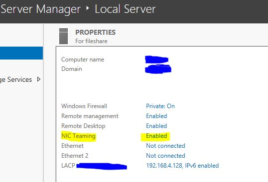
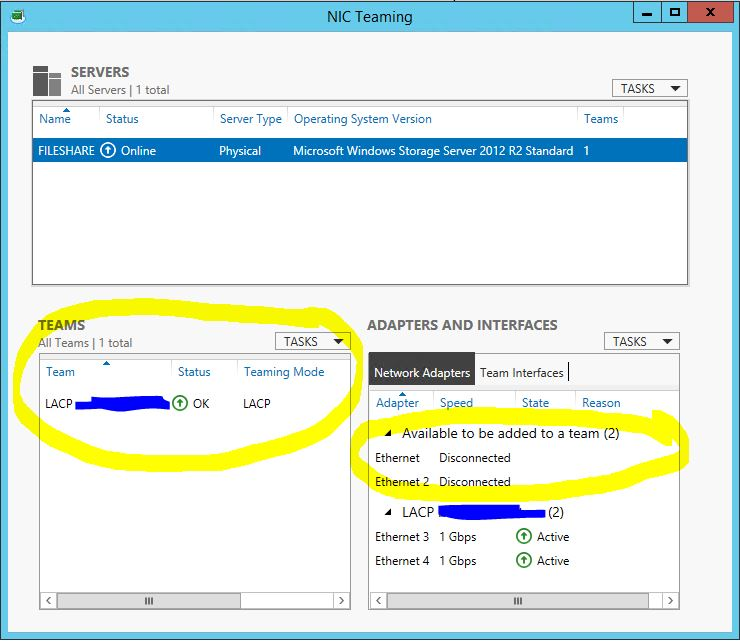
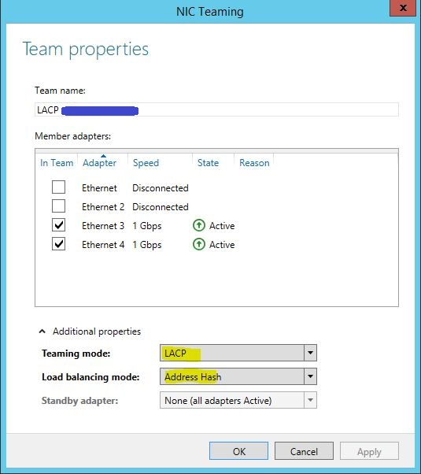

General
=======

Find What is Using File
-----------------------

https://superuser.com/questions/117902/find-out-which-process-is-locking-a-file-or-folder-in-windows/643312#643312

Mapping Drive CLI
-----------------

.. code-block:: powershell
  
  # Create Mapped drive
  net use z: \\server\share /user:administrator mysecurepassword /persistent:Yes
 
  # Delete mapped drive           
  net use * /delete

Changing Network Type
---------------------

http://woshub.com/how-to-change-a-network-type-from-public-to-private-in-windows/

.. code-block:: powershell

  Get-NetConnectionProfile
  Set-NetConnectionProfile -InterfaceIndex 8 -NetworkCategory Private
  Get-NetConnectionProfile -InterfaceIndex 8

7-zip CLI
---------

https://www.dotnetperls.com/7-zip-examples

.. code-block:: powershell

  # a means archive, mx9 means best compression
  7zip.exe a -t7z -mx9 z:\dest-compressed-file.7z z:\source-folder

DC Authenticated With
---------------------

Check which DC authenticated with: ``echo %logonserver%``

Check the Size of a Folder from CLI
-----------------------------------

https://superuser.com/questions/837016/how-can-i-check-the-size-of-a-folder-from-the-windows-command-line

.. code-block:: powershell

  dir /a/s

Download Firefox from CLI
-------------------------

.. code-block:: powershell

  # In PowerShell:
  wget -O FirefoxSetup.exe "https://download.mozilla.org/?product=firefox-latest&os=win64&lang=en-US"

Operations Masters
------------------

Forest
^^^^^^

Domain Naming
Schema

Domain
^^^^^^

Relative Identifier (RID)
Infrastructure
PDC Emulater

PowerShell
----------

Set-ExecutionPolicy Unrestricted
Will allow unsigned powershell scripts to run.
Set-ExecutionPolicy Restricted
Will not allow unsigned powershell scripts to run.
Set-ExecutionPolicy RemoteSigned
Will allow only remotely signed powershell scripts to run.

Rename Domain Controller
------------------------

.. code-block:: batch

  netdom computername <CurrentComputerName> /add:<NewComputerName>
  netdom computername <CurrentComputerName> /makeprimary:<NewComputerName>
  REBOOT
  netdom computername <NewComputerName> /remove:<OldComputerName>

LACP
----

Windows' Side
^^^^^^^^^^^^^

*Server Manager* > click on Link next to NIC teaming option or run ``lbfoadmin.exe``

Select the adapters, add to team

For teaming mode choose LACP, load balancing method use address hash

Cisco's Side
^^^^^^^^^^^^

.. code-block:: none

  int r g0/1 - 2
  channel-group 1 mode active
  channel-protocol lacp

  int port-chan1
  switchport mode trunk
  switchport trunk native vlan <server_VLAN>
  switchport trunk allowed vlan <all_vlans_to_allow>

Standard Installation
---------------------

Ensure that the following has been configured on your physical server:

#. `RAID`_
#. `Partitioning`_
#. `Shadow Copies`_
#. `Backups`_
#. `Updates`_

RAID
^^^^

Hardware Raid - BIOS
Software Raid - diskmgmt.msc

Partitioning
^^^^^^^^^^^^

``diskmgmt.msc`` > right click on C: > Shrink Volume...

Shadow Copies
^^^^^^^^^^^^^

``sysdm.cpl`` > System Protection > click on drive

Backups
^^^^^^^

``ntbackup`` after setting up Windows Backup

.. note::

	Note that iSCSI network cannot restore (backups). Use an external drive for fast, scheduled backups.

Updates
^^^^^^^

``wuapp.exe`` > install updates

Disable Windows Server Updates
------------------------------

https://www.netzen.co.uk/2019/07/17/disable-windows-server-updates-active-hours/

1. Open Windows Powershell by right click > run as administrator
2. Type: SCONFIG and hit enter
3. Press 5 (Windows Update Settings)
4. Press D (Download Only mode)
5. Close Powershell

Fixing Windows Corruption
-------------------------

https://answers.microsoft.com/en-us/windows/forum/all/exception-processing-message-0xc0000005-parameters/71c3eb40-7aab-4340-b2b0-9ef73961665d

* DISM.exe /Online /Cleanup-image /Scanhealth
* DISM.exe /Online /Cleanup-image /Restorehealth
* DISM.exe /online /cleanup-image /startcomponentcleanup
* sfc /scannow
* chkdsk /f /r