Group Policy
============

BGInfo
------

1. Download BgInfo from here.
2. Do the following in Group Policy Management:

3. Edit the BGInfo settings to suit your needs.
4. Save your settings in the same place as bginfo.exe.

.. image:: _images/group-policy-bginfo-2.png

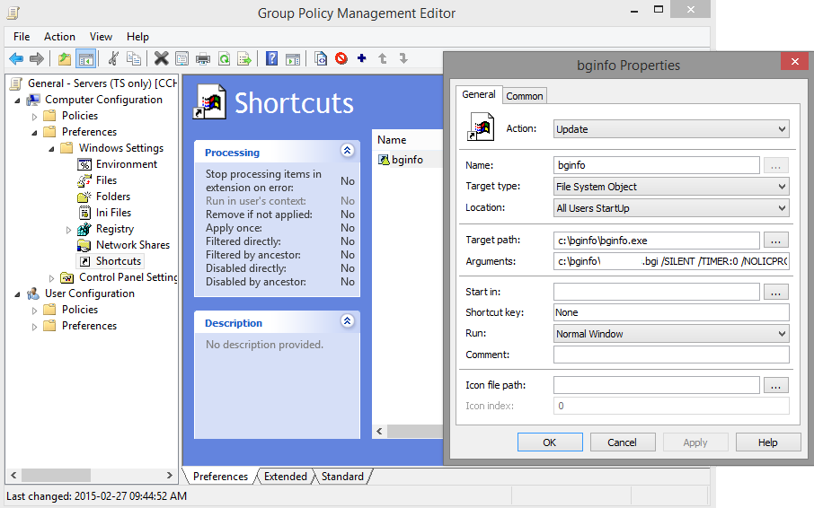

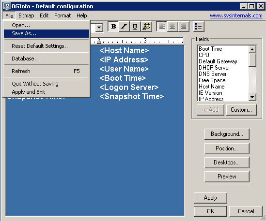

5. Add ``C:\bginfo\name.bgi /SILENT /TIMER:0 /NOCLIENTPROMPT`` to the argument field in the shortcut property in Group Policy Management.

Disable Sound
-------------

Under *Computer Configuration*, under *Policies*, under *Administrative Templates*, do the following:

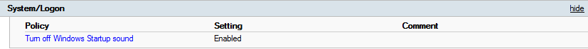

Disable UAC
-----------

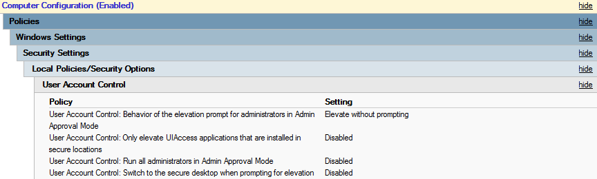

Lock Computers When Idle
------------------------

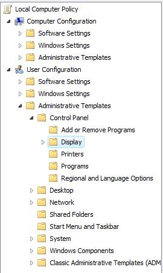

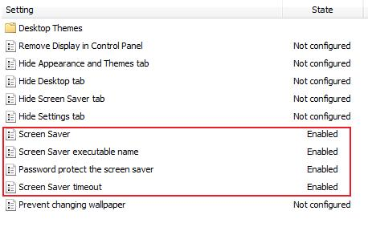

Internet Explorer Settings
--------------------------

Favourites for Intranet
^^^^^^^^^^^^^^^^^^^^^^^

Under *Computer Configuration*, under *Preferences*, under *Windows Settings*, under *Shortcuts*, do the following:

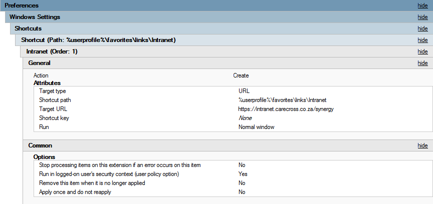

Homepage
^^^^^^^^

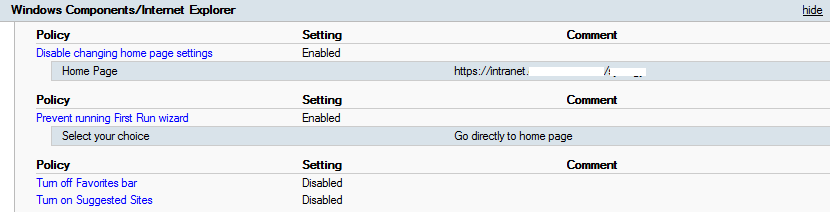

Trusted Sites Zone
^^^^^^^^^^^^^^^^^^

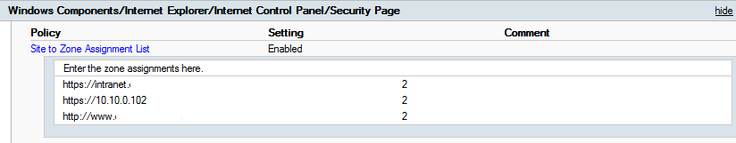

License Server - Point TS to License Server
-------------------------------------------

Under *Computer Configuration*, under *Policies*, under *Administrative Templates*, do the following:

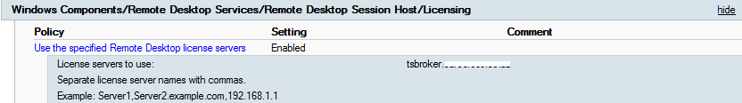

Mapped Drives
-------------

Under *User Configuration*, under *Preferences*, under *Windows Settings*, under *Drive Maps*, do the following:

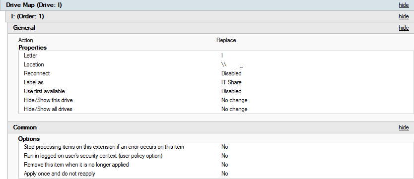

Remote Assistance
-----------------

Under *Computer Configuration*, under *Policies*, under *Administrative Templates*, do the following:

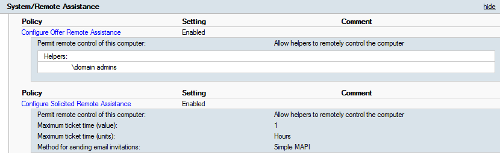

WSUS
----

Under *Computer Configuration*, under *Policies*, under *Administrative Templates*, do the following:

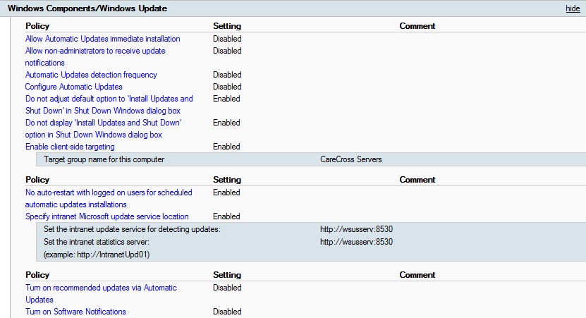
