Hyper-V
=======

Creating a Snapshot
-------------------

A very duh thing to add, but anyway:

Go to *Hyper-V Manager*, right click on the VM, click on *Checkpoint*.

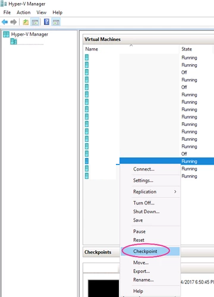

VM Failover
-----------

Certificate Installation
^^^^^^^^^^^^^^^^^^^^^^^^

This should already be in place, however, if you are receiving errors, you can set up the connection between the hypervisors again. In the below code, we are creating certificates for HYPERVISOR-02 and HYPERVISOR-01, so that we can enable replication between the two. The below certificates are computer-based certificates.

Generating the Root Certificate

.. code-block:: powershell

  New-SelfSignedCertificate -Type "Custom" -KeyExportPolicy "Exportable" -Subject "CN=HYPERVISOR-01_to_HYPERVISOR-02-Replication" -CertStoreLocation "Cert:\LocalMachine\My" -KeySpec "Signature" -KeyUsage "CertSign" -NotAfter (Get-Date).AddYears(10)

Generating the Cert for HYPERVISOR-02

.. code-block:: powershell

  New-SelfSignedCertificate -type "Custom" -KeyExportPolicy "Exportable" -Subject "CN=HYPERVISOR-01" -CertStoreLocation "Cert:\LocalMachine\My" -KeySpec "KeyExchange" -TextExtension @("2.5.29.37={text}1.3.6.1.5.5.7.3.1,1.3.6.1.5.5.7.3.2") -Signer "Cert:LocalMachine\My\6C435EE329087825553189D38CD29BEC9E124AB0" -Provider "Microsoft Enhanced RSA and AES Cryptographic Provider" -NotAfter (Get-Date).AddYears(10)

Generating the Cert for HYPERVISOR-01

.. code-block:: powershell

  New-SelfSignedCertificate -Type "Custom" -KeyExportPolicy "Exportable" -Subject "CN=HYPERVISOR-01_to_HYPERVISOR-02-Replication" -CertStoreLocation "Cert:\LocalMachine\My" -KeySpec "Signature" -KeyUsage "CertSign" -NotAfter (Get-Date).AddYears(10)

Place this certificate on both hosts in the Personal store.

Copy the certificates to the other hypervisor and import the certificates. Note that the root certificate needs to be in the Trusted Root Certification Authorities store and the other certificates need to be in the Personal store.

Disable Certificate Revocation Check on the hypervisor, as the certificates are self-signed.

.. code-block:: bat

  REG ADD "HKLM\SOFTWARE\Microsoft\Windows NT\CurrentVersion\Virtualization\Replication" /v DisableCertRevocationCheck /d 1 /t REG_DWORD /f

Enabling Replication
^^^^^^^^^^^^^^^^^^^^

.. _Enabling Replication:

Right click on the Virtual Machine and click on *Enable Replication...*

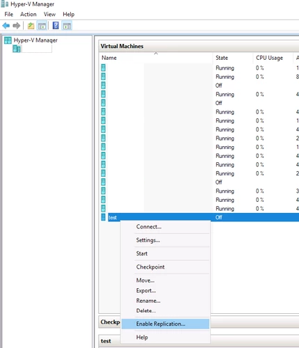

Specify the Replica Server

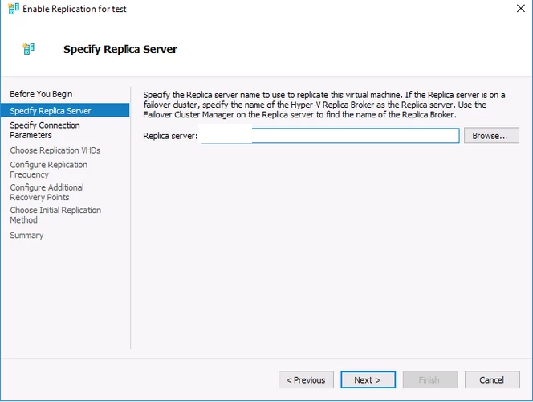

Specify the Connection Parameters. Select the imported certificate.

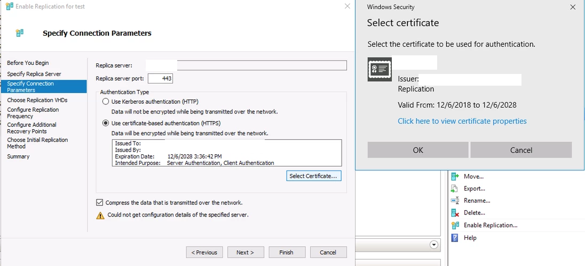

Accept the defaults and Finish

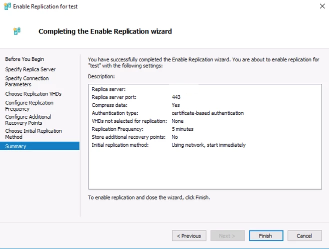

Failing Over
^^^^^^^^^^^^

There are two types of Failovers, as described below.

**Planned Failover**

A Planned Failover is when the *Primary Virtual Machine* is still online and active, and you would like to make the other hypervisor the host for the virtual machine, or you would like to test that the failover would work.

Executing a Planned Failover

Power down the Virtual Machine, so that you can failover.

On the primary host, right click on the Virtual Machine and click on *Replication > Planned Failover...*

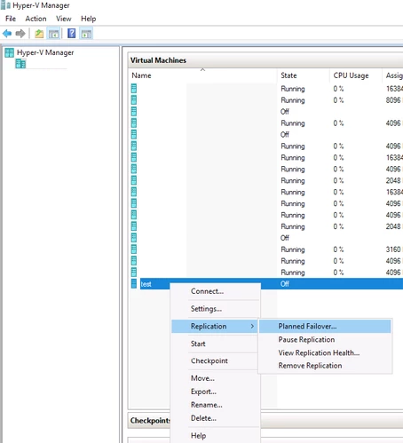

Leave the *Reverse the replication direction after failover* unchecked, because you will receive the below error.

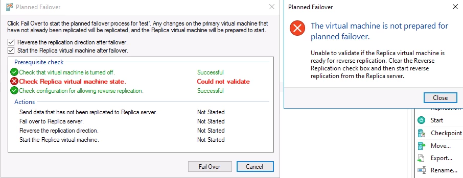

Instead, ensure that only *Start the Replica virtual machine after failover* is checked. Click on *Fail Over*.

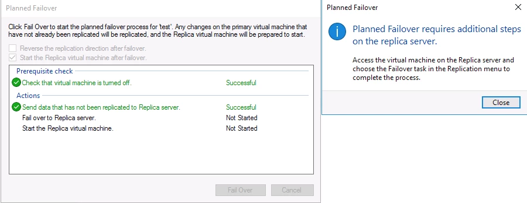

On the secondary host (note that the VM on this host is still the *Replica* or secondary), right click on the Virtual Machine and click on *Replication > Failover...* This is to complete the failover process.

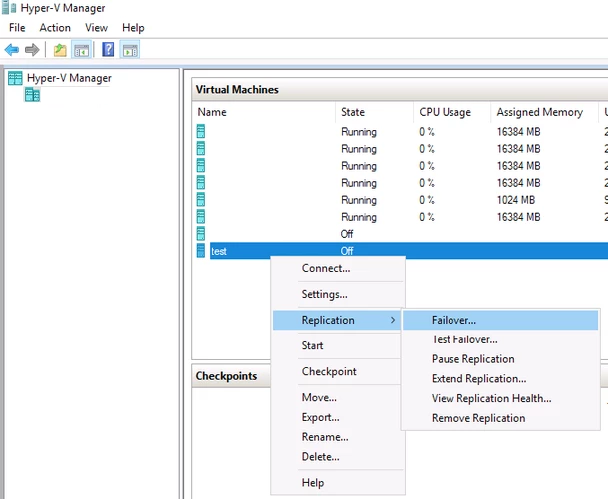

This time you can check both boxes. This will make the secondary host primary, by designating the *Replica* as the *Primary* and vice versa. If you leave the *Reverse the replication direction after failover* checkbox unchecked, you will have to go through the *Reverse Replication Wizard *(right click on the *VM > Replication > Reverse Replication...*), which is similar to ::ref:`Enabling Replication<Enabling Replication>`. You would leave it unchecked if you want to keep the roles of the VMs the same (*Primary* as Primary and *Replica* as *Replica*). It is to be noted that to get the VM running on the old primary host again (in this case HYPERVISOR-01), you will need to reverse replication. It is, therefore, recommended that you check both boxes. *Reverse Replication* basically switches the roles around.

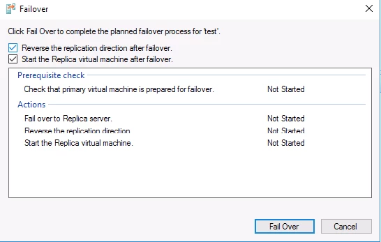

**Unplanned Failover**

An unplanned failover is when the hypervisor hosting the *Primary* Virtual Machine becomes unreachable (due to power failure, natural disaster, etc), and you would like to start the *Replica* Virtual Machine to keep the services that the server was running online. An unplanned failover assumes that the primary host is unrecoverable and that the *Primary* Virtual Machine is lost completely.

Executing an Unplanned Failover

Right click on the *Replica* Virtual Machine, click on *Replication > Failover...*

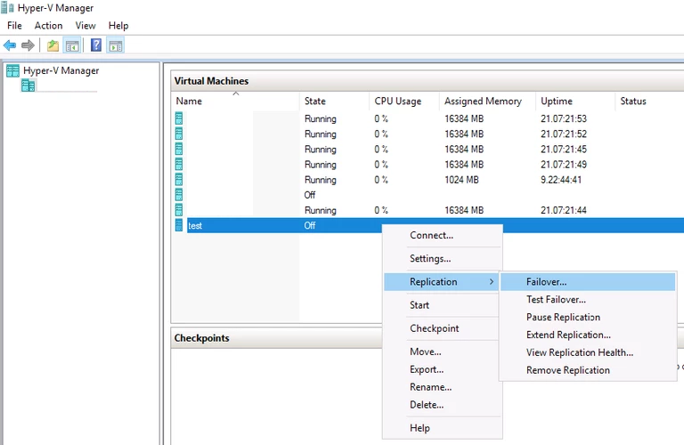

Read the screen, as it mentions the difference between planned and unplanned failover. Select your recovery point (usually the latest). Click on *Fail Over*.

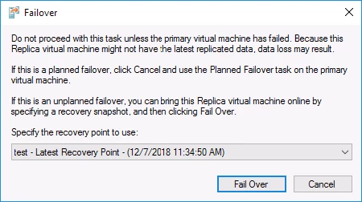

**Post Failover Steps**

When the VM has been moved to the secondary host, you will need to change its IP Address (if static) and change the DNS record accordingly.
