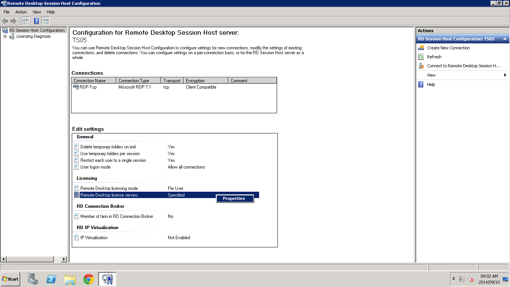
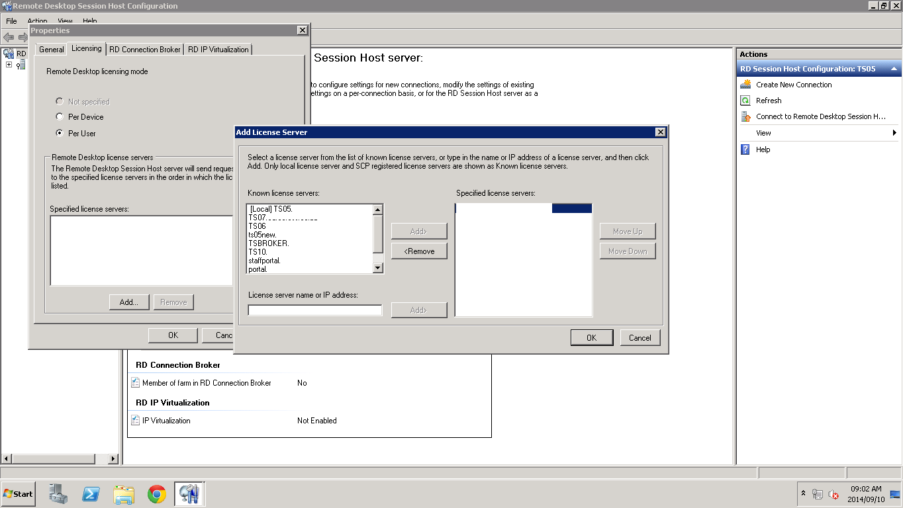
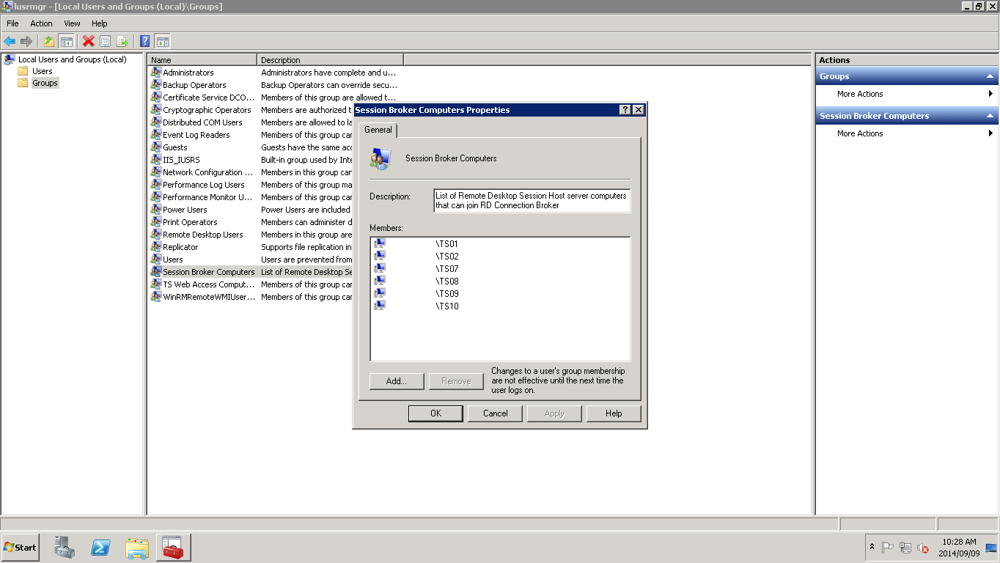
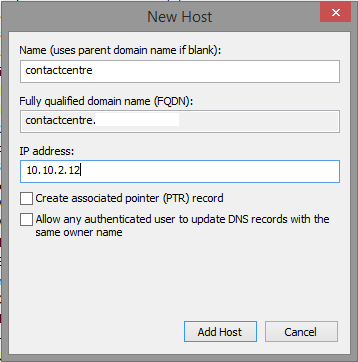
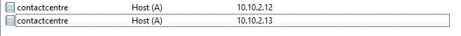

Terminal Services
=================

https://docs.microsoft.com/en-us/previous-versions/windows/it-pro/windows-server-2008-R2-and-2008/cc770412(v=ws.10)

Add a TS to TS License Server
-----------------------------

Add TS to TSBroker Farm
-----------------------

.. image:: _images/terminal-server-4.png
    :width: 664px
    :align: center
    :height: 326px

.. image:: _images/terminal-server-5.png
    :width: 668px
    :align: center
    :height: 331px

.. image:: _images/terminal-server-8.png
    :width: 1364px
    :align: center
    :height: 768px
