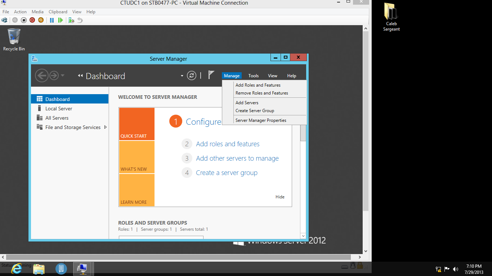
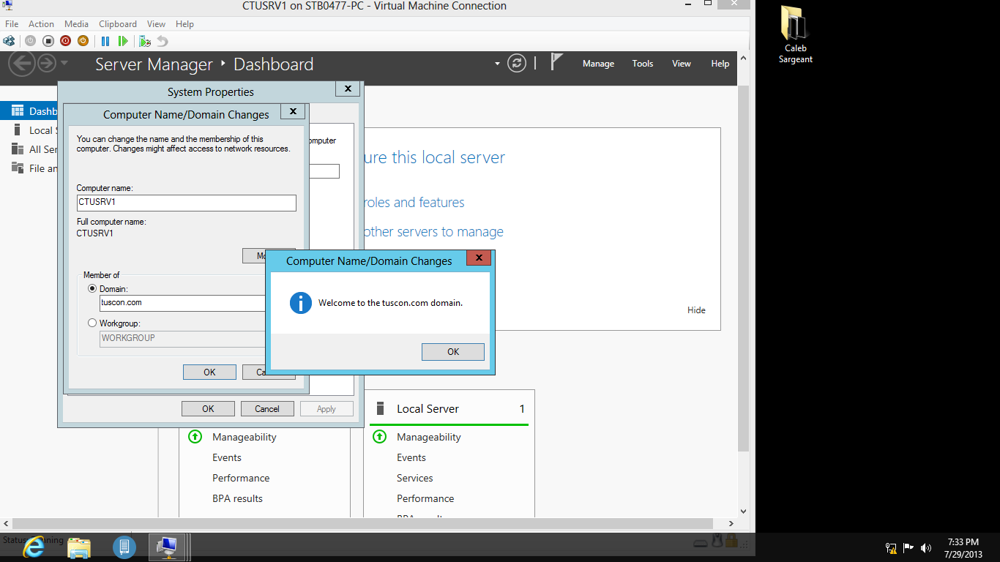
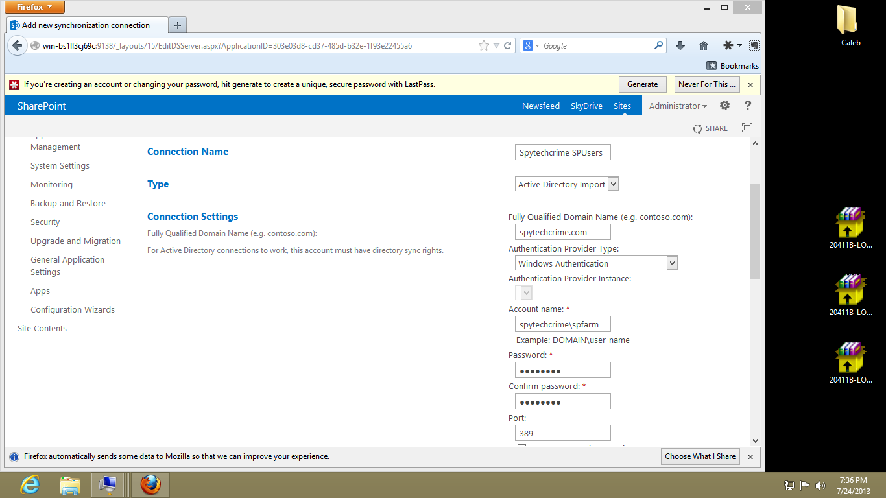
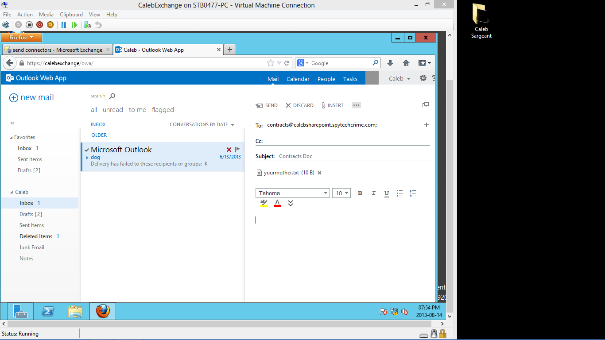
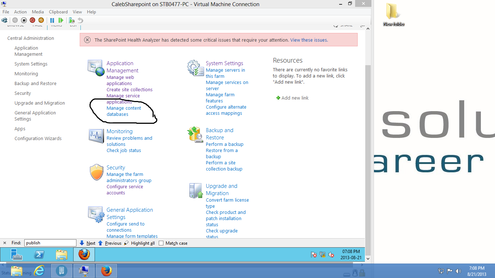
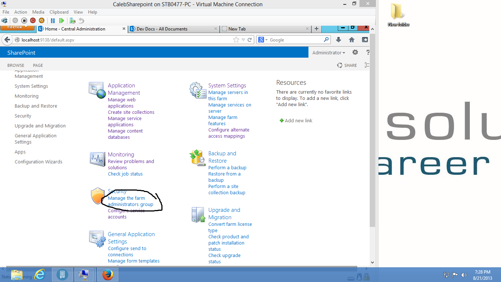
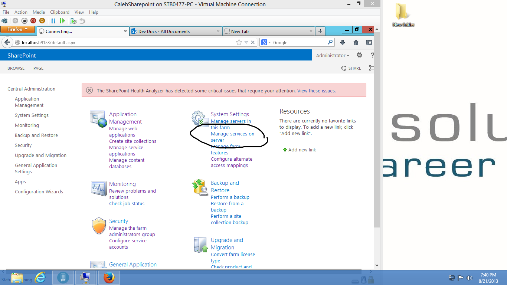

Configuration
=============

A glob of installation and configuration images.

Example 1
---------

.. image:: _images/install/1.png

.. image:: _images/install/2.png

.. image:: _images/install/3.png

.. image:: _images/install/5.png

.. image:: _images/install/6.png

.. image:: _images/install/9.png

.. image:: _images/install/10.png

.. image:: _images/install/11.png

.. image:: _images/install/12.3.png

.. image:: _images/install/12.4.png

.. image:: _images/install/12.9.png

.. image:: _images/install/12.10.png

.. image:: _images/install/12.14.png

.. image:: _images/install/12.17.png

.. image:: _images/install/12.18.png

.. image:: _images/install/12.19.png

.. image:: _images/install/12.20.png

.. image:: _images/install/12.21.png

.. image:: _images/install/12.22.png

.. image:: _images/install/12.24.png

.. image:: _images/install/12.25.png

.. image:: _images/install/12.28.png

.. image:: _images/install/13.3.png

.. image:: _images/install/13.5.png

.. image:: _images/install/13.7.png

.. image:: _images/install/13.10.png

.. image:: _images/install/13.11.png

.. image:: _images/install/13.12.png

.. image:: _images/install/13.14.png

.. image:: _images/install/13.18.png

.. image:: _images/install/13.21.png

.. image:: _images/install/13.22.png

.. image:: _images/install/13.23.png

.. image:: _images/install/13.26.png

.. image:: _images/install/13.27.png

.. image:: _images/install/14.5.png

.. image:: _images/install/14.7.png

.. image:: _images/install/14.8.png

.. image:: _images/install/14.13.png

.. image:: _images/install/14.14.png

.. image:: _images/install/14.15.png

.. image:: _images/install/14.16.png

.. image:: _images/install/14.19.png

.. image:: _images/install/14.21.png

.. image:: _images/install/14.22.png

.. image:: _images/install/14.24.png

.. image:: _images/install/14.25.png

.. image:: _images/install/14.27.png

.. image:: _images/install/14.28.png

.. image:: _images/install/14.29.png

.. image:: _images/install/14.33.png

.. image:: _images/install/14.35.png

.. image:: _images/install/14.36.png

.. image:: _images/install/14.37.png

.. image:: _images/install/14.38.png

.. image:: _images/install/14.42.png

.. image:: _images/install/14.43.png

.. image:: _images/install/14.44.png

.. image:: _images/install/14.45.png

.. image:: _images/install/14.47.png

.. image:: _images/install/14.49.png

.. image:: _images/install/15.1.png

.. image:: _images/install/15.3.png

.. image:: _images/install/15.5.png

.. image:: _images/install/15.6.png

.. image:: _images/install/16.png

.. image:: _images/install/17.png

.. image:: _images/install/18.png

.. image:: _images/install/24.png

Example 2
---------

.. image:: _images/config/1.png

.. image:: _images/config/3.png

.. image:: _images/config/6.png

.. image:: _images/config/7.png

.. image:: _images/config/9.png

.. image:: _images/config/13.png

.. image:: _images/config/14.png

.. image:: _images/config/15.png

.. image:: _images/config/17.png

.. image:: _images/config/20.png

.. image:: _images/config/22.png

.. image:: _images/config/23.png

.. image:: _images/config/25.png

.. image:: _images/config/26.png

.. image:: _images/config/27.png

.. image:: _images/config/28.png

.. image:: _images/config/29.png

.. image:: _images/config/30.png

.. image:: _images/config/31.png

.. image:: _images/config/35.png

.. image:: _images/config/36.png

.. image:: _images/config/37.png

.. image:: _images/config/38.png

.. image:: _images/config/39.png

.. image:: _images/config/41.png

.. image:: _images/config/42.png

.. image:: _images/config/43.png

.. image:: _images/config/44.png

.. image:: _images/config/46.png

.. image:: _images/config/48.png

.. image:: _images/config/49.png

.. image:: _images/config/52.png

.. image:: _images/config/61.png

.. image:: _images/config/62.png

.. image:: _images/config/63.png

.. image:: _images/config/64.png

.. image:: _images/config/66.png

.. image:: _images/config/68.png

.. image:: _images/config/69.png

.. image:: _images/config/70.png

.. image:: _images/config/72.png

.. image:: _images/config/73.png

.. image:: _images/config/74.png

.. image:: _images/config/80.png

.. image:: _images/config/86.png

.. image:: _images/config/87.png

.. image:: _images/config/89.png

Example 3
---------

.. image:: _images/admin/1.png

.. image:: _images/admin/3.png

.. image:: _images/admin/4.png

.. image:: _images/admin/7.png

.. image:: _images/admin/8.png

.. image:: _images/admin/9.png

.. image:: _images/admin/10.png

.. image:: _images/admin/11.png

.. image:: _images/admin/14.png

.. image:: _images/admin/16.png

.. image:: _images/admin/19.png

.. image:: _images/admin/22.png

.. image:: _images/admin/23.png

.. image:: _images/admin/25.png

.. image:: _images/admin/26.png

.. image:: _images/admin/27.png

.. image:: _images/admin/28.png

.. image:: _images/admin/30.png

.. image:: _images/admin/31.png

.. image:: _images/admin/32.png

.. image:: _images/admin/33.png

.. image:: _images/admin/34.png

.. image:: _images/admin/35.png

.. image:: _images/admin/36.png

.. image:: _images/admin/45.png

.. image:: _images/admin/48.png

.. image:: _images/admin/49.png

.. image:: _images/admin/50.png

.. image:: _images/admin/52.png

.. image:: _images/admin/53.png

.. image:: _images/admin/56.png

.. image:: _images/admin/58.png

.. image:: _images/admin/60.png

.. image:: _images/admin/62.png

.. image:: _images/admin/68.png

.. image:: _images/admin/69.png

.. image:: _images/admin/70.png

.. image:: _images/admin/71.png

.. image:: _images/admin/72.png

.. image:: _images/admin/74.png

.. image:: _images/admin/75.png

.. image:: _images/admin/76.png

.. image:: _images/admin/78.png

.. image:: _images/admin/80.png

.. image:: _images/admin/83.png

Example 4
---------

.. image:: _images/email/3.png

.. image:: _images/email/5.png

.. image:: _images/email/8.png

.. image:: _images/email/10.png

.. image:: _images/email/11.png

.. image:: _images/email/12.png

.. image:: _images/email/15.png

.. image:: _images/email/16.png

.. image:: _images/email/18.png
