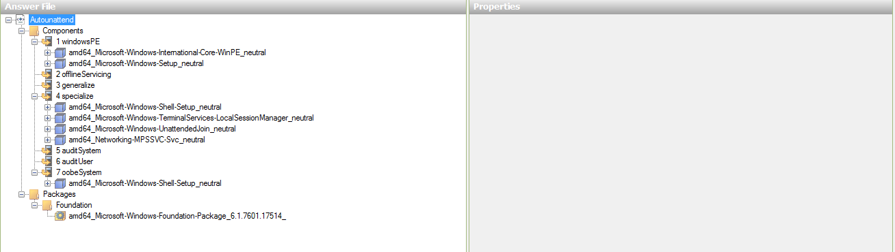
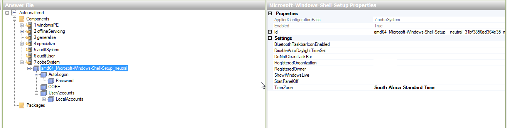

Unattended Installations
========================

Brief Instructions on how to create a Windows unattended disk that allow you to:

* Put in the disk
* Boot from disk
* Make some coffee
* Come back and OS is installed

**Important:**

If you make an Unattended disk for 32-bit, and your physical PC where you are installing WAIK on is 64-bit then you
cannot make a disk for 32-bit. You can however use something like Oracle VM Virtualbox and install Windows 32-bit
virtually.

Windows 7 - 10
--------------

1. Install `WAIK: <https://www.microsoft.com/en-us/download/details.aspx?id=5753>`_ (Remember to use the WAIK relevant to your OS version)
2. Copy Windows onto the local harddrive
3. Open *Windows System Image Manager*
4. *File* > *Select Windows Image* > Browse to location of copied OS
5. Select the desired Image
6. Generate the catalog
7. *File* > *New Answer File*
8. Click the plus by Components
9. Follow the below

  * `Server 2012`_
  * `Server 2008 R2`_
  * `Windows 7 64-bit`_
  * `Windows 7 32-bit`_

10. Save the *autounattend.xml* file to the root of the copied OS
11. Use ImgBurn to Write a Bootable ISO

  1. Click *Advanced* > *Bootable Disk* > *Make Image Bootable*
  2. Boot Image: ``\boot\etfsboot.com``

Server 2012
^^^^^^^^^^^

.. image:: _images/unattended-server2012-1.png

.. image:: _images/unattended-server2012-2.png

.. image:: _images/unattended-server2012-5.png

.. image:: _images/unattended-server2012-6.png

.. image:: _images/unattended-server2012-7.png

.. image:: _images/unattended-server2012-9.png

.. image:: _images/unattended-server2012-10.png

.. image:: _images/unattended-server2012-13.png

.. image:: _images/unattended-server2012-14.png

.. image:: _images/unattended-server2012-15.png

.. image:: _images/unattended-server2012-17.png

.. image:: _images/unattended-server2012-18.png

.. image:: _images/unattended-server2012-19.png

.. image:: _images/unattended-server2012-21.png

.. image:: _images/unattended-server2012-23.png

.. image:: _images/unattended-server2012-25.png

.. image:: _images/unattended-server2012-26.png

.. image:: _images/unattended-server2012-27.png

.. image:: _images/unattended-server2012-29.png

.. image:: _images/unattended-server2012-30.png

Server 2008 R2
^^^^^^^^^^^^^^

.. image:: _images/unattended-server2008r2-2.png

.. image:: _images/unattended-server2008r2-4.png

.. image:: _images/unattended-server2008r2-6.png

.. image:: _images/unattended-server2008r2-8.png

.. image:: _images/unattended-server2008r2-10.png

.. image:: _images/unattended-server2008r2-15.png

.. image:: _images/unattended-server2008r2-16.png

.. image:: _images/unattended-server2008r2-17.png

.. image:: _images/unattended-server2008r2-20.png

.. image:: _images/unattended-server2008r2-23.png

.. image:: _images/unattended-server2008r2-24.png

.. image:: _images/unattended-server2008r2-25.png

.. image:: _images/unattended-server2008r2-26.png

.. image:: _images/unattended-server2008r2-28.png

Windows 7 64-bit
^^^^^^^^^^^^^^^^

.. image:: _images/unattended-windows7x64-2.png

.. image:: _images/unattended-windows7x64-3.png

.. image:: _images/unattended-windows7x64-6.png

.. image:: _images/unattended-windows7x64-7.png

.. image:: _images/unattended-windows7x64-8.png

.. image:: _images/unattended-windows7x64-9.png

.. image:: _images/unattended-windows7x64-10.png

.. image:: _images/unattended-windows7x64-11.png

.. image:: _images/unattended-windows7x64-13.png

.. image:: _images/unattended-windows7x64-15.png

.. image:: _images/unattended-windows7x64-16.png

.. image:: _images/unattended-windows7x64-18.png

.. image:: _images/unattended-windows7x64-21.png

.. image:: _images/unattended-windows7x64-22.png

.. image:: _images/unattended-windows7x64-23.png

.. image:: _images/unattended-windows7x64-25.png

.. image:: _images/unattended-windows7x64-26.png

.. image:: _images/unattended-windows7x64-27.png

.. image:: _images/unattended-windows7x64-30.png

.. image:: _images/unattended-windows7x64-31.png

.. image:: _images/unattended-windows7x64-33.png

Windows 7 32-bit
^^^^^^^^^^^^^^^^

.. image:: _images/unattended-windows7x86-1.png

.. image:: _images/unattended-windows7x86-3.png

.. image:: _images/unattended-windows7x86-4.png

.. image:: _images/unattended-windows7x86-5.png

.. image:: _images/unattended-windows7x86-7.png

.. image:: _images/unattended-windows7x86-8.png

.. image:: _images/unattended-windows7x86-9.png

.. image:: _images/unattended-windows7x86-11.png

.. image:: _images/unattended-windows7x86-12.png

.. image:: _images/unattended-windows7x86-13.png

.. image:: _images/unattended-windows7x86-15.png

.. image:: _images/unattended-windows7x86-17.png

.. image:: _images/unattended-windows7x86-18.png

.. image:: _images/unattended-windows7x86-19.png

.. image:: _images/unattended-windows7x86-20.png

.. image:: _images/unattended-windows7x86-21.png

.. image:: _images/unattended-windows7x86-23.png

.. image:: _images/unattended-windows7x86-24.png

.. image:: _images/unattended-windows7x86-25.png

.. image:: _images/unattended-windows7x86-27.png

.. image:: _images/unattended-windows7x86-28.png

.. image:: _images/unattended-windows7x86-29.png

Windows XP
----------

Instructions:

1. Download and install nLite
2. Copy contents of Windows XP Disk to Harddrive
3. Open nLite
4. Locate the copied Windows XP files
5. Integrate updates and drivers if you want
6. At Unattended section

  #. Fully automated
  #. Enabled
  #. XXXXX-XXXXX-XXXXX-XXXXX-XXXXX (please change when activating Windows)
  #. Automatic
  #. Turn off Firewall
  #. Skip OOBE
  #. Turn off Hibernate
  #. System Restore Service Enabled

7. At Users section

  #. Add an account
  #. Username: admin
  #. Password: 1234567
  #. Local Group: Administrators

8. At Owner and Network ID

  #. Computer Name: windowsxp
  #. Workgroup: WORKGROUP
  #. Full Name: Admin
  #. Organization: Organization

9. At Regional section

  #. Language: English (South Africa)
  #. Localization: English (United States)
  #. Keyboard: US
  #. Location: South Africa
  #. Time Zone: (GMT +02{00) Harare, Pretoria

10. At Automatic Updates

  #. Download and notify of installation

11. Tweek the disk if you want
12. Start the Process and close nLite
13. Edit [copied xp location]\I386\winnt.sif

  #. under [Unattended] put: "Repartition = "Yes""
  #. under [Data] put: "AutoPartition = 1"

14. Open nLite again and go straight to Bootable ISO
15. Make a Bootable ISO with nLite
16. Use ImgBurn to write ISO to disk.
