ASA
===

Adaptive Security Appliance

SCP
---

https://thestupidengineer.wordpress.com/2015/04/01/scp-file-to-asa/

.. code-block:: none

  # Enable SCP on ASA
  ssh scopy enable

  # From your host / laptop / desktop / whatever
  scp -v asa825-51-k8.bin username@IP_ADDRESS:disk0:asa825-51-k8.bin

  # From the ASA
  scp -v cisco@10.251.21.80:disk0:asa822-k8.bin asa822-k8.bin

LDAP Authentication
-------------------

Configuration
^^^^^^^^^^^^^

AAA Authentication via corp-ldap (AD servers). Enable to be kept as LOCAL authentication, otherwise, all AD users will be able to enable.

.. code-block:: none

  ASA(config)# no aaa authentication http console LOCAL
  ASA(config)# aaa authentication http console corp-ldap LOCAL
  ASA(config)# no aaa authentication ssh console LOCAL
  ASA(config)# aaa authentication ssh console corp-ldap LOCAL

Testing
^^^^^^^

**AD Server Becomes Unreachable**

Run a preliminary test: we can see the aaa-server is active.

.. code-block:: none

  ASA# sh aaa-server corp-ldap
  Server Group: corp-ldap
  Server Protocol: ldap
  Server Hostname: server.example.com
  Server Address: x.x.x.x
  Server port: 0
  Server status: ACTIVE, Last transaction at 10:28:15 SAST Mon Feb 25 2019

Shutdown inside interface to simulate AD becoming unavailable.

When connecting to the ASA via SSH or HTTPS, the ASA will flag the aaa-server as FAILED.

.. code-block:: none

  ASA# test aaa-server authentication corp-ldap username caleb.sargeant
  Server IP Address or name: server.example.com
  Password: **************
  INFO: Attempting Authentication test to IP address (x.x.x.x) (timeout: 12 seconds)
  ERROR: Authentication Server not responding: AAA Server has been removed

  ASA# sh aaa-server corp-ldap
  Server Group: corp-ldap
  Server Protocol: ldap
  Server Hostname: server.example.com
  Server Address: x.x.x.x
  Server port: 0
  Server status: FAILED, Server disabled at 12:28:46 SAST Tue Feb 26 2019

If we unshut the inside interface the ASA flags the aaa-server as ACTIVE again after the first authentication test fails.

.. code-block:: none

  ASA# conf t
  ASA(config)# int g0/0
  ASA(config-if)# no shut
  ASA(config-if)# end

  ASA# test aaa-server authentication corp-ldap username caleb.sargeant
  Server IP Address or name: server.example.com
  Password: **************
  INFO: Attempting Authentication test to IP address (x.x.x.x) (timeout: 12 seconds)
  ERROR: Authentication Server not responding: AAA Server has been removed

  ASA# test aaa-server authentication corp-ldap username caleb.$
  Server IP Address or name: server.example.com
  Password: **************
  INFO: Attempting Authentication test to IP address (x.x.x.x) (timeout: 12 seconds)
  INFO: Authentication Successful

  ASA# sh aaa-server corp-ldap
  Server Group:	 corp-ldap
  Server Protocol: ldap
  Server Hostname: server.example.com
  Server Address:	 x.x.x.x
  Server port:	 0
  Server status:	 ACTIVE, Last transaction at 10:28:15 SAST Mon Feb 25 2019

**Bind User Gets Deleted**

The AD Recycle Bin was enabled and he corp-ldap user was deleted.

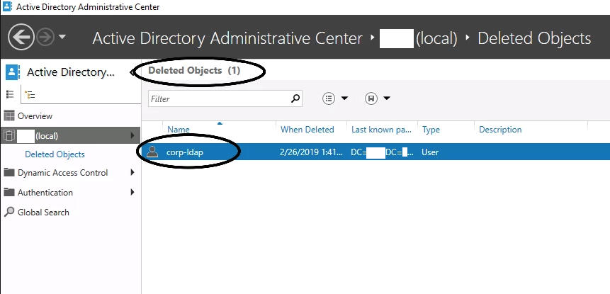

Test authentication

.. code-block:: none

  ASA# test aaa-server authentication corp-ldap username caleb.sargeant
  Server IP Address or name: server.example.com
  Password: **************
  INFO: Attempting Authentication test to IP address (x.x.x.x) (timeout: 12 seconds)
  ERROR: Authentication Server not responding: AAA Server has been removed

AAA-Server gets marked as FAILED

.. code-block:: none

  ASA# sh aaa-server corp-ldap
  Server Group:	 corp-ldap
  Server Protocol: ldap
  Server Hostname: server.example.com
  Server Address:	 x.x.x.x
  Server port:	 0
  Server status:	 FAILED, Server disabled at 13:44:16 SAST Tue Feb 26 2019

Restore the bind user from Deleted Objects in AD

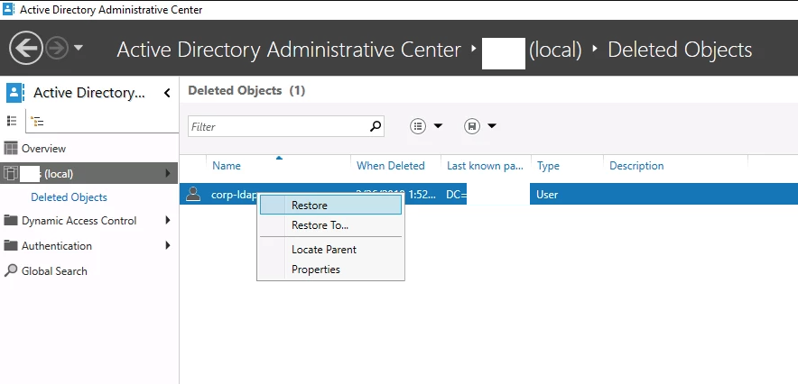

Test authentication again

.. code-block:: none

  ASA# test aaa-server authentication corp-ldap username caleb.sargeant
  Server IP Address or name: server.example.com
  Password: **************
  INFO: Attempting Authentication test to IP address (x.x.x.x) (timeout: 12 seconds)
  INFO: Authentication Successful

**User Account(s) Get(s) Deleted**

This one is obvious. We will be able to log in as a different user. If all users are deleted, we can have the ASA's inside interface cable be unplugged, or console into the ASA and shut the inside interface (or on the switch). When authenticating with the interface shut, the ASA will flag the aaa-server as FAILED and we will be able to login with root (LOCAL) again. See the above tests for proof.

LDAP Authorization
------------------

Authorization Testing
^^^^^^^^^^^^^^^^^^^^^

We need to deauthorize other users from accessing the ASA. We will use "John Doe" from Finance to test and change the configuration on the ASA and on AD accordingly. Even though SSH access to the ASA without logging in or enabling is in non-privileged mode, only members in #Infrastructure should be able to access the ASA.

John Doe is allowed to SSH into the ASA, but because we left ``enable`` as LOCAL authentication, John Doe is unable to login.

.. code-block:: none

  caleb.sargeant@MacBook:~$ ssh john.doe@vpn.example.com
  john.doe@vpn.example.com's password:
  User john.doe logged in to ASA
  Logins over the last 34 days: 1.
  Failed logins since the last login: 0.
  Type help or '?' for a list of available commands.
  ASA> login
  Username: john.doe
  Password: *********
  %Login failed
  ERROR: Invalid username

John Doe is allowed to configure the ASA through ASDM

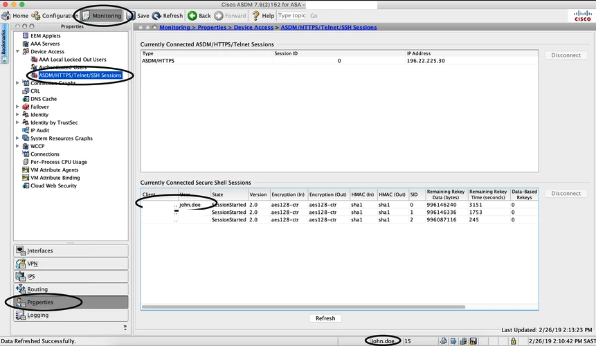

To prevent this, we create a new aaa-server and be more specific with the ldap-base-dn. Only members inside the #Infrastructure OU will be able to log in.

.. code-block:: none

  aaa-server asa-ldap protocol ldap
  aaa-server asa-ldap (inside) host server.example.com
    ldap-scope subtree
    ldap-base-dn ou=REDACTED, dc=REDACTED, dc=com
    ldap-login-dn cn=corp-ldap, dc=REDACTED, dc=com
    ldap-login-password **********
    ldap-naming-attribute sAMAccountName
    server-type microsoft
  exit

  aaa authentication http console asa-ldap LOCAL
  aaa authentication ssh console asa-ldap LOCAL

RADIUS AAA
----------

With RADIUS Authentication, we are able to specify which Windows group a user needs to be part of to log in to the ASA.

Configuration
^^^^^^^^^^^^^

Configure the aaa-server & enable authentication through RADIUS

.. code-block:: none

  aaa-server asa-radius protocol radius
  aaa-server asa-radius (inside) host server.example.com
  key *****
  authentication-port 1812
  accounting-port 1813

  no aaa authentication http console LOCAL
  aaa authentication http console asa-radius LOCAL
  no aaa authentication ssh console LOCAL
  aaa authentication ssh console asa-radius LOCAL

  # View packets
   debug radius all

NPS
^^^

Add a RADIUS Client

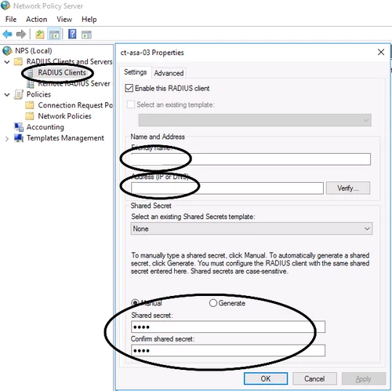

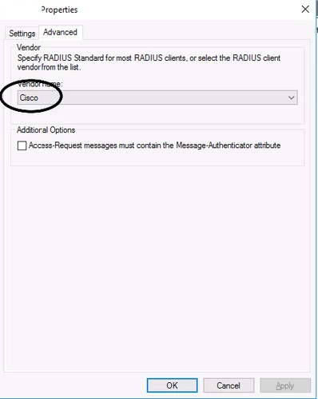

Create a Network Policy (skip Connection Request Policy). The Client Friendly Name optional and perhaps not recommended so that we can use one policy for all network devices

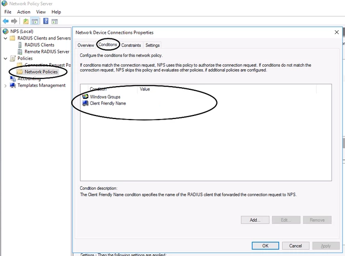

Enable only Unencrypted authentication (PAP, SPAP)

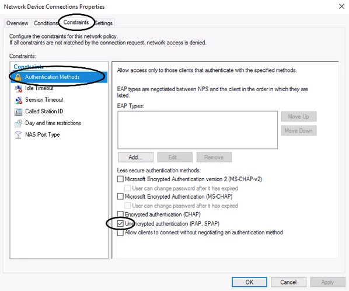

NAS Port Type is Virtual (VPN)

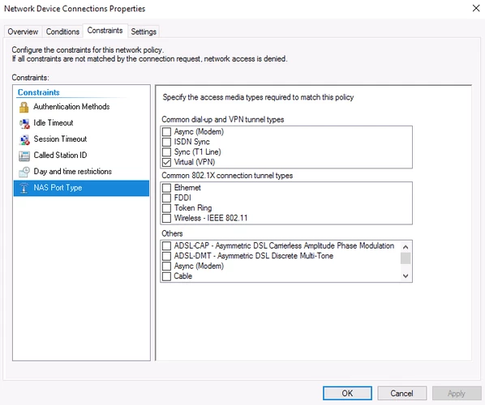

Service-Type is Administrative

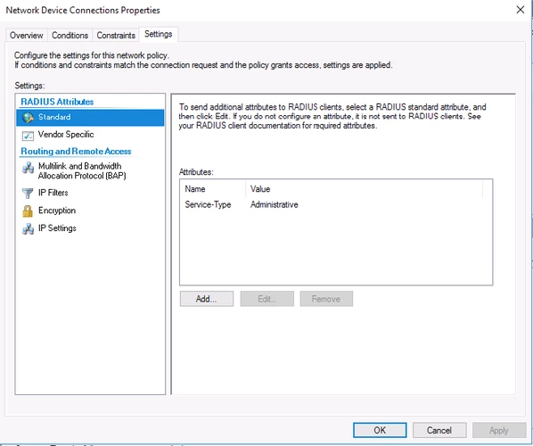

Certificates
------------

Intermediate Cert with Key
^^^^^^^^^^^^^^^^^^^^^^^^^^

Create a PKCS #12 Certificate which we will use to import into the ASA:

.. code-block:: none

  openssl pkcs12 -export -in wildcard.corp.example.com.crt -inkey wildcard.corp.example.com.key -out wildcard.corp.example.com.p12
  Enter Export Password: secret
  Verifying - Enter Export Password: secret

To read the certificate:

.. code-block:: none

  cat wildcard.corp.example.com.p12 | base64
  REDACTED (long string)

On the ASA via CLI (don’t use command ``nointeractive``, which is the default behaviour via ASDM):

.. code-block:: none

  ASA/sec/actNoFailover(config)# crypto ca import 2018-10-TrustPoint pkcs12 "secret"

  Enter the base 64 encoded pkcs12.
  End with the word "quit" on a line by itself:
  REDACTED (long string)
  quit
  % You already have RSA or ECDSA keys named 2018-10-TrustPoint.
  % If you replace them, all device certs issued using these keys
  % will be removed.
  % Do you really want to replace them? [yes/no]: yes

  Trustpoint '2018-10-TrustPoint' is a subordinate CA and holds a non self-signed certificate.

  Trustpoint CA certificate accepted.
  INFO: Import PKCS12 operation completed successfully

  ASA/sec/actNoFailover(config)# crypto ca trustpoint 2018-10-TrustPoint
  ASA/sec/actNoFailover(config-ca-trustpoint)#   revocation-check none
  ASA/sec/actNoFailover(config-ca-trustpoint)#   id-usage ssl-ipsec
  ASA/sec/actNoFailover(config-ca-trustpoint)#   exit
  ASA/sec/actNoFailover(config)# ssl trust-point 2018-10-TrustPoint outside
  ASA/sec/actNoFailover(config)# ssl trust-point 2018-10-TrustPoint inside

Now, when connecting to ASA via RA VPN, as long as you are using a corp.example.com hostname (example vpn.corp.example.com), you will not receive any certificate errors, because the wildcard.corp.example.com certificate is being used.

CSR Wildcard
^^^^^^^^^^^^

**Generate the key**

.. code-block:: none

  crypto key generate rsa label 2018-10-TrustPoint modulus 2048 noconfirm

**Create the Identity Certificate**

.. code-block:: none

  crypto ca trustpoint 2018-10-TrustPoint
    revocation-check none
    keypair -corp.TrustPoint-2018
    id-usage ssl-ipsec
    fqdn vpn.corp.example.com
    subject-name CN=asa,CN=vpn,CN=vpn-out,CN=vpn-in,O=Example,C=US
    enrollment terminal
    no ca-check

**Generate the CSR**

.. code-block:: none

  crypto ca enroll 2018-10-TrustPoint noconfirm
    -----BEGIN CERTIFICATE-----
    ASA-generated random stuff
    -----END CERTIFICATE-----
  # Copy the generated CSR to your clipboard

**Generate a Certificate from the 3rd Party CA**

Go to https://www.digicert.com. We will be requesting a duplicate wildcard certificate.

* Paste the ASA-generated CSR into the *Add Your CSR field*.

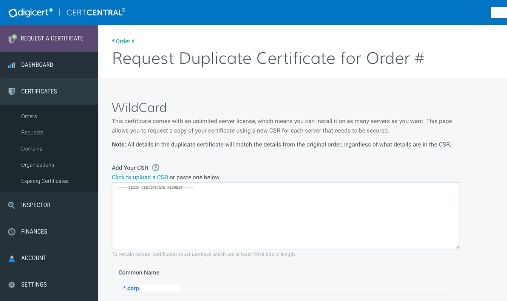

* Input all the hostnames in FQDN format into the *Other Hostnames (SANs) field*. In this example, I inputted the below, not "vpn.corp.example.com", as per the below screenshot. This should match up with the *subject-name* command from when we created the *Identity Certificate*.

  * vpn-out.corp.example.com
  * asa.corp.example.com
  * vpn.corp.example.com
  * vpn-in.corp.example.com

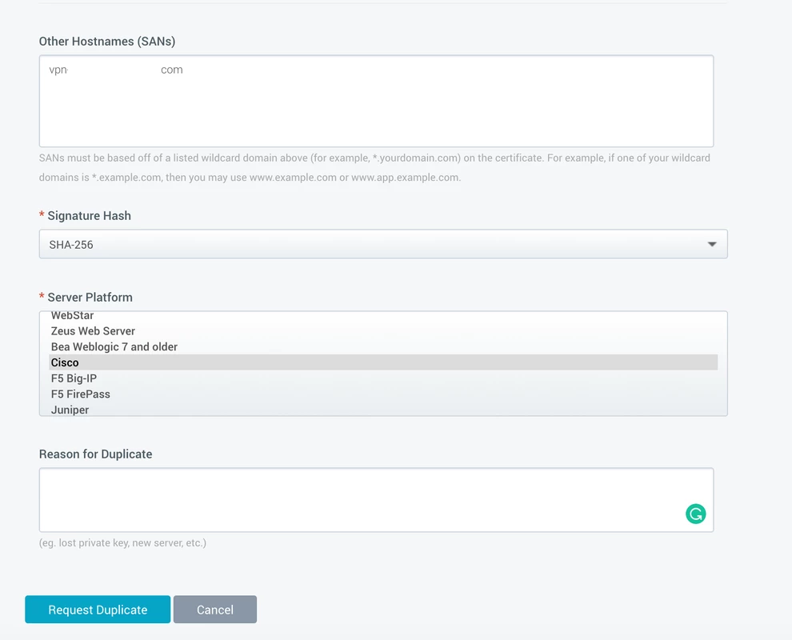

* Select SHA-256 from the *Signature Hash* drop-down menu.
* Select Cisco from the *Server Platform* list.

**Install the Certificate from the 3rd Party CA**

.. code-block:: none

  crypto ca import 2018-10-TrustPoint certificate nointeractive
    -----BEGIN CERTIFICATE-----
    DigiCert-generated random stuff
    -----END CERTIFICATE-----
  quit

**Attach the Certificate to the Interfaces for SSL Authentication**

.. code-block:: none

  ssl trust-point 2018-10-TrustPoint inside
  ssl trust-point 2018-10-TrustPoint outside

Health
------

.. code-block:: none

  # Uptime
  sh ver | grep up

  # Memory
  sh mem | grep Used

  # CPU
  sh cpu

  # Failover
  sh failover state

Capture File Download
---------------------
Go to https://IPADDRESS/CONTEXT/capture/CAPTURENAME/pcap
(Delete ``/context`` if a single context)

Failover
--------

.. code-block:: none

  ### ASA1
  # Setup failover interface
  en
  conf t
  hostname ASA1
  failover lan unit pri
  int g0/6
  no shut

  # Assign failover IP Address
  failover lan int FAILOVER g0/6
  failover int ip FAILOVER 10.255.255.1 255.255.255.252 standby 10.255.255.2
  failover key MySecretKey
  failover link FAILOVER

  # Configure Outside IP Address on ASA1
  int g0/4
  ip add 100.100.100.1 255.255.255.248 standby 100.100.100.2
  nameif outside1
  no shut

  # Configure Inside IP Address on ASA1
  int g0/0
  ip add 10.0.0.1 255.255.255.0 standby 10.0.0.2
  nameif inside1
  security-level 100
  no shut

  # Enable failover
  failover

  ### ASA2
  # Setup failover interface
  en
  conf t
  hostname ASA2
  failover lan unit secondary
  int g0/6
  no shut
  failover lan int FAILOVER g0/6

  # Assign failover IP Address
  failover int ip FAILOVER 10.255.255.1 255.255.255.252 standby 10.255.255.2
  failover key MySecretKey
  failover link FAILOVER

  # Enable failover
  failover

Site to Site VPN
----------------

# Show tunnel uptime
show vpn-sessiondb detail l2l filter ipaddress PEERADDRESS | i Conn|Dur
# Re-establish tunnel (be careful!)
Clear ipsec sa peer PEERADDRESS

Tunnel Establishing in ASDM
^^^^^^^^^^^^^^^^^^^^^^^^^^^

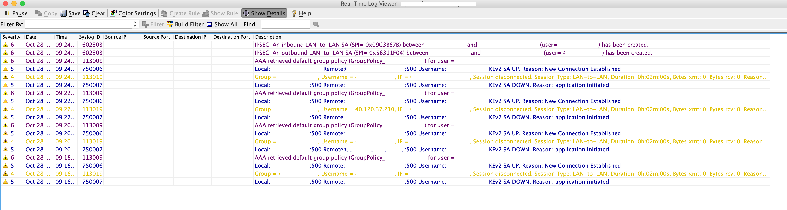
