ASAv
====

AWS
---

Important Caveats
^^^^^^^^^^^^^^^^^

* Launching through the AWS Marketplace does not allow you to input the *Day 0 Configuration*, which means you will not be able to contact the device. Ensure that you create the ASAv via *EC2 > Launch Instance*.
* Also note that if you want to test the difference between BYOL and standard, whichever you subscribe to last will change the subscription of all ASAvs.
* The initial interface that gets created with the ASAv cannot be deleted or dissociated and is exclusively used for the management interface. The second interface you associate is g0/0, the third interface is g0/1, etc. If you remove g0/0, g0/1 will become g0/1.
* You need to reboot the ASAv after modifying the interfaces.
* You need to license the ASAv before the ASA allows AnyConnect configuration.
* ASAv AnyConnect can only be done via Smart Licensing. The ASAv License can be done via the BYOL or Standard AWS license models.

Useful Links
^^^^^^^^^^^^

* https://www.cisco.com/c/en/us/td/docs/security/asa/asa95/asav/quick-start/asav-quick/asav-aws.html
* https://aws.amazon.com/marketplace/pp/B00WRGASUC?qid=1593698881714&sr=0-2&ref_=srh_res_product_title

Launch Steps
^^^^^^^^^^^^

The process to launch a BYOL ASAv as opposed to the Standard AWS ASAv is the same:

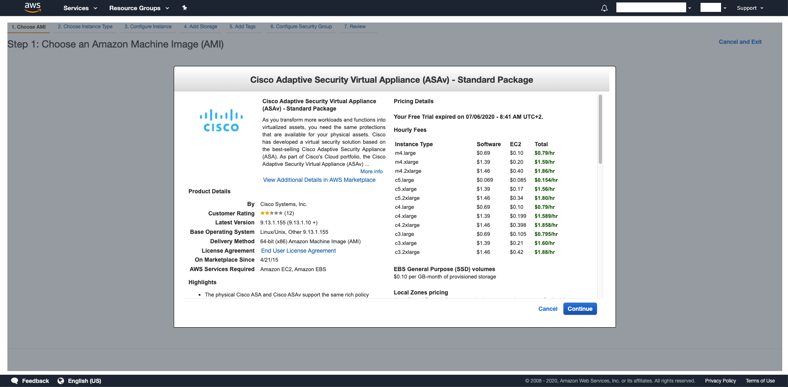

c4.large is the recommended size (to start with):

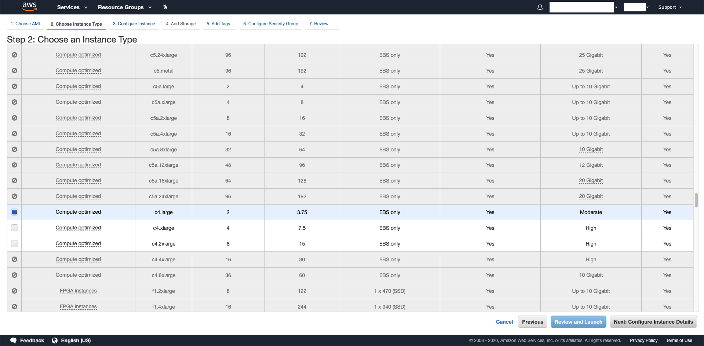

Configure your network settings:

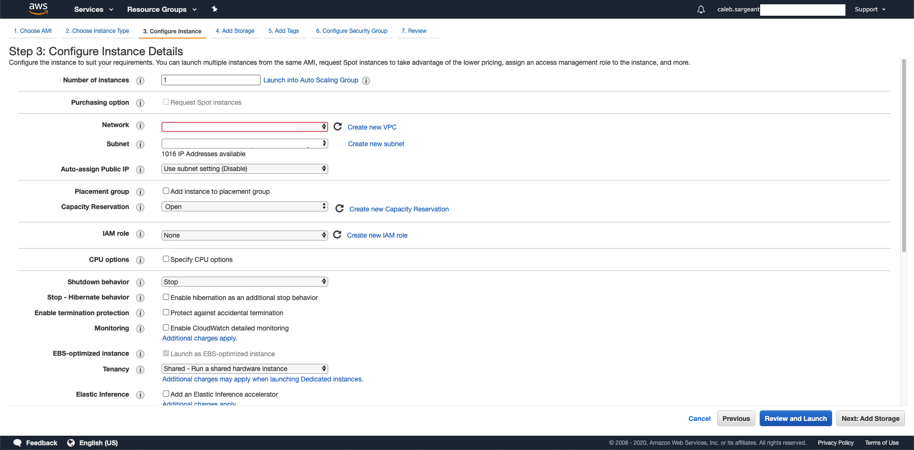

Configure ASAv interfaces and set day 0 configuration.

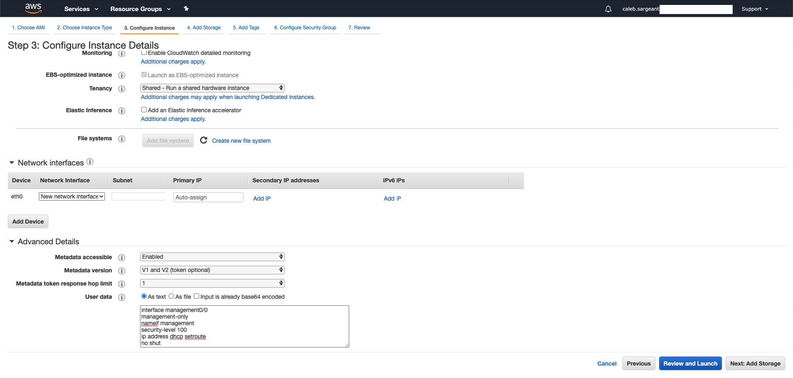

Skip Storage and Tags, select (or create) your Security Group for ASAv:

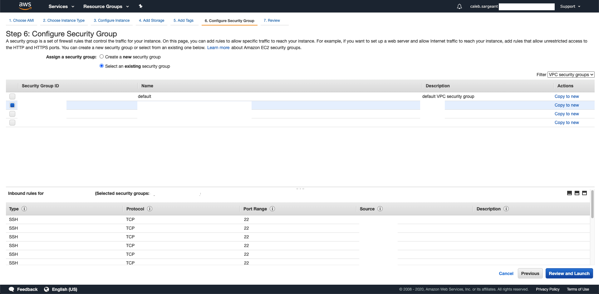

Select or create the Key Pair for your ASAv:

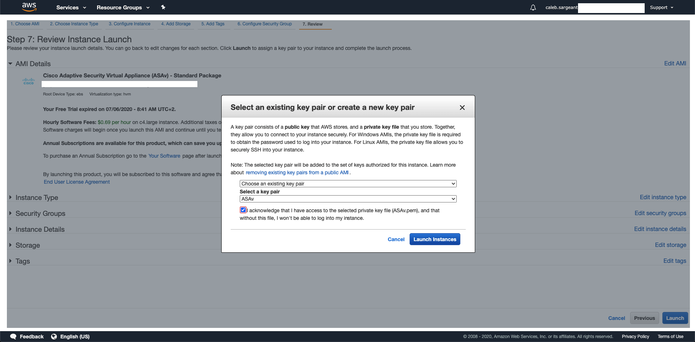

Then, create 2 network interfaces, one in your public subnet (outside), to attach elastic IP, and the other in your private subnet (inside) via *EC2 > Network Interfaces > Create Network Interface*:

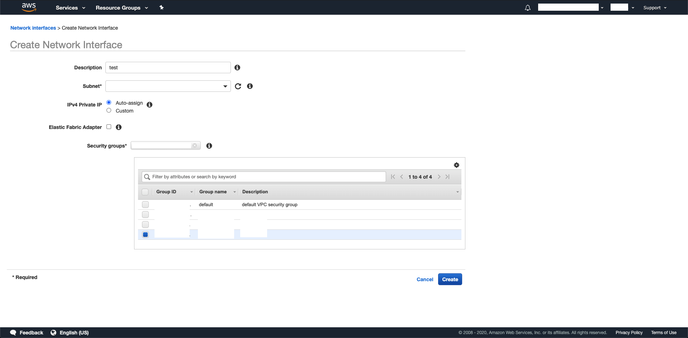

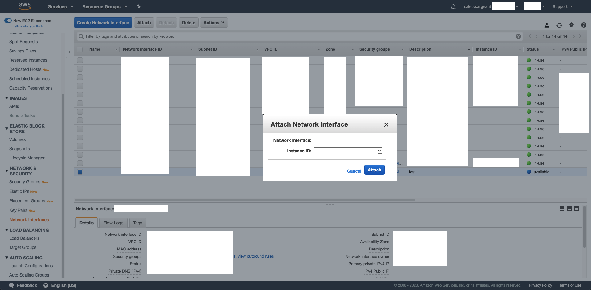

Allocate an Elastic IP:

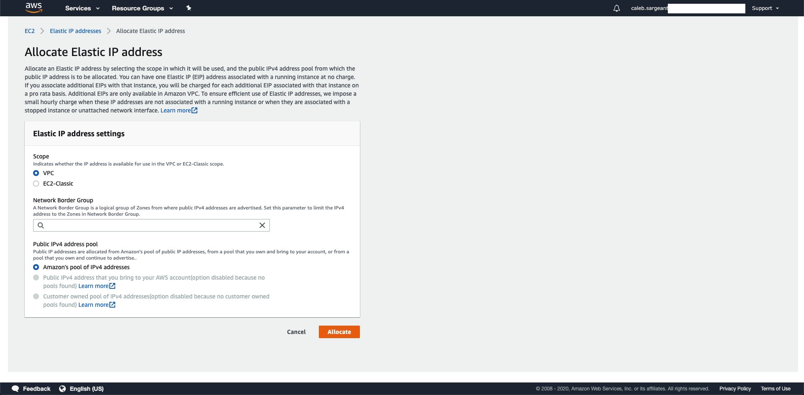

Associate the created Elastic IP to your public (outside) interface:

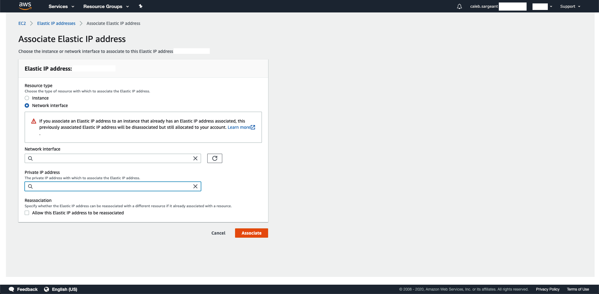

Day 0 Configuration
^^^^^^^^^^^^^^^^^^^

In the below day 0 configuration, we will be disabling the management interface to have only 2 interfaces (outside, inside). Management will be done via outside, as per standard with physical ASAs in offices.

.. code-block:: none

  interface management0/0
  management-only
  nameif management
  security-level 100
  no ip address
  no shut
  !
  interface g0/0
  nameif outside
  security-level 0
  ip address dhcp setroute
  no shut
  !
  interface g0/1
  nameif inside
  security-level 100
  ip address dhcp setroute
  no shut
  !
  same-security-traffic permit inter-interface
  same-security-traffic permit intra-interface
  !
  crypto key generate rsa modulus 2048
  ssh 0 0 management
  ssh 0 0 outside
  http 0 0 management
  http 0 0 outside
  ssh timeout 30
  ssh scopy enable
  http server enable 443
  username admin SUPERSECUREPASSWORD privilege 15
  username admin attributes
  service-type admin
  dns domain-lookup management
  DNS server-group DefaultDNS
  name-server 1.1.1.1
  ntp server 169.254.169.123

Using S3 as Software Storage Location
^^^^^^^^^^^^^^^^^^^^^^^^^^^^^^^^^^^^^

* https://aws.amazon.com/premiumsupport/knowledge-center/s3-aws-ip-addresses-access/
* https://docs.aws.amazon.com/AmazonS3/latest/dev/example-bucket-policies.html

Create an S3 Bucket with the default settings (permission settings to follow):

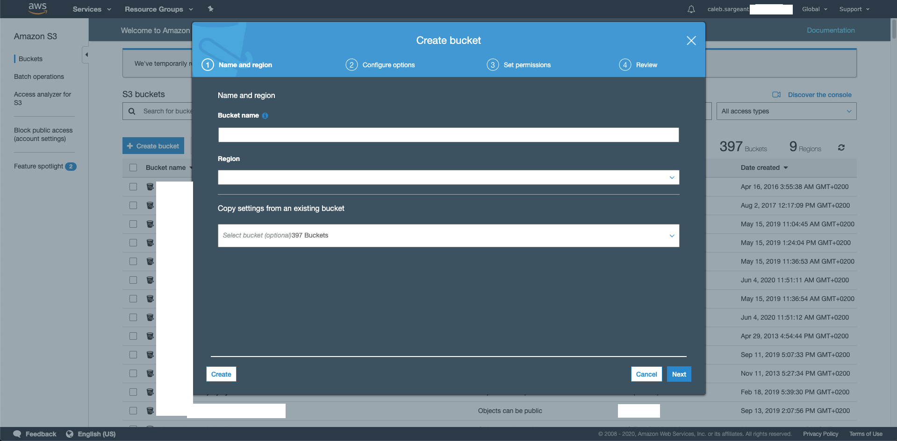

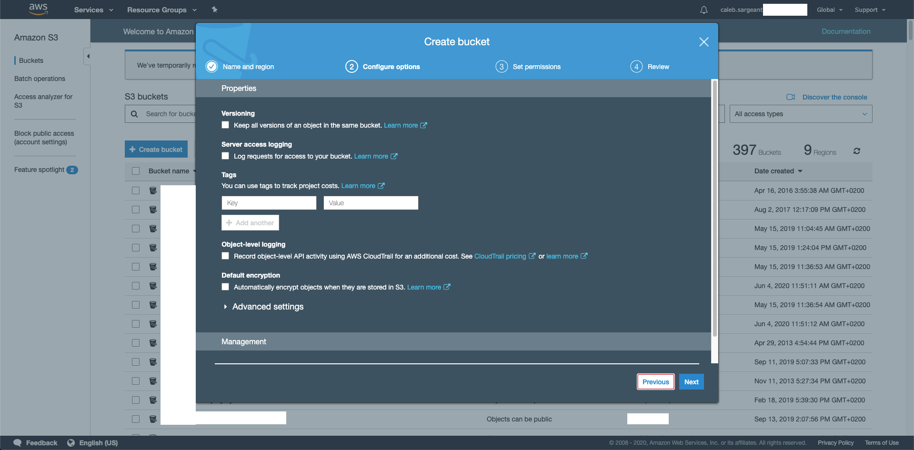

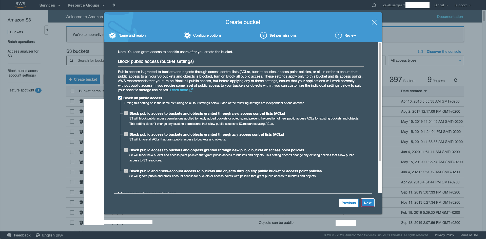

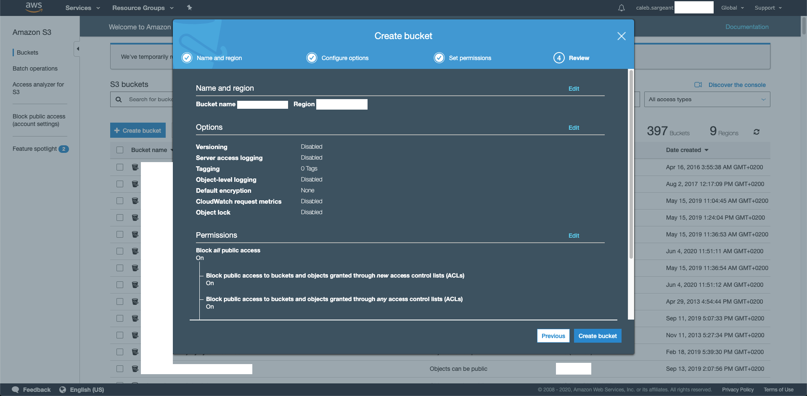

Modify the permission setting to allow a *Bucket Policy* (this could have been done in creating the bucket).

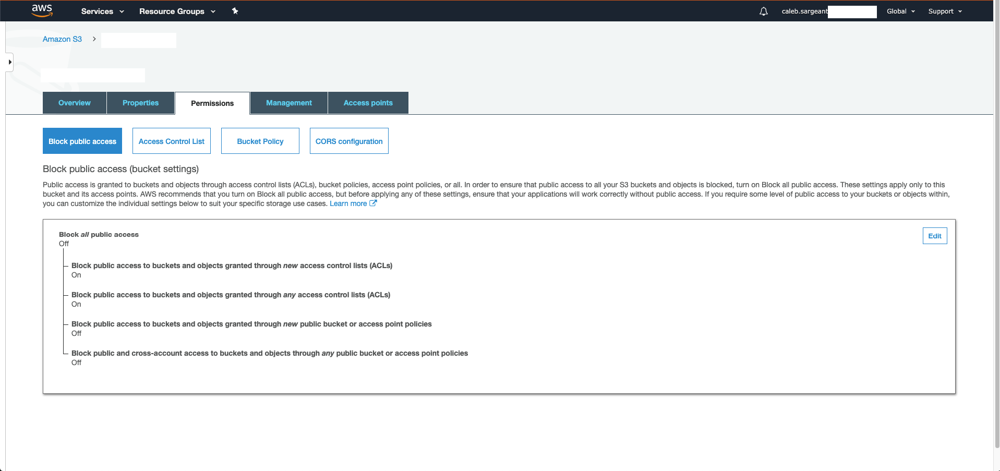

Create the Bucket Policy:

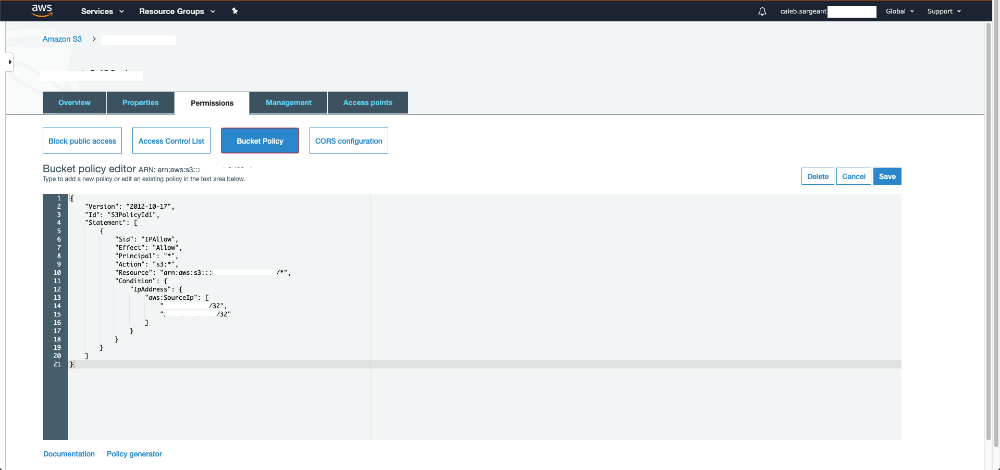

The below bucket policy allows only x.x.x.x/32 and y.y.y.y/32 access.

.. code-block:: json

  {
    "Version": "2012-10-17",
    "Id": "S3PolicyId1",
    "Statement": [
        {
            "Sid": "IPAllow",
            "Effect": "Allow",
            "Principal": "*",
            "Action": "s3:*",
            "Resource": "arn:aws:s3:::bucketname/*",
            "Condition": {
                "IpAddress": {
                    "aws:SourceIp": [
                        "x.x.x.x/32",
                        "y.y.y.y/32"
                    ]
                }
            }
        }
    ]
  }

You can now copy files directly from the S3 bucket onto the ASA:

.. code-block:: none

  asa# copy  https://bucketname.amazonaws.com/anyconnect-linux64-4.8.02042-webdeploy-k9.zip disk0:/anyconnect-linux64-4.8.02042-webdeploy-k9.zip

  Address or name of remote host [bucketname.amazonaws.com]?

  Source filename [anyconnect-linux64-4.8.02042-webdeploy-k9.zip]?

  Destination filename [anyconnect-linux64-4.8.02042-webdeploy-k9.zip]?

  Accessing https://bucketname.amazonaws.com/anyconnect-linux64-4.8.02042-webdeploy-k9.zip...!!!!!!!!!!!!!!!!!!!!!!!!!!!!!!!!!!!!!!!!
  Writing file disk0:/anyconnect-linux64-4.8.02042-webdeploy-k9.zip...
  !!!!!!!!!!!!!!!!!!!!!!!!!!!!!!!!!!!!!!!
  40004376 bytes copied in 2.90 secs (20002188 bytes/sec)
