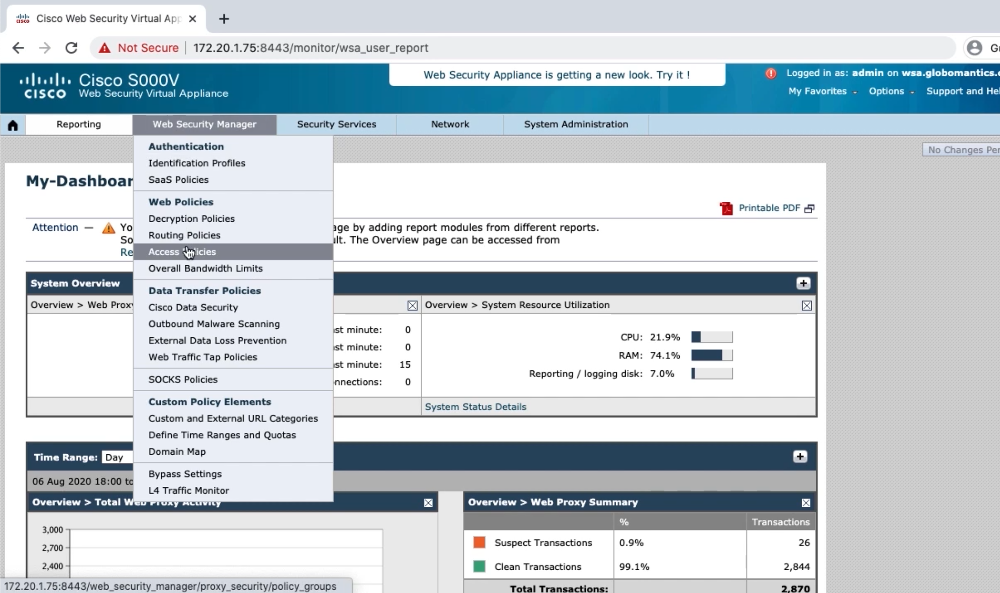
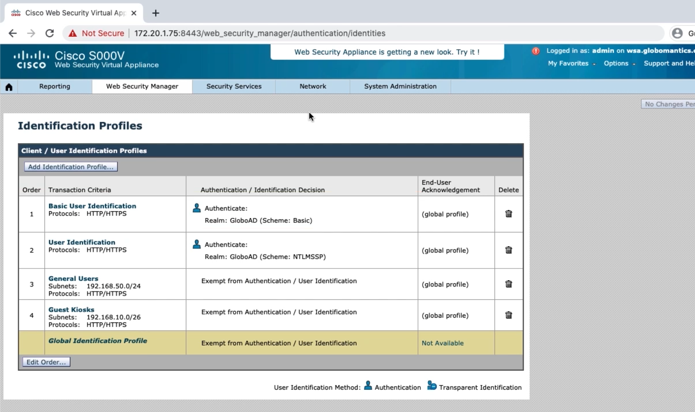
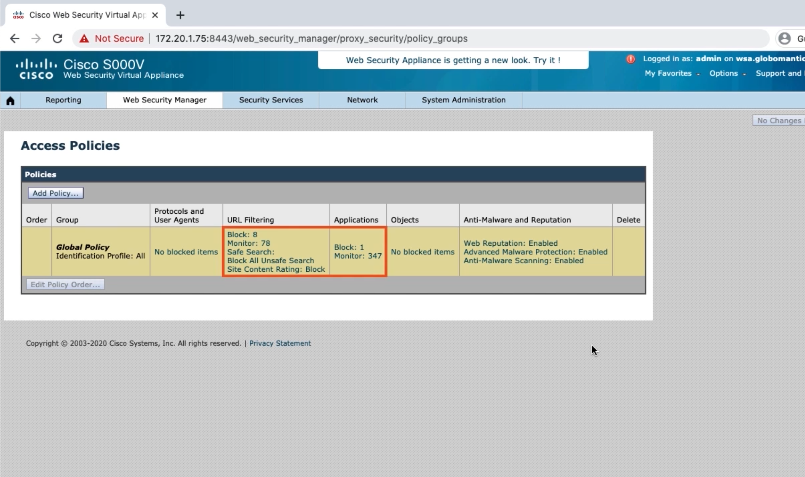
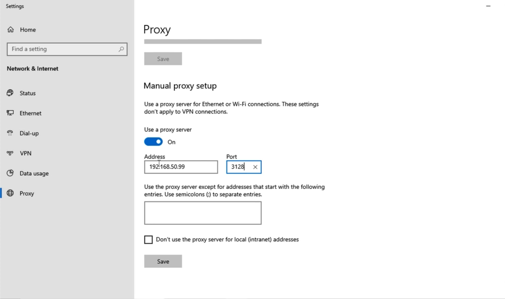
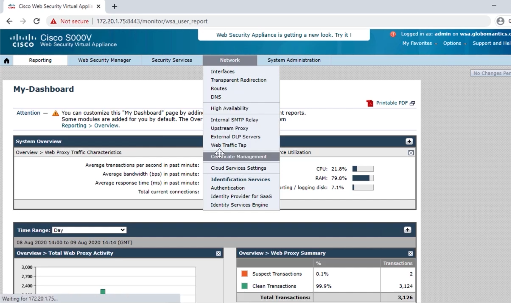
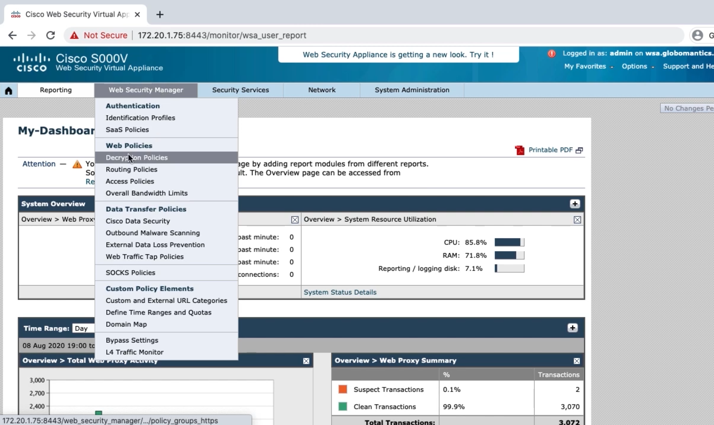

# Configuring the WSA as a Secure Internet Gateway

## Modifying the Global Access Policy

-   Restrict URL categories
-   Restrict Google Maps application
-   Look at file types we can block
-   Configure antimalware settings

## Creating an Exemption Access Policy

-   Look at new identification profiles
-   Create exemption policy for IT admins

## Testing the WSA's Access Policies

## Decryption Policy Overview

-   Client initiates TLS session with site
-   WSA initiates TLS session with site on client's behalf
-   Site sends signed certificate to present to client
-   WSA sends signed copy of site's certificate

### Configuring Certificates on the WSA

**Self-Signed Certificates**

-   Certificates will need to be added to every endpoint
-   Not scalable

**Add Certificate to PKI**

-   Endpoints already trust certificates signed by CA
-   More scalable

## Installing Certificates on the WSA

-   Install root certificate on WSA
-   Create CSR and obtain cert
-   Install certificate on WSA

## Configuring Decryption Policies and Verifying

