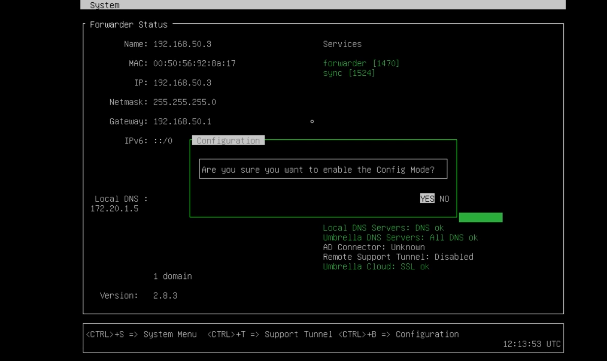
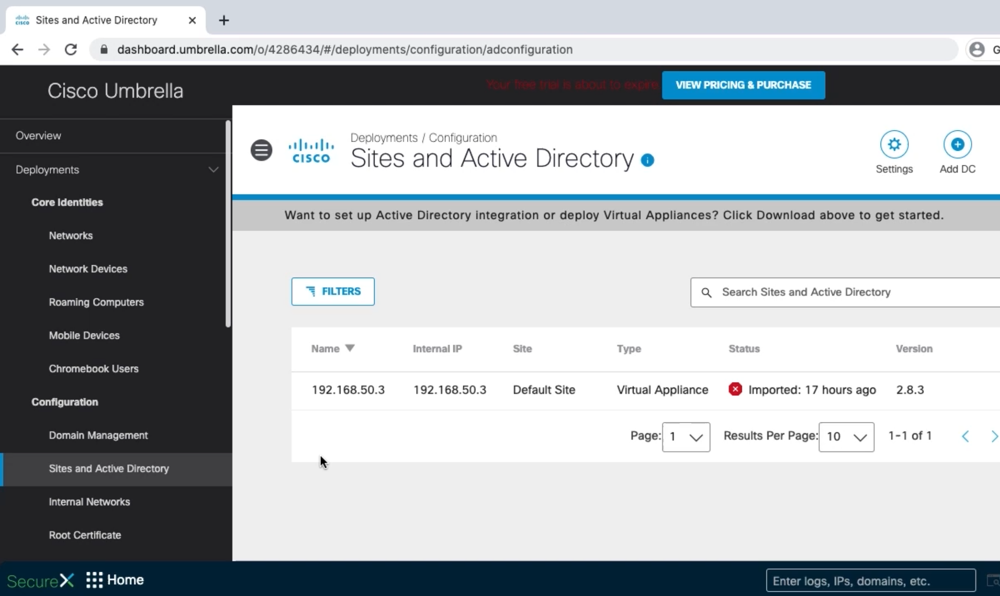
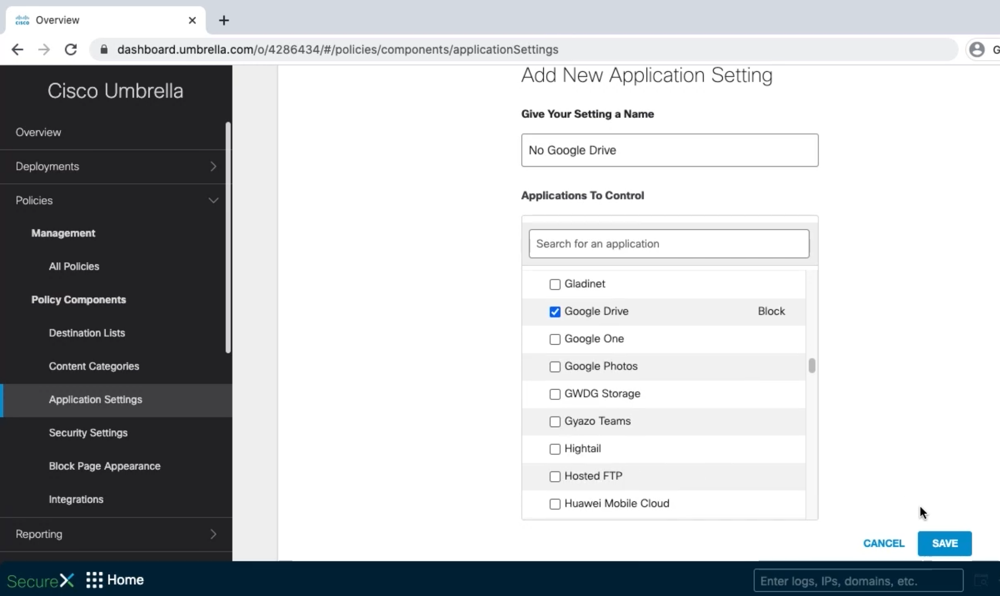
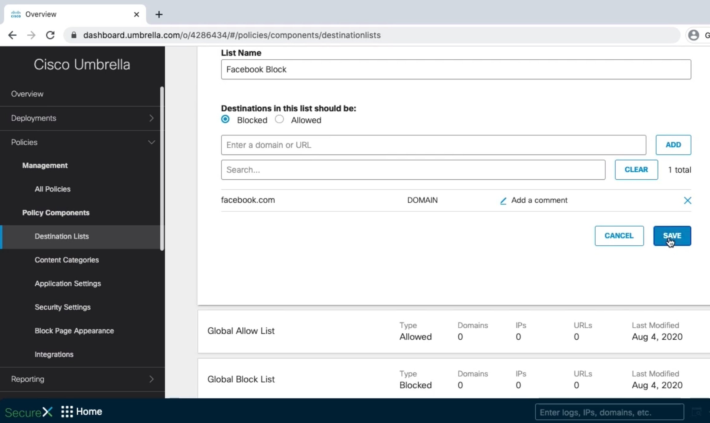
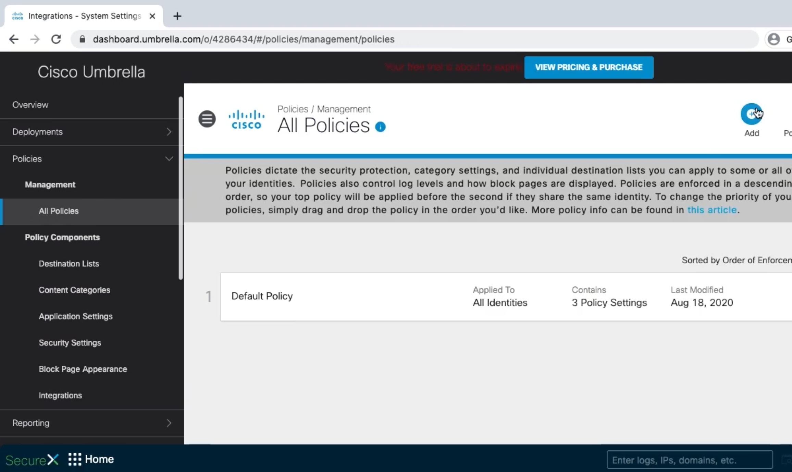
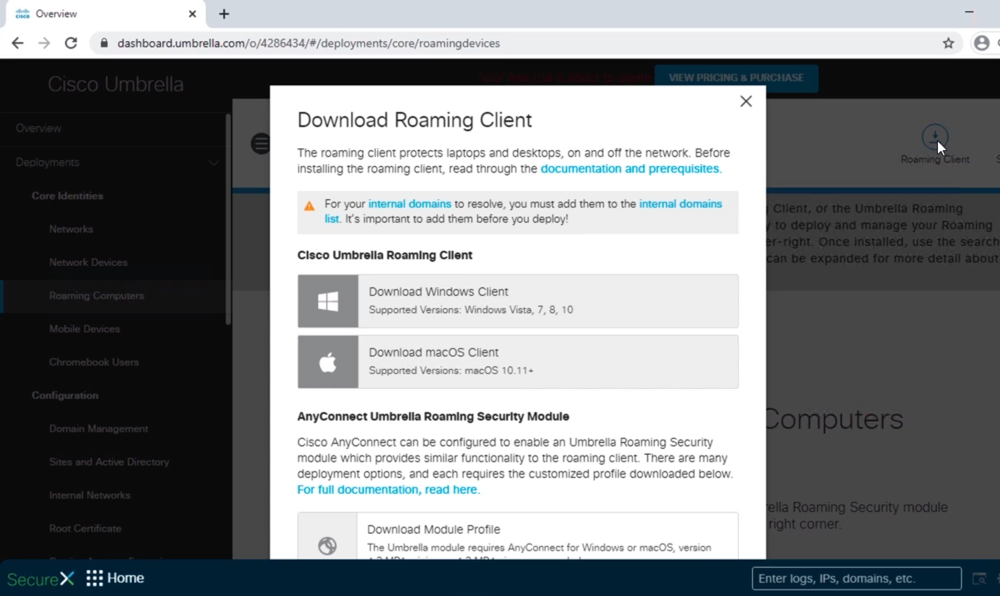
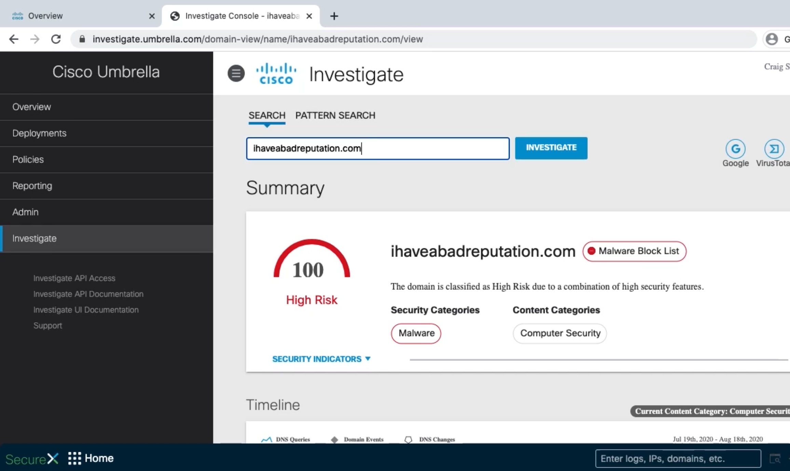

# Deploying Cisco Umbrella

## Configuring Networks to Use Cisco Umbrella

-   Umbrella virtual machine forwarder
-   DHCP
-   Add public IPs to Umbrella
-   Add internal networks to Umbrella



``` text
config va localdns 172.20.1.5
exit
```



## Creating Policies in Cisco Umbrella

-   Create policy components
-   Create a policy







## Cisco Umbrella Roaming Computer Profiles

-   Configure DNS and verify IP address
-   Download and install roaming client
-   Update proxy
-   Verify



## Cisco Umbrella Investigate


