# Configuring Cisco AnyConnect on the ASA

## Uploading the AnyConnect Client to the ASA

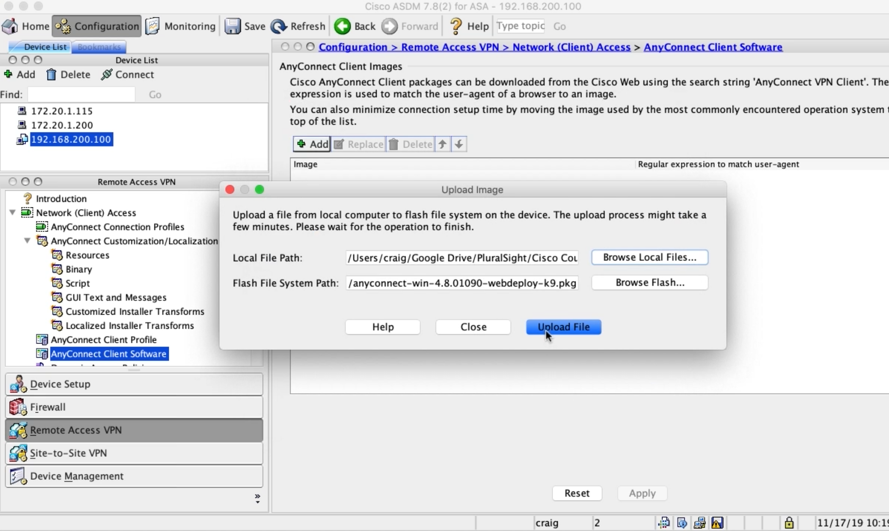

## Adding the ASA to the PKI Infrastructure

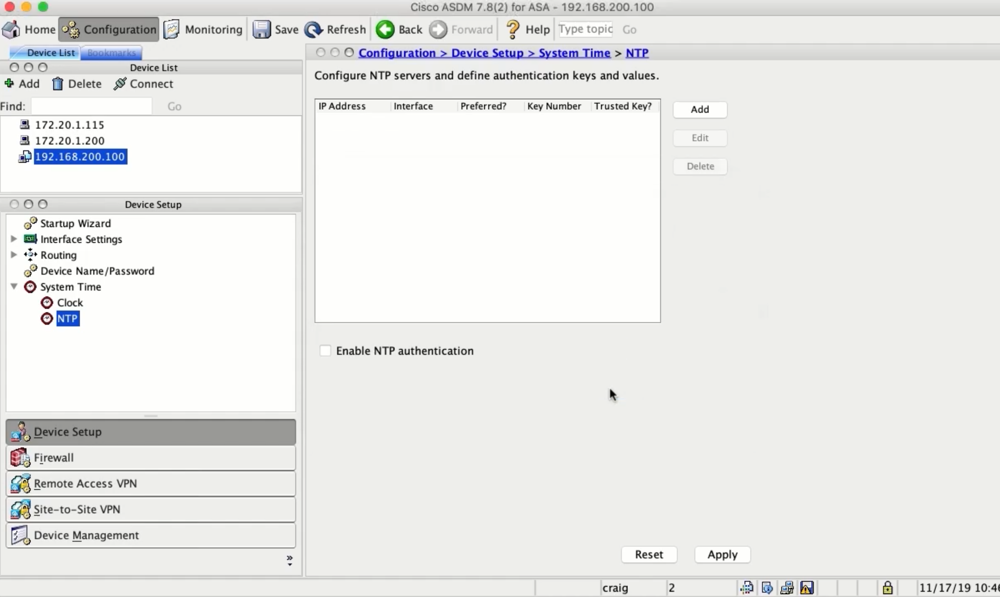

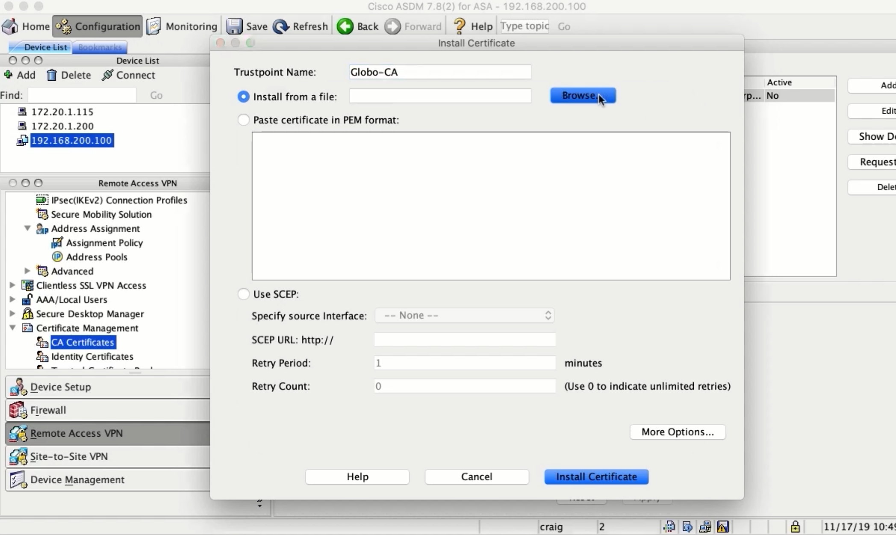

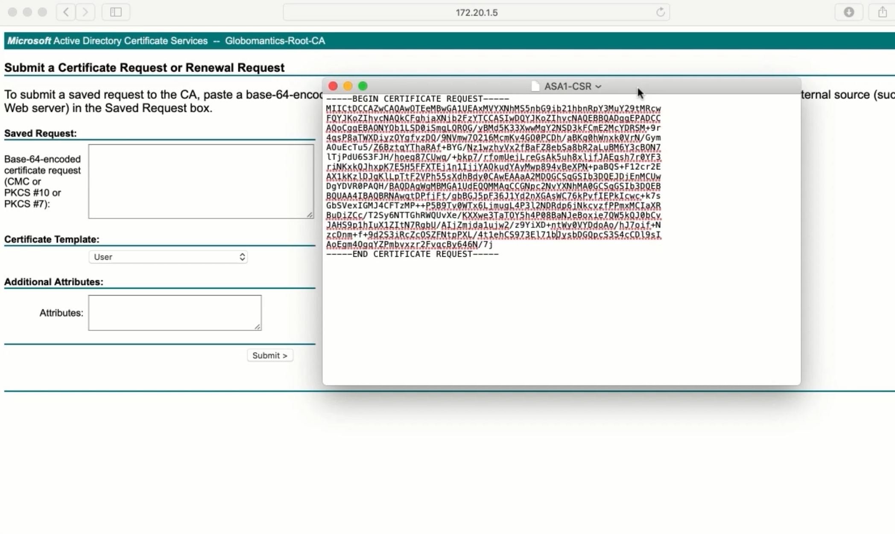

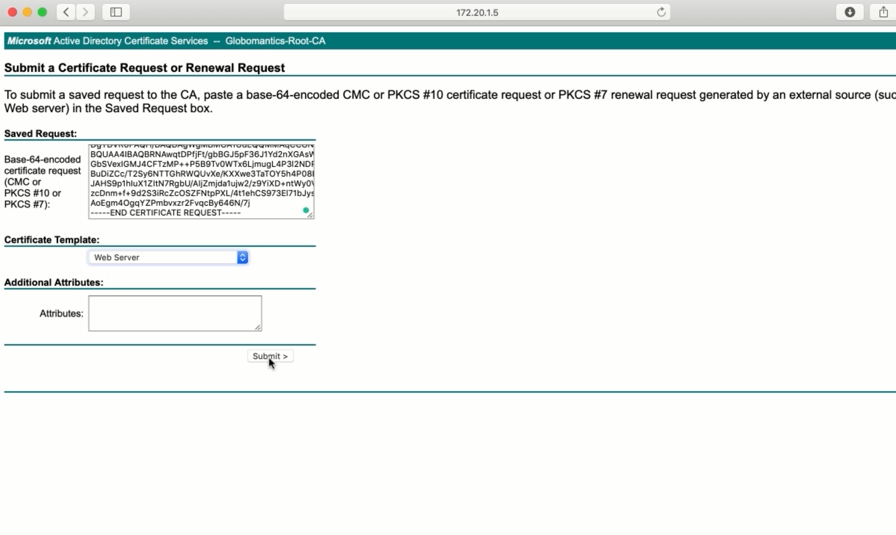

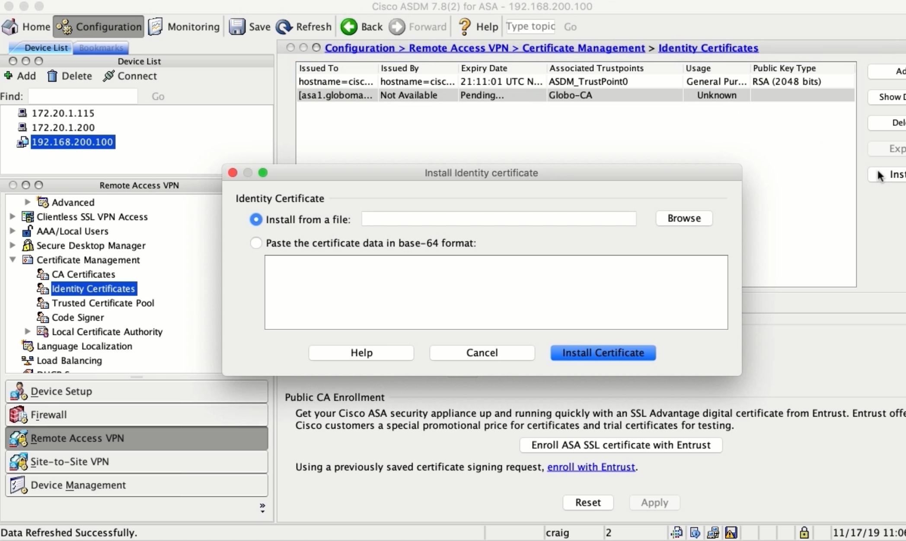

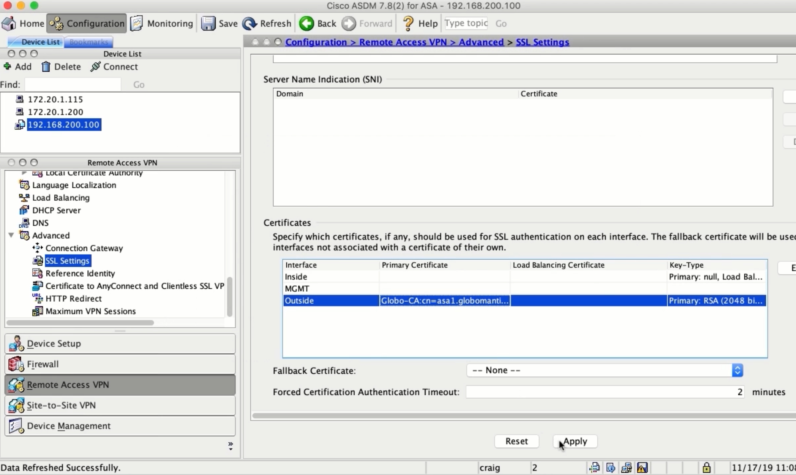

## Creating IP Pools and NoNAT Rules

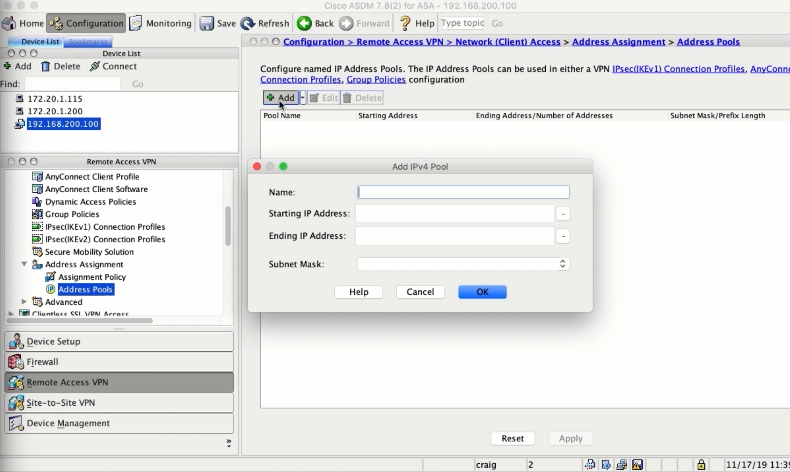

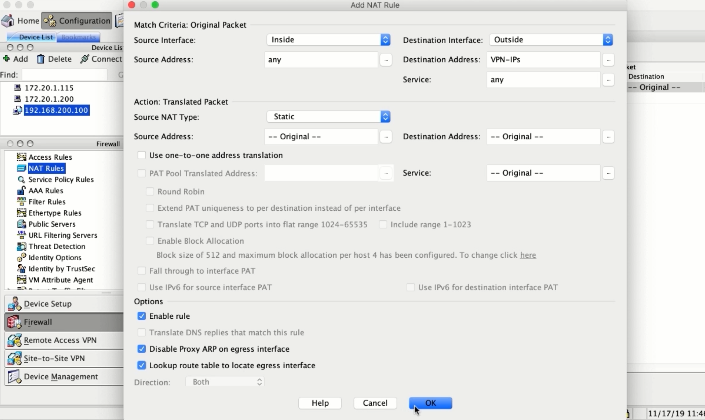

## Integrating the ASA with Active Directory

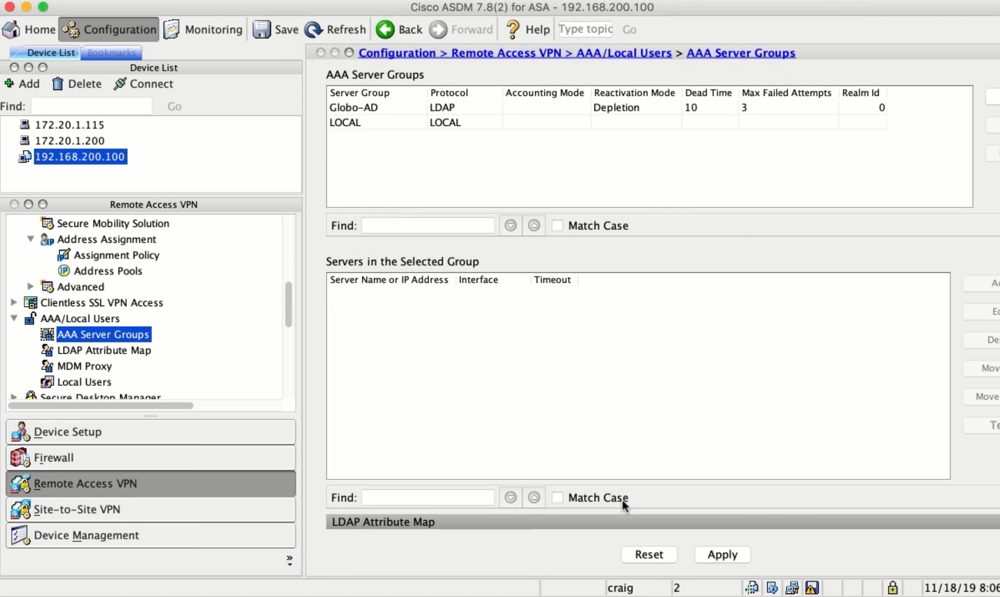

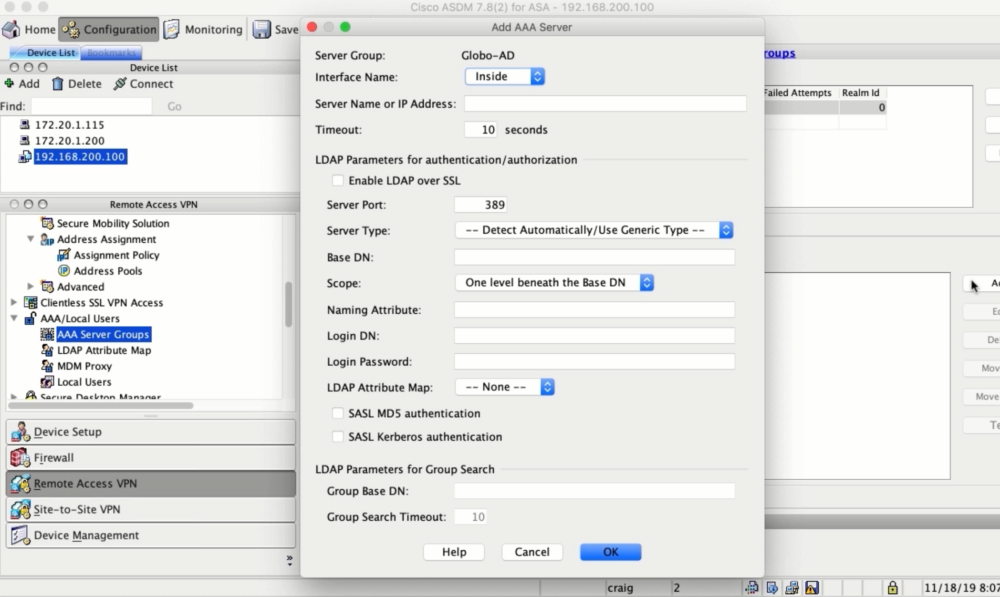

## Policy Hierarchy and Configuring Dynamic Access Policies

### The Ways Settings are Configured

-   VPN Connection Profile
-   User Profile Policy
-   Dynamic Access Policy
-   Group Policy

### Settings Priority

1.  Dynamic Access Policy
2.  User Profile Policy
3.  User Profile Specified Group Policy
4.  Conn. Profile Specified Group Policy
5.  Default Group Policy

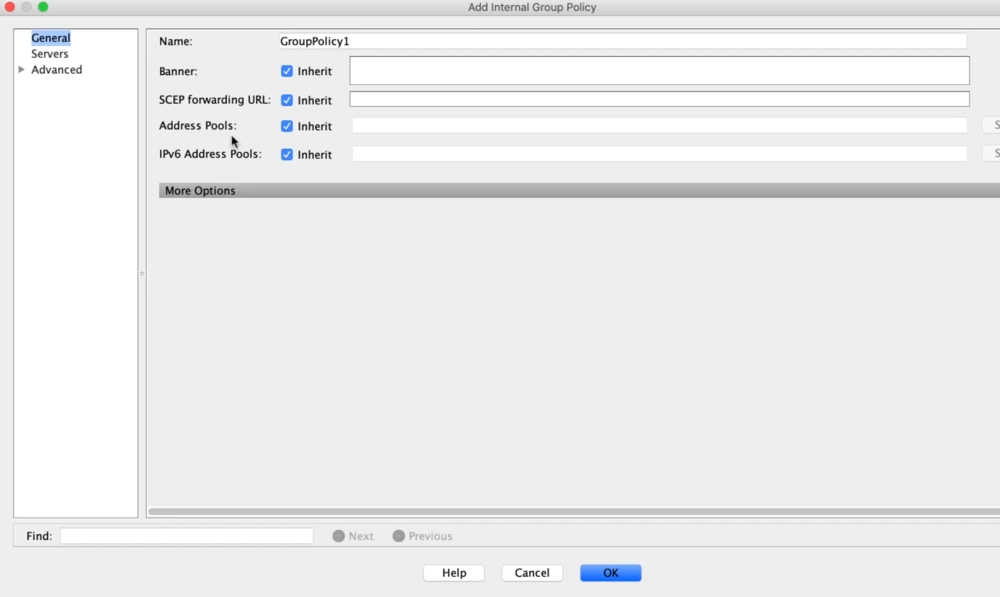

## Configuring Group Policies

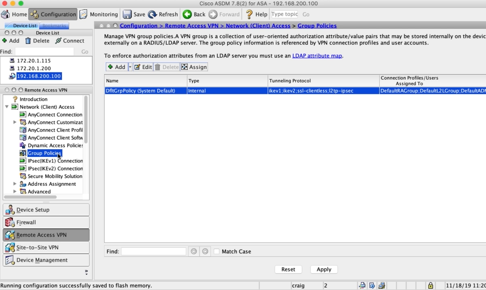

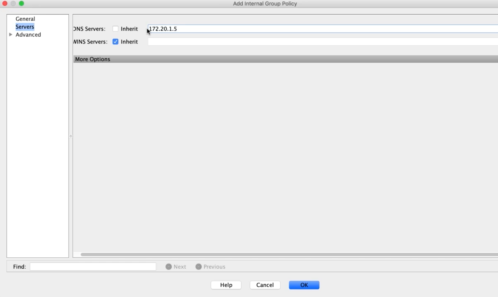

## Configuring Connection Profiles

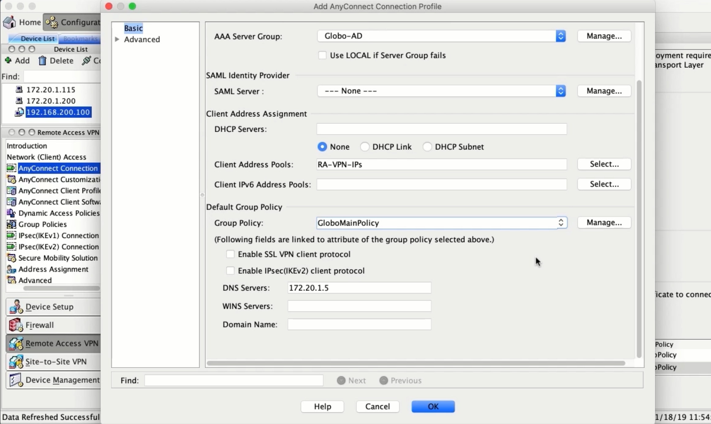
