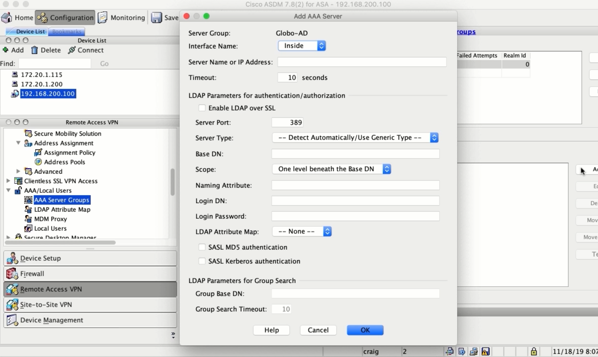
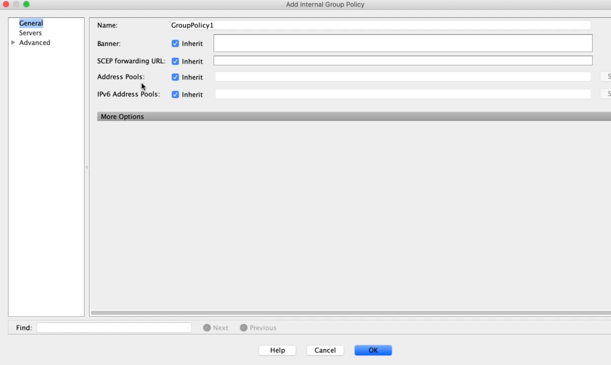

5. Configuring Cisco AnyConnect on the ASA
==========================================

Uploading the AnyConnect Client to the ASA
------------------------------------------

|image1|

Adding the ASA to the PKI Infrastructure
----------------------------------------

|image2|

|image3|

|image4|

|image5|

|image6|

|image7|

Creating IP Pools and NoNAT Rules
---------------------------------

|image8|

|image9|

Integrating the ASA with Active Directory
-----------------------------------------

|image10|

|image11|

Policy Hierarchy and Configuring Dynamic Access Policies
--------------------------------------------------------

The Ways Settings are Configured
~~~~~~~~~~~~~~~~~~~~~~~~~~~~~~~~

-  VPN Connection Profile
-  User Profile Policy
-  Dynamic Access Policy
-  Group Policy

Settings Priority
~~~~~~~~~~~~~~~~~

1. Dynamic Access Policy
2. User Profile Policy
3. User Profile Specified Group Policy
4. Conn. Profile Specified Group Policy
5. Default Group Policy

|image12|

Configuring Group Policies
--------------------------

|image13|

|image14|

Configuring Connection Profiles
-------------------------------

|image15|

.. |image1| image:: _images/configuring-cisco-anyconnect-on-the-asa-1.png
.. |image2| image:: _images/configuring-cisco-anyconnect-on-the-asa-2.png
.. |image3| image:: _images/configuring-cisco-anyconnect-on-the-asa-3.png
.. |image4| image:: _images/configuring-cisco-anyconnect-on-the-asa-4.png
.. |image5| image:: _images/configuring-cisco-anyconnect-on-the-asa-5.png
.. |image6| image:: _images/configuring-cisco-anyconnect-on-the-asa-6.png
.. |image7| image:: _images/configuring-cisco-anyconnect-on-the-asa-7.png
.. |image8| image:: _images/configuring-cisco-anyconnect-on-the-asa-8.png
.. |image9| image:: _images/configuring-cisco-anyconnect-on-the-asa-9.png

.. |image14| image:: _images/configuring-cisco-anyconnect-on-the-asa-14.png
.. |image15| image:: _images/configuring-cisco-anyconnect-on-the-asa-15.png
