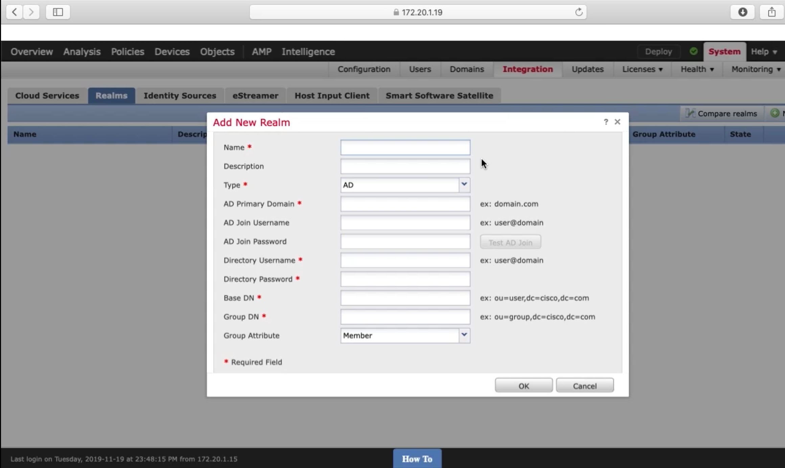
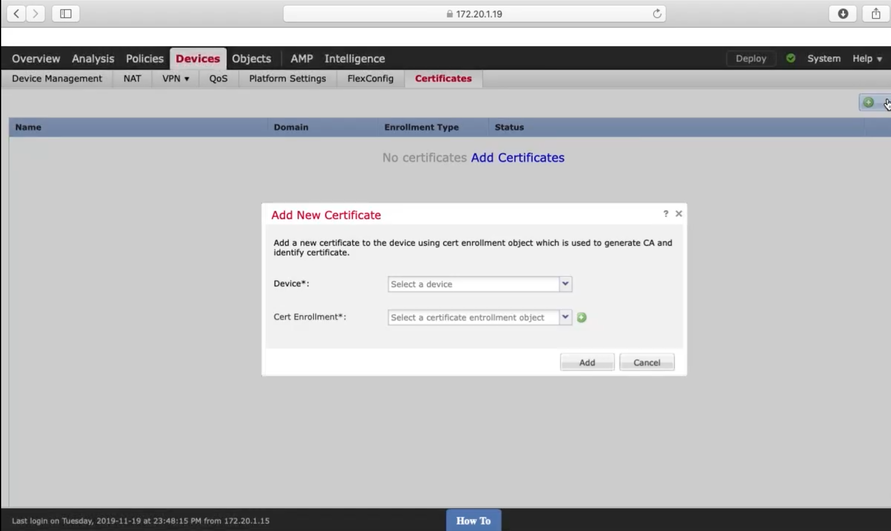
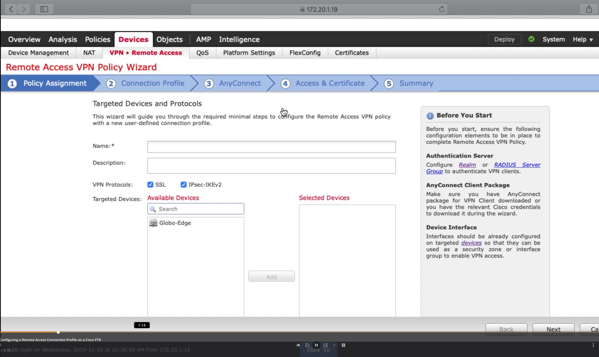
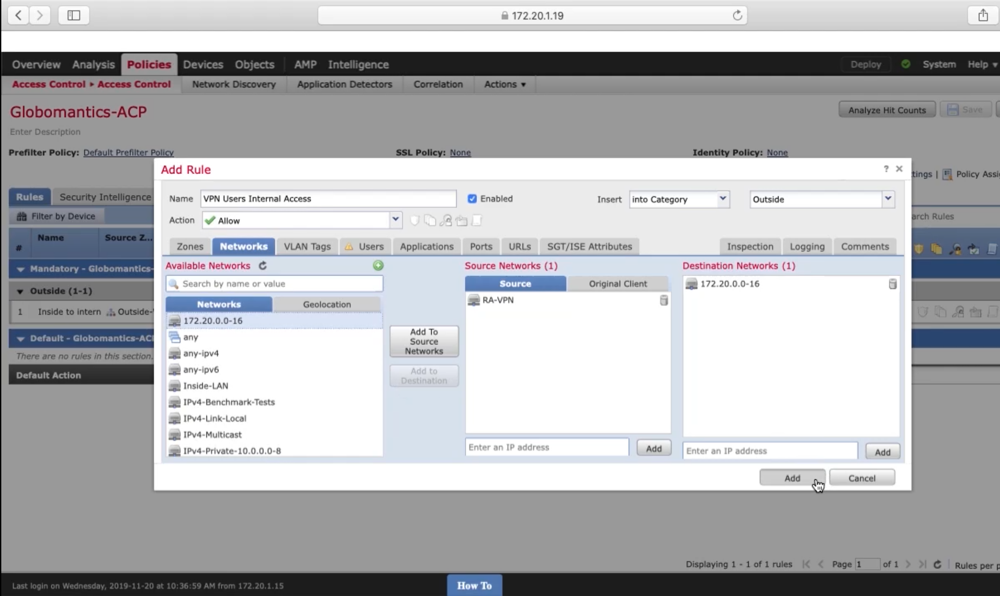

Configuring Cisco AnyConnect on the FTD
=======================================

Integrating Active Directory with the FTD
-----------------------------------------

|image1|

Installing an Identity Cert on the FTD
--------------------------------------

|image2|

Configuring a Remote Access Connection Profile on a Cisco FTD
-------------------------------------------------------------

|image3|

Configuring a NAT Exemption and ACL Rules for VPN User Traffic
--------------------------------------------------------------

|image4|

|image5|

.. |image4| image:: _images/configuring-cisco-anyconnect-on-the-ftd-4.png

