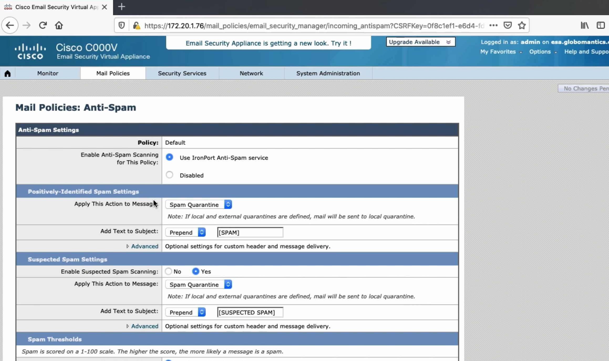
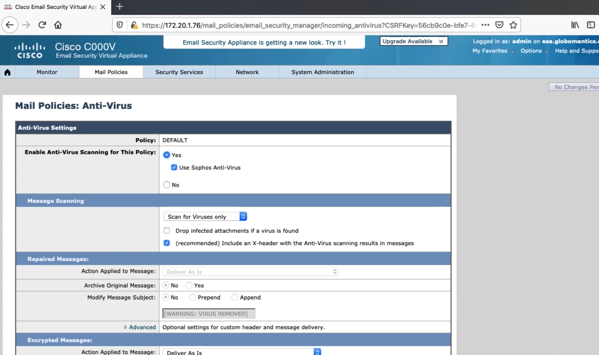
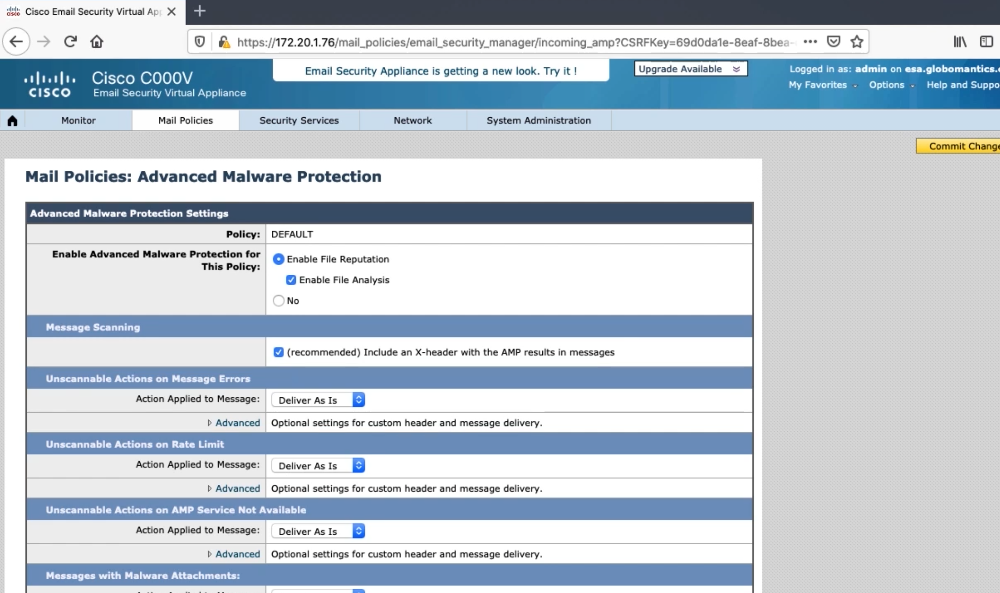
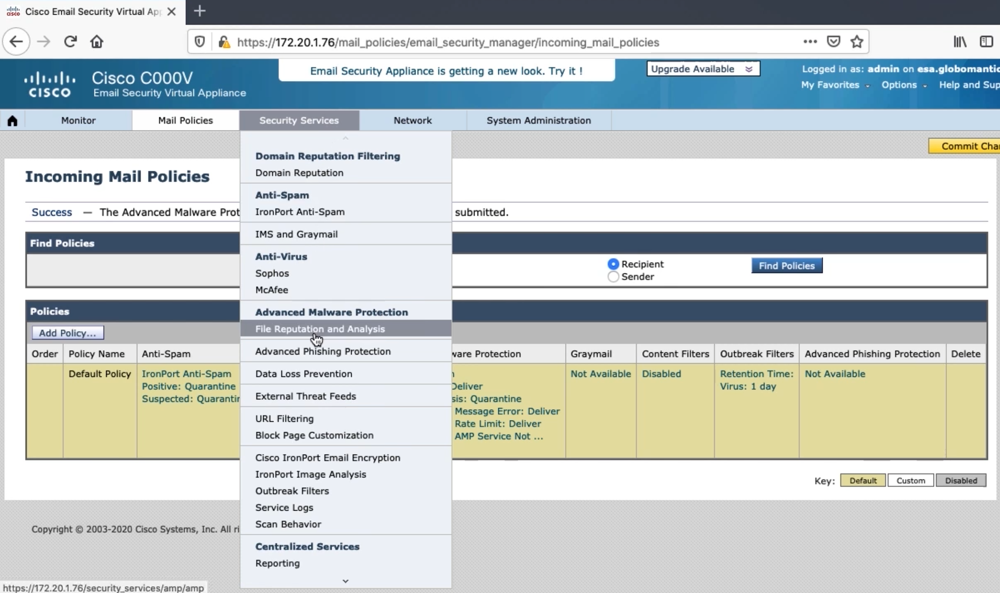
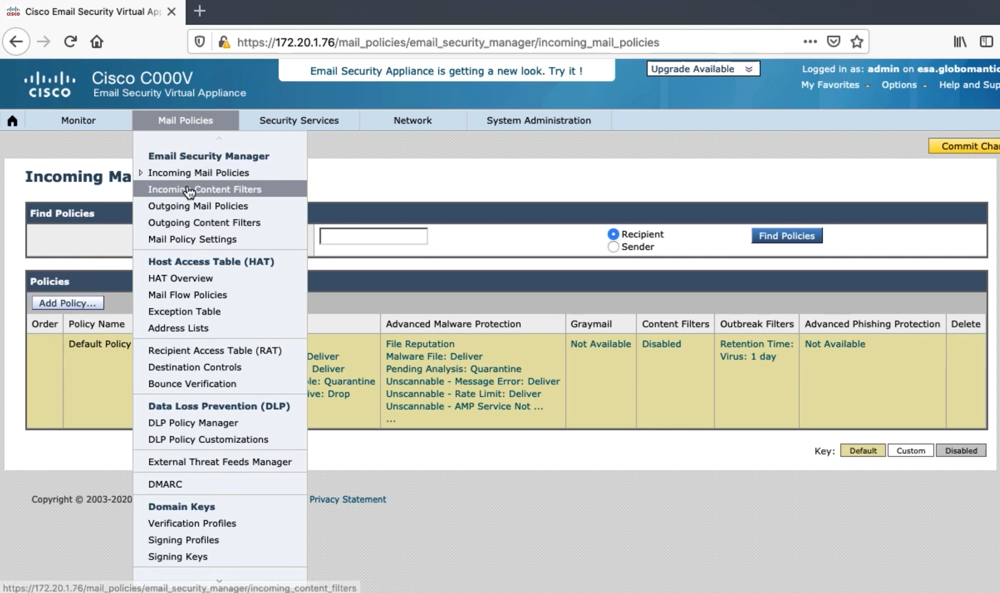
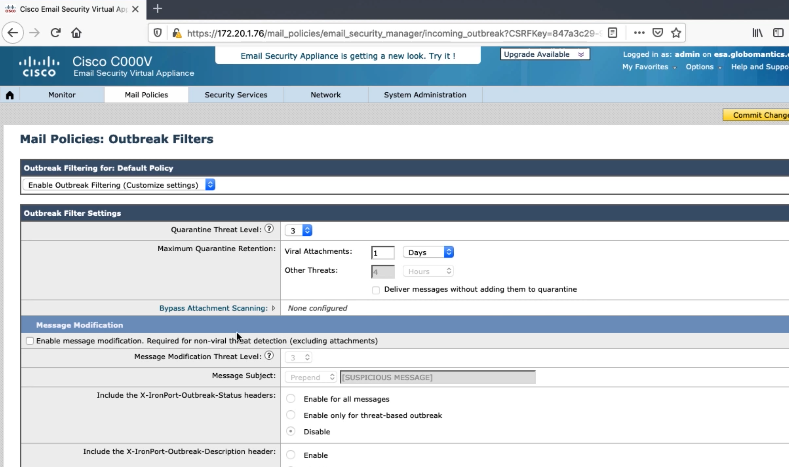
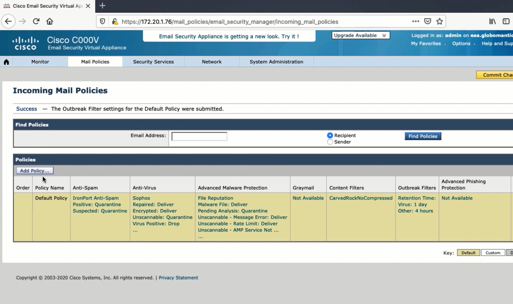

3. Configuring the Default Incoming Mail Policy
===============================================

Anti-Spam Policy
----------------

-  Most spam doesn’t make it past HAT
-  Legit email could be black listed

   -  Would need to create a separate policy

-  Two engines

   -  Scores between 1 and 100
   -  Positively identified spam, suspected spam, not spam

Cisco IronPort Anti-Spam
~~~~~~~~~~~~~~~~~~~~~~~~

-  Detects spam and other email attacks
-  100,000 attributes
-  99% catch rate, in 1-million false positive

Cisco Intelligent Multi-Scan
~~~~~~~~~~~~~~~~~~~~~~~~~~~~

-  Third party anti-spam tools scan the email
-  Cisco IronPort Anti-Spam then scans the email itself, and makes the
   final determination

|image1|

Graymail Filter
~~~~~~~~~~~~~~~

-  Graymail is mail from companies that users have interacted with in
   the past
-  Uniform Experience

   -  Users will have the same experience unsubscribing from all emails

-  Safer

   -  Some unsubscribe link sare actual phishing campaigns

-  Better Visibility

   -  Admins are able to see categories that graymail was classified as

Anti-Virus Policy
-----------------

|image2|

-  SenderBase filters out most viruses
-  Two systems, McAfee and Sophos

   -  Can be usec together

      -  Uses more resources

-  McAfee

   -  Definitions to find malware
   -  Can emulate a file in safe environment
   -  Repair files

-  Sophos

   -  Classifier to find malware
   -  Various engines for specific file types
   -  Can emulate, decompress, detect macros
   -  Repair files

Advanced Malware Protection Policy
----------------------------------

AMP will alert you after the fact if the file’s disposition changes so
you can take action

|image3|

|image4|

Content Filter Policy
---------------------

|image5|

You can choose to define who the content filter applies to in the filter
itself, or by creating multiple policies and only applying the filter
that applies.

Outbreak Control Filters
------------------------

-  Outbreaks spread new attacks quickly

   -  Viral files, phishing attacks, or malware distribution

-  Cisco Threat Operations Center (TOC)

   -  Compare global trends to baselines

-  ESA’s default is to stop any file that is rated as a 3 or higher.

Outbreak Control Policy
~~~~~~~~~~~~~~~~~~~~~~~

-  AMP detects threats in a different way

   -  Could wait a long time for verdict

-  Outbreak looks at global picture
-  Non-viral threats

   -  TOC analyzes messages and URLs

|image6|

Creating an Additional Policy
-----------------------------

|image7|

