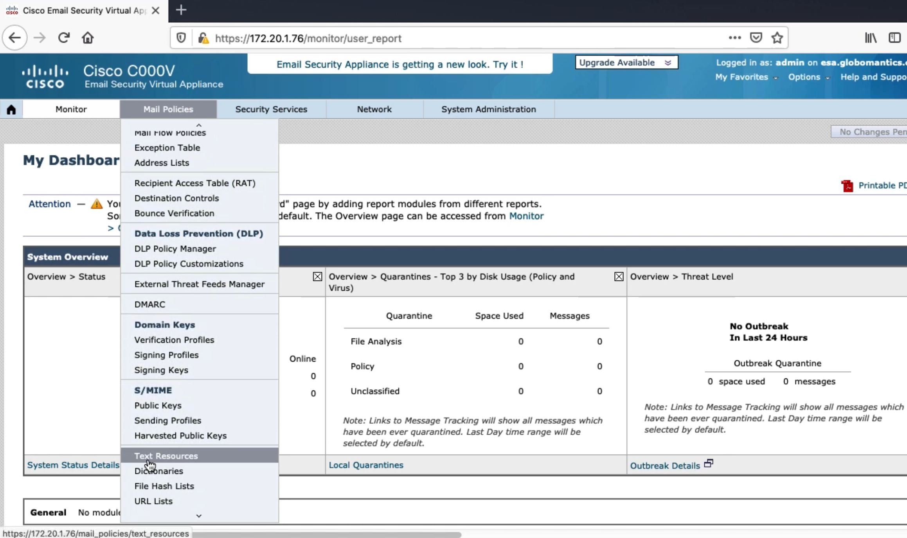
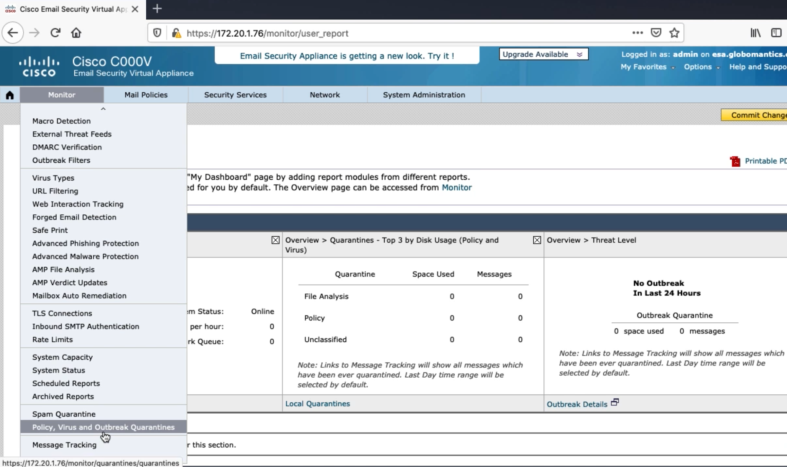
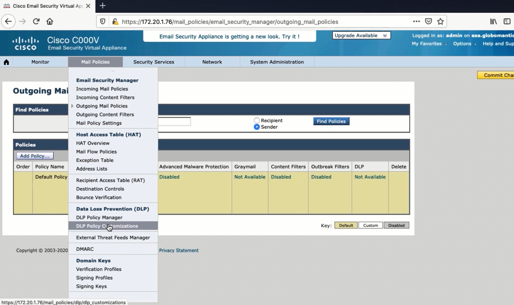
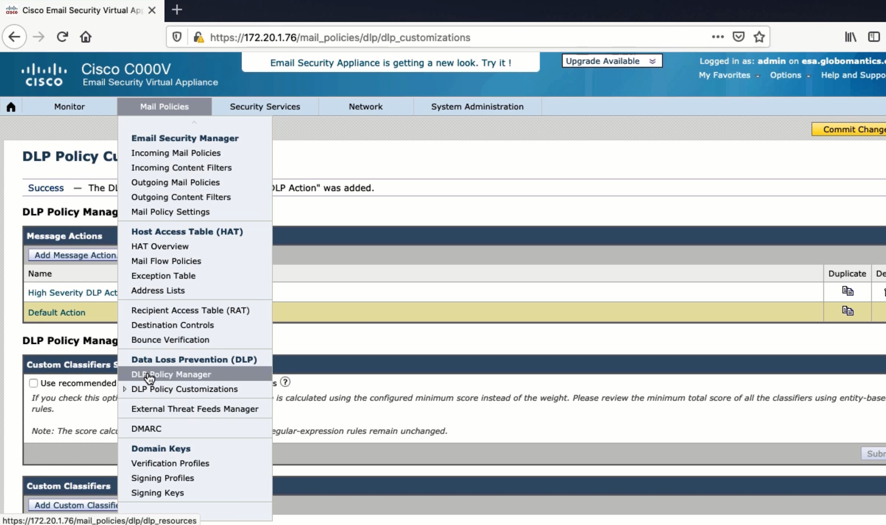
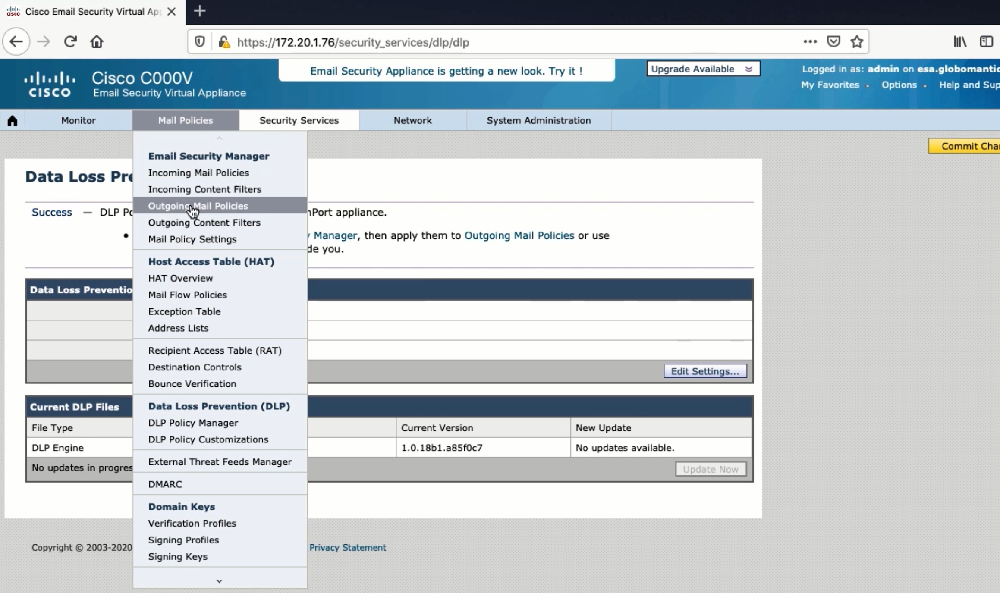
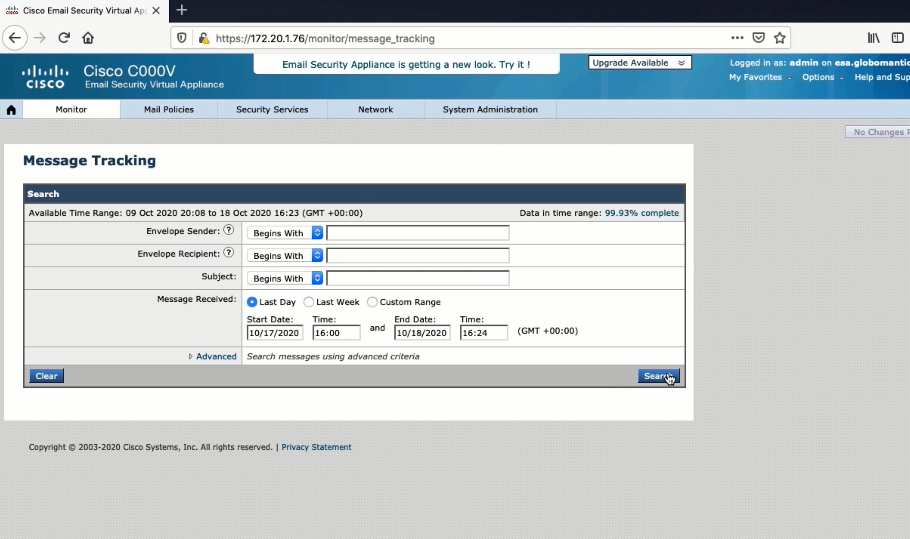
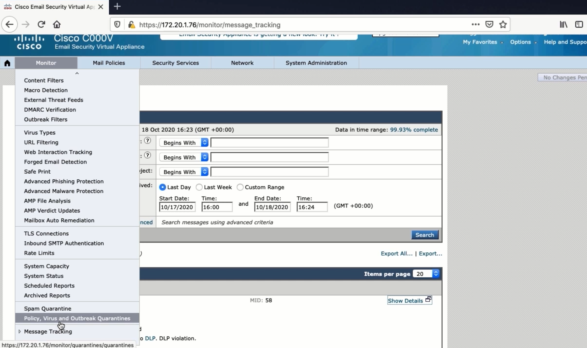

4. Configuring the Default Outgoing Mail Policy and Verifying
=============================================================

Text Resources
--------------

|image1|

Quarantine
----------

|image2|

Data Loss Prevention
--------------------

-  Unauthorized sensitive data doesn’t leave the network

   -  IP, personal info, financial statements
   -  Both malicious and unintentional

-  Scans outbound emails

   -  Pre-built regular expressions and keywords
   -  Looks at contents of email

      -  Supporting info and proximity

-  Scores between and 100

   -  Severity level

      -  Action

|image3|

|image4|

|image5|

|image6|

Setting up an Email Server for Testing
--------------------------------------

-  Microsoft Server
-  MailEnable
-  AD Users and Computers, DNS, IIS

.. code:: text

   PS C:\Users\ Administrator> Import-Module ActiveDirectory
   PS c:\Users Administrator> $User = Get-ADUser kinda -Properties proxyaddresses
   PS C:\users Administrator> Suser-proxyAddresses-Add("SMTP:kinda@example.com")
   PS C:\Users\Administrator» Set-ADUser -instance $user
   PS c:\users \Administrator> Import-Module ActiveDirectory
   Ps c:\Users\Administrator> $User = Get-ADUser brian -Properties proxyAddresses
   PS c:\Users \Administrator» $User.proxyAddresses.Add("SMTP:brian@example.com")
   PS c:\Users\Administrator> Set-ADUser -instance $User
   PS c:\Users\Administrator>

Configuring an Email Client
---------------------------

Setting up mail client is self-explanatory

Make sure that DNS is flushed before your testing you start

.. code:: text

   esa.example.com> dnsflush

   Are you sure you want to clear out the DNS cache? [N]> Y

Verifying DLP and Incoming and Outgoing Mail Policies
-----------------------------------------------------

|image7|

|image8|

.. |image5| image:: _images/configuring-the-default-outgoing-mail-policy-and-verifying-5.png

