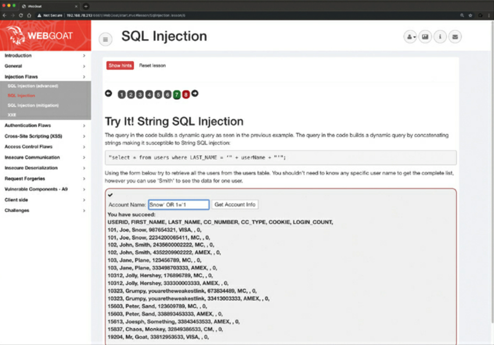

Common Software and Hardware Vulnerabilities
============================================

Check the National Vulnerability Database https://nvd.nist.gov.

Injection Vulnerabilities
-------------------------

* SQL injection vulnerabilities
* HTML injection vulnerability
* Command injection vulnerabilities

Code injection vulnerabilities are exploited by forcing an application or a system to process invalid data. An attacker takes advantage of this type of vulnerability to inject code into a vulnerable system and change the course of execution. Successful exploitation can lead to the disclosure of sensitive information, manipulation of data, denial-of-service conditions, etc. Examples:

* SQL injection
* HTML script injection
* Dynamic code evaluation
* Object injection
* Remote file inclusion
* Uncontrolled format string
* Shell injection

SQL Injection
-------------

Allow an attacker to view, insert, delete, or modify records in a database. In an SQL injection attack, the attacker inserts, or injects, partial or complete SQL queries via the web application. The attacker injects SQL commands into input fields in an application or a URL in order to execute predefined SQL commands. If an application does not sanitise user input, an attacker can supply crafted input in an attempt to make the original SQL statement execute further actions in the database. The attacker must craft a syntactically correct SQL statement or query. The attacker takes advantage of error messages and can reconstruct the logic of the original query to understand how to attack correctly. The attacker might need to reverse engineer the logic of the original query if the application hides the error details.

WebGoat being used to demonstrate effects of SQLi:

SQLi is divided into the following categories:

* In-band SQL injection: With this type of injection, the attacker obtains the data by using the same channel that is used to inject the SQL code. This is the most basic form of an SQL injection attack, where the data is dumped directly in a web application (or web page).
* Out-of-band SQL injection: With this type of injection, the attacker retrieves data using a different channel. For example, an email, a text, or an instant message could be sent to the attacker with the results of the query. Alternatively, the attacker might be able to send the compromised data to another system.
* Blind (or inferential) SQL injection: With this type of injection, the attacker does not make the application display or transfer any data; rather, the attacker is able to reconstruct the information by sending specific statements and discerning the behaviour of the application and database.

HTML Injection
--------------

An HTML injection is a vulnerability that occurs when an unauthorised user is able to control an input point and able to inject arbitrary HTML code into a web application. Successful exploitation could lead to disclosure of a user’s session cookies; an attacker might do this to impersonate a victim or to modify the web page or application content seen by the victims. HTML injection vulnerabilities can lead to cross-site scripting (XSS).

Command Injection
-----------------

A command injection is an attack in which an attacker tries to execute commands that he or she is not supposed to be able to execute on a system via a vulnerable application. Command injection attacks are possible when an application does not validate data supplied by the user (for example, data entered in web forms, cookies, HTTP headers, and other elements). The vulnerable system passes that data into a system shell. With command injection, an attacker tries to send operating system commands so that the application can execute them with the privileges of the vulnerable application. Command injection is not the same as code execution and code injection, which involve exploiting a buffer overflow or similar vulnerability.

Authentication-based Vulnerabilities
------------------------------------

Common ways authentication-based vulnerabilities are taken advantage of:

* Credential brute forcing
* Session hijacking
* Redirecting
* Exploit default credentials
* Exploit weak credentials
* Exploiting Kerberos vulnerabilities

Credential Brute Force Attacks and Password Cracking
^^^^^^^^^^^^^^^^^^^^^^^^^^^^^^^^^^^^^^^^^^^^^^^^^^^^

The attacker attempts to log in to an application or a system by trying different usernames and passwords. The 2 major categories:

* Online brute-force attacks: In this type of attack, the attacker actively tries to log in to the application directly by using many different combinations of credentials. Online brute-force attacks are easy to detect because you can easily inspect for large numbers of attempts by an attacker.
* Offline brute-force attacks: In this type of attack, the attacker can gain access to encrypted data or hashed passwords. These attacks are more difficult to prevent and detect than online attacks. However, offline attacks require significantly more computation effort and resources from the attacker.

Examples of exploitation:

* Password strength: The strength of user and application credentials has a direct effect on the success of brute-force attacks. Weak credentials are one of the major causes of credential compromise. Use complex passwords and multi-factor authentication (MFA). The use of MFA significantly reduces the probability of success for these types of attacks. An attacker may feed to an attacking system a word list containing thousands of words in order to crack passwords or associated credentials. Real-world passwords: http://wordlists.h4cker.org.
* Cryptographic Algorithms: Weak cryptographic algorithms (such as RC4, MD5, and DES) allow attackers to easily crack passwords. Best page showing which algorithms should be used: https://www.cisco.com/c/en/us/about/security-center/next-generation-cryptography.html.
* Rainbow Tables: Attackers can also use statistical analysis and rainbow tables against systems that improperly protect passwords with a one-way hashing function. A rainbow table is a precomputed table for reversing cryptographic hash functions and for cracking password hashes, can be used to accelerate the process of cracking password hashes http://project-rainbowcrack.com/table.htm.
* Security Protocols: poorly designed security protocols such as Wired Equivalent Privacy (WEP) introduce avenues of attack to compromise user and application credentials.

Session Hijacking
^^^^^^^^^^^^^^^^^

If web applications do not validate and filter out invalid session ID values, they can potentially be used to exploit other web vulnerabilities, such as SQL injection (if the session IDs are stored on a relational database) or persistent XSS (if the session IDs are stored and reflected back afterward by the web application).

* Predicting session tokens: This is why it is important to use non-predictable tokens.
* Session sniffing: This can occur through collecting packets of unencrypted web sessions.
* Man-in-the-middle attack: With this type of attack, the attacker sits in the path between the client and the web server.
* Man-in-the-browser attack: This attack is similar in approach to a man-in-the-middle attack; however, in this case, a browser (or an extension or a plugin) is compromised and used to intercept and manipulate web sessions between the user and the web server.

Default Credentials
^^^^^^^^^^^^^^^^^^^

Attackers can easily identify and access systems that use shared default passwords. It is extremely important to always change default manufacturer passwords and restrict network access to critical systems. A lot of manufacturers now require users to change the default passwords during initial setup, but some don’t http://www.defaultpassword.com, https://www.shodan.io.

Insecure Direct Object Reference Vulnerabilities
^^^^^^^^^^^^^^^^^^^^^^^^^^^^^^^^^^^^^^^^^^^^^^^^

When web applications allow direct access to objects based on user input. Successful exploitation could allow attackers to bypass authorisation and access resources that should be protected by the system (for example, database records and system files). This vulnerability occurs when an application does not sanitise user input and does not perform appropriate authorisation checks.

Examples:

* ``https://store.calebsargeant.com/buy?customerID=12345``
* ``https://store.calebsargeant.com/changepassword?user=john.doe``

Cross-site Scripting
--------------------

Attackers can use obfuscation techniques in XSS attacks by encoding tags or malicious portions of the script using Unicode so that the link or HTML content is disguised to the end user browsing site https://github.com/The-Art-of-Hacking/h4cker.

There are 3 types of Cross-site scripting (XSS) vulnerabilities:

* **Reflected (non-persistent) XSS:** when malicious code or scripts are injected by a vulnerable web application using any method that yields a response as part of a valid HTTP request. An example of a reflected XSS attack is a user being persuaded to follow a malicious link to a vulnerable server that injects (reflects) the malicious code back to the user’s browser. This causes the browser to execute the code or script. In this case, the vulnerable server is usually a known or trusted site.
* **Stored (persistent) XSS:** when the malicious code or script is permanently stored on a vulnerable or malicious server, using a database. These attacks are typically carried out on websites hosting blog posts (comment forms), web forums, and other permanent storage methods. An example of a stored XSS attack is a user requesting the stored information from the vulnerable or malicious server, which causes the injection of the requested malicious script into the victim’s browser. In this type of attack, the vulnerable server is usually a known or trusted site.
* **DOM-based XSS:** The Document Object Model (DOM) is a cross-platform and language-independent application programming interface that treats an HTML, XHTML, or XML document as a tree structure. DOM-based attacks are typically reflected XSS attacks that are triggered by sending a link with inputs that are reflected to the web browser. In DOM-based XSS attacks, the payload is never sent to the server. Instead, the payload is only processed by the web client (browser). In a DOM-based XSS attack, the attacker sends a malicious URL to the victim, and after the victim clicks on the link, it may load a malicious website or a site that has a vulnerable DOM route handler. After the vulnerable site is rendered by the browser, the payload executes the attack in the user’s context on that site. One of the effects of any type of XSS attack is that the victim typically does not realize that an attack has taken place. DOM-based applications use global variables to manage client-side information. Often developers create unsecured applications that put sensitive information in the DOM (for example, tokens, public profile URLs, private URLs for information access, cross-domain OAuth values, and even user credentials as variables). It is a best practice to avoid storing any sensitive information in the DOM when building web applications. Successful exploitation could result in installation or execution of malicious code, account compromise, session cookie hijacking, revelation or modification of local files, or site redirection.

The results of XSS attacks are the same regardless of the vector. Even though XSS vulnerabilities are flaws in a web application, the attack typically targets the end user. You typically find XSS vulnerabilities in the following:

* Search fields that echo a search string back to the user
* HTTP headers Input fields that echo user data
* Error messages that return user-supplied text
* Hidden fields that may include user input data
* Applications (or websites) that display user-supplied data

XSS tests from browser's address bar:

.. code-block:: none

  javascript:alert("Omar_s_XSS test");
  javascript:alert(document.cookie);

XSS test from a web form:

.. code-block:: none

  

Cross-site Request Forgery
--------------------------

Cross-site request forgery (CSRF or XSRF) attacks occur when unauthorized commands are transmitted from a user who is trusted by the application. CSRF attacks are different from XSS attacks because they exploit the trust that an application has in a user’s browser. CSRF vulnerabilities are also referred to as “one-click attacks” or “session riding.” CSRF attacks typically affect applications (or websites) that rely on a user’s identity. Attackers can trick the user’s browser into sending HTTP requests to a target website. An example of a CSRF attack is a user authenticated by the application by a cookie saved in the browser unwittingly sending an HTTP request to a site that trusts the user, subsequently triggering an unwanted action.

Cookie Manipulation Attacks
---------------------------

Are **stored** DOM-based attacks (or vulnerabilities). Cookie manipulation is possible when vulnerable applications store user input and then embed that input in a response within a part of the DOM. This input is later processed in an unsafe manner by a client-side script. An attacker can use a JavaScript string (or other scripts) to trigger the DOM-based vulnerability. Such scripts can write controllable data into the value of a cookie. An attacker can take advantage of stored DOM-based vulnerabilities to create a URL that sets an arbitrary value in a user’s cookie. The impact of a stored DOM-based vulnerability depends on the role that the cookie plays within the application.

Race Conditions
---------------

Occurs when a system or an application attempts to perform two or more operations at the same time. The operations must be done in the proper sequence in order to be done correctly. There's a small window of time between when a security control takes effect and when the attack is performed. Race conditions are very difficult to exploit. Also referred to as time of check to time of use (TOCTOU) attacks, for example, a security management system pushing a configuration to a security device where the process rebuilds access control lists and rules from the system. The attacker might have a very small time window in which they can bypass security controls before they are in effect on the managed device.

Unprotected APIs
----------------

Application programming interfaces (APIs) lack the adequate controls and are difficult to monitor. The complexity of APIs make it difficult to automate effective security testing. Technologies behind APIs:

* Simple Object Access Protocol (SOAP): This standards-based web services access protocol was originally developed by Microsoft and has been used by numerous legacy applications for many years. SOAP exclusively uses XML to provide API services. XML-based specifications are governed by XML Schema Definition (XSD) documents. SOAP was originally created to replace older solutions such as the Distributed Component Object Model (DCOM) and Common Object Request Broker Architecture (CORBA). You can find the latest SOAP specifications at https://www.w3.org/TR/soap.
* Representational State Transfer (REST): This API standard is easier to use than SOAP. It uses JSON instead of XML, and it uses standards such as Swagger and the OpenAPI Specification (https://www.openapis.org) for ease of documentation and to encourage adoption.
* GraphQL: GraphQL is a query language for APIs that provides many developer tools. GraphQL is now used for many mobile applications and online dashboards. Many different languages support GraphQL. You can learn more about GraphQL at https://graphql.org/code.

SOAP and REST use the HTTP protocol; however, SOAP limits itself to a more strict set of API messaging patterns than REST.

APIs provide roadmaps that show the implimentation of applications. API documentation can be used by attackers and security proffessionals. API documentation examples:

* Swagger (OpenAPI): Swagger is a modern framework of API documentation and development that is the basis of the OpenAPI Specification (OAS). Additional information about Swagger can be obtained at https://swagger.io. The OAS specification is available at https://github.com/OAI/OpenAPI-Specification.
* Web Services Description Language (WSDL) documents: WSDL is an XML-based language that is used to document the functionality of a web service. The WSDL specification can be accessed at https://www.w3.org/TR/wsdl20-primer.
* Web Application Description Language (WADL) documents: WADL is an XML-based language for describing web applications. The WADL specification can be obtained from https://www.w3.org/Submission/wadl.

Return-to-LibC Attacks and Buffer Overflows
-------------------------------------------

https://www.youtube.com/watch?v=1S0aBV-Waeo.

A “return-to-libc” (or ret2libc) attack typically starts with a buffer overflow. In this type of attack, a subroutine return address on a call stack is replaced by an address of a subroutine that is already present in the executable memory of the process. This is done to potentially bypass the no-execute (NX) bit feature and allow the attacker to inject his or her own code.

* Operating systems that support non-executable stack help protect against code execution after a buffer overflow vulnerability is exploited.
* A Non-executable stack cannot prevent a ret2libc attack because in this attack, only existing executable code is used.
* Stack-smashing protection can prevent or obstruct code execution exploitation because it can detect the corruption of the stack and can potentially “flush out” the compromised segment.
* ASCII armoring can be used to mitigate ret2libc attacks. When you implement ASCII armoring, the address of every system library (such as libc) contains a NULL byte (0x00) that you insert in the first 0x01010101 bytes of memory. This is typically a few pages more than 16MB and is called the ASCII armor region because every address up to (but not including) this value contains at least one NULL byte. When this methodology is implemented, an attacker cannot place code containing those addresses using string manipulation functions such as strcpy().
* Of course, this technique doesn’t protect the system if the attacker finds a way to overflow NULL bytes into the stack. A better approach is to use the address space layout randomization (ASLR) technique, which mitigates the attack on 64-bit systems. When you implement ASLR, the memory locations of functions are random. ASLR is not very effective in 32-bit systems, though, because only 16 bits are available for randomization, and an attacker can defeat such a system by using brute-force attacks.

OWASP Top 10
------------

The Open Web Application Security Project (OWASP) is non-profit charitable organization that leads several industry-wide initiatives to promote the security of applications and software. They list the top 10 most common vulnerabilities against applications: https://www.owasp.org/index.php/Category:OWASP_Top_Ten_Project, https://www.owasp.org/index.php/OWASP_Chapter.

Security Vulnerabilities in Open Source Software
------------------------------------------------

Vulnerability patching for commercial & open software is important. Must use:

* Vulnerability management software and scanners, such as Qualys, Nexpose, and Nessus
* Software composition analysis tools, such as BlackDuck Hub, Synopsys Protecode (formerly known as AppCheck), FlexNet Code Insight (formerly known as Palamida),
* SourceClear, and WhiteSource Security vulnerability feeds, such as MITRE’s CVE list, NIST’s National Vulnerability Database (NVD), VulnDB, and Recorded Future
