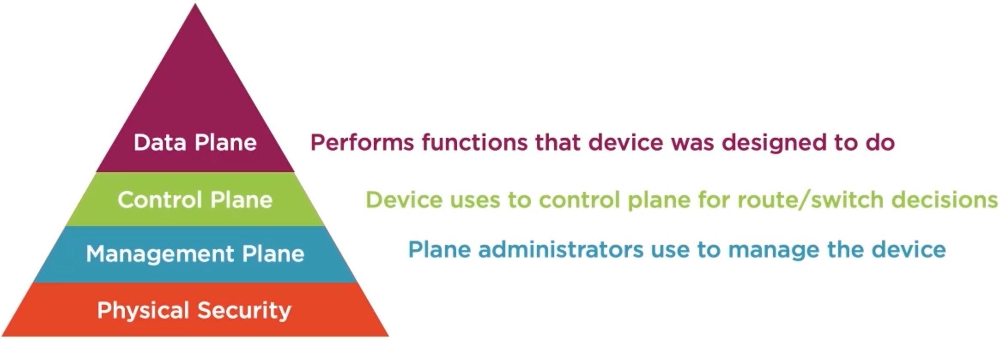

3. Securing the Management Plane
================================

Secure Planes
-------------

Physical Security
~~~~~~~~~~~~~~~~~

-  One of the most important things to consider
-  Configurations to secure device be undone if anyone has access to
   device
-  Boot into ROMmon
-  Could just as easily power off device

   -  Cut cables

Network Device Planes
~~~~~~~~~~~~~~~~~~~~~

|image1|

Telnet, HTTP, SSH, and HTTPs
----------------------------

How Do You Manage a Device?
~~~~~~~~~~~~~~~~~~~~~~~~~~~

-  Console
-  Telnet
-  HTTP
-  Without encryption, data can be compromised

AAA
---

TACACS+ & RADIUS are used for AAA

Managing Administrators
~~~~~~~~~~~~~~~~~~~~~~~

-  Create users, passwords, and permissions on each device

   -  Doesn’t scale

-  AAA

   Authentication, Authorization & Accounting

AAA Process
~~~~~~~~~~~

-  Provide security guard with identification (Guard authenticates you)
-  Verify that the proper forms and approvals have been met (Guard
   authorizes you)
-  Logbook and camera track movements and activities (Accounting record)

RADIUS & TACACS+
----------------

RADIUS
~~~~~~

-  Remote Authentication Dial-in User Service
-  Users would dial office modem
-  Radius used for authentication
-  UDP Ports 1812 & 1813
-  Password field is encrypted

**Authentication Protocols:**

-  Challenge Handshake Authentication Protocol (CHAP)
-  Password Authentication Protocol (PAP)
-  Microsoft CHAP (MS-CHAP)
-  Extensible Authentication Protocol (EAP)

**RADIUS Messages:**

-  Access-Accept
-  Access-Reject
-  Access-Challenge
-  Accounting-Request
-  Accounting-Response

TACACS+
~~~~~~~

-  Terminal Access Controller Access Control System
-  Does not include authorization in authentication request
-  Start message
-  Reply asking for username
-  Continue with username
-  Reply asking for password
-  Continue with password
-  Reply with authentication determination
-  TCP port 49
-  Entire payload is encrypted

**Authorization Messages:**

-  AAA Client starts with a new conversation for authentication
-  Occurs each time user tries to do anything
-  Send a request message
-  Server Responds with:

   -  FAIL
   -  PASS_ADD
   -  PASS_REPL
   -  FOLLOW
   -  ERROR

**Accounting Messages:**

-  Request
-  Response

When Do You Use TACACS+?
~~~~~~~~~~~~~~~~~~~~~~~~

-  Use to authorize IT employees

   -  Have different command sets per different IT levels
   -  Each command set would verify with AAA server that the user is
      authorized
   -  Continue checking authorization for each command

When Do You Use RADIUS?
~~~~~~~~~~~~~~~~~~~~~~~

-  User access to the network
-  802.1X
-  Change of Authorization (CoA)
-  Cisco ISE

SNMP
----

SNMP Benefits
~~~~~~~~~~~~~

-  Audit trail
-  Immediately alerted of issues
-  Events are stored in MIB
-  Changes can be made by SNMP server

SNMPv1 & SNMPv2c
~~~~~~~~~~~~~~~~

-  Community strings

   -  all info is in plain text

-  At a minimum change default community

   -  Too many orgs leave the default
   -  Easy attack

SNMPv3 Configuration
~~~~~~~~~~~~~~~~~~~~

-  noAuthnoPriv

   -  Similar to SNMPv1 and SNMPv2c - not secure

-  AuthNoPriv

   -  Username and HMAC password

-  AuthPriv

   -  Username, HMAC password, & encryption - most secure

-  SNMP users are tied to SNMP groups
-  SNMP groups can be restricted to only see certain info from MIB

Additional Protocol Security
----------------------------

Securely Transferring Files
~~~~~~~~~~~~~~~~~~~~~~~~~~~

-  Secure File Transfer Protocol (SFTP)

   -  Secure version of FTP
   -  Uses SSH framework to provide security

-  Requires secure algorithms!
-  Secure Copy Protocol (SCP)

   -  Also uses SSH to secure traffic
   -  Also relies on secure algorithms

Syslog
~~~~~~

-  Logs created for events
-  SIEM correlates logs and finds anomalies
-  Syslog messages aren’t secure
-  Theres now Secure Syslog
-  Using TLS

Network Time Protocol
~~~~~~~~~~~~~~~~~~~~~

-  Proper time allows logs and SNMP messages to be correlated
-  Some industries require precision time in orter to function
-  Not traditionally secured - easily attacked
-  DoS attacks & disrupting business activities
-  Use NTP authentication

DNS
~~~

-  Registrar hijacking

   -  Attacker hacks into organizations DNS account

-  DNS Cache Poisoning

   -  Attacker sends false DNS records to DNS server

-  Can point DNS records to malicious server to cause DoS or gain data

Cisco Discovery Protocol
~~~~~~~~~~~~~~~~~~~~~~~~

-  Learn which devices are connected
-  IP Address, device model, VLANs, etc.
-  Info can be used by attacker

   -  Reconnaissance

-  Disable CDP on untrusted interfaces

Management Plane ACLs
---------------------

-  Controls which IPs and protocols access management plane
-  Permit and deny traffic based on srs/dst IPs and ports
-  Deny insecure protocols
-  Allow ssh and https from management IPs
-  Permit mgmt. protocols to/from management servers
-  Apply ACL to mgmt. plane

