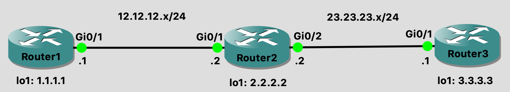
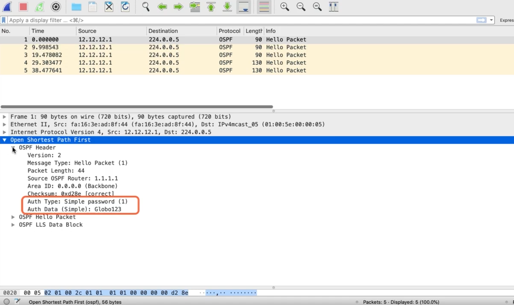
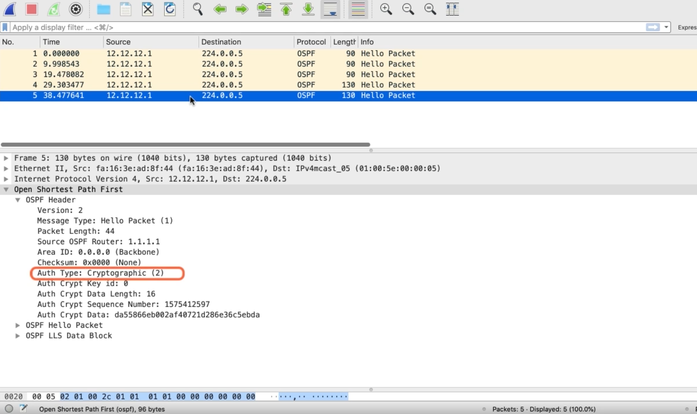
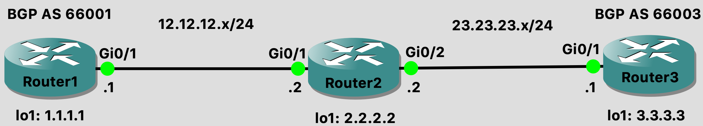

Securing the Control Plane and Data Plane on Cisco Routers
==========================================================

Lab Setup
---------

   Lab topology

`Download Lab
File <https://github.com/CalebSargeant/docs2/blob/master/.gitbook/assets/securing-control-plane-and-data-plane-on-cisco-routers.gns3project?raw=true>`__

**Router1:**

.. code:: text

   Router#
   Router#conf t
   Router(config)#hostname Router1
   Router1(config)#int g0/1
   Router1(config-if)#ip add 12.12.12.1 255.255.255.0
   Router1(config-if)#no shut
   Router1(config-if)#int lo1
   Router1(config-if)#ip add 1.1.1.1 255.255.255.255
   Router1(config-if)#no shut
   Router1(config-if)#do wr

**Router2:**

.. code:: text

   Router#conf t
   Router(config)#hostname Router2
   Router2(config)#int g0/1
   Router2(config-if)#ip add 12.12.12.2 255.255.255.0
   Router2(config-if)#no shut
   Router2(config-if)#int lo1
   Router2(config-if)#ip add 2.2.2.2 255.255.255.255
   Router2(config-if)#no sh
   Router2(config-if)#int g0/2
   Router2(config-if)#ip add 23.23.23.2 255.255.255.0
   Router2(config-if)#no shut
   Router2(config-if)#do wr

**Router3:**

.. code:: text

   Router#conf t
   Router(config)#hostname Router3
   Router3(config)#int g0/1
   Router3(config-if)#ip add 23.23.23.1 255.255.255.0
   Router3(config-if)#no shut
   Router3(config-if)#int lo1
   Router3(config-if)#ip add 3.3.3.3 255.255.255.255
   Router3(config-if)#no shut
   Router3(config-if)#do wr

Securing EIGRP
--------------

Securing the Control Plane
~~~~~~~~~~~~~~~~~~~~~~~~~~

-  Use MD5 hash of a passcode/key
-  Prevents rogue router from injecting
-  EIGRP malicious routes
-  Authentication Create passcode inside of keychain
-  Reference keychain on interfaces participating in EIGRP

Other Routing Protocols
~~~~~~~~~~~~~~~~~~~~~~~

-  RIP

   -  Authentication key configured inside of keychain

-  OSPF

   -  Authentication key configured on interface

-  BGP

   -  Authentication key configured in BGP configuration mode

Configuration Steps
~~~~~~~~~~~~~~~~~~~

-  Configure EIGRP
-  Create keychain
-  Reference keychain on interfaces

`Download Lab
File <https://github.com/CalebSargeant/docs2/blob/master/.gitbook/assets/securing-control-plane-and-data-plane-on-cisco-routers-eigrp.gns3project?raw=true>`__

**Router1:**

.. code:: text

   Router1#conf t
   Router1(config)#router eigrp 100
   Router1(config-router)#network 12.12.12.0 0.0.0.255
   Router1(config-router)#network 1.1.1.0 0.0.0.255
   Router1(config-router)#passive-interface default
   Router1(config-router)#no passive-interface gi 0/1
   Router1(config-router)#exit
   Router1(config)#key chain GloboRoutingKeys
   Router1(config-keychain)#key 1
   Router1(config-keychain-key)#key-string Globo123
   Router1(config-keychain-key)#exit
   Router1(config-keychain)#exit
   Router1(config)#int g0/1
   Router1(config-if)#ip authentication key-chain eigrp 100 GloboRoutingKeys
   Router1(config-if)#ip authentication mode eigrp 100 md5
   Router1(config-if)#do show run | sec key
     key chain GloboRoutingKeys
       key 1
         key-string Globo123
       ip authentication key-chain eigrp 100 GloboRoutingKeys
   Router1(config-if)#exit
   Router1(config)#service password-encryption
   Router1(config)#do show run | sec key
     key chain GloboRoutingKeys
       key 1
         key-string 7 1535070306257A767B
       ip authentication key-chain eigrp 100 GloboRoutingKeys
   Router1(config)#do wr

**Router 2:**

.. code:: text

   Router2#conf t
   Router2(config)#service password-encryption
   Router2(config)#router eigrp 100
   Router2(config-router)#passive-interface default
   Router2(config-router)#no passive-interface gi 0/1
   Router2(config-router)#no passive-interface gi 0/2
   Router2(config-router)#network 23.23.23.0 0.0.0.255
   Router2(config-router)#network 2.2.2.0 0.0.0.255
   Router2(config-router)#network 12.12.12.0 0.0.0.255
   Router2(config-router)#key chain GloboRoutingKeys
   Router2(config-keychain)#key 1
   Router2(config-keychain-key)#key-string Globo123
   Router2(config-keychain-key)#exit
   Router2(config-keychain)#exit
   Router2(config)#int g0/1
   Router2(config-if)#ip authentication key-chain eigrp 100 GloboRoutingKeys
   Router2(config-if)#ip authentication mode eigrp 100 md5
   Router2(config-if)#do wr

**Router 3:**

.. code:: text

   Router3#conf t
   Router3(config)#router eigrp 100
   Router3(config-router)#passive-interface default
   Router3(config-router)#no passive-interface gi 0/1
   Router3(config-router)#network 3.3.3.0 0.0.0.255
   Router3(config-router)#network 23.23.23.0 0.0.0.255
   Router3(config-router)#do wr

**EIGRP Debug:**

.. code:: text

   # We see that router 1 is ignoring the packets until auth configured
   *Dec 4 19:04:41.469 EIGRP: Gi0/1: ignored packet from 12.12.12.1, opcode = 5 (authentication off or key-chain missing)
   # We see the adjacency forms when auth is configured
   *Dec 4 19:07:33.818: %DUAL-5-NBRCHANGE: EIGRP-IPv4 100: Neighbor 12.12.12.1 (GigabitEthernet0/1) is up: new adjacency

   ### show ip route on Router3
   Router3(config-router)#do show ip route
   Codes:  L local, C - connected, S static, R - RIP ,  M mobile, B - BGP
           D - EIGRP , EX EIGRP external, 0 OSPF. IA OSPF inter area
           N1 OSPF NSSA external type 1, N2 OSPF NSSA external type 2
           E1 OSPF external type 1, E2 OSPF external type 2
           i. IS-IS, su - IS-IS summary, L1 IS-IS level-1, L2 - IS-IS level-2
           ia IS-IS inter area, candidate default, U - per-user static route
           o - ODR, P periodic downloaded static route, H NHRP , 1 LISP
           a application route
           + replicated route, % - next hop override, overrides from PfR

   Gateway of last resort is not set

     1.0.0.0/24 is subnetted, 1 subnets
   D   1.1.1.0 [90/131072] via 23.23.23.2, 00:00:11. GigabitEthernet0/1
     2.0.0.0/24 is subnetted, 1 subnets
   D   2.2.2.0 [90/130816] via 23.23.23.2, 00:00:11, GigabitEthernet0/1
     3.0.0.0/8 is variably subnetted, 2 subnets, 2 masks
   C   3.3.3.0/24 is directly connected, Loopback3
   L   3.3.3.3/32 is directly connected, Loopback3
     12.0.0.0/24 is subnetted, 1 subnets
   S   12.12.12.0 [1/0] via 23.23.23.2
     23.0.0.0/8 is variably subnetted, 2 subnets, 2 masks
   C   23.23.23.0/24 is directly connected, GigabitEthernet0/1
   L   23.23.23.3/32 is directly connected, GigabitEthernet0/1

   ### ping 1.1.1.1 from 3.3.3.3
   Router3(config-router)#do ping 1.1.1.1 source 3.3.3.3
   Type escape sequence to abort.
   Sending 5, 100-byte ICMP Echos to 1.1.1.1, timeout is 2 seconds:
   Packet sent with a source address of 3.3.3.3
   !!!!!
   Success rate is 100 percent (5/5), round-trip min/avg/max = 4/5/8 ms

Securing RIP
------------

-  Use the keychain
-  Configure RIPv2
-  Configure authentication

`Download Lab
File <https://github.com/CalebSargeant/docs2/blob/master/.gitbook/assets/securing-control-plane-and-data-plane-on-cisco-routers-rip.gns3project?raw=true>`__

**Router1:**

.. code:: text

   Router1#conf t
   Router1(config)#key chain GloboRoutingKeys
   Router1(config-keychain)#key 1
   Router1(config-keychain-key)#key-string Globo123
   Router1(config-keychain-key)#exit
   Router1(config-keychain)#exit
   Router1(config)#router rip
   Router1(config-router)#version 2
   Router1(config-router)#passive-interface default
   Router1(config-router)#no passive-interface gig 0/1
   Router1(config-router)#network 1.1.1.0
   Router1(config-router)#network 12.12.12.0
   Router1(config-router)#int g0/1
   Router1(config-if)#ip rip authentication key-chain GloboRoutingKeys
   Router1(config-if)#ip rip authentication mode md5
   Router1(config-if)#do wr

**Router2:**

.. code:: text

   Router2#conf t
   Router2(config)#key chain GloboRoutingKeys
   Router2(config-keychain)#key 1
   Router2(config-keychain-key)#key-string Globo123
   Router2(config-keychain-key)#exit
   Router2(config-keychain)#exit
   Router2(config)#router rip
   Router2(config-router)#version 2
   Router2(config-router)#passive-interface default
   Router2(config-router)#no passive-interface gi 0/1
   Router2(config-router)#no passive-interface gi 0/2
   Router2(config-router)#network 2.2.2.0
   Router2(config-router)#network 12.12.12.0
   Router2(config-router)#network 23.23.23.0
   Router2(config)#interface range gi 0/1 - 2
   Router2(config-if-range)#ip rip authentication key-chain GloboRoutingKeys
   Router2(config-if-range)#ip rip authentication mode MD5
   Router2(config-if)#do wr

**Router3:**

.. code:: text

   Router3#conf t
   Router3(config)#key chain GloboRoutingKeys
   Router3(config-keychain)#key 1
   Router3(config-keychain-key)#key-string Globo123
   Router3(config-keychain-key)#exit
   Router3(config-keychain)#exit
   Router3(config)#router rip
   Router3(config-router)#version 2
   Router3(config-router)#passive-interface default
   Router3(config-router)#no passive-interface gi 0/1
   Router3(config-router)#network 23.23.23.0
   Router3(config-router)#network 3.3.3.0
   Router3(config-router)#int gi 0/1
   Router3(config-if)#ip rip authentication key-chain GloboRoutingKeys
   Router3(config-if)#ip rip authentication mode md5
   Router3(config-if)#do wr

**RIP Debug:**

.. code:: text

   Router3#sh ip route
   Codes: L - local, C - connected, S - static, R - RIP, M - mobile, B - BGP
          D - EIGRP, EX - EIGRP external, O - OSPF, IA - OSPF inter area
          N1 - OSPF NSSA external type 1, N2 - OSPF NSSA external type 2
          E1 - OSPF external type 1, E2 - OSPF external type 2
          i - IS-IS, su - IS-IS summary, L1 - IS-IS level-1, L2 - IS-IS level-2
          ia - IS-IS inter area, * - candidate default, U - per-user static route
          o - ODR, P - periodic downloaded static route, H - NHRP, l - LISP
          a - application route
          + - replicated route, % - next hop override, p - overrides from PfR

   Gateway of last resort is not set

   R     1.0.0.0/8 [120/2] via 23.23.23.2, 00:00:13, GigabitEthernet0/1
   R     2.0.0.0/8 [120/1] via 23.23.23.2, 00:00:13, GigabitEthernet0/1
         3.0.0.0/32 is subnetted, 1 subnets
   C        3.3.3.3 is directly connected, Loopback1
   R     12.0.0.0/8 [120/1] via 23.23.23.2, 00:00:13, GigabitEthernet0/1
         23.0.0.0/8 is variably subnetted, 2 subnets, 2 masks
   C        23.23.23.0/24 is directly connected, GigabitEthernet0/1
   L        23.23.23.1/32 is directly connected, GigabitEthernet0/1

Securing OSPF
-------------

-  Configure authentication without a hash
-  Look at packet capture
-  Configure authentication to use hash
-  Configure the other routers

`Download Lab
File <https://github.com/CalebSargeant/docs2/blob/master/.gitbook/assets/securing-control-plane-and-data-plane-on-cisco-routers-ospf.gns3project?raw=true>`__

**Router1:**

.. code:: text

   Router1#conf t
   Router1(config)#key chain GloboRoutingKeys
   Router1(config-keychain)#key 1
   Router1(config-keychain-key)#key-string Globo123
   Router1(config-keychain-key)#exit
   Router1(config-keychain)#exit
   Router1(config)#router ospf 100
   Router1(config-router)#passive-interface default
   Router1(config-router)#no passive-interface GigabitEthernet 0/1
   Router1(config-router)#network 12.12.12.0 0.0.0.255 area 0
   Router1(config-router)#network 1.1.1.0 0.0.0.255 area 0
   Router1(config-router)#exit
   Router1(config)#interface GigabitEthernet 0/1
   Router1(config-if)#ip ospf 100 area 0
   Router1(config-if)#ip ospf authentication message-digest
   Router1(config-if)#ip ospf message-digest-key 1 md5 Globo123
   Router1(config-if)#do wr

**Router2:**

.. code:: text

   Router2#conf t
   Router2(config)#key chain GloboRoutingKeys
   Router2(config-keychain)#key 1
   Router2(config-keychain-key)#key-string Globo123
   Router2(config-keychain-key)#exit
   Router2(config-keychain)#exit
   Router2(config)#router ospf 100
   Router2(config-router)#passive-interface default
   Router2(config-router)#no passive-interface GigabitEthernet 0/1
   Router2(config-router)#no passive-interface GigabitEthernet 0/2
   Router2(config-router)#network 12.12.12.0 0.0.0.255 area 0
   Router2(config-router)#network 23.23.23.0 0.0.0.255 area 0
   Router2(config-router)#network 2.2.2.0 0.0.0.255 area 0
   Router2(config-router)#exit
   Router2(config)#interface range GigabitEthernet 0/1 - 2
   Router2(config-if)#ip ospf 100 area 0
   Router2(config-router)#ip ospf authentication message-digest
   Router2(config-if)#ip ospf message-digest-key 1 md5 Globo123
   Router2(config-if)#do wr

**Router3:**

.. code:: text

   Router3#conf t
   Router3(config)#key chain GloboRoutingKeys
   Router3(config-keychain)#key 1
   Router3(config-keychain-key)#key-string Globo123
   Router3(config-keychain-key)#exit
   Router3(config-keychain)#exit
   Router3(config)#router ospf 100
   Router3(config-router)#passive-interface default
   Router3(config-router)#no passive-interface GigabitEthernet 0/1
   Router3(config-router)#network 23.23.23.0 0.0.0.255 area 0
   Router3(config-router)#network 3.3.3.0 0.0.0.255 area 0
   Router3(config-router)#exit
   Router3(config)#interface GigabitEthernet 0/1
   Router3(config-if)#ip ospf 100 area 0
   Router3(config-router)#ip ospf authentication message-digest
   Router3(config-if)#ip ospf message-digest-key 1 md5 Globo123
   Router3(config-if)#do wr

**OSPF Debug:**

.. code:: text

   ### OSPF without hashing:
   Router1(config-if)#ip ospf authentication-key Globo123
   Router1(config-if)#ip ospf authentication

   Packet capture showing OSPF authentication in plain-text

.. code:: text

   ### OSPF with hashing:
   Router1(config-if)#ip ospf authentication message-digest
   Router1(config-if)#ip ospf message-digest-key 1 md5 Globo123

   Packet capture showing OSPF Auth Type as Cryptographic

.. code:: text

   Router3(config-if)#do sh ip route
   Codes: L - local, C - connected, S - static, R - RIP, M - mobile, B - BGP
          D - EIGRP, EX - EIGRP external, O - OSPF, IA - OSPF inter area
          N1 - OSPF NSSA external type 1, N2 - OSPF NSSA external type 2
          E1 - OSPF external type 1, E2 - OSPF external type 2
          i - IS-IS, su - IS-IS summary, L1 - IS-IS level-1, L2 - IS-IS level-2
          ia - IS-IS inter area, * - candidate default, U - per-user static route
          o - ODR, P - periodic downloaded static route, H - NHRP, l - LISP
          a - application route
          + - replicated route, % - next hop override, p - overrides from PfR

   Gateway of last resort is not set

         1.0.0.0/32 is subnetted, 1 subnets
   O        1.1.1.1 [110/3] via 23.23.23.2, 00:00:09, GigabitEthernet0/1
         2.0.0.0/32 is subnetted, 1 subnets
   O        2.2.2.2 [110/2] via 23.23.23.2, 00:00:09, GigabitEthernet0/1
         3.0.0.0/32 is subnetted, 1 subnets
   C        3.3.3.3 is directly connected, Loopback1
         12.0.0.0/24 is subnetted, 1 subnets
   O        12.12.12.0 [110/2] via 23.23.23.2, 00:00:09, GigabitEthernet0/1
         23.0.0.0/8 is variably subnetted, 2 subnets, 2 masks
   C        23.23.23.0/24 is directly connected, GigabitEthernet0/1
   L        23.23.23.1/32 is directly connected, GigabitEthernet0/1
   ## Securing OSPF

   * Use the keychain
   * Configure RIPv2
   * Configure authentication

Securing BGP
------------

-  Configure TTL Security command
-  Configure BGP neighbor authentication

**Multihops:**

-  Command to allow peers to connect:
   ``neighbor 23.23.23.0 ebgp-multihop``
-  More secure way to do it (specifying exact number of hops for
   neighborship to perform): ``neighbor 23.23.23.0 ttl-security hops 2``

   -  Protects against peering with an unauthorised neighbor
   -  Prevents DoS against BGP process
   -  Prevents a CPU exhaustion attack (lots of SYN packets) - if TTL
      too high, router won’t accept packet and CPU won’t be affected

|image1|

`Download Lab
File <https://github.com/CalebSargeant/docs2/blob/master/.gitbook/assets/securing-control-plane-and-data-plane-on-cisco-routers-ospf.gns3project?raw=true>`__

**Router1:**

.. code:: text

   Router1(config)#ip route 23.23.23.0 255.255.255.0 12.12.12.2
   Router1(config)#router bgp 66001
   Router1(config-router)#bgp router-id 12.12.12.1
   Router1(config-router)#neighbor 23.23.23.1 remote-as 66003
   Router1(config-router)#network 1.1.1.0 mask 255.255.255.0
   Router1(config-router)#neighbor 23.23.23.1 ttl-security hops 2
   Router1(config-router)#neighbor 23.23.23.1 password Globo123

**Router3:**

.. code:: text

   Router3(config)#ip route 12.12.12.0 255.255.255.0 23.23.23.2
   Router3(config)#router bgp 66003
   Router3(config-router)#bgp router-id 23.23.23.3
   Router3(config-router)#neighbor 12.12.12.1 remote-as 66001
   Router3(config-router)#network 3.3.3.0 mask 255.255.255.0
   Router3(config-router)#neighbor 12.12.12.1 ttl-security hops 2
   Router3(config-router)#neighbor 12.12.12.1 password Globo123

**BGP Debug:**

.. code:: text

   Router1(config-router)#do clear ip bgp *
   Router3(config-router)#do clear ip bgp *

Access Control Lists
--------------------

All ACLs have an implicit deny statement at the bottom of the list

Standard ACL
~~~~~~~~~~~~

-  Matches the source IP address
-  Permit and deny
-  IP address followed by

   -  wildcard
   -  use keyword host
   -  use keyword any

-  Traffic is matched against an ACL line-by-line until a match is found

**Sample Standard ACL**

.. code:: text

   (config)#access-list 11 permit 192.168.1.0 0.0.0.255
   (config)#access-list 11 deny host 172.20.1.55
   (config)#access-list 11 permit 172.20.1.0 0.0.0.255
   (config)#access-list 11 deny any

**Sample Standard ACL 2**

.. code:: text

   (config)#ip access-list standard 1350
   (config-std-nacl)#permit 192.168.1.0 0.0.0.255
   (config-std-nacl)#permit 172.20.1.0 0.0.0.255
   (config-std-nacl)#deny host 172.20.1.55
   (config-std-nacl)#deny any

Extended ACL
~~~~~~~~~~~~

-  Source & destination IP addresses
-  Layer 4 protocol
-  Layer 4 port
-  QoS, multicast, & routing protocols
-  Extended ACLs are numbered (100-199 & 2000-2699)

**Sample Extended ACL**

.. code:: text

   (config)#access-list 111 permit ip 10.10.10.0 0.0.0.255 any log
   (config)#access-list 111 deny tcp any host 192.168.1.85 eq 22 log
   (config)#access-list 111 deny any any

**Sample Extended ACL 2**

.. code:: text

   (config)#ip access-list extended 2050
   (config-ext-nacl)#deny ip host 192.168.1.50 any
   (config-ext-nacl)#deny ip host 192.168.1.51 any
   (config-ext-nacl)#permit ip 192.168.1.0 0.0.0.255 any

Applying ACLs and Other ACL Types
---------------------------------

ACL Placement
~~~~~~~~~~~~~

-  Apply the ACL inbound or outbound on an interface
-  ``(config-if)#ip access-group nameOrNumber {inlout}``

Other ACL Usage
~~~~~~~~~~~~~~~

.. code:: text

   permit host 1.1.5.25
   permit host 1.1.5.26 deny any

-  Inside of auth policy
-  Define traffic to be NATd
-  Traffic to be encrypted
-  Can be used on VLAN interfaces
-  dACls
-  Policy-maps

Time Based ACL
~~~~~~~~~~~~~~

.. code:: text

   (config)#time-range Friday
   (config-time-range)#periodic Friday 08:00 to 16:59
   (config-time-range)#exit
   (config)#time-range Jan2020
   (config-time-range)#absolute start 00:00 Jan 2020 end 23:59 31 Jan 2020
   (config-time-range)#exit
   (config)#access-list 2050 permit ip 172.20.1.0 0.0.0.255 any time-range Jan2020

Reflexive ACLs
~~~~~~~~~~~~~~

-  Keep track of IP sessions
-  Create dynamic ACEs allowing return traffic
-  Once session has ended ACE will be removed

.. code:: text

   (config)#ip access-list extended Internet-Traffic-Out
   (config-ext-nacl)#permit tcp 172.20.1.0 0.0.0.255 any eq 443 reflect dynamic-ACL
   (config-ext-nacl)#permit tcp 172.20.1.0 0.0.0.255 any eq 80 reflect dynamic-ACL
   (config-ext-nacl)#exit
   (config)#ip access-list extended Internet-Traffic-In
   (config-ext-nacl)#evaluate-dynamic-ACL
   (config-ext-nacl)#exit

Policy Maps, NBAR, URPF & TCP Intercept
---------------------------------------

Policy Maps and Class Maps
~~~~~~~~~~~~~~~~~~~~~~~~~~

**Policy Maps** Can apply policy such as policing bandwidth, priority,
or drop the traffic.

**Class Maps** Matches traffic based on ACLs, VLANs, protocols, QoS
attributes

Network Based Application Recognition
~~~~~~~~~~~~~~~~~~~~~~~~~~~~~~~~~~~~~

NBAR:

-  ACLs can be difficult to identify applications
-  Uses protocol discovery to classify traffic
-  Traffic matched in a class map
-  Would then be dropped in a policy map
-  Apply policy map to interface

**Configuring NBAR:**

.. code:: text

   (config-if)#ip nbar protocol-discovery
   (config-if)#exit
   (config)#class-map ptpTraffic
   (config-cmap)#match protocol bittorrent
   (config-cmap)#match protocol edonkey
   (config-cmap)#exit
   (config)#policy-map drop-p2pTraffic
   (config-pmap)#class ptpTraffic
   (config-pmap-c)#drop
   (config-pmap-c)#exit
   (config-pmap)#exit

**Applying NBAR:**

.. code:: text

   (config)#int gi 0/1
   (config-if)#service-policy {inputloutput} drop-p2p

Unicast Reverse Path Forwarding
~~~~~~~~~~~~~~~~~~~~~~~~~~~~~~~

URPF:

-  Helps prevent spoofed IP addresses
-  Verifies the packet was received on the correct interface
-  Packet must be reachable from the same interface it came from

.. code:: text

   (config-if)#ip verify unicast reverse-path
   (config-if)#ip verify unicast reachable-via rx

TCP Intercept
~~~~~~~~~~~~~

-  Intervenes and protects servers from SYN-Flood Attacks
-  Intercept Mode

   -  Router is a man-in-the-middle
   -  Uses aggressive timeouts for half-open TCP sessions
   -  Router will stitch legitimate sessions together

-  Watch Mode

   -  Watch connection requests
   -  Intervene if connections aren’t established within allotted time

Intervenes and protects servers from SYN-Flood Attacks:

.. code:: text

   (config)#ip access-list standard Important_Servers
   (config-ext-nacl)#permit tcp any host 192.168.1.50
   (config-ext-nacl)#exit
   (config)#ip tcp intercept mode {watch]intercept}
   (config)#ip tcp intercept list Important_Servers

Control Plane Policing
----------------------

CoPP
~~~~

-  Utilizes ACLs and policy maps
-  Used to police any packets that are routed to the control plane

**Configuring CoPP:**

-  Define traffic using ACLs
-  Create a class map referencing ACL
-  Policy map referencing class map
-  Apply policy map to the control plane

.. code:: text

   Router1(config)#ip access-list extended CoPP-Traffic
   Router1(config-ext-nacl)#permit tcp any any eq bgp
   Router1(config-ext-nacl)#permit ospf any any
   Router1(config-ext-nacl)#permit eigrp any any
   Router1(config-ext-nacl)#exit
   Router1(config)#class-map CoPp-Class-Map
   Router1(config-cmap)#match access-group name CoPP-Traffic
   Router1(config-cmap)#exit
   Router1(config)#policy-map CoPP-Policy-Map
   Router1(config-pmap)#class CoPP-Class-Map
   Router1(config-pmap-c)#police 200000 conform-action transmit exceed-action drop
   Router1(config-pmap-c-police)#exit
   Router1(config-pmap-c)#exit
   Router1(config-pmap)#exit
   Router1(config)#control-plane
   Router1(config-cp)#service-policy input Copp-Policy-Map
   policy map Copp-Policy-Map not configured
   Router1(config-cp)#service-policy input CoPP-Policy-Map

