Configuring Wireless LAN Controller Device Hardening Methods
============================================================

Wireless Security Overview
--------------------------

Why Wireless Security Is Needed
~~~~~~~~~~~~~~~~~~~~~~~~~~~~~~~

-  Malicious attacker doesn’t need physical access to cable
-  Can listen if they are within distance of wireless signal
-  Additional security measures are needed

Wired Equivalent Privacy (WEP)
~~~~~~~~~~~~~~~~~~~~~~~~~~~~~~

-  Password required before device allowed on network
-  24 bit initialization vector (IV and RC4
-  IV was too short and insecure

Wifi Protected Access (WPA)
~~~~~~~~~~~~~~~~~~~~~~~~~~~

-  48-bit IV & TKIP
-  Message Integrity Check
-  Sequence counter

WPA2
~~~~

-  IEEE 802.11i
-  AES-128 & Cipher Block Chaining Message Authentication Code Protocol
   (CCMP)
-  WPA2 Enterprise

   -  Uses 802.1X
   -  Authentication occurs at AAA server

-  WPA2 Personal

   -  Use Pre-Shared-Key as authentication

Adding Encryption to Wireless LANS
~~~~~~~~~~~~~~~~~~~~~~~~~~~~~~~~~~

.. figure:: _images/securing-the-wireless-lan-controller-1.png
   :alt: WLANs > select profile

   WLANs > select profile

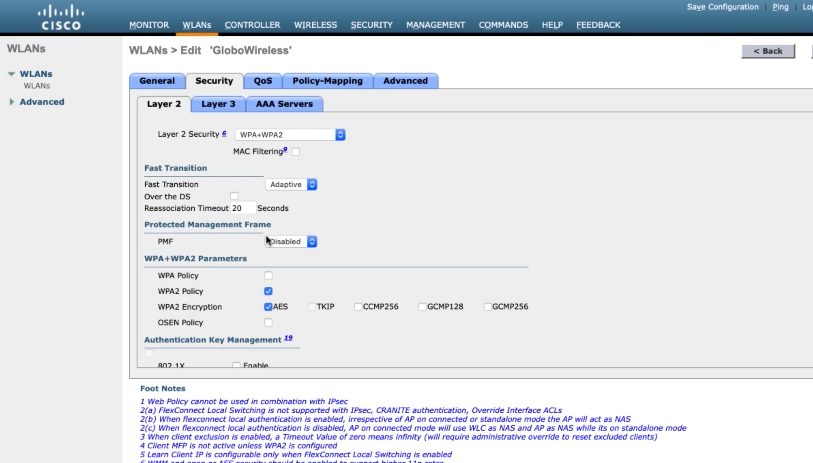

   Security > Layer 2 > WPA+WPA2

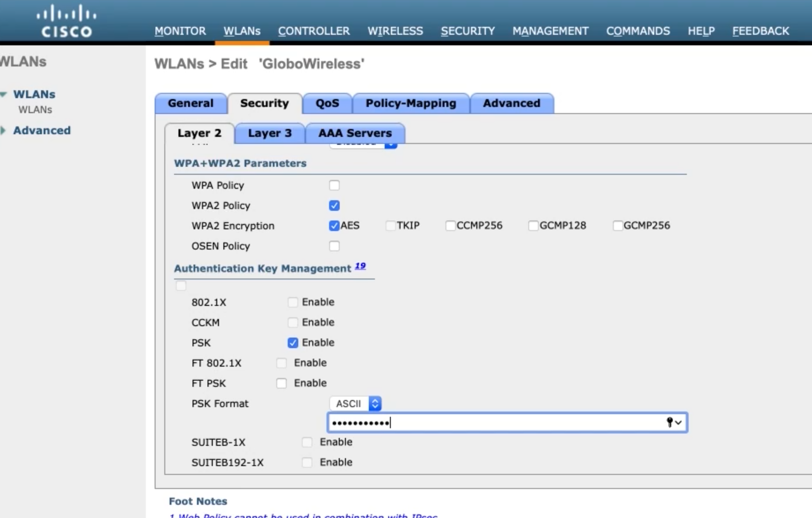

   PSK > input password

Configuring WPA2 Enterprise
~~~~~~~~~~~~~~~~~~~~~~~~~~~

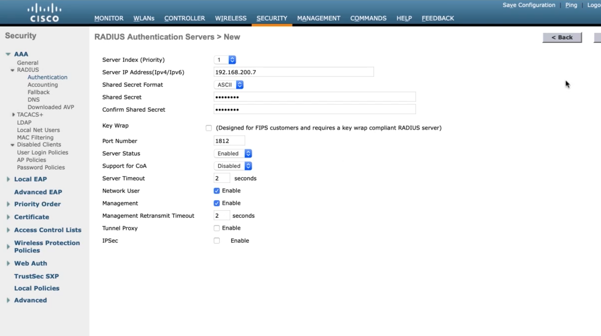

   Security > AAA > RADIUS > Authentication

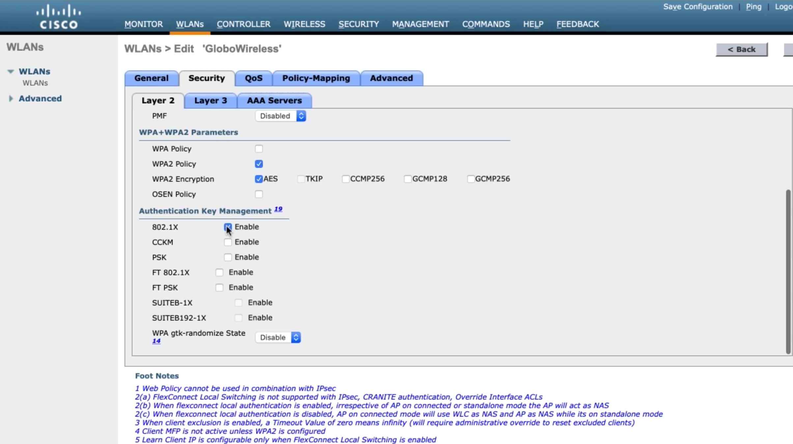

   Input Server IP and Shared Secret

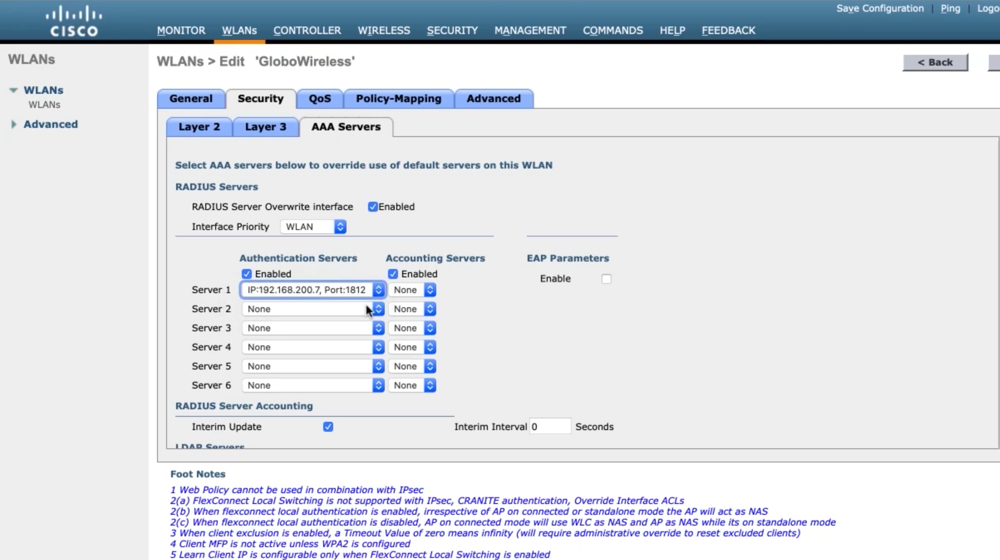

   WLANs > select profile > Security > Layer 2 > 802.1X

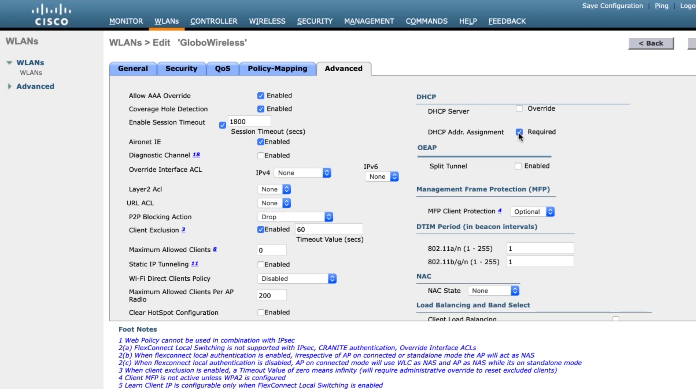

   AAA Servers > Server 1

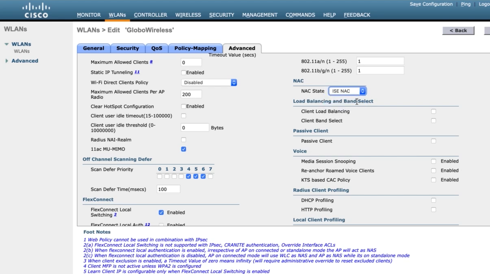

   Advanced > Allow AAA Override, P2P Blocking Action (Drop), DHCP Addr. Assignment (Reguired)

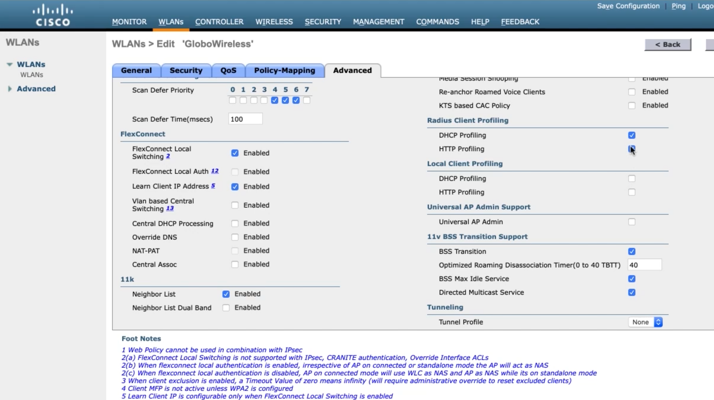

   Advanced > NAC State > ISE NAC

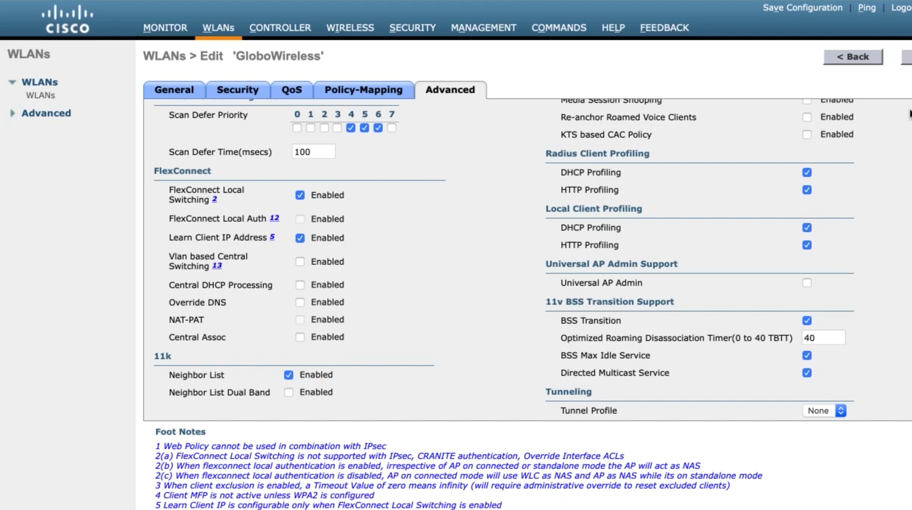

   Advanced > Radius Client Profiling (enable all), Local Client Profiling (enable all)

Securing the Management Plane on a Wireless LAN Controller
~~~~~~~~~~~~~~~~~~~~~~~~~~~~~~~~~~~~~~~~~~~~~~~~~~~~~~~~~~

.. figure:: _images/securing-the-wireless-lan-controller-11.png
   :alt: Security > Priority Order > Management User > move LOCAL down

   Security > Priority Order > Management User > move LOCAL down

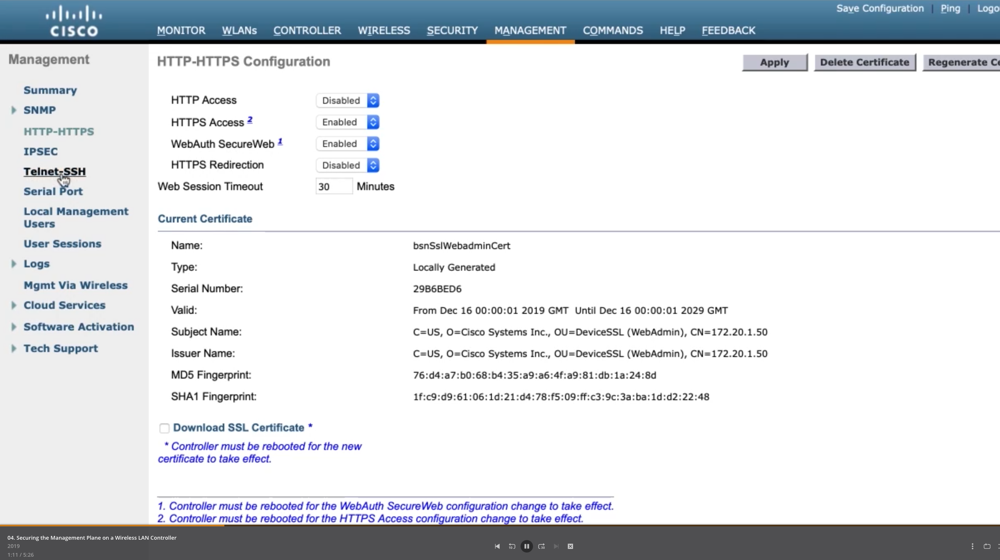

   HTTP-HTTPS

.. figure:: _images/securing-the-wireless-lan-controller-13.png
   :alt: Telnet-SSH

   Telnet-SSH

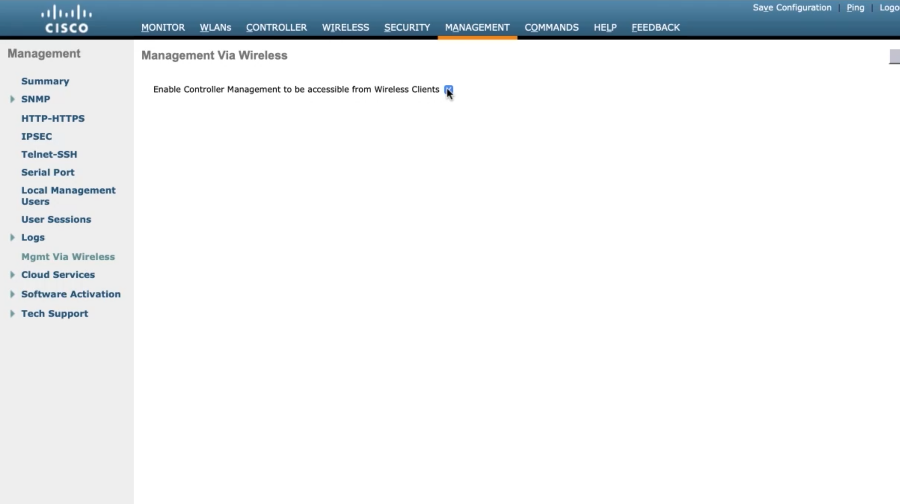

   Mgmt Via Wireless

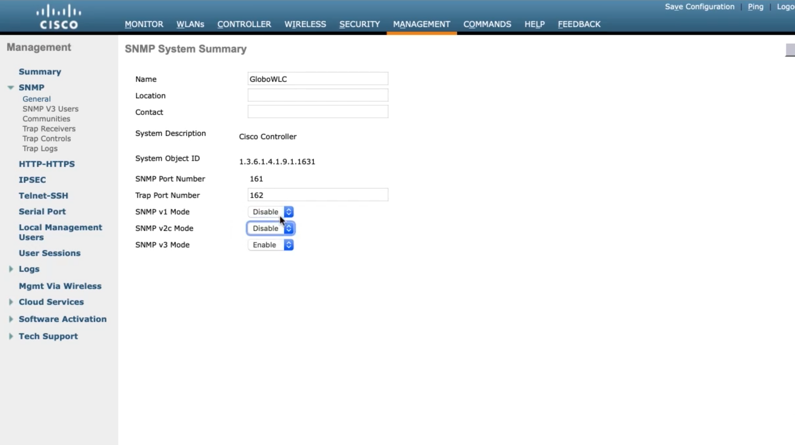

   SNMP > General

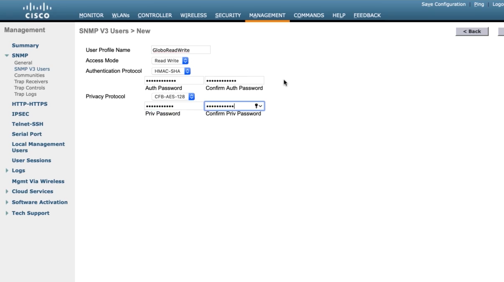

   SNMP > Create User

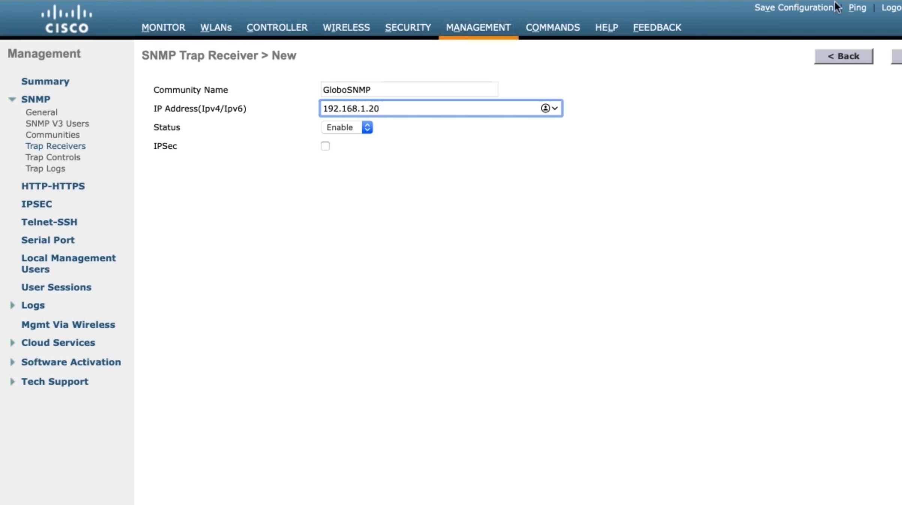

   SNMP > Trap Receivers

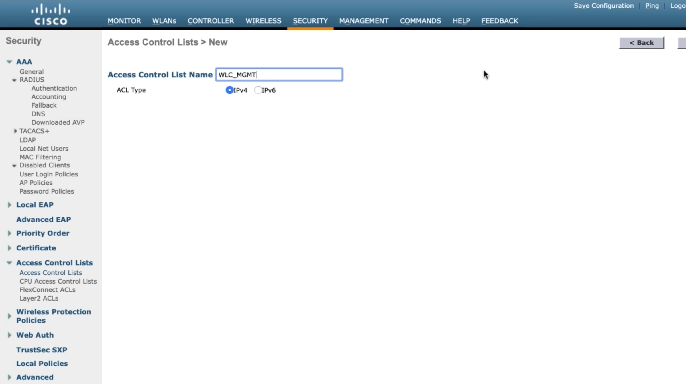

   Security > Access Control Lists > Access Control Lists > New

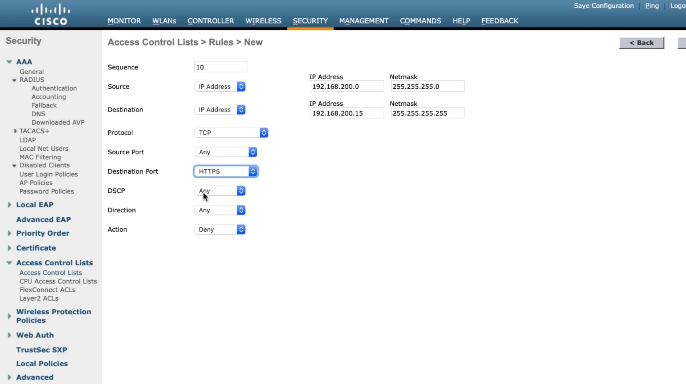

   Add new rule

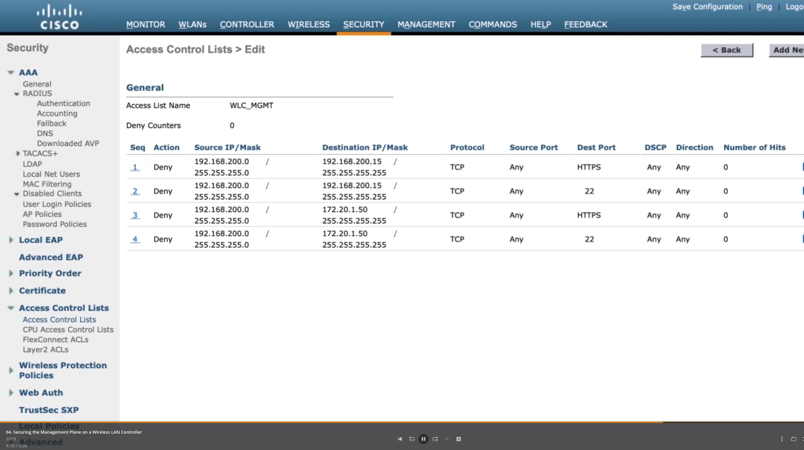

   More rules

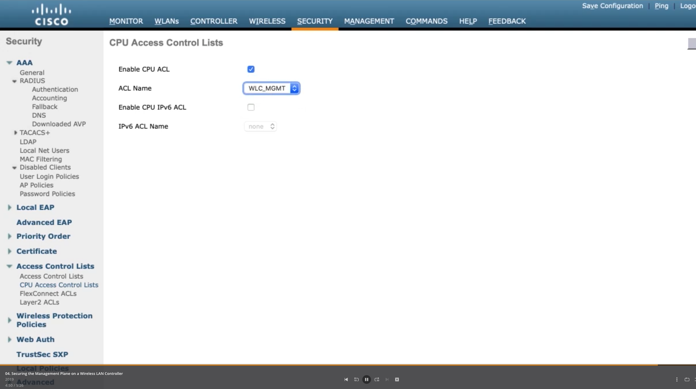

   Apply ACL to CPU
