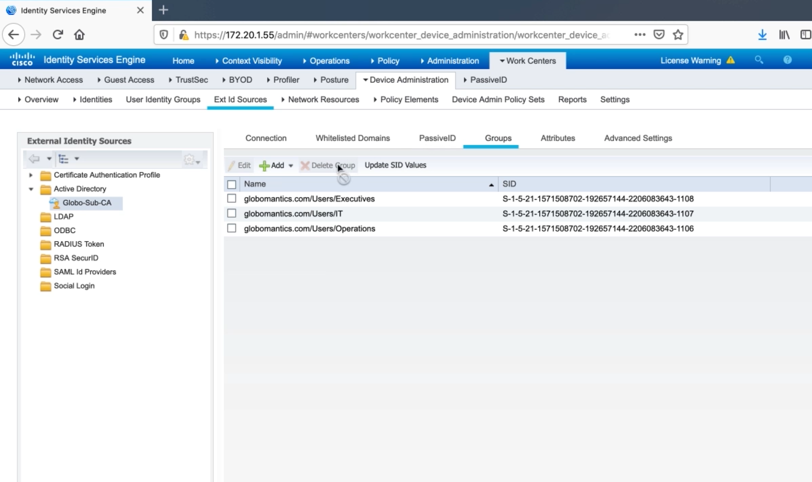
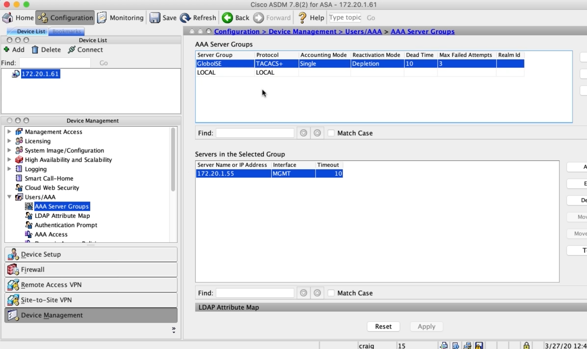

# Configuring AAA on a Cisco ASA For Use with Cisco ISE

## Prepping Cisco ISE to Support TACACS

<figure>

<figcaption>Enable TACACS+</figcaption>
</figure>

<figure>

<figcaption>Define a network device</figcaption>
</figure>

<figure>

<figcaption>Leverage AD security groups</figcaption>
</figure>

## TACACS Profiles and TACACS Command Sets

<figure>

<figcaption>Configure TACACS Profiles</figcaption>
</figure>

<figure>

<figcaption>Configure TACACS Command Sets</figcaption>
</figure>

## Configuring Device Admin Policy Sets

<figure>

<figcaption>Configure Device Admin Policy Sets</figcaption>
</figure>

## Configuring AAA on an ASA Using the CLI and ASDM

``` text
Globo-ASA(config)# aaa-server GloboISE protocol tacacs
Globo-ASA(config-aaa-server-group)# aaa-server GloboISE (MGMT) host 172.20.1.55
Globo-ASA(config-aaa-server-host)# key GloboISE123
Globo-ASA(config-aaa-server-host)# exit
Globo-ASA(config)# aaa authentication ssh console GloboISE LOCAL
Globo-ASA(config)# aaa authentication http console GloboISE LOCAL
Globo-ASA(config)# aaa authentication enable console GloboISE LOCAL
Globo-ASA(config)# aaa authentication secure-http-client
Globo-ASA(config)# aaa authorization http console GloboISE
Globo-ASA(config)# aaa authorization command GloboISE LOCAL
Globo-ASA(config)# aaa authorization exec authentication-server auto-enable
Globo-ASA(config)# aaa accounting ssh console GloboISE
Globo-ASA(config)# aaa accounting serial console GloboISE
Globo-ASA(config)# aaa accounting enable console GloboISE
Globo-ASA(config)# aaa accounting command GloboISE
```

<figure>

<figcaption>Configuring AAA in ASDM</figcaption>
</figure>
