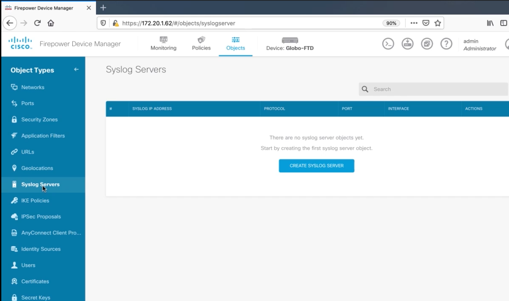
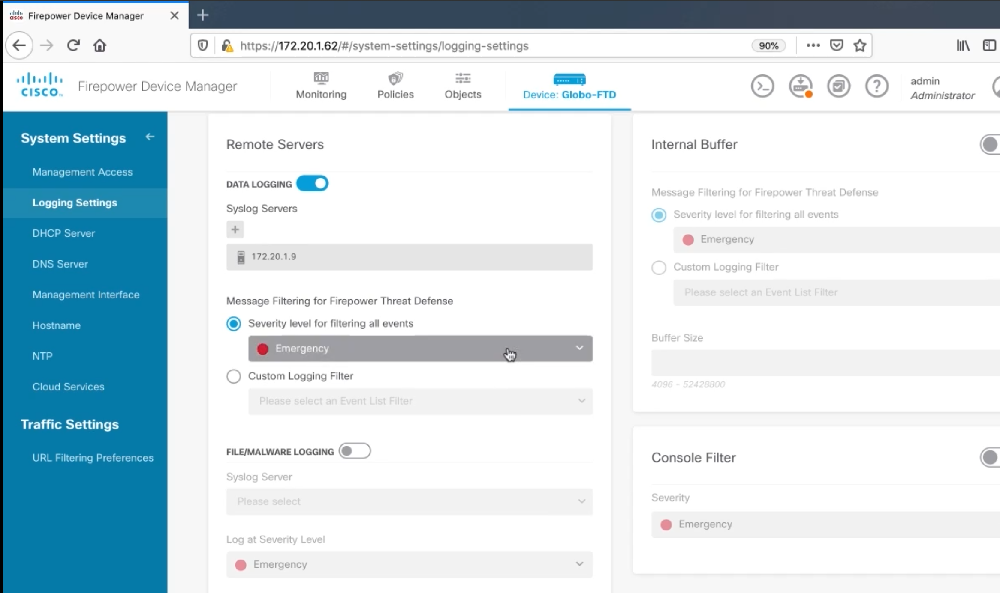
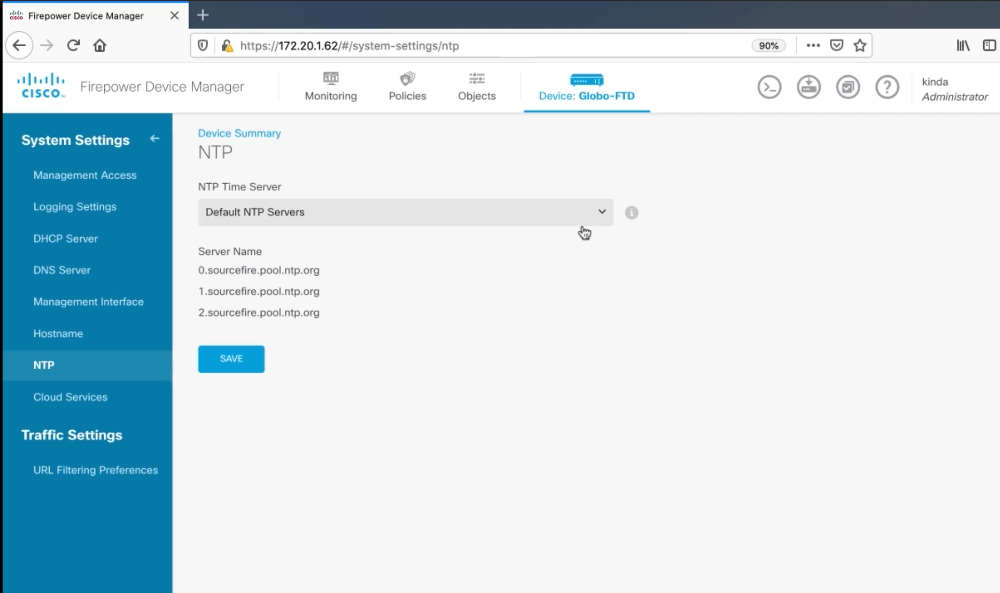
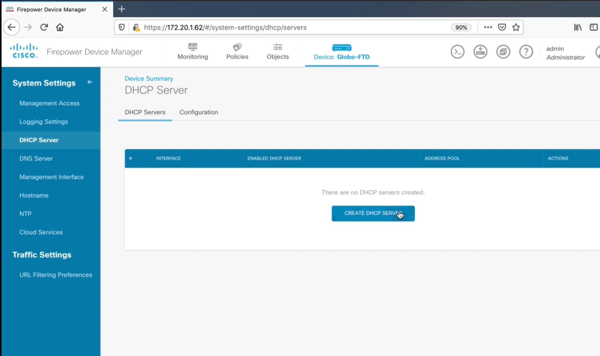

3. Configuring Management Protocols on a Cisco Firepower
========================================================

Configuring Syslog on a Cisco FTD Appliance
-------------------------------------------

   Add a Syslog Server

   Logging Settings

Configuring NTP on a Cisco FTD Appliance
----------------------------------------

   NTP Settings

Configuring DHCP on a FTD Appliance
-----------------------------------

   DHCP Settings
