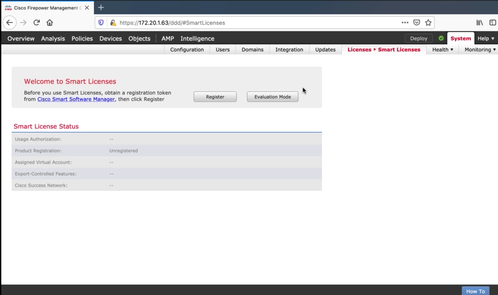
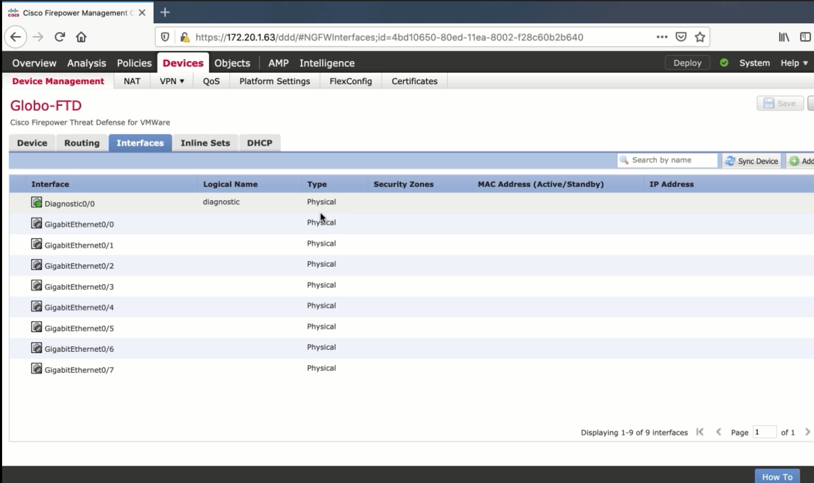
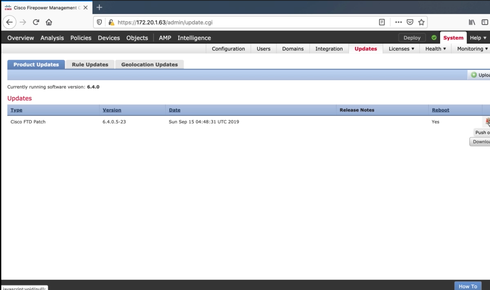

4. Managing Multiple Firepowers with Cisco Firepower Management Center
======================================================================

Initial Setup of Firepower Management Center
--------------------------------------------

``sudo configure-network``

The rest is self-explanatory, browse to GUI to finish setup

   Licensing FMC

Adding an FTD Appliance to Firepower Management Center
------------------------------------------------------

.. code:: text

   configure manager delete
   show managers
   configure manager add 172.20.1.63 Globo123

.. figure:: _images/managing-multiple-firepowers-with-cisco-firepower-management-center-2.png
   :alt: Adding FTDs to FMC

   Adding FTDs to FMC

Using the FMC to Make Changes to a Firepower Appliance
------------------------------------------------------

|image1|

Using the FMC to Upgrade a Firepower Appliance
----------------------------------------------

|image2|

