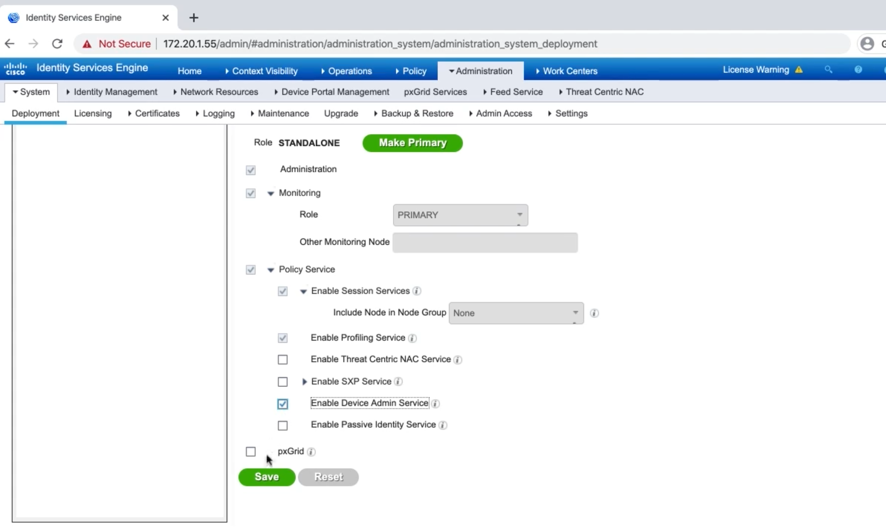
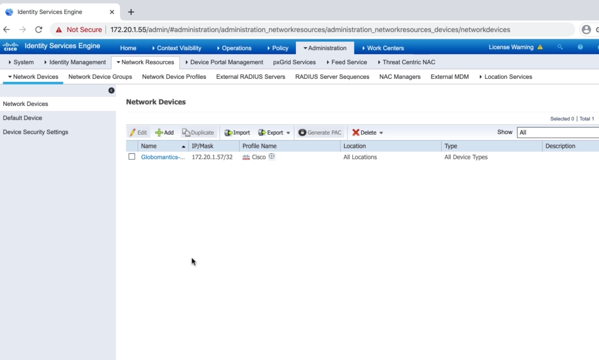
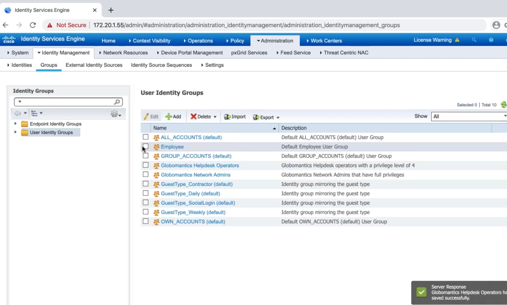
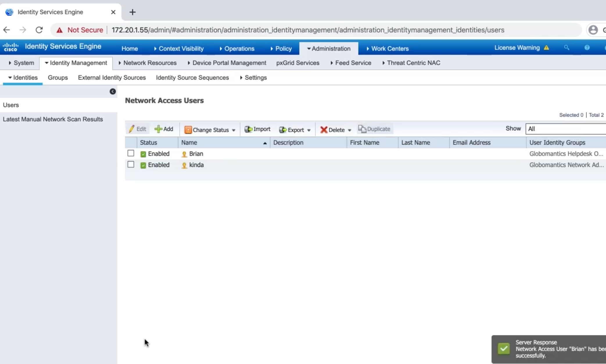
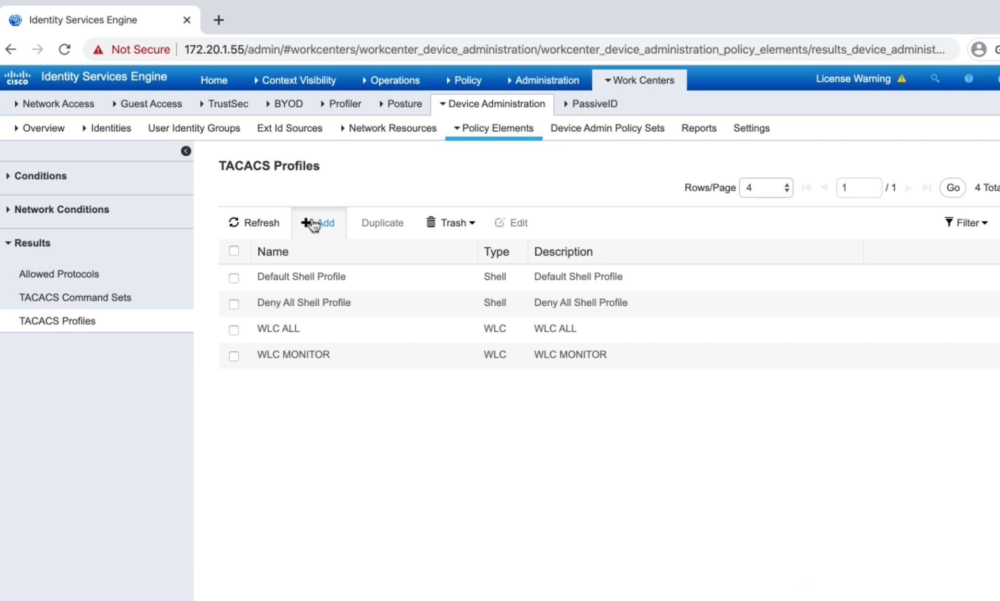
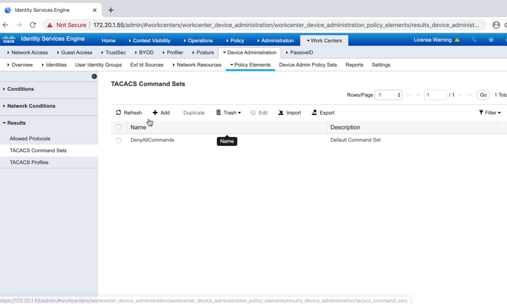
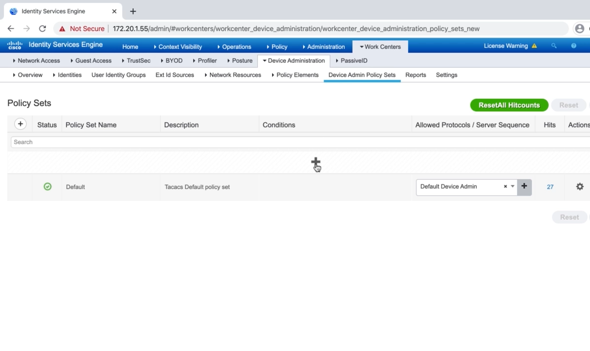

# Configuring AAA on Cisco IOS Device for Use with Cisco ISE

## Configuring Cisco ISE to Support TACACS

<figure>

<figcaption>Enable TACACS+</figcaption>
</figure>

<figure>

<figcaption>Define a network device</figcaption>
</figure>

<figure>

<figcaption>Configure identity groups</figcaption>
</figure>

<figure>

<figcaption>Configure identities</figcaption>
</figure>

## Configuring Policy Sets in ISE for Device Administration

<figure>

<figcaption>Configure TACACS Profiles</figcaption>
</figure>

<figure>

<figcaption>Configure TACACS Command Sets</figcaption>
</figure>

<figure>

<figcaption>Configure Device Admin Policy Sets</figcaption>
</figure>

## Configuring an IOS Device to Use TACACS+ for Administration

``` text
Globo-HQ(config)#tacacs server GloboISE1
Globo-HQ(config-server-tacacs)#address ipv4 172.20.1.55
Globo-HQ(config-server-tacacs)#key GloboISE123
Globo-HQ(config-server-tacacs)#exit
Globo-HQ(config)#aaa group server tacacs+ GloboISEGroup
Globo-HQ(config-sg-tacacs+)#server name GloboISE1
Globo-HQ(config-sg-tacacs+)#ip vrf forwarding Mgmt-intf
Globo-HQ(config-sg-tacacs+)#ip tacacs source-interface gig 0/1
Globo-HQ(config)#aaa authentication login default group GloboISEGroup local
Globo-HQ(config)#aaa authentication enable default group GloboISEGroup enable
Globo-HQ(config)#aaa authorization exec default group GloboISEGroup local if-authenticated
Globo-HQ(confia)#aaa authorization console
Globo-HQ(config)#aaa authorization config-commands
Globo-HQ(config)#aaa authorization commands 0 default group GloboISEGroup local if-authenticated
Globo-HQ(config)#aaa authorization commands 1 default group GloboISEGroup local if-authenticated
Globo-HQ(config)#aaa authorization commands 4 default group GloboISEGroup local if-authenticated
Globo-HQ(config)#aaa authorization commands 15 default group GloboISEGroup local if-authenticated
Globo-HQ(config)#aaa accounting exec default start-stop group GloboISEGroup
Globo-HQ(config)#aaa accounting commands 0 default start-stop group GloboISEGroup
Globo-HQ(config)#aaa accounting commands 1 default start-stop group GloboISEGroup
Globo-HQ(config)#aaa accounting commands 4 default start-stop group GloboISEGroup
Globo-HQ(config)#aaa accounting commands 15 default start-stop group GloboISEGroup
```
