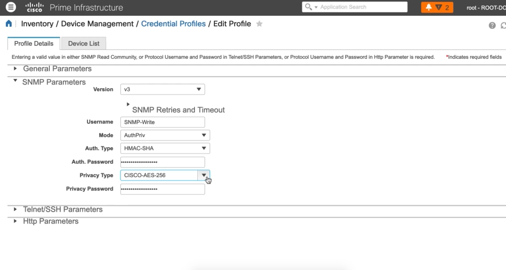
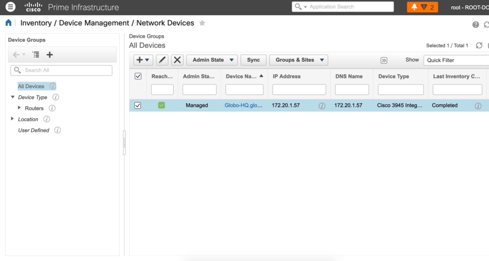

3. Configuring Management Protocols on a Cisco IOS Device
=========================================================

Configuring SNMPv3 Users on a Cisco Router or Switch
----------------------------------------------------

SNMPv3
~~~~~~

-  SNMP Users
-  Defines credentials and algorithms
-  SNMP Groups

   -  Associates with SNMP Users with SNMP Views

-  SNMP Views

   -  Defines the information that the SNMP user can access

      -  All information is stored in the Management Information Base
         (MIB)
      -  Object Identifiers (OID) correspond to specific information
         about a router
      -  OIDs are stored in a hierarchical tree. OIDs lower in the tree
         are included with OIDs above it

   SNMP Configuration on Cisco Prime

.. code:: text

   Globo-HO(confia)#snmp-server view EVERTHING iso included
   Globo-HQ(config)#snmp-server group Write-EVERYTHING v3 priv read EVERYTHING write EVERYTHING
   Globo-HQ(config)#snmp-server user SNMP-Write Write-EVERYTHING v3 auth sha Globo123 priv aes 256 Globo123

   Syncronization Complete

Configuring NTP Authentication
------------------------------

.. code:: text

   Globo-HQ(config)#ntp server vrf Mgmt-intf 172.20.1.51
   Globo-HQ(config)#ntp authentication-key 1 md5 Globo123
   Globo-HQ(config)#ntp trusted-key 1
   Globo-HQ(config)#ntp authenticate
   Globo-HQ(config)#ntp server vrf Mgmt-intf 172.20.1.51 key 1
   Globo-HQ(config)#do show ntp associations detail

Securing CDP on a Cisco Router or Switch
----------------------------------------

.. code:: text

   Globo-Core#show cdp neigh
   Globo-Core#show cdp neigh gi 0/1 detail
   Globo-HQ(config)#no cdp run
   Globo-HQ(config)#cdp run
   Globo-HQ(config)#int gi 0/1
   Globo-HQ(config-if)#no cdp enable
   Globo-HQ(config-if)#cdp enable
   Globo-HQ(config-if)#exit
   Globo-HQ(config)#cdp tlv-list Mgmt-Only
   Globo-HQ(config-tlv-list)#address
   Globo-HQ(config-tlv-list)#capability
   Globo-HQ(config-tlv-list)#cos
   Globo-HQ(config-tlv-list)#duplex
   Globo-HQ(config-tlv-list)#ext-port
   Globo-HQ(config-tlv-list)#hell
   Globo-HQ(config-tlv-list)#ip
   Globo-HQ(config-tlv-list)#nativ
   Globo-HQ(config-tlv-list)#plat
   Globo-HQ(config-tlv-list)#port
   Globo-HQ(config-tlv-list)#power
   Globo-HQ(config-tlv-list)#powernet
   Globo-HQ(config-tlv-list)#spare-
   Globo-HQ(config-tlv-list)#trust
   Globo-HQ(config-tlv-list)#version
   Globo-HQ(config-tlv-list)#vtp
   Globo-HQ(config-tlv-list)#vvid
   Globo-HQ(config)#int gi 0/1
   Globo-HQ(config-if)#cdp filter-tlv-list Mgmt-Only
   Globo-Core#clear cdp table
   Globo-Core#show cdp neigh
   Globo-Core#show cdp neigh gi 0/1 detail

   Device  ID: Globo-HQ.globomantics.com
   Entry address(es):
   Interface: GigabitEthernet0/1
   Holdtime 135 sec

   advertisement version: 2
   Management address(es):
     IP address: 172.20.1.57

   Total cdp entries displayed 1

Using SCP to Transfer Files
---------------------------

Globo-HQ(config)#ip ssh source-interface gig 0/1 Globo-HQ(config)#exit
Globo-HQ#dir Globo-HQ#copy startup-config scp: Address or name of remote
host []? 172.20.1.15 Destination username [caleb]? Destination filename
[globo-hq-confg]? Writing globo-hq-confg Password:

Configuring DHCP and DNS on an IOS Device
-----------------------------------------

.. code:: text

   Globo-Core(config)#int vlan 172
   Globo-Core(config-if)#ip add 172.20.1.189 255.255.255.0
   Globo-Core(config-if)#no shut
   Globo-Core(config-if)#exit
   Globo-Core(config)#ip dhcp excluded-address 172.20.1.1 172.20.1.200
   Globo-Core(config)#ip dhcp excluded-address 172.20.1.210 172.20.1.255
   Globo-Core(config)#ip dhcp pool Mgmt-Hosts
   Globo-Core(dhcp-config)#network 172.20.1.0 255.255.255.0
   Globo-Core(dhcp-config)#default-router 172.20.1.1
   Globo-Core(dhcp-config)#dns-server 172.20.1.57
   Globo-Core(dhcp-config)#domain-name globomantics.com
   Globo-Core(dhcp-config)#option 150 ip 172.20.1.110
   Globo-Core(dhcp-config)#lease 700
   Globo-Core(config)#do show ip dhcp binding
   Globo-HQ(config)#ip dns server
   Globo-HQ(config)#ip domain-lookup
   Globo-HQ(config)#ip name-server 8.8.8.8
   Globo-HQ(config)#ip host Globo-ISE 172.20.1.55
