Managing Cisco IOS Devices with Cisco Prime Infrastructure
==========================================================

Adding a Device to Cisco Prime Infrastructure
---------------------------------------------

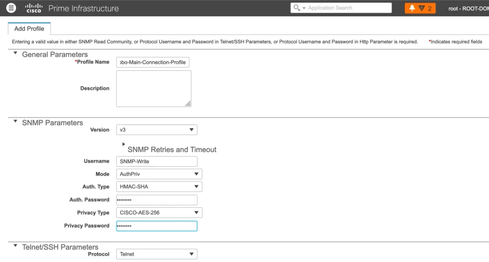

   Add a profile

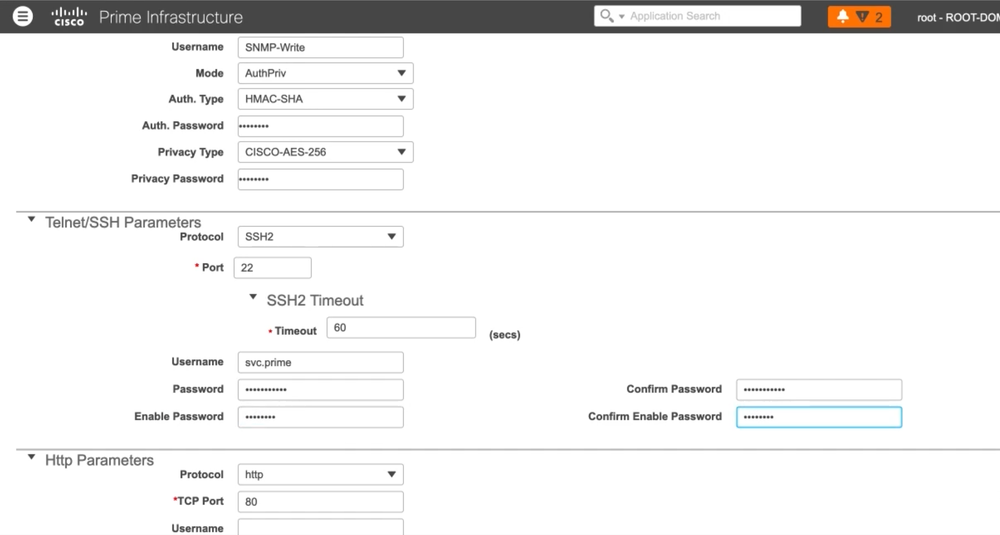

   Config SSH

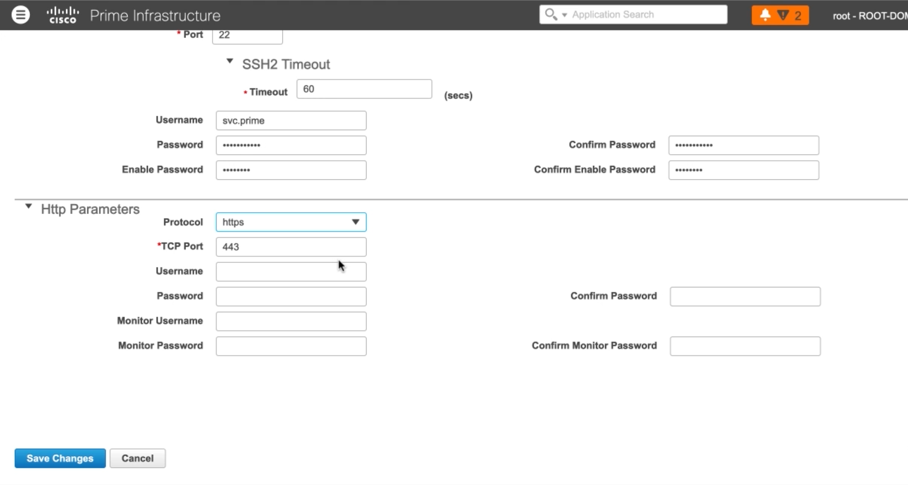

   Config HTTPS

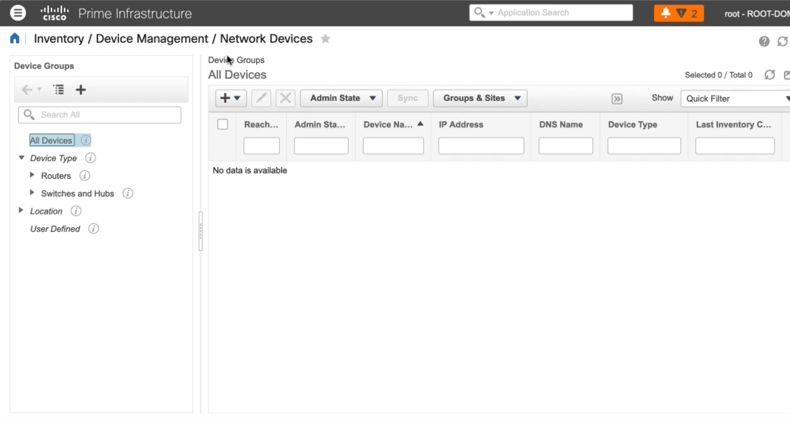

   Add a device

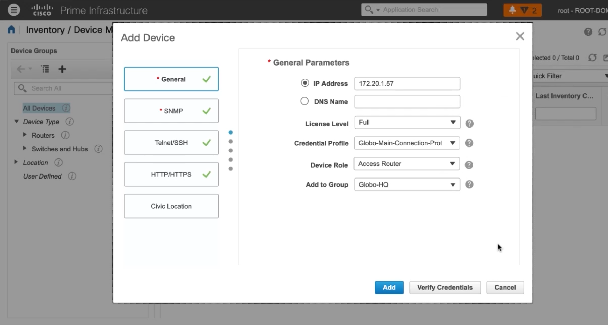

   Specify the profile & add device

Using Cisco Prime Infrastructure to Make Changes on IOS Devices
---------------------------------------------------------------

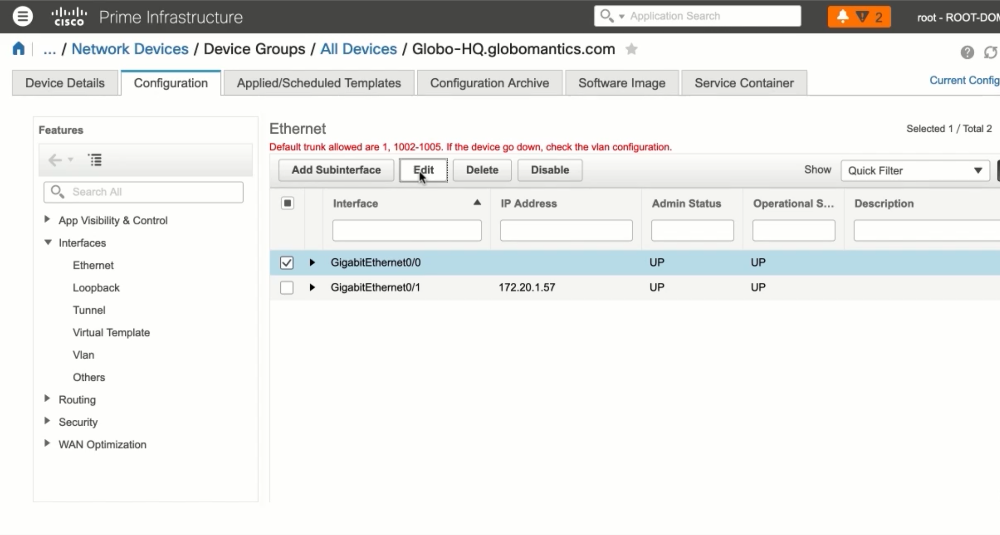

   Configure an existing device

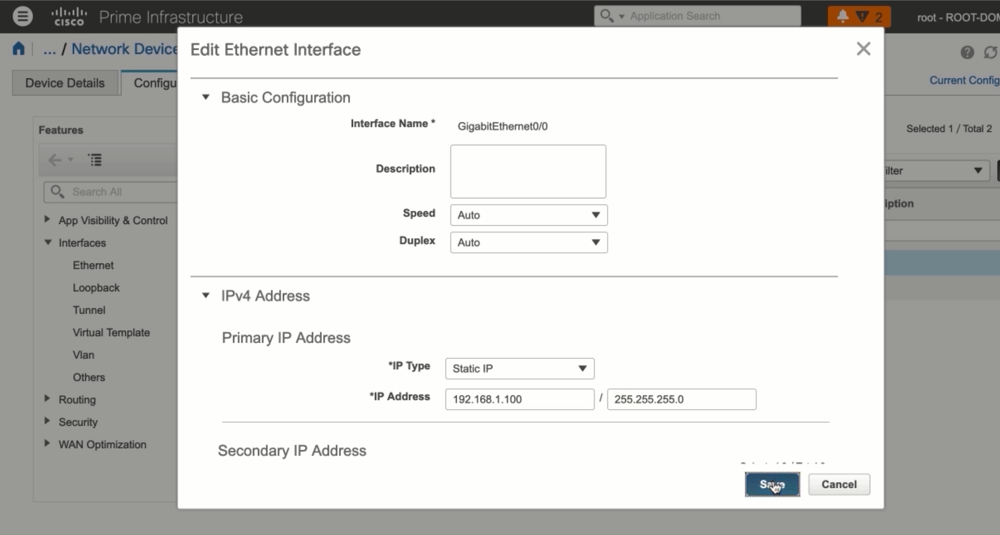

   Device's config

.. code:: text

   Globo-HQ#show ip int bri
   Interface IP-Address 0K? Method Status Protocol
   GigabitEthernet0/0 192.168.1.100 YES manual up up
   GigabitEthernet0/1 172.20.1.57 YES manual up up
   Loopback100 1.1.1.1 YES manual up up

Using Cisco Prime Templates to Make Changes on IOS Devices
----------------------------------------------------------

**Current config on device:**

.. code:: text

   Globo-HQ-MPLS#show run sec aaa
   aaa new-model
   aaa session-id common

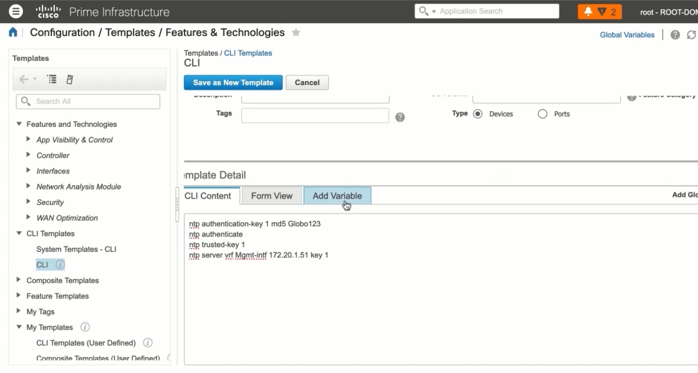

   Configuring a device template

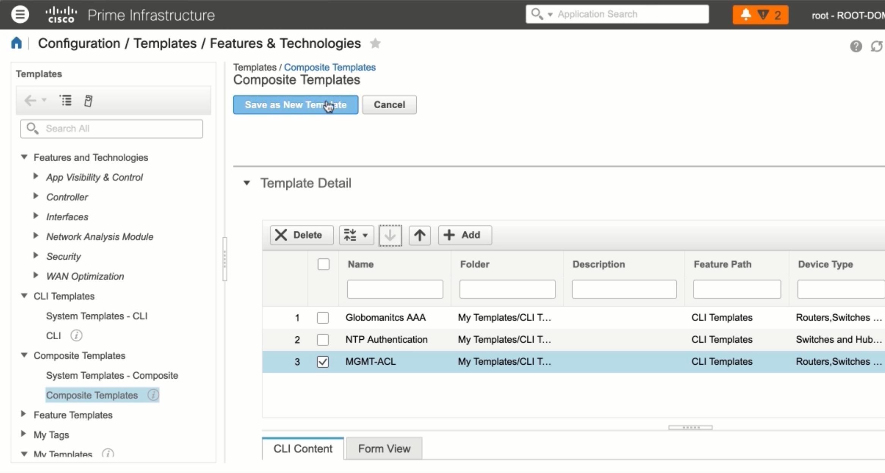

   Creating a composite template

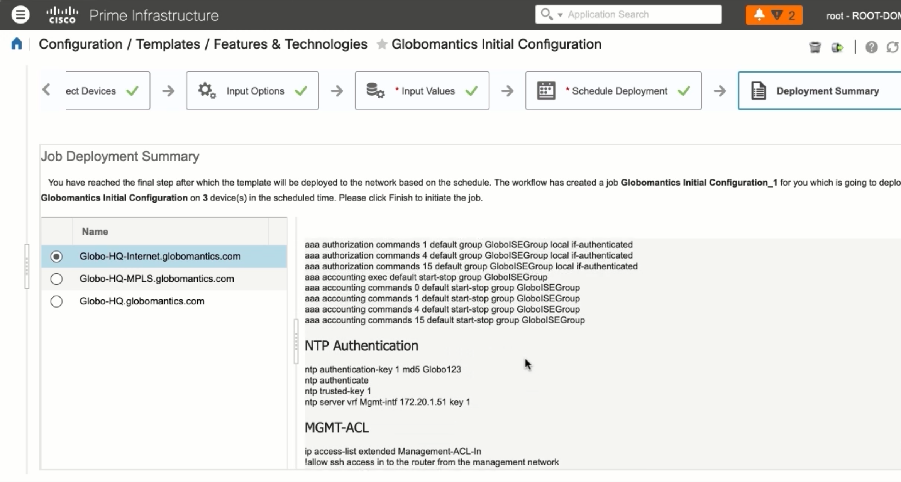

   Deploying config to devices

**Config deployed:**

.. code:: text

   Globo-HQ-MPLS#show run | sec aaa
   aaa new-model
   aaa group server tacacs+ GloboISEGroup
   server name GloboISE1
   ip vrf forwarding Mgmt-intf
   ip tacacs source-interface GigabitEthernet0/1
   aaa authentication login default group GloboISEGroup local
   aaa authentication enable default group GloboISEGroup enable
   aaa authorization console
   aaa authorization config-commands
   aaa authorization exec default group GloboISEGroup local if-authenticated
   aaa authorization commands default group GloboISEGroup local if-authenticated
   aaa authorization commands default group GloboISEGroup local if-authenticated
   aaa authorization commands 4 default group GloboISEGroup local if-authenticated
   aaa authorization commands 15 default group GloboISEGroup local if-authenticated
   aaa accounting exec default start-stop group GloboISEGroup
   aaa accounting commands 0 default start-stop group GloboISEGroup
   aaa accounting commands 1 default start-stop group GloboISEGroup
   aaa accounting commands 4 default start-stop group GloboISEGroup
   aaa accounting commands 15 default start-stop group GloboISEGroup
   aaa session-id common

Using Prime to Upgrade IOS Devices
----------------------------------

**We want to upgrade this image:**

.. code:: text

   sh ver
   System image file is "flash:c3750e-universalk9-mz.152-4.E6/c3750e-universalk9-mz.152-4.E6.bin"

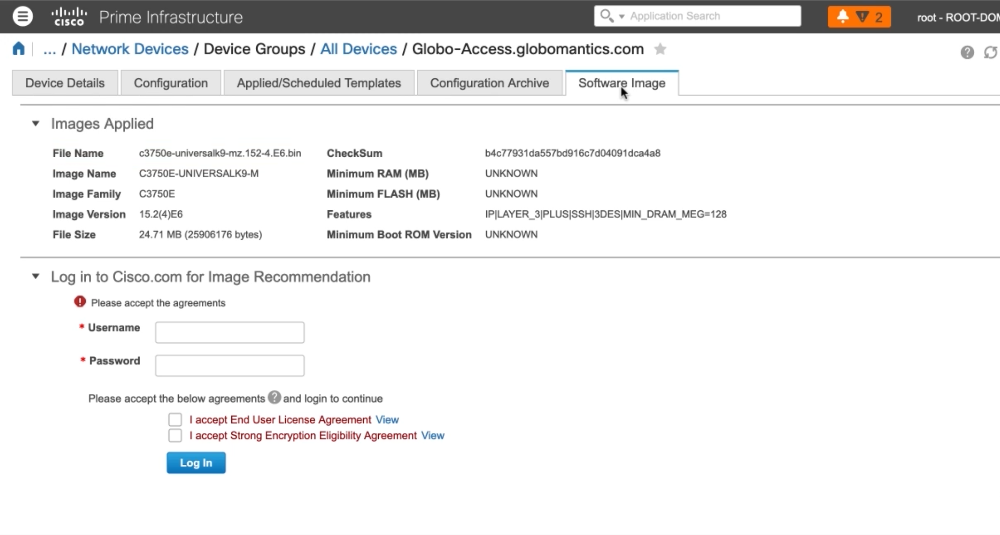

   Downloading software images via Cisco

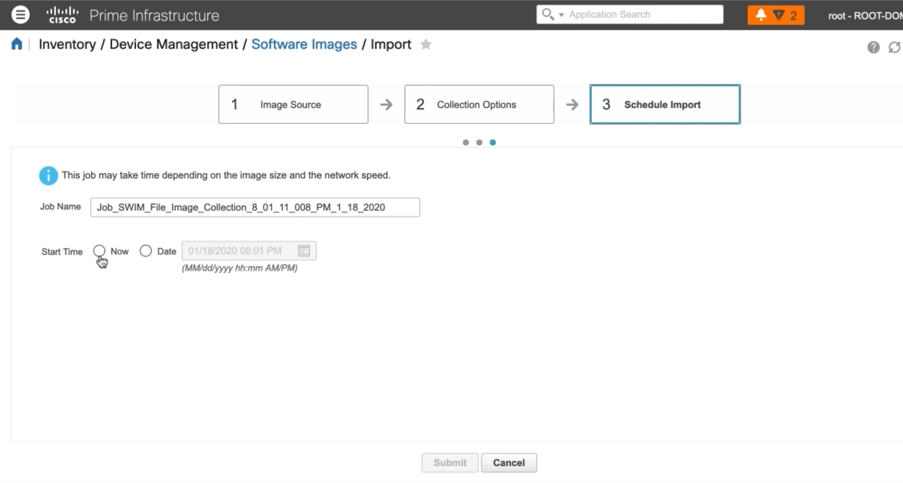

   Downloading software from file

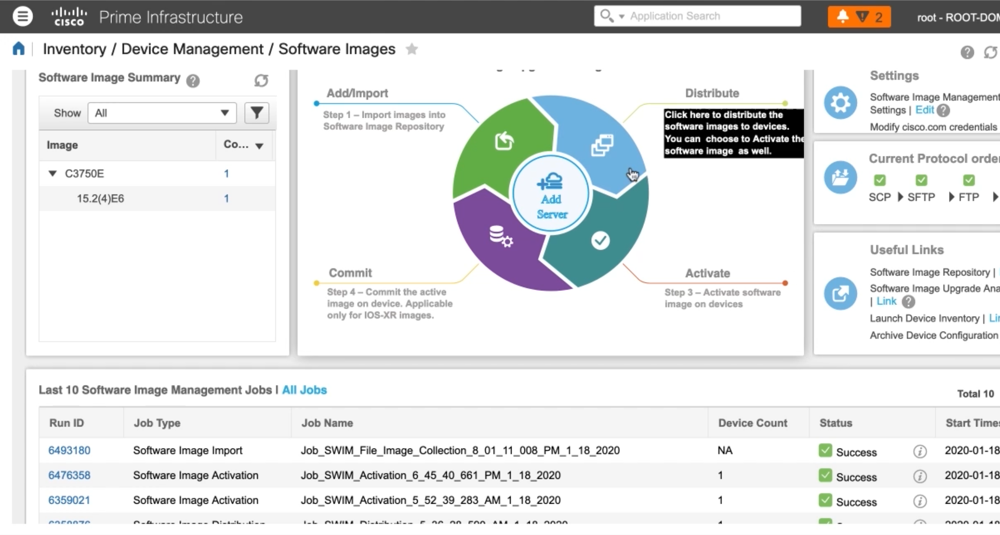

   Distribute the image and follow the wizard

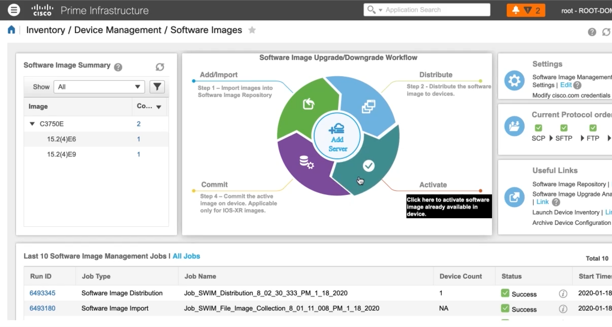

   Activate the image and follow the wizard

**The image is upgraded:**

.. code:: text

   sh ver
   System image file is "flash:c3750e-universalk9-mz.152-4.E9.bin"
