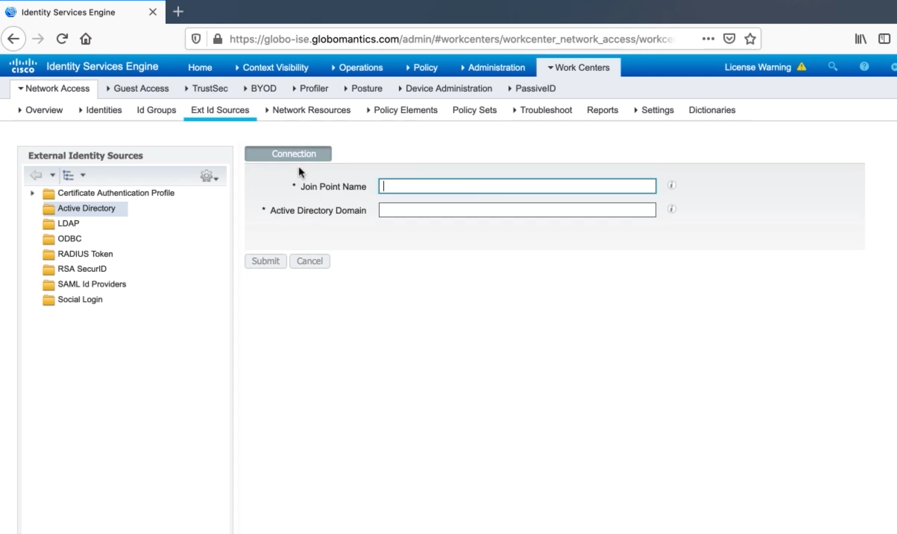
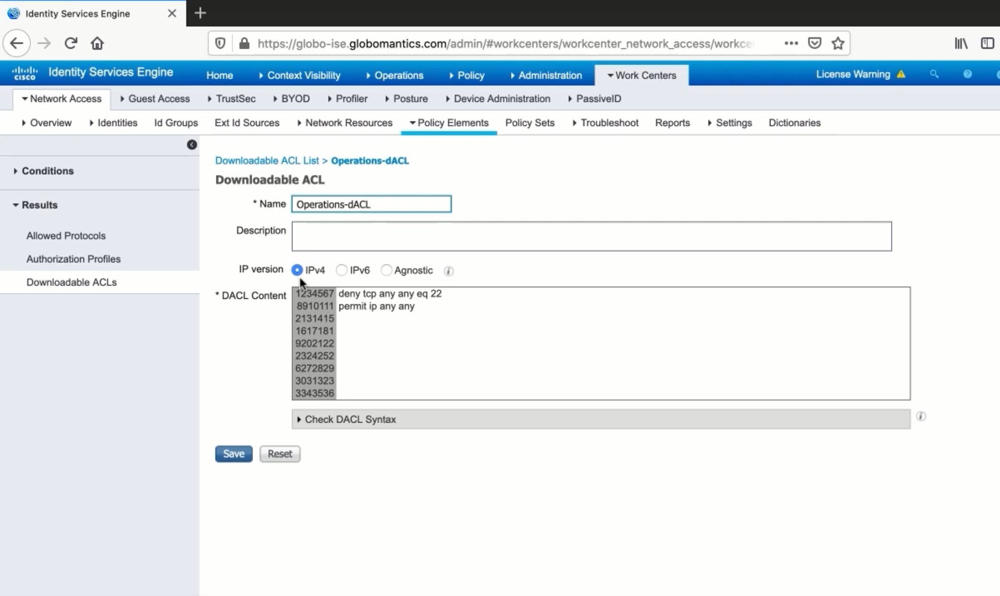
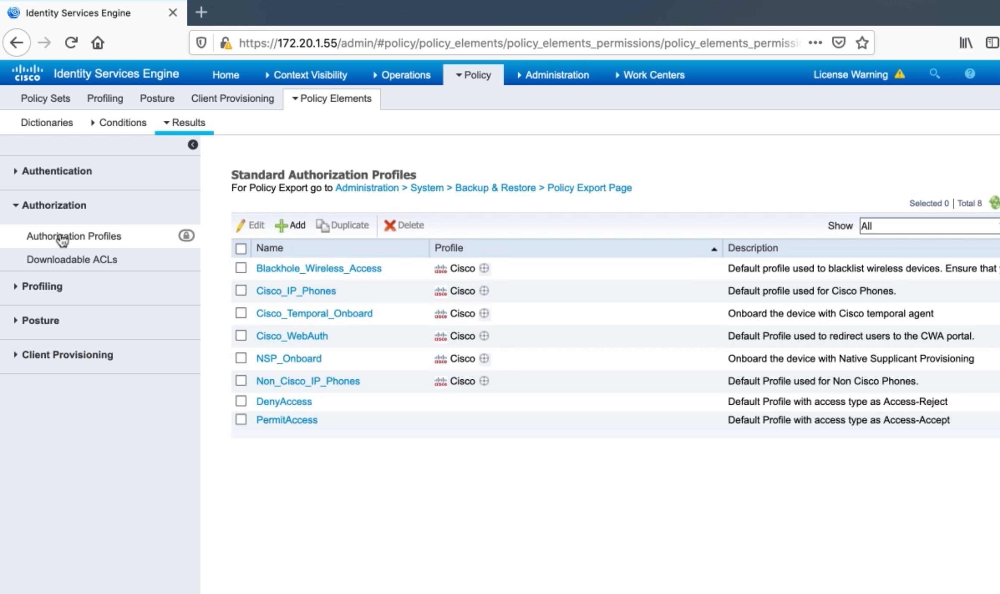

# Configuring Cisco ISE for 802.1X

## Policy Sets, Authentication Policies, and Authorization Policies

### Policy Sets

-   Contain authentication and authorization policies
-   If-then statements

### Policy Set Logic

-   Authorization policy rules are only applied if the device matches
    the policy set
-   Evaluated in a top down fashion
-   Use specific policy sets
    -   Prevents large, confusing rule-sets

## ISE Identity Sources & Active Directory Integration

<figure>

<figcaption>Joining ISE to AD</figcaption>
</figure>

## Adding Network Access Devices To ISE

<figure>

<figcaption>Define a network device</figcaption>
</figure>

## Creating Authentication Policies In ISE

<figure>

<figcaption>Configure Device Admin Policy Sets</figcaption>
</figure>

## Configuring dACLs, Authorization Profiles, and Authorization Policies

<figure>

<figcaption>dACL</figcaption>
</figure>

<figure>

<figcaption>Authorisation Policy</figcaption>
</figure>
