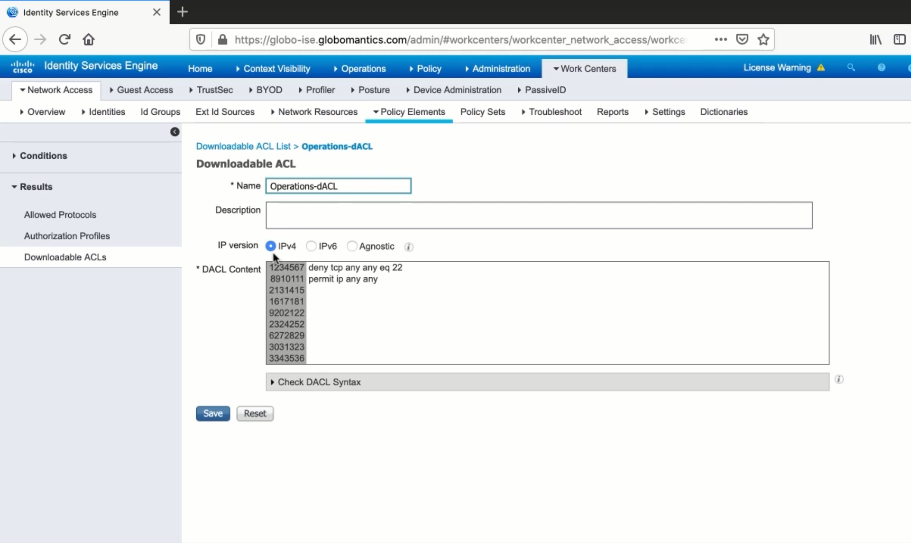
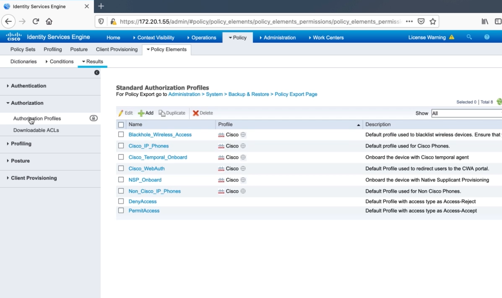

2. Configuring Cisco ISE for 802.1X
===================================

Policy Sets, Authentication Policies, and Authorization Policies
----------------------------------------------------------------

Policy Sets
~~~~~~~~~~~

-  Contain authentication and authorization policies
-  If-then statements

Policy Set Logic
~~~~~~~~~~~~~~~~

-  Authorization policy rules are only applied if the device matches the
   policy set
-  Evaluated in a top down fashion
-  Use specific policy sets

   -  Prevents large, confusing rule-sets

ISE Identity Sources & Active Directory Integration
---------------------------------------------------

.. figure:: _images/configuring-cisco-ise-for-802.1x-1.png
   :alt: Joining ISE to AD

   Joining ISE to AD

Adding Network Access Devices To ISE
------------------------------------

.. figure:: ../network-security-with-cisco-ios/_images/configuring-aaa-on-cisco-ios-device-for-use-with-cisco-ise-2.png
   :alt: Define a network device

   Define a network device

Creating Authentication Policies In ISE
---------------------------------------

.. figure:: ../network-security-with-cisco-ios/_images/configuring-aaa-on-cisco-ios-device-for-use-with-cisco-ise-7.png
   :alt: Configure Device Admin Policy Sets

   Configure Device Admin Policy Sets

Configuring dACLs, Authorization Profiles, and Authorization Policies
---------------------------------------------------------------------

   dACL

   Authorisation Policy
