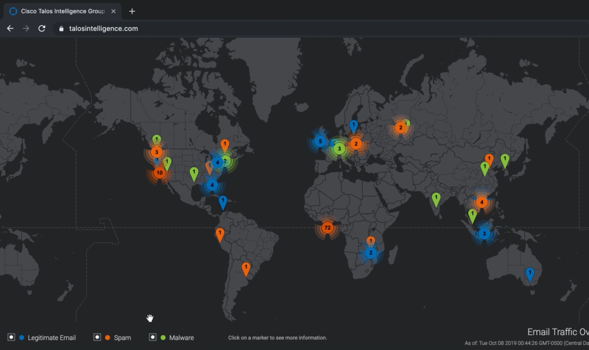
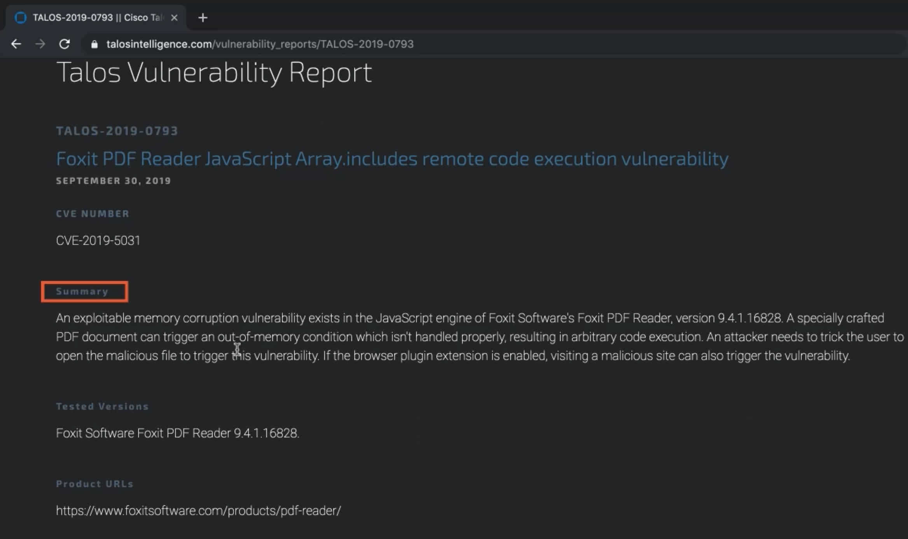
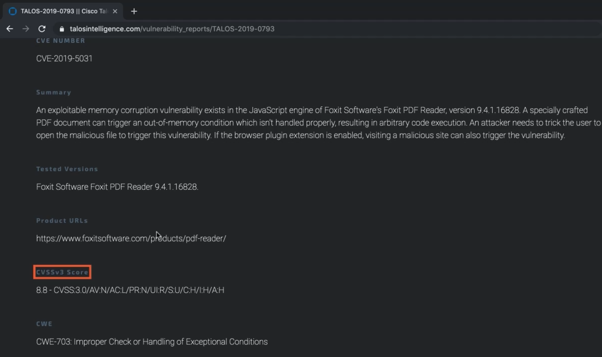
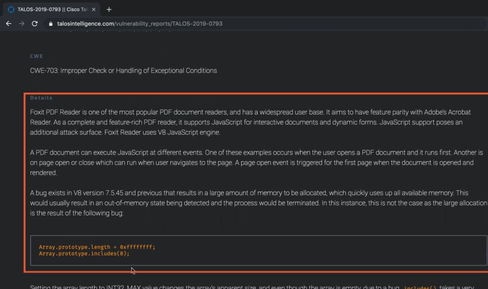
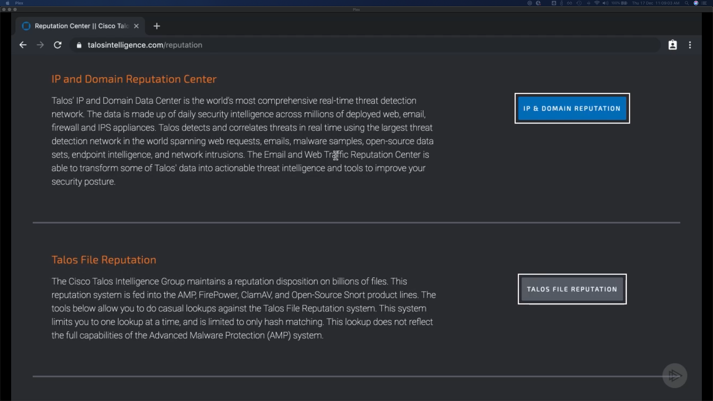

Describing Security Intelligence
================================

Security Intelligence Overview
------------------------------

Hard to Keep up with Threats
~~~~~~~~~~~~~~~~~~~~~~~~~~~~

-  Not a “set it and forget it” solution
-  Cant just sit back and monitor
-  Too many devices to manually update
-  A large amount of surface areas

Too Much Work
~~~~~~~~~~~~~

Identify threats, research solutions, and implement mitigations for
every threat on each attack medium

Security Intelligence
~~~~~~~~~~~~~~~~~~~~~

-  Organisations can participate in a community of security devices

   -  All organisations benefit from new threat information

-  Author, share, and consume

Security Intelligence Authoring, Sharing, and Consuming
-------------------------------------------------------

Telemetry Sharing
~~~~~~~~~~~~~~~~~

Device upload data to network/Cloud

**Scenario:**

-  Threat affects organisation
-  Device now has info on threat
-  Info is uploaded to cloud
-  Additional info is uploaded from other orgs

.. _security-intelligence-1:

Security Intelligence
~~~~~~~~~~~~~~~~~~~~~

-  Cloud performs analytics
-  Normalises data and finds pattens

   -  Time, duration, surface area, other metrics
   -  Who is being attacked
   -  More info allows for better mitigations

-  Create signatures for different threats
-  Different security devices have different mitigations
-  Updates are shared with community

   -  Cisco Talos can be every 3-5min

-  Each device installs the updates
-  All organizations participating in the cloud are protected from the
   new threat
-  Mo manual input required
-  Provides research and info to security professionals
-  Allows you to stay in the loop of the new types of threats that are
   emerging

Cisco Talos
-----------

-  1.1 million malicious software samples
-  300 billion email samples, 200 billion are malicious
-  Block malware, phishing, and spam
-  Need to have the appropriate license

   -  Create policy and ruleset

-  Defence in depth

**Cisco Products that use Talos:**

-  NGFW & NGIPS
-  Cisco AMP
-  Email Security Appliance, Web Security Appliance
-  Cloud Email Security, Cloud Web Security
-  Cisco Umbrella
-  Cisco Threat Grid

   Here you can see Legitimate Email, Spam & Malware colour-coded

   Vulnerability Reports showing summary of the report

   Vulnerability Reports showing the severity of threat

   Vulnerability Reports showing details of how threat works

   See the reputation for different things, like IP and Domain Reputation and File Reputation
