ISE
===

Identity Services Engine (ISE)

Adding RADIUS Clients
---------------------

Creating Locations
^^^^^^^^^^^^^^^^^^

Go to *Administration > Network Device Groups*

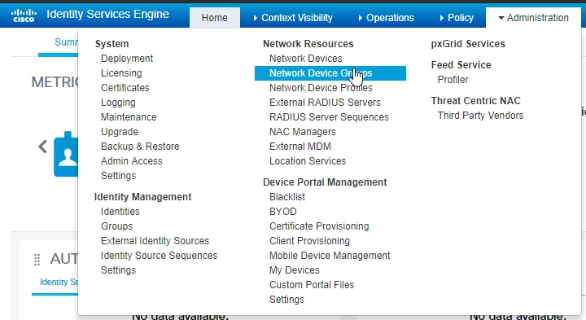

Add a group, for example:

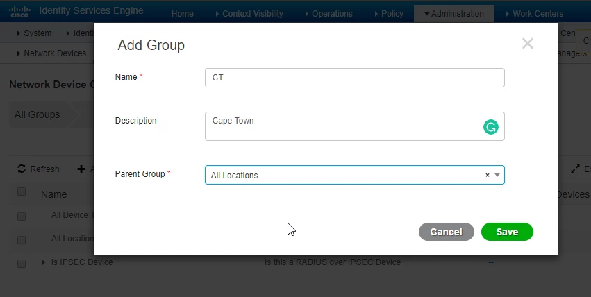

Adding Devices to ISE
^^^^^^^^^^^^^^^^^^^^^

Go to *Administration > Network Devices*

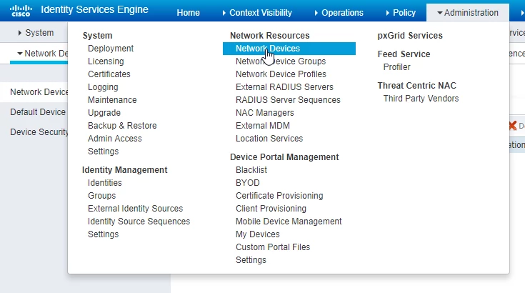

Fill in all the details

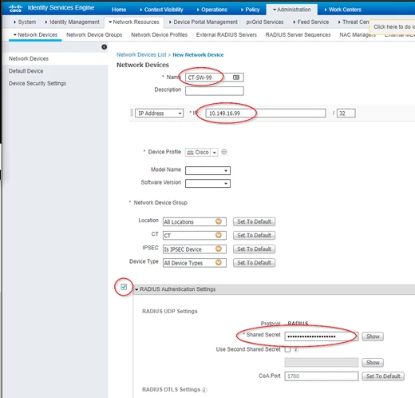

Authenticator Configuration
^^^^^^^^^^^^^^^^^^^^^^^^^^^

See https://docs.calebsargeant.com/en/latest/networking/cisco/switching/aaa.html#RADIUS

ISE and AD
----------

Joining ISE to AD
^^^^^^^^^^^^^^^^^

Go to *Administration > External Identity Sources*

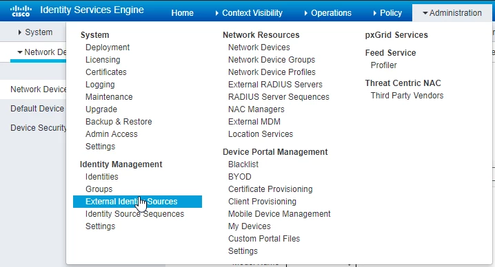

Click on *Active Directory* and click on *Add*

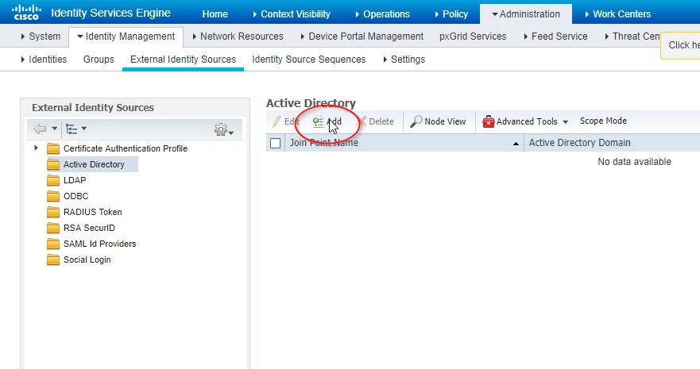

Input the details and click *Submit*

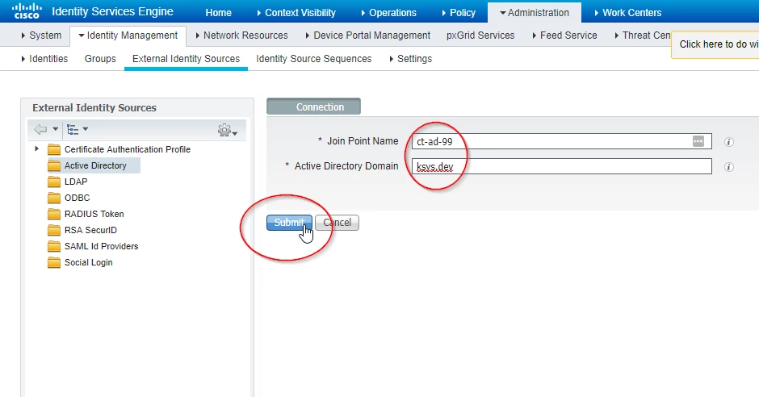

Click *Yes*

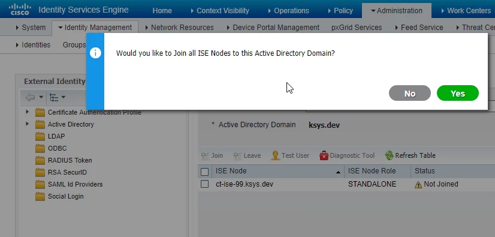

Authenticate

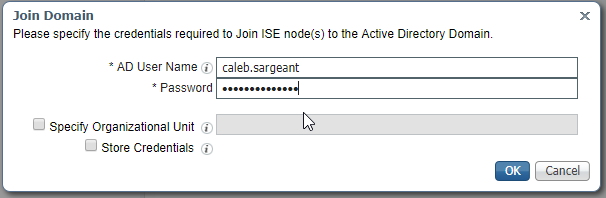

You will see the Computer object in AD

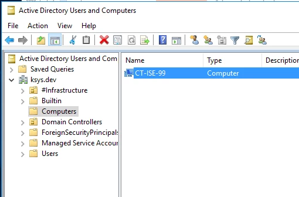

Identity Sources
^^^^^^^^^^^^^^^^

Go to *Administration >  Identity Source Sequences*

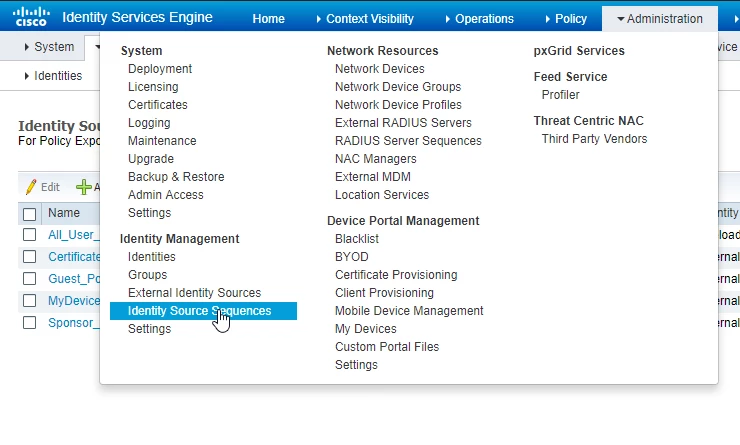

Click *Add*

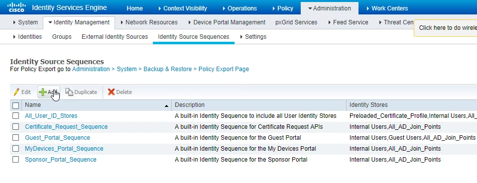

Modify the *Identity Source Sequence* accordingly

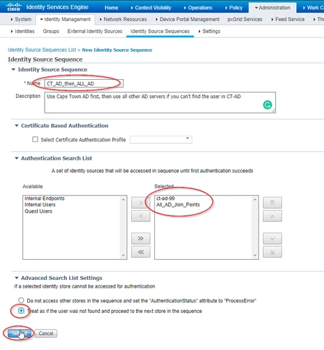

Wired Dot1x Switch Config
-------------------------

Global Config
^^^^^^^^^^^^^

.. code-block:: none

  # use the radius server for dot1x authentication
  aaa authentication dot1x default group radius

  # use the radius server for authorization
  aaa authorization network default group radius

  # use the radius server for accounting
  aaa accounting dot1x default start-stop group radius

  # include IP Address of supplicant request in accounting
  radius-server attribute 8 include-in-access-req

  # enable dot1x
  dot1x system-auth-control

Switchport Config
^^^^^^^^^^^^^^^^^

.. code-block:: none

  int g0/xx
  switchport host

  #set the mode
  authentication host-mode multi-auth

  #set authentication type
  authentication open

  #set recurring authentication
  authentication periodic

  #let server decide how often to reauthenticate
  authentication timer reauthenticate server

  # set Port Access Entity to act as authenticator
  dot1x pae authenticator

  # supplicant retry timeout (sec)
  dot1x timeout tx-period 10

  # enable 802.1x control of port
  authentication port-control auto

Verification
^^^^^^^^^^^^

.. code-block:: none

  CT-SW-99#sh dot1x all
  Sysauthcontrol             Disabled
  Dot1x Protocol Version            3

  Dot1x Info for GigabitEthernet0/30
  -----------------------------------
  PAE                       = AUTHENTICATOR
  PortControl               = AUTO
  ControlDirection          = Both
  HostMode                  = MULTI_AUTH
  QuietPeriod               = 60
  ServerTimeout             = 0
  SuppTimeout               = 30
  ReAuthMax                 = 2
  MaxReq                    = 2
  TxPeriod                  = 10

  # show authentication status
  sh authen int g0/30

  # show authentication sessions
  sh authen session int g/30

  # debug
  debug radius authentication

ISE CA Certificates
-------------------

Due to installing a PKI integrated into AD, ISE will automatically receive a certificate from AD, upon joining the domain. If this does not happen, add the ROOT CA Certificate by going to *Administration > System > Certificates > Trusted Certificates* and click on *Import*

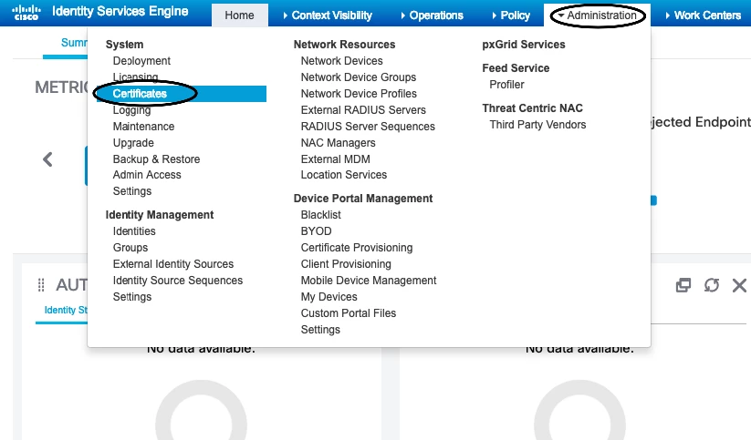

Choose the *Certificate File* downloaded from the Root CA, give it a *Friendly Name*, smash the Trust checkboxes and click on *Submit*.

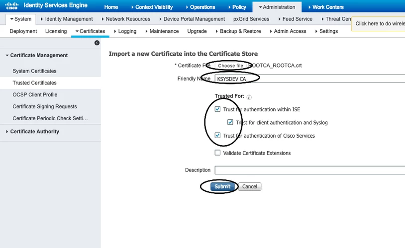

To generate a CSR, go to *Certificate Signing Requests* and click on *Add*, fill in the details and click on *Generate*.

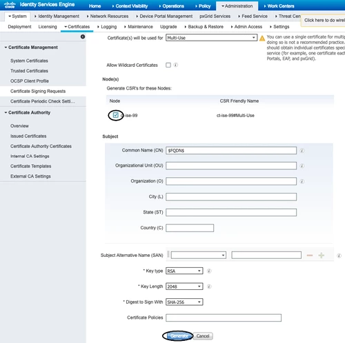

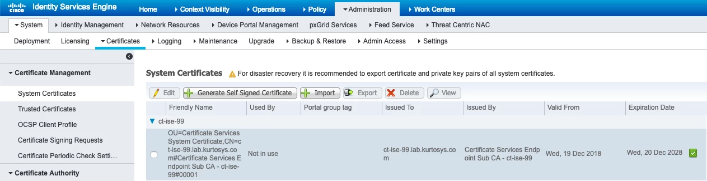

802.1x MAB (Mac Address Bypass)
-------------------------------

Switch Config
^^^^^^^^^^^^^

.. code-block:: none

  CT-SW-99#conf t

  # send over the MAC Address of the device being authenticated by switch (authenticator) to ISE (authentication server) - required for MAB
  CT-SW-99(config)#radius-server attribute 6 on-for-login-auth
  CT-SW-99(config)#radius-server attribute 25 access-request include

  # enable mab for the interface and config the order of authentication
  CT-SW-99(config)#int g0/30
  CT-SW-99(config-if)#mab
  CT-SW-99(config-if)#authentication order mab dot1x

ISE Config
^^^^^^^^^^

**Checking Authentication Logs**

To check the authentication logs go to *Operations > RADIUS > Live Logs*

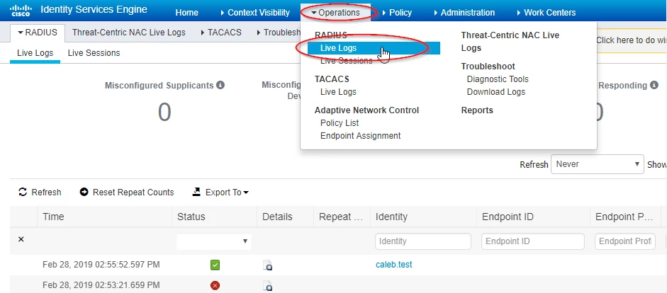

**"MABbing" a Device**

Go to *Work Centers > Identities > Endpoints > +*

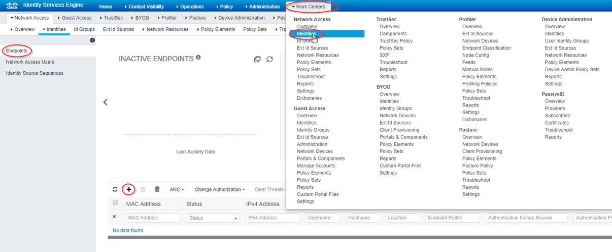

Fill in the details and click *Save*

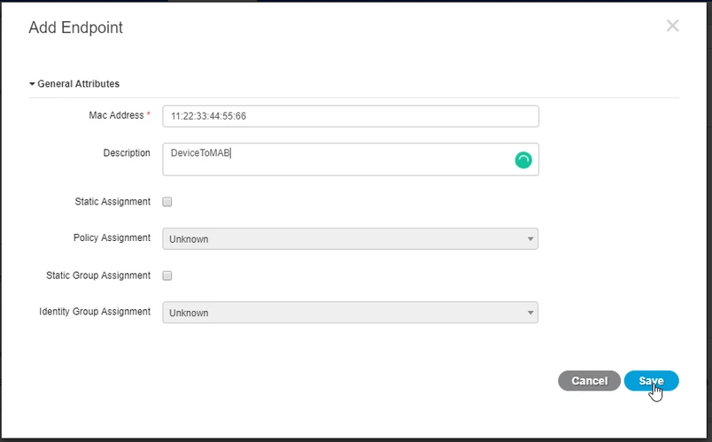

Posture Assessment
------------------

NAC Provisioning
^^^^^^^^^^^^^^^^

Download the latest updates for ISE to check devices via NAC

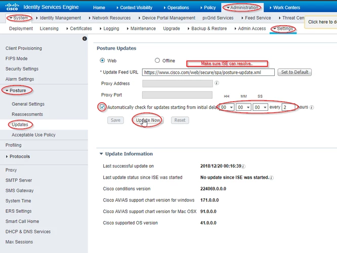

Download the latest NAC Agents from Cisco to ISE

.. image:: _images/ise-posture-2.png

Download one of each of the latest one

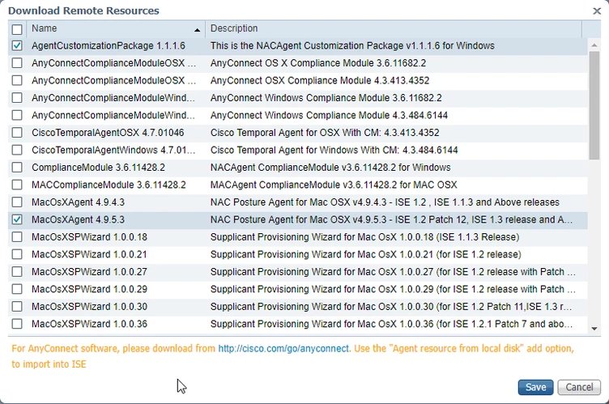
